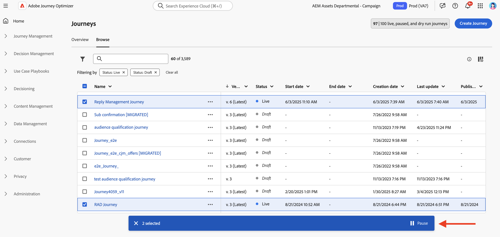

# Een reis pauzeren {#journey-pause}

>[!CONTEXTUALHELP]
>id="ajo_journey_pause"
>title="Uw reis pauzeren"
>abstract="U kunt een live reis pauzeren om te voorkomen dat nieuwe profielen binnenkomen. Kies of u profielen die momenteel op reis zijn, wilt verwijderen of op de juiste plaats wilt houden. Als deze optie behouden blijft, wordt de uitvoering van de volgende actie hervat zodra de reis opnieuw is gestart. Ideaal voor updates of noodstops zonder dat de voortgang verloren gaat."

U kunt uw live reizen pauzeren, alle benodigde wijzigingen uitvoeren en deze op elk gewenst moment hervatten.<!--You can choose whether the journey is resumed at the end of the pause period, or whether it stops completely. --> tijdens de pauze, kunt u [ globale filters ](#journey-global-filters) toepassen om profielen uit te sluiten die op hun attributen worden gebaseerd. De reis wordt automatisch hervat aan het einde van de pauze. U kunt het [ ook manueel hervatten ](#journey-resume-steps).

>[!AVAILABILITY]
>
>Deze mogelijkheid is alleen beschikbaar voor een aantal organisaties (Beperkte beschikbaarheid) en wordt globaal geïmplementeerd in een toekomstige release.

## Belangrijkste voordelen {#journey-pause-benefits}

Het pauzeren en hervatten van reizen geeft de reisartsen meer controle en flexibiliteit door het tijdelijk stilleggen van de actieve reizen toe te staan zonder de ervaring van de klant te verstoren. Wanneer gepauzeerd, worden geen mededelingen verzonden, en de profielen blijven in een geschorste staat tot de reis wordt hervat.

Dit vermogen vermindert het risico om onbedoelde berichten tijdens fouten of updates (bijvoorbeeld: verandering op berichtinhoud) te verzenden, steunt veiliger reisbeheer, en verhoogt praktiserend vertrouwen. De zichtbaarheid in gepauzeerde reizen en hun status rechtstreeks in de gebruikersinterface verbeteren de transparantie en de operationele flexibiliteit verder.

>[!CAUTION]
>
>* Machtigingen om reizen te pauzeren en te hervatten zijn beperkt tot gebruikers met de machtiging op hoog niveau van **[!DNL Publish journeys]** . Leer meer over het beheren van [!DNL Journey Optimizer] de toegangsrechten van gebruikers in [ deze sectie ](../administration/permissions-overview.md).
>
>* Alvorens het beginnen gebruiken van het pauze/hervattingsvermogen, [ lees uit de Guardrails en de beperkingen ](#journey-pause-guardrails).

## Hoe een reis pauzeren {#journey-pause-steps}

U kunt om het even welke **Levende** reis pauzeren.

Voer de volgende stappen uit om uw reis te pauzeren:

1. Open de reis die u wilt pauzeren.
1. Klik op **...Meer** knoop op de hoger-juiste sectie van het wegcanvas, en selecteer **Pauzeren**.

   

1. Selecteer hoe u profielen wilt beheren die zich momenteel op de reis bevinden.

   {width="50%" align="left"}

   U kunt:

   * **Greep** profielen - de Profielen zullen op de reis wachten om worden hervat
   * **verwerpt** profielen - de Profielen zullen van de reis op de volgende actieknooppunt worden uitgesloten

1. Klik de **knoop van de Pauze** om te bevestigen.

Van de lijst van uw reizen, kunt u één of verscheidene **Levende** reizen pauzeren. Om een groep reizen (_bulkpauze_) te pauzeren, hen in de lijst te selecteren en de **knoop van de Pauze** in de blauwe bar bij de bodem van het scherm te klikken. De **knoop van de Pauze** is slechts beschikbaar wanneer **Levende** reizen worden geselecteerd.

### Gedrag tijdens gepauzeerde reizen

Wanneer een reis wordt gepauzeerd, worden de verse ingangen altijd genegeerd, ongeacht de Greep/de wijze van de Weigering.

Wanneer een reis wordt gepauzeerd, hangt profielbeheer en activiteitenuitvoering van de activiteit af. Gedragingen worden hieronder beschreven. Voor een volledig begrip, zie ook dit [ Eind om steekproef ](#journey-pause-sample) te beëindigen.

| Reisactiviteiten | Gevolgen |
|-------------------------|--------------------------------------------------|
| [ Kwalificatie van het publiek ](audience-qualification-events.md) | <ul> <li>In het eerste knooppunt: Het publiek wordt verwijderd </li><li>In andere knopen: Het zelfde gedrag zoals in een levende reis, echter als de publiekskwalificatie na een <strong> Actie </strong> activiteit is en de gebruiker op die actie wordt gepauzeerd, wordt de publiekskwalificatie verworpen. </li></ul> |
| [ Eenvoudige Gebeurtenis ](general-events.md) | <ul> <li>In het eerste knooppunt: De gebeurtenis wordt genegeerd</li><li>In andere knopen: Het zelfde gedrag zoals in een levende reis, echter als de gebeurtenis na een <strong> Actie </strong> activiteit is en de gebruiker op die actie wordt gepauzeerd, wordt de gebeurtenis verworpen. </li></ul> |
| [ gelezen Publiek ](read-audience.md) | Hetzelfde gedrag als tijdens een live reis, met enkele specifieke kenmerken <ol> <li> Als <strong> Pauze </strong> werd geduwd nadat <strong> gelezen publiek </strong> activiteit was begonnen, zullen de profielen die de reis zijn ingegaan (tot de volgende <strong> actie </strong> activiteit) verdergaan. Als het volledige publiek nog niet is ingevoerd tijdens de reis en het publiek met een bepaalde snelheid leest, worden de resterende profielen in de wachtrij genegeerd.</li><li> Voor afzonderlijke uitvoeringen: er wordt geen fout weergegeven op het moment van hervatting als de geplande datum voor de hervattingsdatum ligt. Dat schema wordt genegeerd.</li><li>Voor incrementele reizen: <ul><li>Als pauze plaatsvindt vóór de eerste instantie, wordt bij hervatting het volledige publiek afgespeeld. </li><li>Als bijvoorbeeld pauze optreedt op de vierde dag van een dagelijkse herhaling en de reis onderbroken blijft tot de negende dag, worden alle profielen die vanaf de vierde tot de negende dag zijn ingevoerd, hervat  </li></ul></ol> |
| [ Reactie ](reaction-events.md) | Het zelfde gedrag zoals in een levende reis, echter als de reactie na een <strong> Actie </strong> activiteit is en de gebruiker op die actie wordt gepauzeerd, wordt de gebeurtenis verworpen. |
| [Wachten](wait-activity.md) | Hetzelfde gedrag als tijdens een live reis |
| [Condition](condition-activity.md) | Hetzelfde gedrag als tijdens een live reis |
| Inhoudsbesluit | Profielen worden geparkeerd of gedecardeerd op basis van de keuze van de gebruiker wanneer de reis is gepauzeerd |
| [ Actie van het Kanaal ](journeys-message.md) | Profielen worden geparkeerd of gedecardeerd op basis van de keuze van de gebruiker wanneer de reis is gepauzeerd |
| [ Actie van de Douane ](../action/action.md) | Profielen worden geparkeerd of gedecardeerd op basis van de keuze van de gebruiker wanneer de reis is gepauzeerd |
| [ Profiel van de Update ](update-profiles.md) &amp; [ Jump ](jump.md) | Hetzelfde gedrag als tijdens een live reis |
| [ Externe Gegevens Source ](../datasource/external-data-sources.md) | Hetzelfde gedrag als tijdens een live reis |
| [ Criteria van de Uitgang ](journey-properties.md#exit-criteria) | Hetzelfde gedrag als tijdens een live reis |

## Hoe te om een gepauzeerde reis te hervatten {#journey-resume-steps}

>[!CONTEXTUALHELP]
>id="ajo_journey_resume"
>title="Uw reis hervatten"
>abstract="Hervat een gepauzeerde reis zodat nieuwe profielen opnieuw kunnen ingaan. Als profielen tijdens de pauze wachtten, zullen ze hun reis voortzetten. Ideaal voor het veilig opnieuw starten van reizen na updates of pauzes."

Gepauzeerde reizen worden automatisch hervat aan het einde van de maximale pauzeduur van 14 dagen. Ze kunnen op elk gewenst moment handmatig worden hervat. Hervat een gepauzeerde reis staat nieuwe profielen toe om opnieuw binnen te gaan. Als profielen tijdens de pauze wachtten, zullen ze hun reis voortzetten. Ideaal voor het veilig opnieuw starten van reizen na updates of pauzes.

Ga als volgt te werk om een gepauzeerde reis te hervatten en opnieuw te luisteren naar de gebeurtenissen van de reis:

1. Open de reis die u wilt hervatten.
1. Klik op **...Meer** knoop op de hoger-juiste sectie van het wegcanvas, en selecteer **Hervatten**.

   De reisschakelaars aan de **Herhalende** status. Wanneer de reis hervat, beginnen nieuwe ingangen binnen een minuut. Het hervatten van profielen die zijn opgeslagen, kan enige tijd in beslag nemen.  Aangezien alle profielen voor de reis moeten worden hervat om **Levend** opnieuw te zijn, kan de overgang van het **Hervatten** aan **Levende** status wat tijd vergen.

1. Klik op de knop **Hervatten** om te bevestigen.

Van de lijst van uw reizen, kunt u één of verscheidene **Gepauzeerde** reizen hervatten. Om een groep ritten (_bulksgewijs hervat_) te hervatten, hen te selecteren en de **hervat** knoop te klikken die in de blauwe bar bij de bodem van het scherm wordt gevestigd. Gelieve te merken op dat de **Hervatten** knoop slechts beschikbaar zal zijn wanneer **Gepauzeerde** reizen worden geselecteerd.

## Een algemeen filter toepassen op profielen in een gepauzeerde reis {#journey-global-filters}

Wanneer een reis wordt gepauzeerd, kunt u een globaal filter toepassen dat op profielattributen wordt gebaseerd. Met dit filter kunt u profielen uitsluiten die overeenkomen met de gedefinieerde expressie tijdens het hervatten. Wanneer het globale filter is ingesteld, is het van toepassing op actieknooppunten, zelfs voor nieuwe profielingang. Profielen die de criteria en de nieuwe profielen aanpassen die proberen om binnen te gaan zullen van de reis **op de volgende actieknooppunt** worden uitgesloten zij ontmoeten.

Als u bijvoorbeeld alle Franse klanten wilt uitsluiten van een gepauzeerde reis, voert u de volgende stappen uit:

1. Blader naar de gepauzeerde reis die u wilt wijzigen.

1. Klik op de **criteria van de Uitgang &amp; Globale filter** pictogram.

   

1. In de **Criteria van de Uitgang &amp; Globale montages van de Filter**, klik **toevoegen Globale Filter** bepaalt een filter dat op profielattributen wordt gebaseerd.

1. Stel de expressie in om profielen uit te sluiten als het kenmerk country gelijk is aan Frankrijk.

   

1. Sparen uw filter en klik de **reis van de Update** knoop om uw veranderingen toe te passen.

1. [ hervat de reis ](#journey-resume-steps).

   Op het moment van hervatting worden alle profielen met het landkenmerk dat aan Frankrijk is ingesteld, automatisch van de reis bij het volgende actieknooppunt uitgesloten. Alle nieuwe profielen waarvoor het kenmerk country is ingesteld op Frankrijk dat de reis probeert te betreden, worden geblokkeerd bij het volgende actieknooppunt.

Houd er rekening mee dat profieluitsluitingen voor profielen die momenteel op reis zijn en voor nieuwe profielen alleen worden uitgevoerd wanneer ze een actieknooppunt bereiken.

>[!CAUTION]
>
>* U kunt **slechts één** globale filter per reis plaatsen.
>
>* U kunt slechts tot stand brengen, bijwerken of een globaal filter in **Gepauzeerde** reizen schrappen.

## Afvoerkanalen en beperkingen {#journey-pause-guardrails}

* Een reisversie kan maximaal 14 dagen worden onderbroken
* Gepauzeerde reizen worden meegerekend in de quota voor rechtstreekse reizen
* Profielen die tijdens de pauze zijn opgepakt maar die tijdens de reis zijn verwijderd, worden nog steeds als inzetbare profielen geteld
* Gepauzeerde reizen worden in alle bedrijfsregels in aanmerking genomen, op dezelfde manier als wanneer ze levend waren
* De wereldwijde time-out van de reis geldt nog steeds voor gepauzeerde reizen. Als een profiel bijvoorbeeld 90 dagen op reis was en de reis wordt gepauzeerd, zal dit profiel de reis op de 91ste dag nog steeds verlaten
* Profielen worden **verworpen** in een gepauzeerde reis wanneer zij een actieactiviteit bereiken. Als zij op een wachttijd blijven tijdens de tijd dat een reis wordt gepauzeerd en vertrekken die wachten nadat deze is hervat, zullen zij de reis voortzetten en niet worden weggegooid. [ zie de steekproef van begin tot eind ](#journey-pause-sample)
* Zelfs na de pauze zouden deze gebeurtenissen, aangezien de gebeurtenissen nog steeds worden verwerkt, worden geteld voor het aantal Journale Gebeurtenissen per seconde quota waarna er een vertraging ontstaat voor de eenheid
* Als profielen tijdens een gepauzeerde rit staan, worden de profielkenmerken tijdens het hervatten vernieuwd
* Voorwaarden worden nog steeds uitgevoerd tijdens gepauzeerde reizen, zodat als een reis is gepauzeerd vanwege problemen met de gegevenskwaliteit, elke voorwaarde vóór een actieknooppunt kan worden geëvalueerd met onjuiste gegevens
* Voor stijgende die publiek **wordt gebaseerd Gelezen publiek** reizen, wordt de gepauzeerde duur overwogen. Als de reis bijvoorbeeld op de tweede dag werd gepauzeerd en op de vijfde van de maand werd hervat, zal de 6de reis alle profielen nemen die van de eerste tot en met de zesde zijn gekwalificeerd. Dit is niet het geval voor publiekskwalificatie of op gebeurtenis-gebaseerde reizen (als een publiekskwalificatie of een gebeurtenis tijdens een pauze worden ontvangen, worden die gebeurtenissen verworpen)
* Als profielen op reis worden gehouden en deze reis na een paar dagen automatisch wordt hervat, blijven profielen de reis voortzetten en niet vallen. Als je ze wilt laten vallen, moet je de reis stoppen
* Bij gepauzeerde reizen worden waarschuwingen niet afgevuurd voor waarschuwingen over batchsegmenten
* Er zijn geen auditlogs in het systeem wanneer na 14 dagen pauzestatus de reis wordt beëindigd
* Sommige verwijderde profielen kunnen zichtbaar zijn in de Gebeurtenis van de Stap van de Reis maar niet zichtbaar in het melden. Bijvoorbeeld:
   * De bedrijfsgebeurtenissen van de verwerping voor **Lees Publiek**
   * **Gelezen de banen van het publiek** die wegens gepauzeerde reis worden gelaten vallen
   * Verworpen gebeurtenissen wanneer de **activiteit van de Gebeurtenis** na een actie was waar het profiel wachtte
     <!--* There is a guardrail (at an org level) on the max number of profiles that can be held in paused journeys. This guardrail is per org, and is visible in the journey inventory on a new bar (only visible when there are paused journeys).-->

## Eindmonster {#journey-pause-sample}

Laten we het volgende voorbeeld van de reis nemen:

{zoomable="yes"}

Wanneer het pauzeren van deze reis, selecteert u als de profielen **** of **Greep** worden genegeerd, en dan profielbeheer is het volgende:

1. **AddToCart** activiteit: alle nieuwe profielingangen worden geblokkeerd. Als een profiel al de reis vóór een pauze is ingegaan, gaan zij tot de volgende actieknooppunt voort.
1. **wacht** activiteit: de profielen blijven normaal op de knoop wachten en zullen het weggaan, zelfs als de reis in pauze is.
1. **Voorwaarde**: de profielen blijven door voorwaarden gaan en zich naar de juiste tak bewegen, die op de uitdrukking wordt gebaseerd op de voorwaarde wordt bepaald.
1. **duw**/**e-mail** activiteiten: tijdens een gepauzeerde reis, beginnen de profielen te wachten of worden verworpen (die op de keus door de gebruiker op het tijdstip van pauze wordt gemaakt) op de volgende actieknooppunt wordt gebaseerd. Profielen wachten dus of worden daar genegeerd.
1. **Gebeurtenissen** na **3} knopen van de Actie {: als een profiel op een** knoop van de Actie **wacht en er een** activiteit van de Gebeurtenis **na het is, als die gebeurtenis in brand wordt gestoken, wordt het profiel verworpen.**

Zoals per dit gedrag, kunt u profielaantallen zien die op gepauzeerde reis stijgen, meestal in activiteiten vóór **Actie** activiteiten. Bijvoorbeeld, in dat voorbeeld, **wacht** activiteit wordt genegeerd, verhogend het aantal profielen die door de **** activiteit van de Voorwaarde gaan.

Wanneer u deze reis hervat:

1. Vernieuwde ingangen beginnen binnen een minuut
1. De profielen die momenteel in de reis op **activiteiten wachtten van de Actie** worden hervat bij een tarief van 5k tps. Zij kunnen dan de **Actie** ingaan zij op wachtten, en de reis voortzetten.
