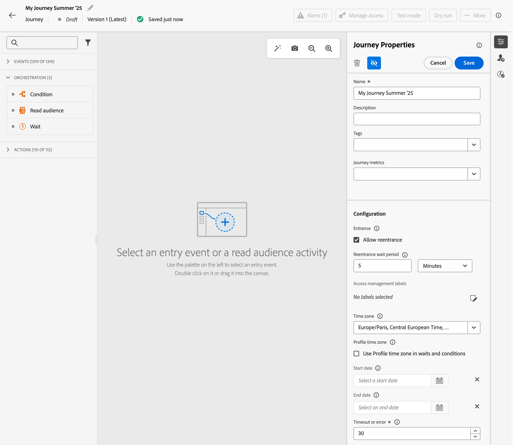

# De eigenschappen van uw reis instellen {#jo-properties}

>[!CONTEXTUALHELP]
>id="ajo_journey_properties"
>title="Journeyeigenschappen"
>abstract="In dit gedeelte worden de eigenschappen van de reis weergegeven. Standaard zijn alleen-lezen parameters verborgen. Welke instellingen beschikbaar zijn, is afhankelijk van de status van de rit, uw machtigingen en de productconfiguratie."

## Toegang tot de eigenschappen van een reis {#access-properties}

De eigenschappen van een reis zijn gecentraliseerd in het rechterspoor. Deze sectie wordt standaard weergegeven wanneer u een nieuwe reis maakt. Voor bestaande reizen klikt u op het potloodpictogram naast de naam van de reis om deze te openen.

Definieer in deze sectie de naam van de reis, voeg een beschrijving toe en stel de globale eigenschappen van de reis in.

U kunt:

* Wijs Adobe Experience Platform Verenigde Markeringen aan uw reis toe, om hen gemakkelijk te classificeren en onderzoek van de campagnemelijst te verbeteren. [ leer hoe te met markeringen ](../start/search-filter-categorize.md#tags) werken
* Selecteer uw reismetriek. [ leer hoe te om uw reismetriek te vormen en te volgen ](success-metrics.md)
* Beheer [ ingang en ingang ](#entrance). Profielbeheer is afhankelijk van het type reis. De details zijn beschikbaar op [ deze pagina ](entry-management.md)
* Beheer [ toegang tot gegevens ](#manage-access)
* Selecteer de reis en profiel [ tijdzones ](#timezone)
* Kies douane [ begin en einddata ](#dates)
* Bepaal a [ onderbrekingsduur ](#timeout) in reisactiviteiten (voor slechts Admin gebruikers)
* De conflicten van de monitor en geven voorrang aan uw reizen gebruikend [ hulpmiddelen van het conflictenbeheer ](#conflict)

{width="80%"}{zoomable="yes"}

>[!NOTE]
>
>Voor live reizen worden in dit scherm alleen de publicatiedatum en de naam van de gebruiker weergegeven die de reis heeft gepubliceerd.

De **technische details van het Exemplaar** optie staat u toe om technische informatie over de reis te kopiëren die het steunteam kan gebruiken om problemen op te lossen. De volgende informatie wordt gekopieerd: `JourneyVersion UID`, `OrgID`, `orgName`, `sandboxName`, `lastDeployedBy`, `lastDeployedAt`.

Leer meer over technische gebieden met betrekking tot een reis voor een bepaald profiel, en hoe te om hen [ op deze pagina ](expression/journey-properties.md) te gebruiken.

## Entrance en reentrance {#entrance}

De modus voor profielinvoer wordt gedefinieerd op het niveau van het transport, in het configuratievenster rechts. De instellingen worden hieronder beschreven.

Profielbeheer is afhankelijk van het type reis. Leer meer over profielingang en terugkeerbeheer, op [ deze pagina ](entry-management.md). Leer meer over de tarieven van de reisverwerking en hoe de profielen door reizen in [ stromen deze sectie ](entry-management.md#journey-processing-rate).

### Ingang toestaan  {#allow-reentrance}

>[!CONTEXTUALHELP]
>id="ajo_journey_properties_entrance"
>title="Ingang toestaan"
>abstract="Nieuwe reizen maken standaard terugkeer mogelijk. U kunt uncheck **toestaan ingang** optie bijvoorbeeld als u een eenmalig geschenk wilt aanbieden wanneer een persoon een winkel ingaat."
>additional-url="https://experienceleague.adobe.com/en/docs/journey-optimizer/using/orchestrate-journeys/manage-journey/entry-management" text="Profieltoegangsbeheer"

Nieuwe reizen maken standaard terugkeer mogelijk. U kunt uncheck **toestaan terugkeer** optie voor &quot;één schot&quot;reizen, bijvoorbeeld als u een eenmalig geschenk wilt aanbieden wanneer een persoon een winkel ingaat.

### Reentrale wachttijd  {#reentrance-wait}

>[!CONTEXTUALHELP]
>id="ajo_journey_properties_re-entrance_wait"
>title="Reentrale wachttijd"
>abstract="Stel de tijd in die moet worden gewacht voordat een profiel de reis weer kan betreden tijdens een enkele reis. Hierdoor kunnen gebruikers de reis niet opnieuw betreden voor een bepaalde duur. Maximale duur: 90 dagen."
>additional-url="https://experienceleague.adobe.com/en/docs/journey-optimizer/using/orchestrate-journeys/manage-journey/entry-management" text="Profieltoegangsbeheer"

Wanneer **toe staat terugkeer** optie wordt geactiveerd, **de ingang wacht periode** gebied wordt getoond. In dit veld kunt u de tijd definiëren die u moet wachten voordat u een profiel toestaat om de reis opnieuw te betreden tijdens een enkele reis (te beginnen met een evenement of een publiekskwalificatie). Hierdoor wordt voorkomen dat ritten meerdere keren ten onrechte worden geactiveerd voor dezelfde gebeurtenis. Het veld wordt standaard ingesteld op 5 minuten. De maximale duur is 90 dagen.

## Toegang beheren {#manage-access}

U kunt de toegang tot een reis beperken op basis van toegangslabels.

Klik op het pictogram **[!UICONTROL Manage access labels]** en selecteer een of meerdere labels om aangepaste labels voor gegevensgebruik toe te wijzen aan de rit.

[Meer informatie over het Toegangsbeheer op objectniveau (OLAC)](../administration/object-based-access.md)

## Tijdzones voor reizen en profielen {#timezone}

De tijdzone wordt gedefinieerd op het niveau van de reis. U kunt een vaste tijdzone invoeren of Adobe Experience Platform-profielen gebruiken om de tijdzone van de reis te definiëren. Als een tijdzone in Adobe Experience Platform-profiel is gedefinieerd, kan deze tijdens de reis worden opgehaald.

[Meer informatie over tijdzonebeheer](../building-journeys/timezone-management.md)

## Begin- en einddatum {#dates}

>[!CONTEXTUALHELP]
>id="ajo_journey_properties_start_date"
>title="Begindatum"
>abstract="Selecteer de datum waarop de profielen kunnen beginnen de reis in te gaan. Als er geen begindatum is vastgesteld, wordt standaard de publicatiedatum van de reis aangehouden."

>[!CONTEXTUALHELP]
>id="ajo_journey_properties_end_date"
>title="Einddatum"
>abstract="Stel de datum in waarop de reis eindigt. Op deze datum wordt de reis automatisch verlaten door actieve profielen, en geen nieuwe ingang wordt toegestaan."

Door gebrek, kunnen de profielen uw reis ingaan zodra het wordt gepubliceerd, en kunnen blijven tot de [ globale reisonderbreking ](#global_timeout) wordt bereikt. De enige uitzondering is terugkerende lees publiekstrajecten met **geactiveerde ingang van de Kracht op herhaling**, die op de begindatum van het volgende voorkomen beëindigen.

Indien nodig, kunt u de datum van het douane **Begin** en **Eind** bepalen. Hiermee kunnen profielen op een bepaalde datum uw reis betreden en automatisch afsluiten wanneer de einddatum is bereikt.

## Time-out {#timeout}

### Tijdslimiet voor reisactiviteiten {#timeout_and_error}

>[!CONTEXTUALHELP]
>id="ajo_journey_properties_timeout"
>title="Time-out of fout"
>abstract="Geef aan hoe lang de reis moet proberen een handeling uit te voeren of een voorwaarde te evalueren voordat deze wordt behandeld als een time-out. De aanbevolen waarden liggen tussen 1 en 30 seconden."

Wanneer u een actie of voorwaardenactiviteit bewerkt, kunt u een alternatief pad definiëren in het geval van een fout of time-out. Als de verwerking van de activiteit die een derdesysteem ondervraagt de onderbrekingsduur overschrijdt die in **[!UICONTROL Timeout or error]** wordt bepaald van het gebied van de reis eigenschappen, zal de tweede weg worden gekozen om een potentiële reserveactie uit te voeren.

De aanbevolen waarden liggen tussen 1 en 30 seconden.

We raden u aan een zeer korte **[!UICONTROL Timeout or error]** -waarde te definiëren als uw reis tijdgevoelig is (bijvoorbeeld: reageren op de locatie in real-time van een persoon), omdat u de handeling niet langer dan een paar seconden kunt uitstellen. Als uw reis minder tijdgevoelig is, kunt u een langere waarde gebruiken om meer tijd aan het geroepen systeem te geven om een geldige reactie te verzenden.

Reizen gebruiken ook een wereldwijde time-out, zoals hieronder wordt beschreven.

### Globale time-out voor transport {#global_timeout}

Naast [ timeout ](#timeout_and_error) gebruikt in reisactiviteiten, wordt een globale reisonderbreking toegepast. Het wordt niet getoond in de interface en kan niet worden veranderd.

Deze globale onderbreking houdt de vooruitgang van individuen in de reis **91 dagen** nadat zij ingaan. Dit betekent dat de reis van een individu niet langer mag duren dan 91 dagen. Na deze time-outperiode worden de gegevens van de persoon verwijderd. Personen die aan het einde van de time-outperiode nog onderweg zijn, worden gestopt en er wordt geen rekening mee gehouden bij de rapportage. Je zou dus meer mensen op de reis zien komen dan vertrekken.

Vanwege de reistijd van 91 dagen, wanneer het niet is toegestaan om de reis opnieuw te betreden, kunnen we er niet voor zorgen dat de toegangsblokkering langer dan 91 dagen werkt. Aangezien we alle informatie over personen die 91 dagen na hun binnenkomst de reis hebben betreden, verwijderen, kunnen we niet weten dat de persoon eerder, meer dan 91 dagen geleden, is binnengekomen.

Een individu kan alleen een wachtdienst doen als hij of zij genoeg tijd in de reis heeft om de wachttijd vóór de reisonderbreking van 91 dagen te voltooien. Zie [deze pagina](../building-journeys/wait-activity.md).

#### Time-to-live (TTL) en veelgestelde vragen over gegevensinvoer {#timeout-faq}

Vanaf de release van Adobe Journey Optimizer juni 2024 is de wereldwijde time-out van de reis van 30 naar 91 dagen gestegen. De gevolgen worden vermeld in de FAQ hieronder:

**voor Eenheids reizen**

<table style="table-layout:auto">
  <tr style="border: 1;">
    <td>
      
Wat gebeurt er met de reis die wordt gepubliceerd na de introductie van de TTL-uitbreiding?

    </td>
    <td>
      
Profielen die de nieuwe reis ingaan, hebben automatisch een TTL van 91 dagen.

    </td>
  </tr>
  <tr style="border: 1;">
    <td>
      
Wat gebeurt er met een profiel dat een reis ingaat die vóór de lancering van de uitbreiding van TTL werd gepubliceerd?

    </td>
    <td>
      
Het profiel zal een TTL van 30 dagen (7 dagen voor HIPAA) hebben, in overeenstemming met de tijd dat de reis oorspronkelijk werd gepubliceerd.

    </td>
  </tr>
  <tr style="border: 1;">
    <td>
      
Wat gebeurt er met een profiel dat al een reis is begonnen toen de uitbreiding van de TTL wordt gestart?

    </td>
    <td>
      
Het profiel behoudt een TTL van 30 dagen (7 dagen voor HIPAA) volgens de oorspronkelijke publicatietijd van de reis.

    </td>
  </tr>
  <tr style="border: 1;">
    <td>
      
Wat gebeurt er met een profiel in een vorige reisversie dat opnieuw wordt gepubliceerd na de lancering van de uitbreiding van TTL?

    </td>
    <td>
      
Het profiel zal een TTL van 30 dagen (7 dagen voor HIPAA) handhaven, die met de de publicatietijd van de originele reisversie wordt gericht.

    </td>
  </tr>
  <tr style="border: 1;">
    <td>
      
Wat gebeurt er met een nieuw profiel dat een opnieuw gepubliceerde reisversie invoert na de introductie van de uitbreiding van TTL?

    </td>
    <td>
      
Het profiel zal een TTL van 91 dagen hebben, die TTL van de onlangs opnieuw gepubliceerde reisversie aanpassen.

    </td>
  </tr>
</table>

**voor de Reizen van de Trekker van het Segment**

<table style="table-layout:auto">
  <tr style="border: 1;">
    <td>
      
Wat gebeurt er met nieuwe eenmalige reizen die na de uitbreiding van de TTL worden gepubliceerd?

    </td>
    <td>
      
Profielen die de nieuwe reis ingaan zullen een TTL van 91 dagen automatisch hebben.

    </td>
  </tr>
  <tr style="border: 1;">
    <td>
      
Wat gebeurt er met nieuwe terugkerende reizen zonder gedwongen terugkeer die na de uitbreiding van de GVTO worden gepubliceerd?

    </td>
    <td>
      
Profielen die de nieuwe reis ingaan zullen een TTL van 91 dagen automatisch hebben.

    </td>
  </tr>
  <tr style="border: 1;">
    <td>
      
Wat gebeurt er met nieuwe terugkerende reizen met gedwongen terugkeer die na de uitbreiding van de GVTO worden gepubliceerd?

    </td>
    <td>
      
De profielen die de nieuwe reis ingaan zullen een TTL gelijk aan de herhalingsperiode hebben. Bijvoorbeeld, als de reis dagelijks loopt, zal TTL 1 dag zijn.

    </td>
  </tr>
  <tr style="border: 1;">
    <td>
      
Wat gebeurt er met een profiel dat een reis ingaat die vóór de lancering van de uitbreiding van TTL werd gepubliceerd?

    </td>
    <td>
      
Het profiel zal een TTL van 30 dagen (7 dagen voor HIPAA) hebben, verenigbaar met de originele publicatietijd. Voor terugkerende ritten met gedwongen terugkeer zal de TTL overeenkomen met de herhalingsperiode.

    </td>
  </tr>
  <tr style="border: 1;">
    <td>
      
Wat gebeurt er met een profiel dat door een reis loopt wanneer de uitbreiding van TTL wordt gelanceerd?

    </td>
    <td>
      
Het profiel behoudt een TTL van 30 dagen (7 dagen voor HIPAA) volgens de oorspronkelijke publicatietijd van de reis. Voor terugkerende ritten met gedwongen terugkeer zal de TTL overeenkomen met de herhalingsperiode.

    </td>
  </tr>
  <tr style="border: 1;">
    <td>
      
Wat gebeurt er met een lopend profiel in een vorige reisversie die opnieuw wordt gepubliceerd na de lancering van de uitbreiding van TTL?

    </td>
    <td>
      
Het profiel zal een TTL van 30 dagen (7 dagen voor HIPPA) handhaven, die aan de originele de publicatietijd van de reisversie wordt gericht. Voor terugkerende ritten met gedwongen terugkeer zal de TTL overeenkomen met de herhalingsperiode.

    </td>
  </tr>
  <tr style="border: 1;">
    <td>
      
Wat gebeurt er met een nieuw profiel dat een opnieuw gepubliceerde reisversie invoert na de introductie van de uitbreiding van TTL?

    </td>
    <td>
      
Het profiel zal een TTL van 91 dagen hebben, die TTL van de onlangs opnieuw gepubliceerde reisversie aanpassen. Voor terugkerende ritten met gedwongen terugkeer zal de TTL overeenkomen met de herhalingsperiode.

    </td>
  </tr>
</table>

## Beleid samenvoegen {#merge-policies}

Adobe Journey Optimizer gebruikt samenvoegbeleid terwijl het terugwinnen van profielgegevens van Adobe Experience Platform. Afhankelijk van het type van reis, worden de verschillende samenvoegingsbeleidsvormen gebruikt:

* In kwalificatiereizen voor het publiek of het publiek lezen: het samenvoegbeleid van het publiek wordt gebruikt
* Bij Eenheidstijdvluchten wordt het standaard samenvoegbeleid gebruikt
* Bij zakenreizen: het samenvoegbeleid van het doelpubliek in de volgende Lees-publieksactiviteit wordt gebruikt

Adobe Journey Optimizer past het fusiebeleid toe dat gedurende de hele reis wordt gebruikt. Daarom als de veelvoudige publiek in een reis (bijvoorbeeld het gebruiken van binnen [`inAudience` functies ](functions/functioninaudience.md)) wordt gebruikt, leidt dit tot inconsistenties met het fusiebeleid dat door de reis wordt gebruikt, wordt een fout opgeheven en de publicatie wordt geblokkeerd. Nochtans, als een inconsistent publiek in berichtverpersoonlijking wordt gebruikt, wordt een alarm niet opgeheven, ondanks de inconsistentie. Om deze reden, wordt het hoogst geadviseerd om het samenvoegbeleid te controleren verbonden aan uw publiek, wanneer dit publiek in berichtverpersoonlijking wordt gebruikt.

Meer over fusiebeleid leren, verwijs naar [ documentatie van Adobe Experience Platform ](https://experienceleague.adobe.com/en/docs/experience-platform/profile/merge-policies/overview){target="_blank"}.

>[!NOTE]
>
>Wanneer een beleid van de publiekssamenvoeging wordt bijgewerkt, moet om het even welke actieve reis die naar dat publiek verwijzen opnieuw worden gepubliceerd (of worden gedupliceerd). Door het fusiebeleid te wijzigen ontstaat er een &#39;nieuw&#39; publiek dat niet toegankelijk is voor de lopende reis, waardoor de consistentie van de gegevens wordt gegarandeerd.

## Afsluitingscriteria {#exit-criteria}

>[!CONTEXTUALHELP]
>id="ajo_journey_exit_criterias"
>title="Afsluitingscriteria"
>abstract="In dit gedeelte worden de opties voor afsluitcriteria weergegeven. U kunt één of veelvoudige regels en filters van de uitgangscriteria voor uw reis tot stand brengen."

### Afsluitcriteria voor reizen {#exit-criteria-desc}

Door afsluitcriteria toe te voegen, sluiten de profielen de reis af zodra een gebeurtenis (bijvoorbeeld: Aankoop) plaatsvindt of komen zij in aanmerking voor een publiek. Dit zal de gebruiker verhinderen om het even welke verdere mededelingen van de reis te krijgen.

U wilt misschien profielen van een reis verwijderen als zij niet meer aan het doel van de reis voldoen. Dit kan door **globale uitgangscriteria** worden bereikt, die nauw met doelbeheer worden geassocieerd.

>[!TIP]
>
>Op zoek naar praktische begeleiding met echte voorbeelden? Zie onze [ uitvoerige gids aan de criteria van de reisingang en van de uitgang ](entry-exit-criteria-guide.md), die volledige gebruiksgevallen met zowel ingang als uitgangsconfiguraties, beste praktijken, en optimaliseringsstrategieën omvat.

**het gebruiksgeval van de Steekproef**

Een marketeer heeft een promotietraject met een reeks communicatie. Elk van deze mededelingen is bedoeld om de klant ertoe aan te zetten een aankoop te doen. Zodra de aankoop wordt gemaakt, mag de klant de rest van de berichten in de reeks niet meer ontvangen. Door een exit-criterium te definiëren, worden profielen die een aankoop hebben gedaan, van de reis verwijderd.

#### Configuratie en gebruik {#exit-criteria-config}

Afsluitingscriteria worden vastgesteld op het niveau van de reis. Eén reis kan meerdere exit-criteria hebben. Als u meerdere afsluitcriteria hebt ingesteld, vindt de evaluatie van boven naar beneden plaats met een `OR` -logica. Vandaar, als u Criteria A van de Uitgang en Criteria B hebt, wordt het geëvalueerd als A **OF** B. De criteria worden bij elke etappe van de reis geëvalueerd.

Om **te creëren** een uitgangscriteria, volg deze stappen:

1. Open je reis.

1. Klik het  **[!UICONTROL Show Exit Criteria]** pictogram dat in de hoger-juiste sectie van het wegcanvas wordt gevestigd.

1. Selecteer **[!UICONTROL Add exit criteria]**.

1. Ga a **Etiket** in en selecteer als uw uitgangscriteria op een **Gebeurtenis** of een **Publiek** gebaseerd zijn.

   * Kies voor Afsluiten-criteria die zijn gebaseerd op een gebeurtenis, zoals het downloaden van een app of het toevoegen van een product aan een winkelwagentje, alleen een eenheidsgebeurtenis.
   * Voor criteria van de Uitgang die op een publiek worden gebaseerd, zoals een publiek dat controleert als een klant in de laatste 24 uren heeft gekocht, selecteer een publiek. Opmerking: het kan 10 minuten duren voordat de criteria voor het afsluiten met een publiek effectief zijn.

U kunt meerdere afsluitcriteria toevoegen.

{width="40%" align="left"}

### Afsluitcriteria op basis van profielkenmerken {#profile-exit-criteria}

De op kenmerk-Gebaseerde Criteria van de Uitgang van het profiel geeft u grotere controle over gepauzeerde reizen door u toe te staan om regels te bepalen die specifieke profielen automatisch verwijderen alvorens de reis hervat. U kunt afsluitvoorwaarden instellen op basis van profielkenmerken, zoals locatie, status of voorkeuren, om ervoor te zorgen dat alleen de relevante profielen worden voortgezet in de rit nadat deze is hervat.

Bijvoorbeeld, kunt u [ een reis ](journey-pause.md) pauzeren, een uitgangsvoorwaarde toevoegen om alle profielen te verwijderen die in Frankrijk worden gevestigd, en de reis hervatten wetend dat die profielen bij de volgende actiestap zullen worden uitgesloten. Deze logica geldt zowel voor profielen die al tijdens de reis worden gebruikt als voor nieuwe profielen die na de hervatting van de reis in aanmerking komen.

Deze functie werkt naast de functie Pauzeren/Hervatten, zodat u reizen veiliger en flexibeler kunt beheren. Het minimaliseert handinterventie, vermindert het risico om irrelevante of niet-volgzame mededelingen te verzenden, en houdt uw reislogica gericht aan huidige bedrijfsvereisten.

Verwijs naar deze sectie om te leren hoe te [ de criteria van de de uitgang van het gebruiksprofielattribuut in gepauzeerde reizen ](journey-pause.md#journey-pause-sample).

### Afvoerkanalen en beperkingen {#exit-criteria-guardrails}

De volgende guardrails en de beperkingen zijn op het [ vermogen van de Criteria van de Uitgang 0} van de Reis {van toepassing:](#exit-criteria-desc)

* Afsluitingscriteria worden alleen in de ontwerpstatus gedefinieerd
* Reis namespace coherentie tussen gebeurtenissen en op gebeurtenis-gebaseerde uitgangscriteria

De volgende gidsen zijn van toepassing wanneer het gebruiken van het [ Attribuut-Gebaseerde vermogen van de Uitgang van het Profiel ](#profile-exit-criteria):

* **de criteria van de Uitgang zijn van toepassing op het actieniveau**\
  De afsluitcriteria voor &quot;Profielkenmerk&quot; worden alleen geëvalueerd bij handelingen. In tegenstelling tot andere soorten uitstapcriteria gelden deze niet over de hele reis.\
  Als u een reis hervat en sommige profielen aan de uitgangsvoorwaarde voldoen, zullen die profielen bij de volgende actieknooppunt worden uitgesloten.\
  Nieuwe profielen die de reis na hervatting ingaan zullen ook bij hun eerste actieknooppunt worden geëvalueerd en worden uitgesloten, als zij aan de voorwaarde voldoen.

* **Één op profiel-gebaseerde uitgangsregel per reis**\
  U kunt slechts één &quot;Kenmerk van het Profiel&quot;uitgangscriteria per reis bepalen. Deze beperking helpt duidelijkheid te behouden en voorkomt conflicten in reislogica.

* **Beschikbaar in gepauzeerde reizen slechts**\
  U kunt de afsluitcriteria voor &quot;Profielkenmerk&quot; alleen toevoegen of bewerken wanneer de reis wordt gepauzeerd.

   * In a **ontwerpprijs reis**, verschijnt de *optie van het Attribuut van het Profiel* gehandicapt (read-only), terwijl *Gebeurtenis* en *Publiek* opties actief blijven.
   * In a **gepauzeerde reis**, wordt de *optie van het Attribuut van het Profiel* editable, en *Gebeurtenis* en *de opties van het Publiek* worden read-only.

### Verwante onderwerpen {#exit-criteria-related}

* [ de ingang van de Reis en de criteria van de uitgang gids ](entry-exit-criteria-guide.md) - Volledige gids met echte voorbeelden en beste praktijken
* [ de ingangsbeheer van het Profiel ](entry-management.md) - vorm hoe de profielen reizen ingaan
* [ hoe de reizen ](end-journey.md) beëindigen - begrijp natuurlijke reis voltooiing
* [ Pauzeer een reis met de criteria van de de uitgang van profielattributen ](journey-pause.md#journey-exit-criteria) - de criteria van de Uitgang van het gebruik wanneer het pauzeren van reizen

## Reisschema {#schedule}

De sectie **[!UICONTROL Schedule]** is alleen beschikbaar wanneer een **[!UICONTROL Read Audience]** -activiteit op het canvas is neergezet. Hiermee kunt u een specifieke datum/tijd en frequentie voor de rit definiëren. [ Leer hoe te om een Lezen-publiek reis ](../building-journeys/read-audience.md) te plannen

## Conflictbeheer {#conflict}

Met de sectie **[!UICONTROL Conflict management]** in de eigenschappen van de reis kunt u conflicten volgen en prioriteiten stellen voor uw reizen. U kunt:

* Pas de Reeks van de a **Regel** toe om deze reis aan een deel van uw publiek uit te sluiten dat op het begrenzen van regels wordt gebaseerd. [ leer hoe te met regelreeksen ](../conflict-prioritization/rule-sets.md) werken

* Wijs a **prioritaire score** aan de reis toe, die zich van 0 tot 100 uitstrekken. Een hoger getal geeft een hogere prioriteit aan. De hier ingevoegde prioriteitswaarde wordt overgeërfd door binnenkomende acties (zoals In-App) die zich in deze reis bevinden. [ leren hoe te met prioritaire scores ](../conflict-prioritization/priority-scores.md) te werken

  Voor situaties waar deze zelfde binnenkomende kanaalconfiguratie in andere campagnes of reizen wordt gebruikt, wordt de binnenkomende actie met de hoogste prioritaire score getoond aan de ontvanger. Als meerdere reizen of campagnes dezelfde score hebben, wordt het element gekozen dat het laatst is gewijzigd.

* **de conflicten van de Mening** met andere reizen, campagnes, of kanaalconfiguraties. Als u overlappingen op publiek wilt identificeren, begin en einddatum, kanaalconfiguratie, kanaal, of regelreeks kunt u potentiële conflicten hier bekijken. [ Leer hoe te om potentiële conflicten in reis te identificeren ](../conflict-prioritization/conflicts.md)
