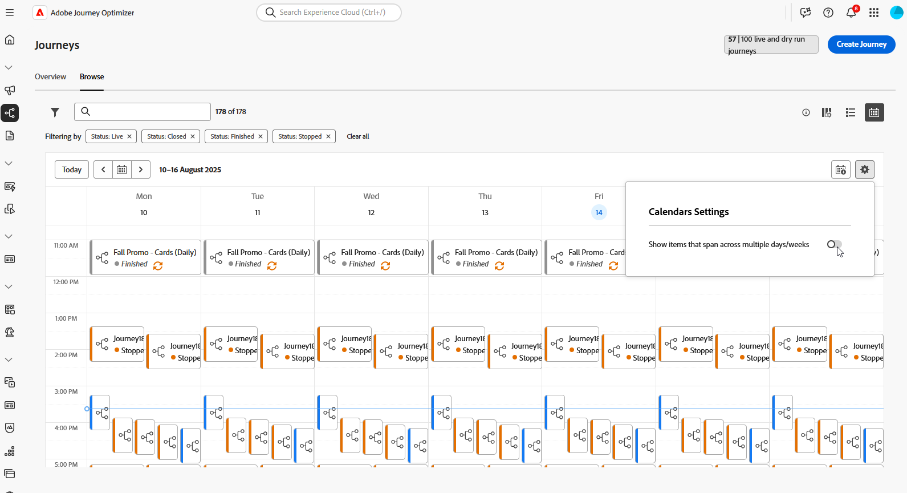
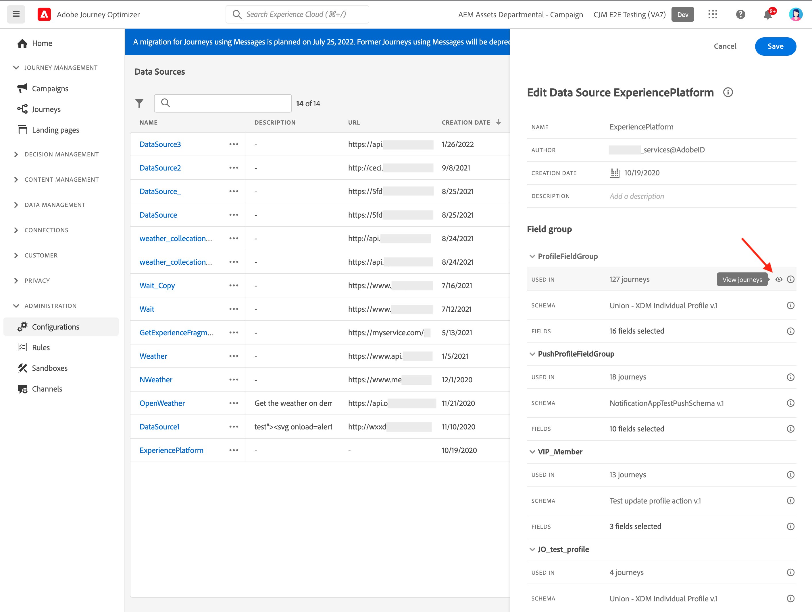

# Bladeren en uw reizen filteren {#browse-journeys}

>[!CONTEXTUALHELP]
>id="ajo_journey_view"
>title="Reislijst en kalenderweergaven"
>abstract="Naast de lijst met ritten geeft [!DNL Journey Optimizer] een kalenderweergave van uw reizen, met een duidelijke visuele weergave van hun dienstregelingen. Met deze knoppen kunt u op elk gewenst moment schakelen tussen de lijst- en de kalenderweergave."

## Reisdashboard {#dashboard-jo}

Klik in de menusectie JOURNEY MANAGEMENT op **[!UICONTROL Journeys]** . Er zijn twee tabbladen beschikbaar: **[!UICONTROL Overview]** en **[!UICONTROL Browse]** .

### Overzicht van reizen

Op het tabblad **[!UICONTROL Overview]** wordt een dashboard weergegeven met de belangrijkste maatstaven voor uw reizen.

 benadrukt

* **verwerkte Profielen**: totaal aantal profielen die in de laatste 24 uren worden verwerkt
* **Levende reizen**: totaal aantal levende reizen met verkeer over de laatste 24 uren. De actieve reizen omvatten **Eenheids reizen** (gebeurtenis-gebaseerd) en **ritten van de Partij** (gelezen publiek).
* **tarief van de Fout**: verhouding van alle profielen in fout vergeleken met het totale aantal profielen die over de laatste 24 uren inging.
* **verwerpt tarief**: verhouding van alle verworpen profielen vergeleken met het totale aantal profielen die de afgelopen 24 uren inging. Een weggegooid profiel vertegenwoordigt iemand die niet in aanmerking komt om de reis, bijvoorbeeld, wegens onjuiste namespace of toegangsregels binnen te gaan.

>[!NOTE]
>
>Dit dashboard houdt rekening met de reizen met verkeer in de afgelopen 24 uur. Alleen de reizen waartoe u toegang hebt, worden weergegeven. De metriek worden verfrist om de 30 minuten en slechts wanneer de nieuwe gegevens beschikbaar zijn.

### Reizigerslijst

Op het tabblad **[!UICONTROL Browse]** wordt de lijst met bestaande reizen weergegeven. U kunt reizen zoeken, filters gebruiken en basishandelingen op elk element uitvoeren. U kunt bijvoorbeeld een item dupliceren of verwijderen.

In de reislijst, worden alle reisversies getoond met het versieaantal. Wanneer u een reis zoekt, verschijnen de nieuwste versies bij de eerste keer dat de toepassing wordt geopend boven aan de lijst. Vervolgens kunt u de gewenste sortering definiëren en wordt deze door de toepassing als gebruikervoorkeur behouden. De versie van de reis wordt ook weergegeven boven aan de interface van de reiseditie, boven het canvas. Leer meer over [ beheer van de reisversie ](publish-journey.md#journey-versions).

### Reizigerskalender {#calendar}

Naast de lijst met ritten geeft [!DNL Journey Optimizer] een kalenderweergave van uw reizen, met een duidelijke visuele weergave van hun dienstregelingen.

Hoe reizen worden vertegenwoordigd:

* Standaard toont het kalenderraster alle actieve en geplande reizen voor de geselecteerde week. Extra filteropties kunnen voltooide, gestopt en voltooide activeringen of activeringen tonen.
* Conceptreizen en ritten in testmodus worden niet weergegeven.
* Reizen die meerdere dagen beslaan, worden boven in het kalenderraster weergegeven.
* Als er geen begintijd is opgegeven, wordt de dichtstbijzijnde handmatige activeringstijd gebruikt om deze in de kalender te plaatsen.
* De reizen worden getoond als timespans van 1 uur, maar dit weerspiegelt geen daadwerkelijke verzend of voltooiingstijd.

Navigeren in uw kalender voor reizen:

1. Om tot de kalendermening toegang te hebben, open de reislijst en klik het  over te schakelen.

1. Gebruik de pijlknoppen of de datumkiezer boven de kalender om tussen weken te gaan.

   In de kalender worden alle reizen weergegeven die voor de huidige week zijn gepland.

   

1. Klik het  om de vertoning van punten van een knevel te voorzien die veelvoudige dagen of weken overspannen.

   

1. Klik  pictogram om tot drie externe kalenders te beheren en toe te voegen.

   

1. Sleep de CSV-bestanden met namen van gebeurtenissen, begindatums en einddatums.

   Geüploade gebeurtenissen worden voor alle gebruikers in uw organisatie weergegeven en worden zowel op de kalenders Reis als Campagne weergegeven.

   +++De CSV-indeling moet als volgt zijn:

   | Kolom1 | Kolom2 | Kolom3 |
   |-|-|-|
   | Gebeurtenisnaam | Begindatum in mm/dd/jj-formaat | Einddatum in mm/dd/yformaat |

   +++

1. Indien nodig, kunt u toegevoegde externe kalenders verbergen, verbergen of verwijderen.

   

1. Voor meer details op een reis, klik zijn visueel blok om zijn details te openen en te onderzoeken.

   

## Uw reizen filteren {#journey-filter}

Gebruik in de lijst met reizen verschillende filters om de lijst met reizen te verfijnen.

U kunt reizen volgens hun [ status ](#journey-statuses) filtreren, [ type ](#journey-types), [ versie ](publish-journey.md#journey-versions), en toegewezen [ markeringen ](../start/search-filter-categorize.md#tags) van **[!UICONTROL Status and version filters]**.

Gebruik **[!UICONTROL Creation filters]** om ritten te filteren op basis van de aanmaakdatum of de gebruiker die ze heeft gemaakt.

Geef ritten weer die een specifieke gebeurtenis, veldgroep of handeling van de **[!UICONTROL Activity filters]** en **[!UICONTROL Data filters]** gebruiken.

Gebruik **[!UICONTROL Publication filters]** om een publicatiedatum of een gebruiker te selecteren. U kunt bijvoorbeeld kiezen of u de nieuwste versies wilt weergeven van live reizen die gisteren zijn gepubliceerd.

Selecteer **[!UICONTROL Custom]** in de vervolgkeuzelijst **[!UICONTROL Published]** als u reizen wilt filteren op basis van een specifiek datumbereik.

Daarnaast wordt in het configuratievenster Gebeurtenis, Gegevensbron en Handeling in het veld **[!UICONTROL Used in]** het aantal ritten weergegeven dat die specifieke gebeurtenis, veldgroep of handeling gebruikt. U kunt klikken op de knop **[!UICONTROL View journeys]** om de lijst met corresponderende journey’s weer te geven.

## Soorten reizen {#journey-types}

Het soort reis hangt af van de activiteiten die in die reis worden gebruikt. Het kan zijn:

* **[!UICONTROL Unitary event]** - Eenheidsuitzettingen worden gekoppeld aan een specifiek profiel. Gebeurtenissen hebben betrekking op het gedrag van een persoon of iets dat met een persoon verband houdt (een persoon bereikte bijvoorbeeld 10.000 loyaliteitspunten). [Meer informatie](../event/about-events.md).
* **[!UICONTROL Business event]**. De reis van bedrijfsgebeurtenissen begint met een niet-profielgerelateerde gebeurtenis. De gebeurtenisconfiguratie wordt uitgevoerd door een technische gebruiker en kan niet worden uitgegeven. [Meer informatie](../event/about-events.md).
* **[!UICONTROL Audience Qualification]** - De reizen van de Kwalificatie van het publiek luisteren naar de ingangen en de uitgang van profielen in [!DNL Adobe Experience Platform] publiek om individuen te maken ingaan of zich op een reis vooruit bewegen. [Meer informatie](audience-qualification-events.md).
* **[!UICONTROL Read audience]** - Bij Lezen kijkreizen nemen alle personen in het publiek de reis in en ontvangen ze de berichten die in uw reis zijn opgenomen.  [Meer informatie](read-audience.md).

Leer meer over reistypes en bijbehorend ingangsbeheer op [ deze pagina ](entry-management.md).

## Reisstatussen {#journey-statuses}

De reisstatus hangt af van de levenscyclus. Het kan zijn:

* **Ontwerp**: de reis is in zijn eerste stadium. Het is nog niet gepubliceerd.
* **Ontwerp (Test)**: de testwijze is geactiveerd gebruikend de **wijze van de Test** knoop. [Meer informatie](../building-journeys/testing-the-journey.md)
* **Voltooid**: de reis schakelt automatisch aan deze status over die op het vervoerstype en de configuratie wordt gebaseerd. Profielen die al op reis zijn, worden normaal afgehandeld. Nieuwe profielen kunnen niet langer de reis betreden. [ leer wanneer de reizen als gebeëindigd ](end-journey.md#journey-finished-definition) worden beschouwd.
* **Levend**: de reis is gepubliceerd gebruikend **publiceer** knoop. [Meer informatie](../building-journeys/publish-journey.md)
* **Gepauzeerd**: de levende reis is gepauzeerd, gebruikend de **3} knoop van de Pauze.** [Meer informatie](../building-journeys/journey-pause.md)
* **Gestopt**: de reis is uitgezet gebruikend de **3} knoop van het Einde {.** Alle individuen sluiten onmiddellijk de reis. [Meer informatie](../building-journeys/end-journey.md#stop-journey)
* **Gesloten**: de reis is gesloten gebruikend **dicht aan nieuwe ingangen** knoop. De reis houdt in dat nieuwe individuen de reis kunnen betreden. Personen die al onderweg zijn, kunnen de reis normaal afmaken. [Meer informatie](../building-journeys/end-journey.md)

>[!NOTE]
>
>* De Journaal die levenscyclus creeert omvat ook een reeks intermediaire statussen die niet beschikbaar voor het filtreren zijn: **het Publiceren** (tussen &quot;Ontwerp&quot;en &quot;Levend&quot;), **activerende testwijze** of **het Deactiveren testwijze** (tussen **Ontwerp** en **Ontwerp (test)**), **het Stoppen** (tussen) **Levend** en **gestopt**), **Hervatten** (tussen **Gepauzeerd** en **Levend**), **Werkend Pauzeren** (tussen **Levend** en **Gepauzeerd**) wanneer een reis in een tussenstadium is, is het read-only.
>
>* Als u aan a **Levende** reis moet wijzigen, [ creeer een nieuwe versie ](#journey-versions) van uw reis. U kunt ook uw live ritten pauzeren, alle benodigde wijzigingen uitvoeren en deze op elk gewenst moment hervatten. [ leer meer over het pauzeren van reizen ](../building-journeys/journey-pause.md)

## Een reis dupliceren {#duplicate-a-journey}

U kunt een bestaande reis van **dupliceren doorbladert** tabel. Alle objecten en instellingen worden gedupliceerd naar de reiskopie.

Volg onderstaande stappen om dit te doen:

1. Navigeer aan de reis u wilt kopiëren, **klikken Meer acties** pictogram (de drie punten naast de reisnaam).
1. Selecteer **Dupliceren**.

   

1. Voer de naam van de reis in en bevestig deze. U kunt de naam ook wijzigen in het scherm met de reiseigenschappen. Standaard wordt de naam als volgt ingesteld: `[JOURNEY-NAME]_copy`

   

1. De nieuwe reis wordt gecreeerd en beschikbaar in de reislijst.

## Bulkbewerkingen {#bulk-operations}

Van de lijst van uw reizen, kunt u veelvoudige **Levende** reizen pauzeren. Om een groep reizen (_bulkpauze_) te pauzeren, hen in de lijst te selecteren en de **knoop van de Pauze** in de blauwe bar bij de bodem van het scherm te klikken. De **knoop van de Pauze** is slechts beschikbaar wanneer **Levende** reizen worden geselecteerd.

U kunt één of verscheidene **Gepauzeerde** reizen ook hervatten. Om een groep ritten (_bulksgewijs hervat_) te hervatten, hen te selecteren en de **hervat** knoop te klikken die in de blauwe bar bij de bodem van het scherm wordt gevestigd. Gelieve te merken op dat de **Hervatten** knoop slechts beschikbaar zal zijn wanneer **Gepauzeerde** reizen worden geselecteerd.

[ Leer meer over de reizen van de Pauze/van de Hervat ](journey-pause.md).

>[!NOTE]
>
>U kunt pauzeren/hervatten tot 10 reizen per verrichting.

