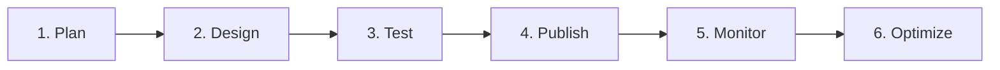

# Aan de slag met reizen{#jo-general-principle}

Met Adobe Journey Optimizer kunt u persoonlijke, uit meerdere stappen bestaande klantritten maken die zich in real-time aanpassen aan het gedrag en de behoeften van uw publiek. Met een intuïtief canvas voor slepen en neerzetten kunt u berichten en acties op meerdere kanalen ordenen, waarbij gebruik wordt gemaakt van contextafhankelijke gegevens en doelgroepen voor maximale impact.

Deze gids verstrekt een duidelijke routekaart om u te helpen de grondbeginselen van de reis begrijpen, het juiste reistype voor uw gebruiksgeval kiezen, en betrouwbaar ontwerpt reizen die betekenisvolle, geschikte klantenervaringen leveren.

## Wat zijn reizen?

**de Reizen** zijn geautomatiseerde, multi-step klantenervaringen die gepersonaliseerde interactie over kanalen in antwoord op klantengedrag, bedrijfsgebeurtenissen, of geplande campagnes organiseren.

Gebruik [!DNL Journey Optimizer] om:

* Bouw **gebruiksgevallen in real time van het orkestgebruik** gebruikend contextafhankelijke gegevens die in gebeurtenissen of gegevensbronnen worden opgeslagen
* Ontwerp **multistep geavanceerde scenario&#39;s** die dynamisch aan klantengedrag en bedrijfsgebeurtenissen antwoorden
* Lever **1 :1 gepersonaliseerde ervaringen** bij schaal over e-mail, duw, SMS, in-app, Web, en meer

➡️ **Klaar om te beginnen met bouwen?** [ creeer uw eerste reis ](journey-gs.md) in 5 minuten.

## Kies uw type reis {#journey-types}

**alvorens u begint te bouwen**, is het belangrijk om te begrijpen welk type van reis uw gebruiksgeval past. Adobe Journey Optimizer ondersteunt vier soorten reizen, elk ontworpen voor verschillende toegangsmechanismen en bedrijfsscenario&#39;s:

>[!BEGINTABS]

>[!TAB  Eenheids reizen ]

 **wanneer te gebruiken:** Real-time, gebeurtenis-teweeggebrachte ervaringen

**de eenheidstrajecten** worden teweeggebracht individueel wanneer een specifieke actie (aankoop, app login, vormvoorlegging) voorkomt. Profielen worden een voor een ingevoerd in real-time ingevoerd, waardoor dit ideaal is voor directe, op gedrag gebaseerde reacties.

**Perfect voor:**

* Bevestigingen van bestellingen na aankoop
* E-mails ontvangen wanneer iemand zich abonneert
* Opzegging van winkelwagentje geactiveerd door bladeren
* Meldingen voor opnieuw instellen van wachtwoord

➡️ [ Leer over gebeurtenissen ](../event/about-events.md) | [ Bericht aan abonnees gebruikt geval ](message-to-subscribers-uc.md)

>[!TAB  lees de reizen van het Publiek ]

 **wanneer te gebruiken:** Geplande campagnes aan publiekssegmenten

**las de reizen van het Publiek** beginnen met een publiek van Adobe Experience Platform en verzendt berichten in partij naar alle profielen gelijktijdig. Dit type van reis is ideaal voor geplande, grootschalige mededelingen.

**Perfect voor:**

* Maandelijkse nieuwsbrieven
* Promotiecampagnes voor doelsegmenten
* Aankondigingen van producten
* Seizoensgebonden marketingcampagnes

➡️ [ Leer over Gelezen Publiek ](read-audience.md) | [ krijgen begonnen met publiek ](../audience/about-audiences.md)

>[!TAB  reizen van de Kwalificatie van het publiek ]

 **toen te gebruiken:** Reële-tijd reacties op de veranderingen van het publiekslidmaatschap

**de reizen van de Kwalificatie van het publiek** teweegbrengen wanneer de profielen voor (of uitgang uit) een specifiek publiek kwalificeren. Profielen worden afzonderlijk ingevoerd als ze in real-time aan de criteria voldoen, zodat ze direct in contact kunnen komen wanneer het gedrag van de klant verandert.

**Perfect voor:**

* VIP-upgrademeldingen
* Opnieuw in dienst nemen wanneer klanten inactief worden
* Eerste berichten voor aankoopfeest
* Geografisch doel wanneer klanten verhuizen

➡️ [ Leer over de Kwalificatie van het Publiek ](audience-qualification-events.md) | [ Creërend publiek ](../audience/creating-a-segment-definition.md)

>[!TAB  Van bedrijfs gebeurtenisreizen ]

 **wanneer te gebruiken:** Bedrijfs voorwaarden die veelvoudige klanten beïnvloeden

{de ritten van de Bedrijfs gebeurtenis **worden teweeggebracht door zaken-vlakke gebeurtenissen (voorraadupdates, weeralarm, prijsveranderingen) die veelvoudige profielen gelijktijdig beïnvloeden.** Deze maatregelen zijn eerder gericht op bredere bedrijfsomstandigheden dan op individuele acties.

**Perfect voor:**

* Lage inventariswaarschuwingen aan geïnteresseerde klanten
* Aankondigingen Flash-verkoop
* Op weersomstandigheden gebaseerde promoties
* Prijsdalingsberichten
* Waarschuwing over back-in-stock van producten

➡️ [ Leer over bedrijfsgebeurtenissen ](../event/about-creating-business.md) | [ Invoerbeheer ](entry-management.md)

>[!ENDTABS]

>[!NOTE]
>
>Weet u niet zeker welk type u wilt kiezen? Begin met **Eenvoudige reizen** voor op gebeurtenis-gebaseerde ervaringen of **Gelezen de reizen van het Publiek** voor geplande campagnes-deze behandelen gemeenschappelijkste gebruiksgevallen.

## Bouw met de reisontwerper {#journey-designer}

De **[reisontwerper](using-the-journey-designer.md)** is uw visueel canvas voor het creëren van klantenervaringen. Met een intuïtieve drag-and-drop interface, kunt u elke stap van uw reis organiseren zonder code te schrijven.

### Wat u in de ontwerper kunt doen:

:::: landing-cards-container

:::

**bepaalt ingangspunten**

Kies hoe klanten ingaan: door een gebeurtenis, een publiekssegment, of een publiekskwalificatie.

[Meer informatie over entry-beheer](entry-management.md)
:::

:::

**Berichten verzenden**

Gebruik ingebouwde kanaalacties voor e-mail, push, SMS/MMS, in-app, web en meer, allemaal ontworpen in Journey Optimizer.

[Berichten verzenden tijdens reizen](journeys-message.md)
:::

:::

**voeg logica &amp; voorwaarden** toe

Vertakken uw reis die op profielattributen, publiekslidmaatschap, of gebeurtenissen in real time wordt gebaseerd.

[Gebruiksvoorwaarden](condition-activity.md)
:::

:::

**gegevens van de Leverage**

Gebruik contextuele gegevens van gebeurtenissen, Adobe Experience Platform of externe API-services.

[Werken met gegevensbronnen](../datasource/about-data-sources.md)
:::

:::

**verbindt externe systemen**

Aangepaste acties maken om systemen van derden te integreren voor het verzenden van berichten of het activeren van workflows.

[Aangepaste handelingen configureren](../action/about-custom-action-configuration.md)
:::

:::

**voeg orchestration activiteiten** toe

Gebruik wachttijden, sprongen, profielupdates en publieksbeheer om geavanceerde stromen te maken.

[Alle activiteiten verkennen](about-journey-activities.md)
:::

::::

➡️ **Hands-on het leren:** [ bekijk de video van de reisontwerper ](#video) of [ onderzoek van begin tot eind gebruiksgevallen ](jo-use-cases.md)

## Uw workflow voor het maken van reizen {#workflow}

De bouw van succesvolle reizen volgt een duidelijk, herhaalbaar proces. Dit is uw stapsgewijze workflow:

### &#x200B;1. **Plan uw reis** {#plan}

Voordat u de ontwerper opent, moet u uw doelstellingen verduidelijken:

* **wat is het doel?** (bijvoorbeeld aan boord van nieuwe klanten, opnieuw inactieve gebruikers inschakelen)
* **Wie is het publiek?** (specifiek segment, gebeurtenisgestuurde personen)
* **Welk vervoerstype past?** (Zie [ reistypes ](#journey-types) hierboven)
* **Welke kanalen zult u gebruiken?** (e-mail, push, SMS, enz.)

### &#x200B;2. **Ontwerp in het canvas** {#design}

Gebruik de reisontwerper om uw stroom te bouwen:

1. **vastgestelde ingangsvoorwaarden** - bepalen hoe de profielen ingaan (gebeurtenis, publiek, kwalificatie)
2. **voeg orchestratielogica** toe - omvat wachttijden, voorwaarden, en besluitvormingspunten
3. **vorm berichten** - Ontwerp uw mededelingen of hefboomwerking bestaande malplaatjes
4. **de acties van de opstelling** - vorm ingebouwde of douaneacties om uit te voeren
5. **bepaalt uitgangscriteria** - specificeer wanneer en hoe de profielen de reis voltooien

[Leer hoe u de reisontwerper → gebruikt](using-the-journey-designer.md)

### &#x200B;3. **Test alvorens live te gaan** {#test}

Test altijd uw reis om kwesties te vangen alvorens de klanten hen ervaren:

* Gebruik **testwijze** om de reis met testprofielen te simuleren
* Gebruik **droge looppas** aan voorproefreis uitvoering zonder echte gegevens te beïnvloeden of berichten te verzenden
* Controleren of alle voorwaarden, berichten en handelingen naar behoren werken
* De timing, gegevensstromen, en verpersoonlijking van de controle

[ test uw reis → ](testing-the-journey.md) | [ Leer over droge looppas → ](journey-dry-run.md)

### &#x200B;4. **publiceer uw reis** {#publish}

Als het testen is voltooid, publiceert u om uw reis live te maken:

* Definitieve instellingen en eigenschappen controleren
* Publiceren om te activeren voor echte klanten
* Opmerking: actieve reizen kunnen worden gestopt, maar niet worden bewerkt (u moet een nieuwe versie maken)

[Uw reis publiceren →](publish-journey.md)

### &#x200B;5. **prestaties van de Monitor** {#monitor}

Volg hoe je reis in de echte wereld presteert:

* Reisrapporten en analyses weergeven
* Het ingang, de voltooiing van de monitor, en foutenpercentages
* Waarschuwingen instellen voor kritieke problemen

[ Monitor en rapport → ](report-journey.md) | [ opstelling alarm → ](../reports/alerts.md)

### &#x200B;6. **optimaliseer en herhaling** {#optimize}

Gebruik inzichten om te verbeteren:

* De betrokkenheidswaarden en conversiesnelheden analyseren
* Optimalisatie van verzendtijd testen
* Nieuwe reisversies maken met verbeteringen
* Aanbevelingen van AI gebruiken

[ optimaliseer uw reizen →](optimize.md) | [ Send-time optimalisering → ](send-time-optimization.md)

➡️ **Klaar om te beginnen?** [ creeer nu uw eerste reis → ](journey-gs.md)

## Kwesties voor gebruik in de praktijk {#use-cases}

Leer uit praktische voorbeelden die aantonen hoe u reisconcepten toepast om gemeenschappelijke marketinguitdagingen op te lossen:

:::: landing-cards-container

:::

**Onthaal nieuwe abonnees**

Wanneer een klant zich op uw dienst abonneert, teweeg een welkome reis die hen aanmoedigt om onboarding stappen te voltooien.

[Gebruiksscenario weergeven →](message-to-subscribers-uc.md)
:::

:::

**Send-time optimalisering**

Gebruik AI om e-mails te verzenden wanneer elke klant waarschijnlijk verbinding zal maken, waarbij de geopende snelheden en kliksnelheden worden gemaximaliseerd.

[Gebruiksscenario weergeven →](send-time-optimization.md)
:::

:::

**Ramp omhoog leveranties**

Verhoog geleidelijk het berichtvolume om uw verzendende reputatie op te warmen en leveringsproblemen te vermijden.

[Gebruiksscenario weergeven →](ramp-up-deliveries-uc.md)
:::

:::

**Doel tegen weekdag**

Verstuur verschillende inhoud op de dag van de week die klanten uw reis voor betere relevantie ingaan.

[Gebruiksscenario weergeven →](weekday-email-uc.md)
:::

:::

**Multikanaalcampagnes**

Orchestreer naadloze ervaringen via e-mail, push, SMS en webkanalen in één reis.

[Gebruiksscenario weergeven →](journeys-uc.md)
:::

:::

**Alle gebruiksgevallen**

Ontdek de volledige bibliotheek met trajectgebruiksgevallen met stapsgewijze implementaties.

[ doorblader allen → ](jo-use-cases.md) | [ de gevallenbibliotheek van het Gebruik → ](/help/rp_landing_pages/journey-use-cases-landing-page.md)
:::

::::

## Verken de mogelijkheden van de reis {#capabilities}

Terwijl u comfortabeler bent met het maken van reizen, verkent u deze krachtige mogelijkheden om geavanceerde klantervaringen te creëren:

:::: landing-cards-container

:::

**Geavanceerde Uitdrukkingen**

Bouw dynamische voorwaarden en verpersoonlijking gebruikend de uitdrukkingsredacteur voor gegevensmanipulatie en complexe logica.

[Meer informatie over expressies](/help/rp_landing_pages/building-advanced-conditions-journeys-landing-page.md)
:::

:::

**Tijdzonebeheer**

Verwerk het algemene publiek met automatische aanpassingen van de tijdzone en optimale verzendtijden.

[Tijdzones beheren](timezone-management.md)
:::

:::

**wijze van de Test &amp; droge looppas**

U kunt reizen valideren met testprofielen voordat u live gaat en een voorvertoning van de uitvoering weergeven zonder dat dit invloed heeft op de werkelijke gegevens.

[droge run gebruiken](journey-dry-run.md)
:::

:::

**Exemplaar aan zandbak**

Dubbele reizen tussen sandboxen om test- en implementatieworkflows te stroomlijnen.

[Reizen kopiëren](copy-to-sandbox.md)
:::

:::

**Markeringen &amp; organisatie**

Gebruik labels om ritten te categoriseren en filteren voor beter beheer op schaal.

[Organiseren met tags](tags.md)
:::

:::

**controle van de Output**

Beperk berichtproductie om het verzenden van reputatie te beheren en overweldigende systemen te vermijden.

[Doorvoercontrole](limit-throughput.md)
:::

::::

[Alle reismogelijkheden weergeven →](/help/rp_landing_pages/manage-journey-landing-page.md)

## Leren door te kijken {#video}

Bekijk een visuele introductie van reisonderdelen en leer de basisbeginselen van het maken van reizen op het canvas:

>[!VIDEO](https://video.tv.adobe.com/v/3424996?quality=12)

➡️ **Wilt u meer video&#39;s?** [ Onderzoek reis videoleerprogramma&#39;s ](https://experienceleague.adobe.com/en/docs/journey-optimizer-learn/tutorials/journeys/journey-designer-overview){target="_blank"}

## Hebt u hulp nodig? {#help}

### Snelle koppelingen voor algemene taken

* **[creeer uw eerste reis](journey-gs.md)** - geleidelijke gids voor beginners
* **[Veelgestelde Veelgestelde vragen van de Reis](journey-faq.md)** - de Gemeenschappelijke beantwoorde vragen
* **[het Oplossen van problemen](/help/rp_landing_pages/troubleshoot-journey-landing-page.md)** - onderzoekt en bevestigt kwesties
* **[Verwijzing van de codes van de Fout](error-codes-reference.md)** - begrijp foutenmeldingen
* **[Grafieken &amp; beperkingen](../start/guardrails.md)** - Technische grenzen en beste praktijken

### Ontvang meldingen over problemen

Opstelling **[reisalarm](../reports/alerts.md)** om bericht in real time te ontvangen wanneer de reizen fouten of ongebruikelijke patronen ontmoeten.

### Aanvullende bronnen

* **[hub van het het beheersbeleid van de Reis](/help/rp_landing_pages/manage-journey-landing-page.md)** - Hulpmiddelen voor het filtreren, optimalisering, en profielbeheer
* **[de activiteitenverwijzing van de Reis](/help/rp_landing_pages/about-journey-building-landing-page.md)** - Volledige gids aan alle activiteitentypes
* **[de uitvoeringskwesties van het Oplossen van problemen](troubleshooting-execution.md)** - zuivert de problemen van de reisuitvoering
* **[het Oplossen van problemen binnenkomende activiteiten](troubleshooting-inbound.md)** - de ingang en kwalificatiekwesties van de moeilijke situatie

**Klaar om uw eerste reis te bouwen?** [ wordt begonnen nu → ](journey-gs.md)
