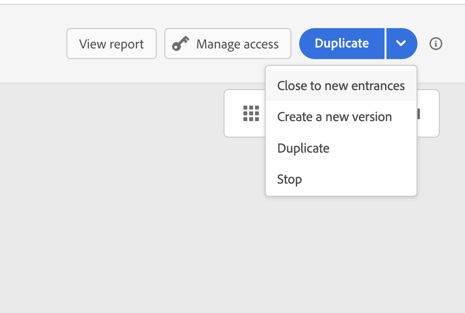

# Algemeen principe{#jo-general-principle}

[!DNL Journey Optimizer] kunt u in real time het gebruik van het orchestration gebruiken gevallen leveraging contextuele gegevens die in gebeurtenissen of gegevensbronnen worden opgeslagen.

Ontwerp multistep geavanceerde scenario&#39;s aangedreven door de volgende mogelijkheden:

* In real time verzenden **unitaire levering** geactiveerd wanneer een gebeurtenis wordt ontvangen, of **in batch** Adobe Experience Platform-segmenten gebruiken.

* Hefboomwerking **contextafhankelijke gegevens** uit gebeurtenissen, informatie van Adobe Experience Platform of gegevens van externe API-services.

* Gebruik de **ingebouwde handelingen** om berichten te verzenden die zijn ontworpen in [!DNL Journey Optimizer] of maak **aangepaste handelingen** als u een systeem van derden gebruikt om uw berichten te verzenden.

* Met de **reisontwerper**, maak uw meerstapse gebruiksscenario&#39;s: U kunt eenvoudig een entry-gebeurtenis of een lezen-segmentactiviteit slepen en neerzetten, voorwaarden toevoegen en gepersonaliseerde berichten verzenden.

## Reislevenscyclus{#journey-lifecyle}

### Profielen tijdens reizen{#profile-journey}

Op een eengemaakte reis:

* Als re-entry wordt toegelaten, kan een profiel een reis verscheidene keren ingaan, maar kan het niet doen tot hij dat vorige geval van de reis volledig verliet.

* Als re-entry gehandicapt is, kan een profiel niet veelvoudige tijden de zelfde reis ingaan

Raadpleeg deze voor meer informatie over het opnieuw invoeren van profielen [sectie](../building-journeys/journey-gs.md#change-properties).

In een leesegment reis:

* Voor eenmalige ritten: het profiel wordt slechts eenmaal ingevoerd .
* voor terugkerende ritten: het profiel gaat de reis op elke herhaling in, als hij zich in het segment/de verwachte status bevindt. Als hij nog onderweg was van een eerdere herhaling, zal hij het vanaf het begin opnieuw starten.

In zakelijke gebeurtenissenritten die beginnen met een leesegment:

In het besef dat deze reis gebaseerd is op de ontvangst van een bedrijfsevenement, als het profiel in het verwachte segment gekwalificeerd is, zal hij de reis voor elke ontvangen bedrijfsgebeurtenis ingaan, die betekent dat dit profiel veelvoudige tijden in de zelfde reis, tezelfdertijd, maar in de context van verschillende bedrijfsgebeurtenissen kan zijn.

Eenheidstrajecten (te beginnen met een evenement of segmentkwalificatie) bevatten een geleider die voorkomt dat ritten voor dezelfde gebeurtenis meerdere keren ten onrechte worden gestart. De terugkeer van het profiel wordt tijdelijk geblokkeerd door gebrek gedurende 5 minuten. Als bijvoorbeeld een evenement om 12.01 uur een reis voor een bepaald profiel start en een ander om 12.03 uur aankomt (ongeacht of het dezelfde gebeurtenis is of een andere gebeurtenis die dezelfde reis veroorzaakt), zal die reis niet opnieuw beginnen voor dit profiel.

### Reiseinde{#journey-ending}

Een reis kan voor een individu in twee specifieke contexten eindigen:

* De persoon komt bij de laatste activiteit van een weg aan.
* De persoon komt aan bij een **Voorwaarde** activiteit (of **Wachten** activiteit met een voorwaarde) en voldoet aan geen van de voorwaarden.

De persoon kan dan opnieuw de reis betreden als herbinnenkomst is toegestaan. Zie [deze pagina](../building-journeys/journey-gs.md#change-properties)

Om een live reis te beëindigen, adviseren wij dat u het sluit. De komst van nieuwe klanten op de reis zal dan worden geblokkeerd. Klanten die al op reis zijn gegaan, kunnen het tot het einde ervaren. Zie [deze sectie](../building-journeys/journey.md#close-journey)

U kunt een reis alleen stoppen als zich een noodsituatie voordoet en alle verwerking onmiddellijk op een reis moet worden beëindigd. Personen die al een reis zijn binnengekomen, worden in de loop der tijd gestopt. Zie [deze sectie](../building-journeys/journey.md#stop-journey)

>[!NOTE]
>
>U kunt een gesloten of gestopt reis niet hervatten.

#### Tag voor einde van reis{#end-tag}

Tijdens het ontwerpen van een rit wordt aan het einde van elk pad een &quot;eindtag&quot; weergegeven. Dit knooppunt kan niet door een gebruiker worden toegevoegd, kan niet worden verwijderd en alleen het label ervan kan worden gewijzigd. Het markeert het einde van elk pad van de reis. Als de reis verscheidene wegen heeft, adviseren wij dat u een etiket aan elk eind toevoegt om rapporten gemakkelijker te maken te lezen. Zie [deze pagina](../reports/live-report.md).

<!--

### End activity{#journey-end-activity}

The **[!UICONTROL End]** activity allows you to mark the end of each path of the journey. It is not mandatory but recommended for visual clarity. See [this page](../building-journeys/end-activity.md)

-->

#### Een reis sluiten{#close-journey}

Een reis kan om de volgende redenen worden gesloten:

* De reis wordt handmatig gesloten via de **[!UICONTROL Close to new entrances]** knop.
* Een reis op basis van een segment met één opname die klaar is met de uitvoering.
* Na het laatste voorkomen van een terugkerende op segment gebaseerde reis.

Als u een reis handmatig sluit, weet u zeker dat klanten die de reis al hebben betreden, hun pad kunnen voltooien, maar dat nieuwe gebruikers de reis niet kunnen betreden. Wanneer een reis wordt gesloten (om een van de bovenstaande redenen), heeft deze de status **[!UICONTROL Closed]**. De reis houdt in dat nieuwe individuen de reis kunnen betreden. Personen die al onderweg zijn, kunnen de reis normaal afmaken. Na de standaard wereldwijde time-out van 30 dagen wordt de reis overgeschakeld op de **Voltooid** status. Zie dit [sectie](../building-journeys/journey-gs.md#global_timeout).

Een gesloten reisversie kan niet opnieuw worden gestart of verwijderd. U kunt er een nieuwe versie van maken of deze dupliceren. Alleen voltooide reizen kunnen worden verwijderd.

Als u een reis wilt sluiten in de lijst met ritten, klikt u op de knop **[!UICONTROL Ellipsis]** knop rechts van de naam van de reis en selecteer **[!UICONTROL Close to new entrances]**.

U kunt ook het volgende doen:

1. In de **[!UICONTROL Journeys]** klikt u op de rit die u wilt sluiten.
1. Klik rechtsboven op de pijl omlaag.

   

1. Klikken **[!UICONTROL Close to new entrances]** en bevestigen in het dialoogvenster.

#### Een reis stoppen{#stop-journey}

Als u de voortgang van alle mensen op de reis moet stoppen, kunt u deze stoppen. Als de reis wordt stopgezet, wordt een time-out voor alle personen op de reis vastgesteld. Als we echter een reis stoppen, moeten mensen die al een reis hebben afgelegd, in de loop van hun reis worden gestopt. De reis is eigenlijk uitgeschakeld. Als u een reis wilt beëindigen, raden wij u aan deze te sluiten.

Een voltooide reisversie kan niet opnieuw worden gestart.

Wanneer deze wordt gestopt, wordt de reisstatus ingesteld op **[!UICONTROL Stopped]**.

U kunt bijvoorbeeld een reis stoppen als een markeerder beseft dat de reis het verkeerde publiek aanvalt of dat een aangepaste actie die berichten moet leveren, niet correct werkt. Om een reis van de lijst van reizen tegen te houden, klik **[!UICONTROL Ellipsis]** knop rechts van de naam van de reis en selecteer **[!UICONTROL Stop]**.

U kunt ook het volgende doen:

1. In de **[!UICONTROL Journeys]** klikt u op de reis die u wilt stoppen.
1. Klik rechtsboven op de pijl omlaag.
   
1. Klikken **[!UICONTROL Stop]** en bevestigen in het dialoogvenster.

## Journeyversies{#journey-versions}

In de reislijst, worden alle reisversies getoond met het versieaantal. Zie [deze pagina](../building-journeys/using-the-journey-designer.md).

Wanneer u een reis zoekt, verschijnen de nieuwste versies bij de eerste keer dat de toepassing wordt geopend boven aan de lijst. Vervolgens kunt u de gewenste sortering definiëren en wordt deze door de toepassing als gebruikervoorkeur behouden. De versie van de reis wordt ook weergegeven boven aan de interface van de reiseditie, boven het canvas.

>[!NOTE]
>
>In de meeste gevallen kan een profiel niet meerdere keren tegelijk op dezelfde reis aanwezig zijn. Als de terugkeer wordt toegelaten, kan een profiel een reis opnieuw ingaan, maar kan het niet doen tot hij dat vorige geval van de reis volledig verliet. [Meer informatie](#journey-ending)

Als u zich aan een levende reis moet aanpassen, creeer een nieuwe versie van uw reis.

1. Open de nieuwste versie van uw livereis en klik op **[!UICONTROL Create a new version]** en bevestigen.

   

   >[!NOTE]
   >
   >U kunt alleen een nieuwe versie maken van de meest recente versie van een reis.

1. Breng de gewenste wijzigingen aan en klik op **[!UICONTROL Publish]** en bevestigen.

   

Vanaf het moment dat de reis wordt gepubliceerd, zullen individuen naar de recentste versie van de reis gaan. Mensen die al een vorige versie hebben ingevoerd, blijven er totdat ze klaar zijn met de reis. Als ze later weer dezelfde reis maken, gaan ze naar de meest recente versie.

Reisversies kunnen afzonderlijk worden gestopt. Alle versies van reizen hebben dezelfde naam.

Wanneer u een nieuwe versie van een reis publiceert, automatisch beëindigt de vorige versie en schakelt naar **Gesloten** status. Er kan geen toegang tot de reis plaatsvinden. Zelfs als u de laatste versie stopt, blijft de vorige versie gesloten.

>[!NOTE]
>
>Meer informatie over reisversies, instructies en beperkingen, in [deze pagina](../start/guardrails.md#journey-versions-limitations)