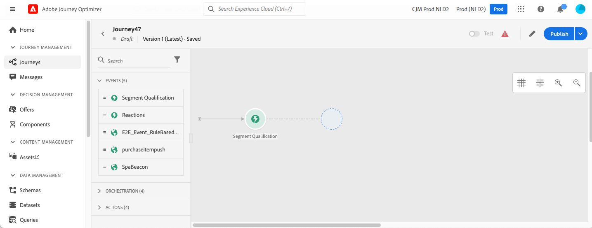
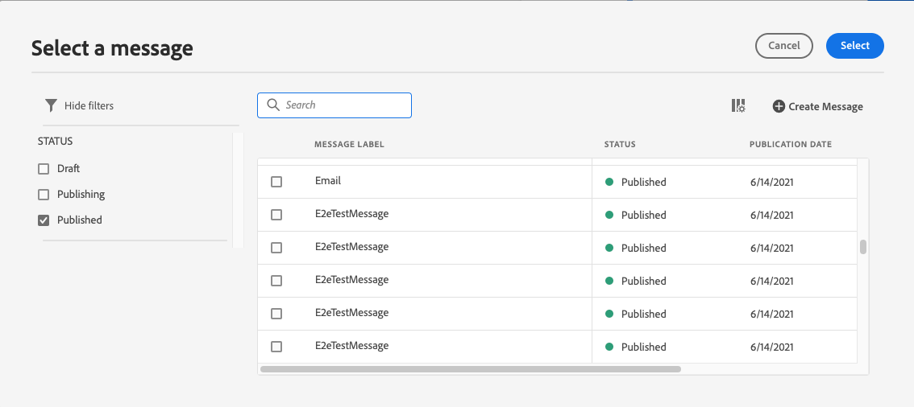

# Een bericht toevoegen in een journey{#add-a-message-in-a-journey}

[!DNL Journey Optimizer] berichtmogelijkheden zijn ingebouwd. U hoeft alleen uw inhoud te ontwerpen en uw bericht te publiceren. Zie [deze sectie](../messages/get-started-content.md). Vervolgens voegt u eenvoudig een push- of e-mailbericht toe dat is ontworpen met Journey Optimizer.

Als u een systeem van derden gebruikt om uw berichten te verzenden, kunt u een douaneactie tot stand brengen. Meer informatie in deze [sectie](../action/action.md).

## Berichtactiviteit toevoegen

1. Zoals altijd begint uw reis met een gebeurtenis of een **Segment lezen** activiteit.

   

1. Van de **Handelingen** van het palet, slepen en neerzetten **Bericht** op het canvas.

   

1. Voeg een label en beschrijving toe.

   

1. Klik in het dialoogvenster **Bericht** veld. De lijst met beschikbare berichten die in Journey Optimizer zijn ontworpen, wordt weergegeven. U kunt de lijst filteren op status.

   

1. Kies een bericht en klik op **Selecteren**. U kunt ook rechtstreeks vanuit dit scherm een nieuw bericht maken door op **Bericht maken**.

   

   Als u uw bericht wilt controleren, kunt u klikken **Het bericht openen** in het deelvenster **Bericht** veld. Het bericht wordt geopend op een nieuw tabblad.

   

1. Voeg de volgende stappen aan uw reis toe.

## E-mailparameters en push-parameters

De **[!UICONTROL Email parameters]** en **[!UICONTROL Push parameters]** worden alleen-lezen velden weergegeven. U voert typisch deze configuratie uit wanneer het creëren van het bericht. Zie [deze sectie](../messages/get-started-content.md).

Als u een bepaalde waarde wilt afdwingen, kunt u de opdracht **Parameteroverschrijving inschakelen** rechts van het veld. Deze optie kan nuttig zijn voor verschillende doeleinden:

* Als u bijvoorbeeld een e-mailbericht wilt testen, kunt u uw e-mailadres toevoegen. Nadat u de reis hebt gepubliceerd, wordt het e-mailbericht naar u verzonden.
* U kunt naar het e-mailadres van de abonnees van een lijst verwijzen. Zie dit [use case](message-to-subscribers-uc.md).

## Send-Time optimalisatie{#send-time-optimization}

>[!CONTEXTUALHELP]
>id="jo_bestsendtime_disabled"
>title="Optimalisatie Verzonden tijd"
>abstract="De functie voor Send-Time optimalisatie van Adobe Journey Optimizer, aangedreven door de AI-services van Adobe, kan de beste tijd voorspellen voor het verzenden van een e-mail- of pushbericht om de betrokkenheid te maximaliseren op basis van de historische open en kliksnelheden."

De functie voor Send-Time optimalisatie van Adobe Journey Optimizer, aangedreven door de AI-services van Adobe, kan de beste tijd voorspellen voor het verzenden van een e-mail- of pushbericht om de betrokkenheid te maximaliseren op basis van de historische open en kliksnelheden. Gebruik ons machine-leert model om gepersonaliseerde verzendtijden voor elke gebruiker te plannen om open te groeien en tarieven van uw berichten te klikken.

>[!NOTE]
>
>Deze functie is momenteel in bètaversie beschikbaar voor bètaklanten. Neem contact op met de klantenservice van Adobe om deel te nemen aan het bètaprogramma.

Het model van de Optimalisering van de Send-Time neemt uw gegevens van Adobe Journey Optimizer op en kijkt open (voor e-mail en duw) op gebruikersniveau en klikt (voor e-mail) tarieven om te bepalen wanneer uw klanten het meest waarschijnlijk met uw overseinen in dienst zullen nemen. De optimalisering van de Send-Tijd vereist een minimum van één maand van bericht-volgende gegevens om geïnformeerde aanbevelingen te doen. Voor elke gebruiker kiest het systeem automatisch de beste tijd met behulp van de volgende scores:

* Het beste uur van elke dag van de week om de betrokkenheid te maximaliseren
* De beste dag van de week om de betrokkenheid te maximaliseren
* Het beste uur van de beste dag van de week om de betrokkenheid te maximaliseren

Het model varieert, of u over score of opleiding spreekt. De training wordt aanvankelijk wekelijks en vervolgens driemaandelijks gegeven. De score wordt eerst wekelijks en daarna maandelijks vastgesteld.

* Training - de ontwikkeling van het algoritme dat wordt gebruikt om de score te maken
* Scores - de toepassing van een score op individuele profielen die op het getrainde model worden gebaseerd

Deze informatie wordt opgeslagen met het profiel van de gebruiker en wordt bij de uitvoering van de reis gebruikt om Adobe Journey Optimizer te laten weten wanneer je bericht moet worden verzonden.

>[!CAUTION]
>
>* Deze functie is alleen beschikbaar voor monokanaalberichten via e-mail en push met de functie voor bijhouden ingeschakeld.
>* Het bericht moet worden gepubliceerd.
>* Deze functie is niet compatibel met de burst-modus.

### Send-Time optimaliseren activeren{#activate-send-time-optimization}

>[!CONTEXTUALHELP]
>id="jo_bestsendtime_email"
>title="Send-Time optimaliseren activeren"
>abstract="Kies of u wilt optimaliseren bij het openen van e-mail of door op de e-mail te klikken. Selecteer hiervoor het juiste keuzerondje. U kunt er ook voor kiezen om de verzendtijden die door het systeem worden gebruikt te accentueren door een waarde voor Verzenden in te voeren binnen de volgende optie."

>[!CONTEXTUALHELP]
>id="jo_bestsendtime_push"
>title="Send-Time optimaliseren activeren"
>abstract="Pushberichten worden standaard ingesteld op de optie Openen, omdat klikken niet van toepassing zijn op pushberichten. U kunt er ook voor kiezen om de verzendtijden die door het systeem worden gebruikt te accentueren door een waarde voor Verzenden in te voeren binnen de volgende optie."

Schakel SendTime Optimization in op een e-mail- of pushbericht door de optie **Send-Time optimalisatie** schakelaar van de parameters van de activiteit van het Bericht.

Kies bij e-mailberichten of u wilt optimaliseren bij het openen van een e-mail of door op het juiste keuzerondje te klikken. Pushberichten worden standaard ingesteld op de optie Openen, omdat klikken niet van toepassing zijn op pushberichten.

U kunt er ook voor kiezen om de verzendtijden die door het systeem worden gebruikt, te accentueren door een waarde in te voeren voor het dialoogvenster **Verzenden binnen de volgende** optie. Als u &quot;zes uur&quot;als waarde kiest, [!DNL Journey Optimizer] zal elk gebruikersprofiel controleren en de optimale verzendtijd kiezen binnen zes uur na de uitvoeringstijd van de reis.
