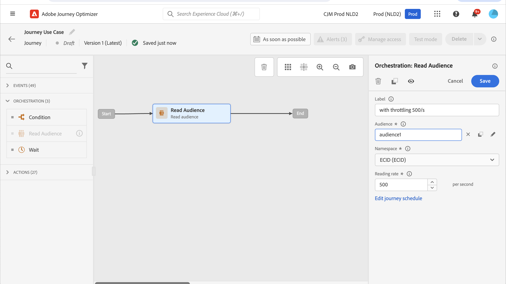

# Gebruik hoofdletters/kleine letters om de doorvoer te beperken met externe gegevensbronnen en aangepaste handelingen{#limit-throughput}

## Beschrijving van het gebruiksgeval

Adobe Journey Optimizer staat artsen toe om API vraag naar externe systemen door het gebruik van de Acties van de Douane en Gegevensbronnen te verzenden.

Dit kan gebeuren met:

* **Bronnen van Gegevens**: om informatie van externe systemen te verzamelen en het in de reiscontext te gebruiken, bijvoorbeeld om weerinformatie over de profielstad te krijgen en een specifieke reisstroom te hebben die op dat wordt gebaseerd.

* **Acties van de Douane**: om informatie naar externe systemen te verzenden, bijvoorbeeld om e-mails door een externe oplossing te verzenden gebruikend de mogelijkheden van het Orchestration van Journey Optimizer naast profielinformatie, publieksgegevens en reiscontext.

>[!NOTE]
>
>Aangezien de reacties nu worden gesteund, zou u douaneacties in plaats van gegevensbronnen voor externe gegevensbronnen moeten gebruiken-gevallen. Voor meer informatie over reacties, zie deze [ sectie ](../action/action-response.md)

Als u met externe gegevensbronnen of douaneacties werkt, kunt u uw externe systemen willen beschermen door reisproductie te beperken: tot 5.000 instanties/seconde voor unitaire reizen en tot 20.000 instanties/seconde voor publiek-teweeggebrachte degenen.

Voor aangepaste acties zijn vertragingsmogelijkheden beschikbaar op productniveau. Verwijs naar deze [ pagina ](../configuration/external-systems.md#capping).

Voor externe gegevensbronnen, kunt u een het begrenzen op eindpuntniveau bepalen om die externe systemen te vermijden overweldigend door Journey Optimizer Capping APIs. Alle resterende aanvragen nadat de limiet is bereikt, worden echter genegeerd. In deze sectie vindt u tijdelijke oplossingen waarmee u de doorvoer kunt optimaliseren.

Voor meer informatie over hoe te met externe systemen te integreren, verwijs naar deze [ pagina ](../configuration/external-systems.md).

## Implementatie

Voor **publiek-teweeggebrachte reizen**, kunt u het lezingstarief van uw Gelezen activiteit van het Publiek bepalen die reisproductie zal beïnvloeden. [Meer informatie](../building-journeys/read-audience.md)

>[!NOTE]
>
> Dit is het maximumaantal profielen dat de reis per seconde kan ingaan. Dit tarief geldt alleen voor deze activiteit en niet voor andere activiteiten op de reis. [Meer informatie](../building-journeys/read-audience.md)

U kunt deze waarde wijzigen van 500 tot 20 000 exemplaren per seconde. Als u lager dan 500/s moet gaan, kunt u &quot;percentage gespleten&quot;voorwaarden met wachtactiviteiten ook toevoegen om uw reis in veelvoudige takken te verdelen en hen te hebben op een specifiek tijdstip uitvoeren.

Neem een voorbeeld van a **publiek-teweeggebrachte reizen** die met een bevolking van **10.000 profielen** werken en gegevens verzenden naar een extern systeem ondersteunend **100 verzoeken/seconde**.

1. U kunt het leespubliek definiëren om profielen te lezen met een doorvoer van 500 profielen per seconde. Dit betekent dat het 20 seconden duurt om al uw profielen te lezen. Op de tweede 1 lees je er 500, op de tweede 2 500, enzovoort.

1. Vervolgens kunt u een Condition-activiteit (percentage gesplitst) met een splitsing van 20% toevoegen, zodat elke seconde 100 profielen in elke vertakking wordt gebruikt.

1. Na dat, voeg wachtactiviteiten met een specifieke tijdopnemer in elke tak toe. Hier hebben we een wachttijd van 30 seconden ingesteld. Elke seconde stromen 100 profielen in elke tak.

   * Op tak 1, zullen zij 30 seconden wachten, betekenend dat:
      * op de tweede 1 wachten 100 profielen op de tweede 31
      * in de tweede 2 wachten 100 profielen op de tweede 32 , enz .

   * Op tak 2, zullen zij 60 seconden wachten, betekenend dat:
      * Op de tweede 1 wachten 100 profielen op de tweede 61 (1&#39;01&#39;)
      * In de tweede 2 wachten 100 profielen op de tweede 62 (1&#39;02&#39;), enz.

   * Als we weten dat we maximaal 20 seconden nodig hebben om alle profielen te lezen, is er geen overlapping tussen elke vertakking. De tweede 20 is de laatste waarin profielen in de voorwaarde vloeien. Tussen de tweede 31 en de tweede 51 worden alle profielen in branche 1 verwerkt. Tussen de tweede 61 (1&#39;01&#39;) en de tweede 81 (1&#39;21&#39;&#39;) worden alle profielen in branche 2 verwerkt, enz.

   * Als hulpmiddel, kunt u een zesde tak ook toevoegen om minder dan 100 profielen per tak te hebben, vooral als uw extern systeem slechts 100 verzoeken/seconde steunt.

>[!IMPORTANT]
>
>Net als bij alle andere tijdelijke oplossingen moet u die oplossing grondig testen voordat u in productie gaat, om er zeker van te zijn dat de oplossing werkt wat u wilt.

Als extra hulpmiddel, kunt u de mogelijkheden van het Afschilderen ook gebruiken.

>[!NOTE]
>
>In tegenstelling tot de mogelijkheden van het Afbakenen, die een eindpunt beschermen door globaal aan alle reizen van een zandbak te zijn, werkt deze alternerende actie slechts op reisniveau. Dit betekent dat als meerdere reizen parallel lopen en zich richten op hetzelfde eindpunt, u daarmee rekening moet houden bij het ontwerpen van uw reis. Deze oplossing is daarom niet geschikt voor elk geval van gebruik.
