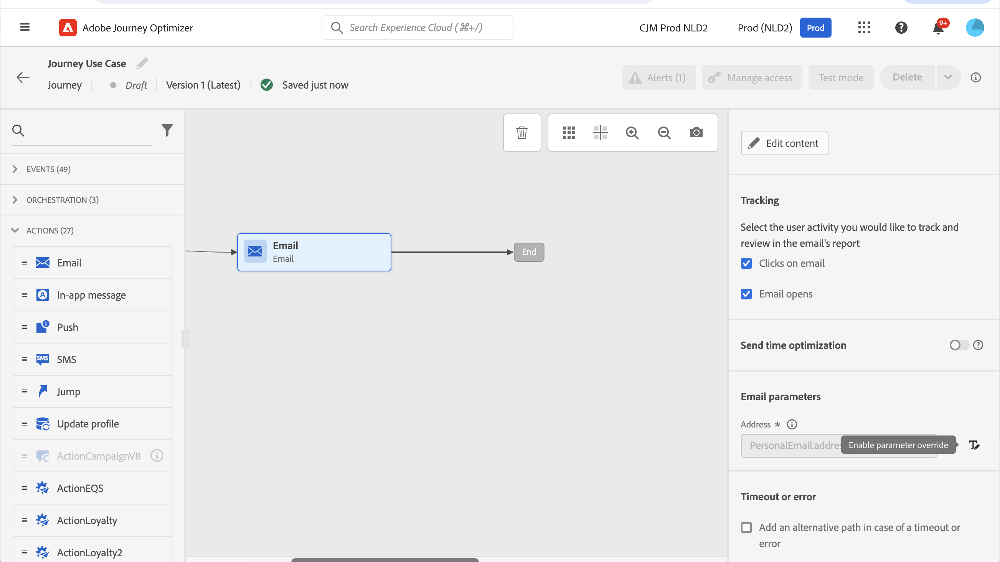

# Een bericht verzenden naar de abonnees van een lijst {#send-a-message-to-the-subscribers-of-a-list}

Het doel van dit gebruiksgeval is een reis tot stand te brengen om een bericht naar de abonnees van een lijst te verzenden.

In dit voorbeeld wordt de veldgroep **[!UICONTROL Consent and Preference Details]** van [!DNL Adobe Experience Platform] gebruikt. Kies **[!UICONTROL Data Management]** in het menu **[!UICONTROL Schemas]** om deze veldgroep te zoeken. Typ op het tabblad **[!UICONTROL Field groups]** de naam van de veldgroep in het zoekveld.


Om deze reis te vormen, volg deze stappen:

1. Maak een reis die begint met een **[!UICONTROL Read]** -activiteit. Leer meer in [&#x200B; creeer uw eerste reis &#x200B;](journey-gs.md).
1. Voeg een **[!UICONTROL Email]** actieactiviteit aan de reis toe. Leer hoe te [&#x200B; met kanaalacties &#x200B;](journeys-message.md) werken.
1. Vervang in de sectie **[!UICONTROL Email parameters]** van de **[!UICONTROL Email]** activity-instellingen het standaard-e-mailadres ( `PersonalEmail.adress` ) door het e-mailadres van de abonnees van de lijst:

   1. Klik op het pictogram **[!UICONTROL Enable parameter override]** rechts van het veld **[!UICONTROL Address]** en klik vervolgens op het pictogram **[!UICONTROL Edit]** .

      

   1. Voer in de expressieeditor de expressie in om de e-mailadressen van de abonnees op te halen. [Meer informatie](expression/expressionadvanced.md).

      In dit voorbeeld wordt een expressie getoond die verwijzingen naar kaartvelden bevat:

      ```json
      #{ExperiencePlatform.Subscriptions.profile.consents.marketing.email.subscriptions.entry('daily-email').subscribers.firstEntryKey()}
      ```

      In dit voorbeeld worden de volgende functies gebruikt:

      | Functie | Beschrijving | Voorbeeld |
      | --- | --- | --- |
      | `entry` | Verwijst naar een structuurelement volgens de geselecteerde naamruimte | Een specifieke abonnementenlijst bekijken |
      | `firstEntryKey` | Hiermee wordt de eerste entry-sleutel van een kaart opgehaald | Het eerste e-mailadres van abonnees ophalen |

      In dit voorbeeld heeft de abonnementenlijst de naam `daily-email` . E-mailadressen worden gedefinieerd als sleutels in de `subscribers` -kaart, die is gekoppeld aan de abonnementenlijstkaart.

      Lees meer over [&#x200B; verwijzingen naar gebieden &#x200B;](expression/field-references.md) in uitdrukkingen.

      

   1. Klik in het dialoogvenster **[!UICONTROL Add an expression]** op **[!UICONTROL Ok]** .

>[!CAUTION]
>
>Overschrijven van e-mailadressen mag alleen worden gebruikt voor specifieke gebruiksgevallen. Meestal hoeft u het e-mailadres niet te wijzigen, omdat de waarde die wordt gedefinieerd als het primaire adres in de **[!UICONTROL Execution fields]** het adres is dat moet worden gebruikt. [Meer informatie](../configuration/primary-email-addresses.md)
