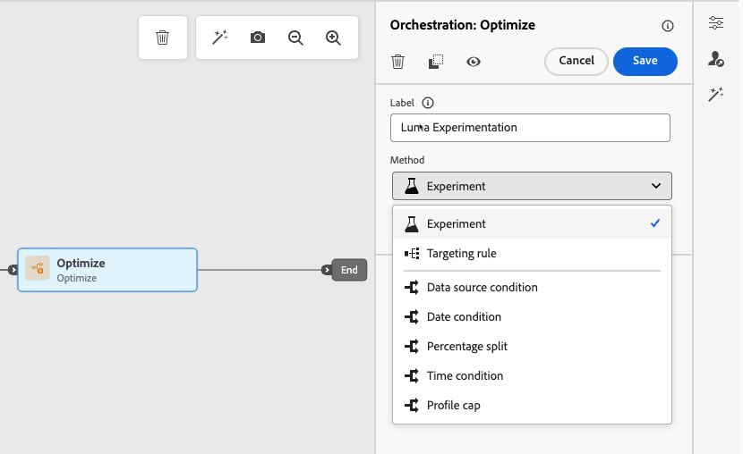

# Actie optimaliseren {#journey-path-optimization}

>[!CONTEXTUALHELP]
>id="ajo_journey_optimize"
>title="Actie optimaliseren"
>abstract="**optimaliseer** activiteit laat u bepalen hoe de individuen door uw reis door veelvoudige wegen te creëren die op specifieke criteria, met inbegrip van het experimenteren, richten, en specifieke voorwaarden worden gebaseerd."

>[!AVAILABILITY]
>
>Deze mogelijkheid is beschikbaar in Beperkte Beschikbaarheid. Neem contact op met uw Adobe-vertegenwoordiger voor toegang.

**optimaliseer** activiteit laat u bepalen hoe de individuen door uw reis door veelvoudige **wegen** te creëren die op specifieke criteria, met inbegrip van het experimenteren, het richten, en specifieke voorwaarden - het verzekeren van maximumbetrokkenheid en succes door hoogst aangepaste en efficiënte reizen te creëren.

A **wegweg** kan uit om het even welk volgend bestaan:

* rangschikking van communicatie;
* tijd tussen de twee;
* aantal mededelingen;
* of een combinatie van deze drie variabelen.

Bijvoorbeeld, kon één weg één e-mail bevatten, een andere twee SMS berichten bevatten, en een derde kon een e-mail bevatten, a [ wacht ](wait-activity.md) knoop van twee uren, en dan een bericht van SMS.

<!--With this feature, [!DNL Journey Optimizer] empowers you with the tools to deliver personalized and optimized paths to your audience, ensuring maximum engagement and success to create highly customized and effective journeys.-->

Door **optimaliseer** activiteit u kunt:

* Voer [ wegexperimenten ](#experimentation) in werking
* Hefboomwerking [ richtend ](#targeting) regels in elke wegweg
* Pas [ voorwaarden ](#conditions) op uw wegen toe

Zodra de reis levend is, worden profielen beoordeeld aan de hand van de vastgestelde criteria en op basis van passende criteria, worden zij de aangewezen weg van de reis afgelegd.

## Gebruik experimenteren {#experimentation}

Met behulp van experimenten kunt u verschillende paden testen op basis van een willekeurige splitsing om te bepalen wat het beste werkt op basis van vooraf gedefinieerde succeswaarden.

Volg de onderstaande stappen om experimenten op een reis in te stellen.

Stel dat u drie paden wilt vergelijken:

* één pad met één e-mail;
* een tweede pad met een wachtknooppunt van twee dagen en een e-mail;
* een derde pad met een e-mail en vervolgens een SMS-bericht.

1. Zet de **[!UICONTROL Optimize]** -activiteit neer in het canvas van de reis.

1. Voeg een optioneel label toe om de activiteit in de logboeken van de rapportage- en testmodus te identificeren.

1. Selecteer **[!UICONTROL Experiment]** in de vervolgkeuzelijst **[!UICONTROL Method]** .

   {width=85%}

1. Klik op **[!UICONTROL Experiment settings]**.

1. Ontwerp en configureer uw experiment naar wens. [ leer hoe ](../content-management/content-experiment.md)

   <!--
    {width=85%}
    Replace with appropriate screenshot
    The experiment applies to all the activities in the journey.TBC
   -->

Zodra de reis levend is, worden de gebruikers willekeurig toegewezen om verschillende wegen te gaan. [!DNL Journey Optimizer] houdt bij welk pad meer aankopen aanstuurt en biedt activeerbare inzichten.

<!--Follow the success of your journey with the [Experimentation journey report](../reports/campaign-global-report-cja-experimentation.md). Is there a report specific to experimentation in journey?-->

### Kwesties gebruiken met Experimentatie {#uc-experiment}

In de volgende voorbeelden ziet u hoe u de **[!UICONTROL Optimize]** -activiteit met de **[!UICONTROL Experiment]** -methode gebruikt om te bepalen welk pad het beste werkt.

**de doeltreffendheid van het Kanaal**

Test of het verzenden van het eerste bericht via e-mail versus SMS tot hogere omzettingen leidt.

* Gebruik de conversiesnelheid als de optimalisatiemethode (bijvoorbeeld: aankopen, aanmelden).

**frequentie van het Bericht**

Voer een experiment uit om te controleren of het verzenden van één e-mail versus drie e-mails over een week meer aankopen oplevert.

* Gebruik aankopen of het afmeldingspercentage als optimalisatiemetrisch.

**wacht tijd tussen mededelingen**

Vergelijk een wachttijd van 24 uur in vergelijking met een wachttijd van 72 uur vóór een follow-up om te bepalen welke timing de betrokkenheid maximaliseert.

* Gebruik het klikdoorslag tarief of de opbrengst als optimalisatiemetrisch.

## Hefboomdoel {#targeting}

Het richten staat u toe om specifieke regels of kwalificaties te bepalen die voor een klant moeten worden ontmoet om één van de reiswegen in te gaan, die op specifieke publiekssegmenten <!-- depending on profile attributes or contextual attributes--> wordt gebaseerd.

In tegenstelling tot experimenteren, een willekeurige toewijzing van een bepaald pad, is het kiezen voor een bepaald pad bepalend om ervoor te zorgen dat het juiste publiek of profiel het opgegeven pad ingaat.

Met betrekking tot doelgerichtheid kunnen specifieke regels worden vastgesteld op basis van:

* **de profielattributen van de Gebruiker** zoals plaats (b.v. geo-targeting), leeftijd of voorkeuren. Gebruikers in de VS zien bijvoorbeeld een &#39;Golden Gate&#39;-promotie, terwijl gebruikers in Frankrijk een &#39;Eiffeltoren&#39;-promotie zien.

* **Contextuele gegevens** zoals apparatentype (b.v. apparaat-richt), tijd van dag, of zittingsdetails. Desktopgebruikers ontvangen bijvoorbeeld inhoud die geoptimaliseerd is voor het bureaublad, terwijl mobiele gebruikers inhoud ontvangen die geoptimaliseerd is voor mobiele apparaten.

* **Soorten publiek** die kunnen worden gebruikt om profielen te omvatten of uit te sluiten die een bepaald publiekslidmaatschap hebben.

Volg de onderstaande stappen om doelgericht te kiezen op een reis.

1. Zet de **[!UICONTROL Optimize]** -activiteit neer in het canvas van de reis.

1. Voeg een optioneel label toe om de activiteit in de logboeken van de rapportage- en testmodus te identificeren.

1. Selecteer **[!UICONTROL Targeting]** in de vervolgkeuzelijst **[!UICONTROL Method]** .

   {width=85%}

1. Klik op **[!UICONTROL Create targeting rule]**.

1. Gebruik de regelbouwer om uw criteria te bepalen. Definieer bijvoorbeeld een regel voor inwoners van de VS, een regel voor inwoners van Frankrijk en een regel voor inwoners van India.

   

1. Selecteer **[!UICONTROL Enable fallback content]** naar wens. Met de inhoud voor alternatieven kan uw doelgroep een standaardinhoud ontvangen als er geen specifieke doelregels zijn. Als u deze optie niet selecteert, zal een publiek dat niet in aanmerking komt voor een hierboven gedefinieerde doelregel geen fallback-pad invoeren.

1. Sla de instellingen voor de doelregel op.

1. Plaats op de achtergrond de specifieke handelingen om elk pad aan te passen. U kunt bijvoorbeeld een specifieke e-mail maken voor inwoners van de VS, een andere e-mail voor inwoners van Frankrijk enzovoort.

   

1. Ontwerp aangewezen inhoud voor elke groep die door uw het richten regelmontages wordt bepaald. U kunt naadloos navigeren tussen de verschillende paden.

   

   In dit voorbeeld, ontwerp een specifieke weg voor inwoners van de V.S., een verschillende weg voor Franse ingezetenen en een andere weg voor inwoners van India.

Zodra de reis levend is, wordt de weg die voor elk segment wordt gespecificeerd verwerkt zodat de inwoners van de VS een specifieke weg ingaan, de inwoners van Frankrijk een verschillende weg ingaan, etc.

### Gebruik hoofdletters en kleine letters bij het richten {#uc-targeting}

In de volgende voorbeelden ziet u hoe u de **[!UICONTROL Optimize]** -activiteit met de **[!UICONTROL Targeting]** -methode kunt gebruiken om paden voor verschillende subdoelgroepen aan te passen.

**segment-specifieke kanalen**

Goudstatusloyaliteitsleden kunnen persoonlijke aanbiedingen via e-mail ontvangen, terwijl alle andere leden naar SMS-herinneringen worden gestuurd.

* Gebruik de omzet per profiel of conversiesnelheid als optimalisatiemetrisch.

**op gedrag-gebaseerd richten**

Klanten die een e-mail hebben geopend maar niet hebben geklikt, kunnen een pushmelding ontvangen, terwijl zij die helemaal niet hebben geopend een SMS-bericht ontvangen.

* Gebruik de klikthrough snelheid of stroomafwaartse omzettingen als optimalisatiemetrisch.

**de geschiedenis van de Aankoop richtend**

Klanten die onlangs een aankoop hebben gedaan, kunnen een kort pad naar &quot;Bedankt + Cross-sell&quot; volgen, terwijl klanten zonder aankoopgeschiedenis een langere reis naar de verpleegkunde beginnen.

* Gebruik de aankoopsnelheid of de betrokkenheidsgraad van de herhaalde aankoop als optimalisatiemetrisch.

## Een voorwaarde toevoegen {#conditions}

U kunt een voorwaarde toevoegen om te bepalen hoe de individuen door uw reis door het creëren van veelvoudige wegen die op specifieke criteria worden gebaseerd. U kunt ook een ander pad configureren voor het afhandelen van time-outs of fouten, zodat u over een naadloze ervaring beschikt.

Leer hoe te om een voorwaarde in [ te bepalen deze sectie ](conditions.md).

De volgende soorten voorwaarden zijn beschikbaar:

* [Source-voorwaarde voor gegevens](condition-activity.md#data_source_condition)
* [ voorwaarde van de Tijd ](condition-activity.md#time_condition)
* [ Splitsing van het Percentage ](condition-activity.md#percentage_split)
* [Datumvoorwaarde](condition-activity.md#date_condition)
* [Profiel uiteinde](condition-activity.md#profile_cap)
