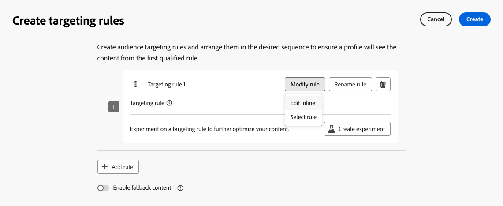
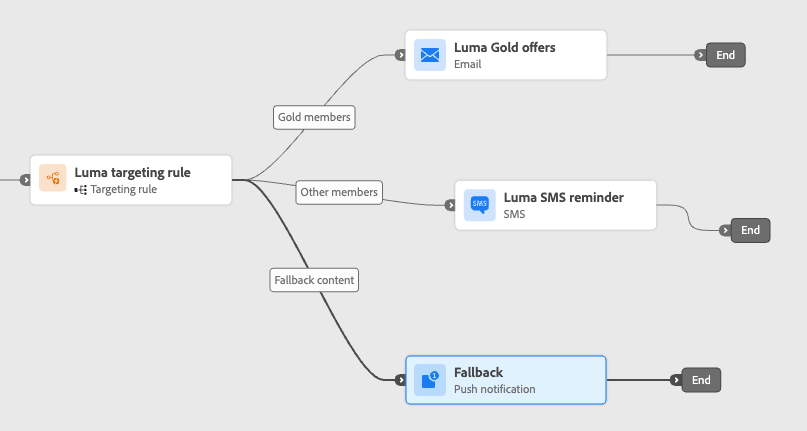
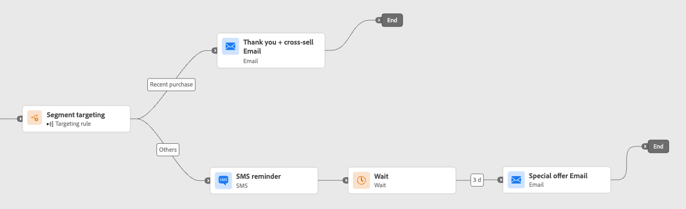

# Actie optimaliseren {#journey-path-optimization}

>[!CONTEXTUALHELP]
>id="ajo_journey_optimize"
>title="Actie optimaliseren"
>abstract="**optimaliseer** activiteit laat u bepalen hoe de individuen door uw reis door veelvoudige wegen te creëren die op specifieke criteria, met inbegrip van het experimenteren, richten, en specifieke voorwaarden worden gebaseerd."

>[!AVAILABILITY]
>
>Deze mogelijkheid is beschikbaar in Beperkte Beschikbaarheid. Neem contact op met uw Adobe-vertegenwoordiger voor toegang.

**optimaliseer** activiteit laat u bepalen hoe de individuen door uw reis door veelvoudige **wegen** te creëren die op specifieke criteria, met inbegrip van het experimenteren, het richten, en specifieke voorwaarden - het verzekeren van maximumbetrokkenheid en succes door hoogst aangepaste en efficiënte reizen te creëren.

Een reis **weg** kan uit om het even welke volgend bestaan: het rangschikken van mededelingen, tijd binnen tussen hen, aantal mededelingen, of om het even welke combinatie van deze drie variabelen.

Een pad kan bijvoorbeeld een e-mail bevatten, een ander pad kan twee SMS-berichten bevatten en een derde pad kan een e-mail bevatten, een Wachten-knooppunt van twee uur en vervolgens een SMS-bericht.

<!--With this feature, [!DNL Journey Optimizer] empowers you with the tools to deliver personalized and optimized paths to your audience, ensuring maximum engagement and success to create highly customized and effective journeys.-->

Door **optimaliseer** activiteit, kunt u de volgende acties op de resulterende wegen uitvoeren:

* Voer [&#x200B; wegexperimenten &#x200B;](#experimentation) in werking
* Hefboomwerking [&#x200B; richtend &#x200B;](#targeting) regels in elke wegweg
* Pas [&#x200B; voorwaarden &#x200B;](#conditions) op uw wegen toe

Zodra de reis levend is, worden profielen beoordeeld aan de hand van de vastgestelde criteria en op basis van passende criteria, worden zij de aangewezen weg van de reis afgelegd.

## Gebruik experimenteren {#experimentation}

>[!CONTEXTUALHELP]
>id="ajo_path_experiment_success_metric"
>title="Metrisch met succes"
>abstract="Succesvolle maatstaf wordt gebruikt om de best presterende behandeling in een experiment bij te houden en te evalueren."
>additional-url="https://experienceleague.adobe.com/en/docs/journey-optimizer/using/orchestrate-journeys/create-journey/success-metrics" text="Vorm en spoor uw reismetriek"

Met behulp van experimenten kunt u verschillende paden testen op basis van een willekeurige splitsing om te bepalen wat het beste werkt op basis van vooraf gedefinieerde succeswaarden.

Volg onderstaande stappen om padexperimenten in te stellen voor een rit.

Stel dat u drie paden wilt vergelijken:

* één pad met één e-mail;
* een tweede pad met een knooppunt **[!UICONTROL Wait]** van twee dagen en een e-mail;
* een derde pad met een e-mail en vervolgens een SMS-bericht.

1. Sleep vanuit de sectie **[!UICONTROL Orchestration]** de **[!UICONTROL Optimize]** -activiteit naar het canvas van de reis.

1. Voeg een optioneel label toe, dat nuttig kan zijn om de activiteit in rapporterings- en testmoduslogboeken te identificeren.

1. Selecteer **[!UICONTROL Experiment]** in de vervolgkeuzelijst **[!UICONTROL Method]** .

   {width=65%}

1. Klik op **[!UICONTROL Create experiment]**.

1. Selecteer de **[!UICONTROL Success metric]** die u voor het experiment wilt instellen. Leer meer op de beschikbare metriek en hoe te om de lijst in [&#x200B; te vormen deze sectie &#x200B;](success-metrics.md).

   {width=80%}

1. U kunt desgewenst een **[!UICONTROL Holdout]** -groep toevoegen aan uw levering. Deze groep zal geen weg van dit experiment ingaan.

   >[!NOTE]
   >
   >Als u de schakelbalk inschakelt, neemt 10% van de bevolking automatisch aan. U kunt dit percentage desgewenst aanpassen.

   <!--
    DOES THIS APPLY TO PATH EXPERIMENT?
    IMPORTANT: When a holdout group is used in an action for path experimentation, the holdout assignment only applies to that specific action. After the action is completed, profiles in the holdout group will continue down the journey path and can receive messages from other actions. Therefore, ensure that any subsequent messages do not rely on the receipt of a message by a profile that might be in a holdout group. If they do, you may need to remove the holdout assignment.-->

1. U kunt een exact percentage toewijzen aan elke **[!UICONTROL Treatment]** of gewoon de schakelbalk van **[!UICONTROL Distribute evenly]** inschakelen.

   {width=80%}

1. Klik op **[!UICONTROL Create]**.

1. Definieer de elementen die u wilt gebruiken voor elke vertakking die het resultaat is van het experiment, bijvoorbeeld:

   * De belemmering en laat vallen een [&#x200B; E-mail &#x200B;](../email/create-email.md) activiteit op de eerste tak (**Behandeling A**).

   * De belemmering en laat vallen a [&#x200B; wacht &#x200B;](wait-activity.md) activiteit van twee dagen op de eerste tak, die door een [&#x200B; wordt gevolgd e-mail &#x200B;](../email/create-email.md) activiteit (**Behandeling B**).

   * De belemmering en laat vallen een [&#x200B; E-mail &#x200B;](../email/create-email.md) activiteit op de derde tak, die door een [&#x200B; wordt gevolgd SMS &#x200B;](../sms/create-sms.md) activiteit (**Behandeling C**).

   {width=100%}

1. U kunt ook de **[!UICONTROL Add an alternative path in case of a timeout or an error]** gebruiken om een fallback-actie te definiëren. [Meer informatie](using-the-journey-designer.md#paths)

1. Selecteer een kanaalactie en gebruik de knop **[!UICONTROL Edit content]** om de ontwerpgereedschappen te openen.

   {width=70%}

1. Vanaf dat punt kunt u in het linkervenster navigeren tussen de verschillende inhoud voor elke actie in het experiment. Selecteer elke inhoud en ontwerp deze zo nodig.

   {width=100%}

1. [&#x200B; publiceer &#x200B;](publish-journey.md) uw reis.

Zodra de reis levend is, worden de gebruikers willekeurig toegewezen om verschillende wegen te gaan. [!DNL Journey Optimizer] houdt bij welk pad het beste presteert en biedt activeerbare inzichten.

Volg het succes van uw reis met het rapport van de Experiment van de Weg van de Reis. [Meer informatie](../reports/journey-global-report-cja-experimentation.md)

### Gebruiksscenario&#39;s bij experimenten {#uc-experiment}

In de volgende voorbeelden ziet u hoe u de **[!UICONTROL Optimize]** -activiteit met de **[!UICONTROL Experiment]** -methode gebruikt om te bepalen welk pad het beste werkt.

+++Kanaaleffectiviteit

Test of het verzenden van het eerste bericht via e-mail versus SMS tot hogere omzettingen leidt.

➡️ Gebruik de conversiesnelheid als de succesmaatstaf (bijvoorbeeld aankopen, aanmelden).

+++

+++Berichtfrequentie

Voer een experiment uit om te controleren of het verzenden van één e-mail versus drie e-mails over een week meer aankopen oplevert.

➡️ Gebruik aankopen of de afmeldingsfrequentie als de maatstaf voor succes.

+++

+++Wacht tijd tussen mededelingen

Vergelijk een wachttijd van 24 uur in vergelijking met een wachttijd van 72 uur vóór een follow-up om te bepalen welke timing de betrokkenheid maximaliseert.

➡️ Gebruik de doorklikfrequentie of de opbrengst als succesmetrisch.

+++

## Hefboomdoel {#targeting}

>[!CONTEXTUALHELP]
>id="ajo_path_targeting_fallback"
>title="Wat is een fallback-pad?"
>abstract="Met alternatieven voor paden kunnen gebruikers een ander pad invoeren als er geen specifieke doelregels zijn.   als u deze optie niet selecteert, zal om het even welk publiek dat niet voor een het richten regel kwalificeert niet de reserveweg ingaan en de reis weggaan."

Het richten van regels staat u toe om specifieke regels of kwalificaties te bepalen die voor een klant moeten worden ontmoet om één van de reiswegen in te gaan, die op specifieke publiekssegmenten <!-- depending on profile attributes or contextual attributes--> wordt gebaseerd.

In tegenstelling tot experimenteren, een willekeurige toewijzing van een bepaald pad, is het kiezen voor een bepaald pad bepalend om ervoor te zorgen dat het juiste publiek of profiel het opgegeven pad ingaat.

<!--With targeting, specific rules can be defined based on:

* **User profile attributes** such as location (eg. geo-targeting), age, or preferences. For example, users in the US receive a "Golden Gate" promotion, while users in France receive an "Eiffel Tower" promotion.

* **Contextual data** such as device type (eg. device-targeting), time of day, or session details. For example, desktop users receive desktop-optimized content, while mobile users receive mobile-optimized content.

* **Audiences** which can be used to include or exclude profiles that have a particular audience membership.-->

Volg de onderstaande stappen om doelgericht te kiezen op een reis.

1. Sleep vanuit de sectie **[!UICONTROL Orchestration]** de **[!UICONTROL Optimize]** -activiteit naar het canvas van de reis.

1. Voeg een optioneel label toe, dat nuttig kan zijn om de activiteit in rapporterings- en testmoduslogboeken te identificeren.

1. Selecteer **[!UICONTROL Targeting rule]** in de vervolgkeuzelijst **[!UICONTROL Method]** .

   {width=60%}

1. Klik op **[!UICONTROL Create targeting rule]**.

1. Klik op **[!UICONTROL Create rule]** > **[!UICONTROL Create new]** en gebruik de regelbouwer om uw criteria te definiëren.

   {width=100%}

   U kunt bijvoorbeeld een regel definiëren voor Gold-leden van het Loyalty-programma (`loyalty.status.equals("Gold", false)`) en een regel voor de andere leden (`loyalty.status.notEqualTo("Gold", false)`).

   

1. U kunt ook op **[!UICONTROL Create rule]** > **[!UICONTROL Select rule]** klikken om een bestaande doelregel te selecteren die in het menu **[!UICONTROL Rules]** is gemaakt. [Meer informatie](../experience-decisioning/rules.md)

   {width=70%}

   In dit geval wordt de formule die de regel vormt, gewoon gekopieerd naar de reisactiviteit. Eventuele volgende wijzigingen in die regel in het menu **[!UICONTROL Rules]** hebben geen invloed op de kopie van de rit.

   >[!AVAILABILITY]
   >
   >[&#x200B; Creërend het richten van regels &#x200B;](../experience-decisioning/rules.md#create) van het specifieke [!DNL Journey Optimizer] menu is momenteel beschikbaar aan organisaties die het Besluit toe:voegen-op aanbieden hebben gekocht, en zij zijn beschikbaar op bestelling voor de andere organisaties (Beperkte Beschikbaarheid).
   >
   >Deze capaciteit zal geleidelijk aan aan alle klanten worden uitgebreid. Neem in de tussentijd contact op met uw Adobe-vertegenwoordiger voor toegang.

1. Nadat u een regel hebt toegevoegd, kunt u deze nog steeds wijzigen. Kies **[!UICONTROL Edit inline]** om de regel onderweg bij te werken met de regelbuilder of **[!UICONTROL Select rule]** om een andere bestaande regel op te halen.

   {width=100%}

   >[!NOTE]
   >
   >Het inline bewerken van een regel heeft geen invloed op de bestaande regel waaruit de regel afkomstig is.

1. Selecteer de optie **[!UICONTROL Enable fallback path]** naar wens. Met deze actie maakt u een fallback-pad voor het publiek dat niet voldoet aan een van de hierboven gedefinieerde doelregels.

   >[!NOTE]
   >
   >Als u deze optie niet selecteert, komt een publiek dat niet in aanmerking komt voor een doelregel niet in het terugvalpad terecht en wordt de reis verlaten.

1. Klik op **[!UICONTROL Create]** om de instellingen voor de doelregel op te slaan.

1. Plaats op de achtergrond de specifieke handelingen om elk pad aan te passen. Maak bijvoorbeeld een e-mailbericht met persoonlijke aanbiedingen voor leden van Gold Loyalty en een SMS-herinnering voor alle andere leden.

   

1. Als u bij het definiëren van de regelinstellingen de optie **[!UICONTROL Enable fallback content]** hebt geselecteerd, definieert u een of meer handelingen voor het terugvalpad dat automatisch is toegevoegd.

   {width=70%}

1. U kunt desgewenst ook de **[!UICONTROL Add an alternative path in case of a timeout or an error]** gebruiken om een alternatieve actie te definiëren als er problemen optreden. [Meer informatie](using-the-journey-designer.md#paths)

1. Ontwerp aangewezen inhoud voor elke actie die aan elke groep beantwoordt die door uw het richten regelmontages wordt bepaald. U kunt naadloos navigeren tussen de verschillende inhoud voor elke actie.

   

   In dit voorbeeld ontwerpt u een e-mail met speciale aanbiedingen voor Gold-leden en een SMS-herinnering voor de andere leden.

1. [&#x200B; publiceer &#x200B;](publish-journey.md) uw reis.

Zodra de reis levend is, wordt de weg die voor elk segment wordt gespecificeerd verwerkt zodat de Gouden leden de weg met de e-mailaanbiedingen ingaan, terwijl de andere leden de weg met de herinnering van SMS ingaan.

Volg het succes van je reis met het Journey-rapport. [Meer informatie](../reports/journey-global-report-cja.md#targeting)

### Gebruiksgevallen voor regel instellen {#uc-targeting}

In de volgende voorbeelden ziet u hoe u de **[!UICONTROL Optimize]** -activiteit met de **[!UICONTROL Targeting rule]** -methode kunt gebruiken om paden voor verschillende subdoelgroepen aan te passen.

+++Segmentspecifieke kanalen

Goudstatusloyaliteitsleden kunnen persoonlijke aanbiedingen via e-mail ontvangen, terwijl alle andere leden naar SMS-herinneringen worden gestuurd.

<!--➡️ Use the revenue per profile or conversion rate as the optimization metric.-->

+++

+++Op gedrag gebaseerde doelframes

Klanten die een e-mail hebben geopend maar niet hebben geklikt, kunnen een pushmelding ontvangen, terwijl zij die helemaal niet hebben geopend een SMS-bericht ontvangen.

<!--➡️ Use the click-through rate or downstream conversions as the optimization metric.-->

+++

+++Aankoopgeschiedenis als doel

Klanten die onlangs een aankoop hebben gedaan, kunnen een kort pad naar &quot;Bedankt + Cross-sell&quot; volgen, terwijl klanten zonder aankoopgeschiedenis een langere reis naar de verpleegkunde beginnen.

<!--➡️ Use the repeat purchase rate or engagement rate as the optimization metric.-->

+++

### Een voorwaarde toevoegen {#conditions}

De voorwaarden zijn een type van [&#x200B; richtend &#x200B;](#targeting) regels die u toelaten om te bepalen hoe de individuen door uw reis door veelvoudige wegen te creëren die op specifieke criteria worden gebaseerd.

Leer hoe te om een voorwaarde in [&#x200B; te bepalen deze sectie &#x200B;](conditions.md).

De volgende soorten voorwaarden zijn beschikbaar:

* [Source-voorwaarde voor gegevens](condition-activity.md#data_source_condition)
* [&#x200B; voorwaarde van de Tijd &#x200B;](condition-activity.md#time_condition)
* [&#x200B; Splitsing van het Percentage &#x200B;](condition-activity.md#percentage_split)
* [Datumvoorwaarde](condition-activity.md#date_condition)
* [Profiel uiteinde](condition-activity.md#profile_cap)
