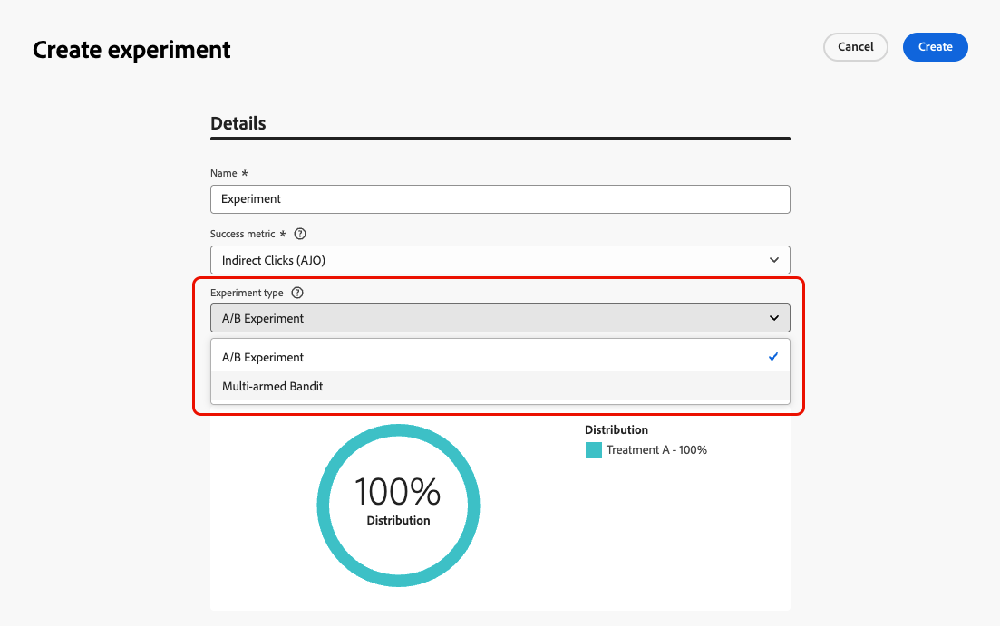
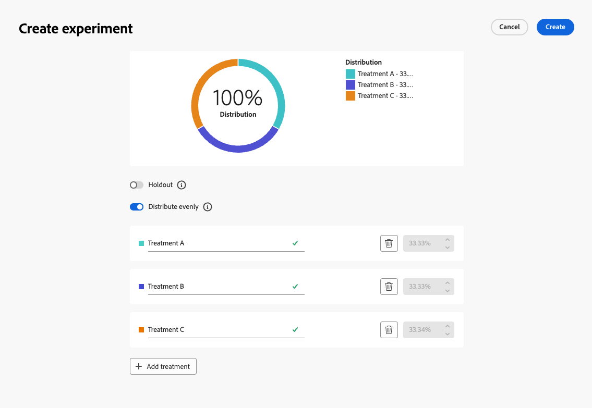
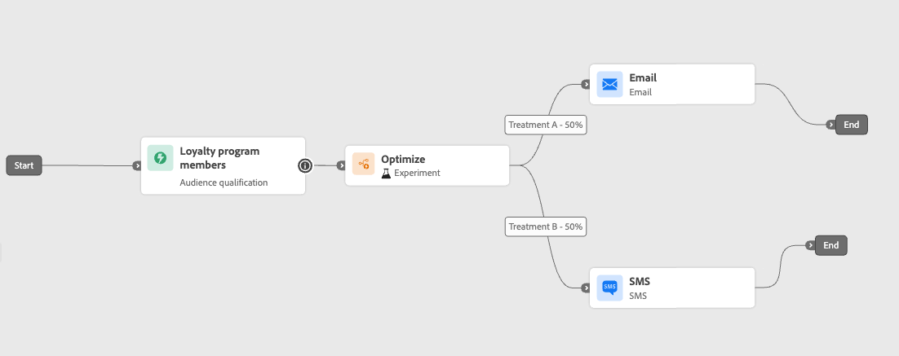

# Padexperimenten gebruiken {#experimentation}

>[!CONTEXTUALHELP]
>id="ajo_path_experiment_success_metric"
>title="Metrisch met succes"
>abstract="Succesvolle maatstaf wordt gebruikt om de best presterende behandeling in een experiment bij te houden en te evalueren."
>additional-url="https://experienceleague.adobe.com/en/docs/journey-optimizer/using/orchestrate-journeys/create-journey/success-metrics" text="Vorm en spoor uw reismetriek"

Met behulp van experimenten kunt u verschillende paden testen op basis van een willekeurige splitsing om te bepalen wat het beste werkt op basis van vooraf gedefinieerde succeswaarden.

Volg onderstaande stappen om padexperimenten in te stellen voor een rit.

Stel dat u drie paden wilt vergelijken:

* één pad met één e-mail;
* een tweede pad met een knooppunt **[!UICONTROL Wait]** van twee dagen en een e-mail;
* een derde pad met een e-mail en vervolgens een SMS-bericht.

1. Sleep vanuit de sectie **[!UICONTROL Orchestration]** de **[!UICONTROL Optimize]** -activiteit naar het canvas van de reis.

1. Voeg een optioneel label toe, dat nuttig kan zijn om de activiteit in rapporterings- en testmoduslogboeken te identificeren.

1. Selecteer **[!UICONTROL Experiment]** in de vervolgkeuzelijst **[!UICONTROL Method]** .

   {width=65%}

1. Klik op **[!UICONTROL Create experiment]**.

1. Selecteer de **[!UICONTROL Success metric]** die u voor het experiment wilt instellen. Leer meer op de beschikbare metriek en hoe te om de lijst in [&#x200B; te vormen deze sectie &#x200B;](success-metrics.md).

   {width=80%}

1. Selecteer de **[!UICONTROL Experiment type]** voor het padexperiment:

   * **[!UICONTROL A/B experiment]** — Definieer de verkeersverdeling tussen de behandelingen aan het begin van de test. De prestaties worden beoordeeld op basis van de gekozen primaire maatstaf. De rapportage toont de waargenomen lift tussen de behandelingen.

   * **[!UICONTROL Multi-armed bandit]** — Verkeer dat wordt opgesplitst tussen behandelingen wordt automatisch afgehandeld. Om de 7 dagen, worden de prestaties op primaire metrisch beoordeeld, en de gewichten worden dienovereenkomstig aangepast. Uit de rapportage blijkt nog steeds dat er lift is, zoals bij A/B-tests.

   {width=80%}

   ➡️ [&#x200B; Leer meer over het verschil tussen A/B en Multi-gewapende bandit experimenten &#x200B;](../content-management/mab-vs-ab.md)

1. U kunt desgewenst een **[!UICONTROL Holdout]** -groep toevoegen aan uw levering. Deze groep zal geen weg van dit experiment ingaan.

   >[!NOTE]
   >
   >Als u de schakelbalk inschakelt, neemt 10% van de bevolking automatisch aan. U kunt dit percentage desgewenst aanpassen.

   <!--
    DOES THIS APPLY TO PATH EXPERIMENT?
    IMPORTANT: When a holdout group is used in an action for path experimentation, the holdout assignment only applies to that specific action. After the action is completed, profiles in the holdout group will continue down the journey path and can receive messages from other actions. Therefore, ensure that any subsequent messages do not rely on the receipt of a message by a profile that might be in a holdout group. If they do, you may need to remove the holdout assignment.
-->

1. U kunt een exact percentage toewijzen aan elke **[!UICONTROL Treatment]** of gewoon de schakelbalk van **[!UICONTROL Distribute evenly]** inschakelen.

   {width=80%}

1. Laat het auto-schaalexperiment toe om de winnende variatie van uw experiment automatisch uit te rollen. [&#x200B; Leer meer op hoe te om winnaar te schrapen &#x200B;](#scale-winner)

1. Klik op **[!UICONTROL Create]**.

1. Definieer de elementen die u wilt gebruiken voor elke vertakking die het resultaat is van het experiment, bijvoorbeeld:

   * De belemmering en laat vallen een [&#x200B; E-mail &#x200B;](../email/create-email.md) activiteit op de eerste tak (**Behandeling A**).

   * De belemmering en laat vallen a [&#x200B; wacht &#x200B;](wait-activity.md) activiteit van twee dagen op de eerste tak, die door een [&#x200B; wordt gevolgd e-mail &#x200B;](../email/create-email.md) activiteit (**Behandeling B**).

   * De belemmering en laat vallen een [&#x200B; E-mail &#x200B;](../email/create-email.md) activiteit op de derde tak, die door een [&#x200B; wordt gevolgd SMS &#x200B;](../sms/create-sms.md) activiteit (**Behandeling C**).

   {width=100%}

1. U kunt ook de **[!UICONTROL Add an alternative path in case of a timeout or an error]** gebruiken om een fallback-actie te definiëren. [Meer informatie](using-the-journey-designer.md#paths)

1. [&#x200B; publiceer &#x200B;](publish-journey.md) uw reis.

<!--
    Select a channel action and use the **[!UICONTROL Edit content]** button to access the design tools.

    {width=70%}

    From there, using the left pane you can navigate between the different contents for each action in your experiment. Select each content and design it as needed.

    {width=100%}
-->

Zodra de reis levend is, worden de gebruikers willekeurig toegewezen om verschillende wegen te gaan. [!DNL Journey Optimizer] houdt bij welk pad het beste presteert en biedt activeerbare inzichten.

Volg het succes van uw reis met het rapport van de Experiment van de Weg van de Reis. [Meer informatie](../reports/journey-global-report-cja-experimentation.md)

<!--
REMOVED WITH GA

>[!CAUTION]
>
>Do not edit the metadata of a path experiment once it has been published. Editing the metadata will disrupt the calculation and reporting of experiment results.
-->

## Gebruiksscenario&#39;s bij experimenten {#uc-experiment}

In de volgende voorbeelden ziet u hoe u de **[!UICONTROL Optimize]** -activiteit met de **[!UICONTROL Experiment]** -methode gebruikt om te bepalen welk pad het beste werkt.

+++Kanaaleffectiviteit

Test of het verzenden van het eerste bericht via e-mail versus SMS tot hogere omzettingen leidt.

➡️ Gebruik de conversiesnelheid als de succesmaatstaf (bijvoorbeeld aankopen, aanmelden).

+++

+++Berichtfrequentie

Voer een experiment uit om te controleren of het verzenden van één e-mail versus drie e-mails over een week meer aankopen oplevert.

➡️ Gebruik aankopen of de afmeldingsfrequentie als de maatstaf voor succes.

+++

+++Wacht tijd tussen mededelingen

Vergelijk een wachttijd van 24 uur in vergelijking met een wachttijd van 72 uur vóór een follow-up om te bepalen welke timing de betrokkenheid maximaliseert.

➡️ Gebruik de doorklikfrequentie of de opbrengst als succesmetrisch.

+++

## De winnaar schalen {#scale-winner}

>[!AVAILABILITY]
>
>Voor padexperimenten is de functie Winner schalen alleen beschikbaar voor eenheidstrajecten (gebeurtenisgestuurde kwalificaties en kwalificaties van het publiek).
>
>Deze optie is niet beschikbaar voor ritten voor lezers.

Schaal de Winner laat u toe om de het winnen variatie van een experiment aan uw volledige publiek automatisch of manueel uit te rollen. Met deze functie kunt u het bereik en de doeltreffendheid van de functie vergroten wanneer een winnaar eenmaal is aangewezen, zonder dat u het experiment voortdurend hoeft te volgen.

U kunt kiezen uit twee modi:

* **auto-schrapen**: Vorm auto-schrapende montages wanneer het creëren van uw experiment door de timing en de voorwaarden voor het schrapen van de het winnen behandeling of een fallback optie te kiezen als geen winnaar verschijnt.

* **Handmatig Schalen**: Herzie manueel experimenteerresultaten en stel de terugwinning van de het winnen behandeling in werking, die volledige controle over timing en besluiten handhaaft.

### Automatisch schalen {#autoscaling}

Met Automatisch schalen kunt u vooraf gedefinieerde regels instellen voor het tijdstip waarop de winnende bewerking of een fallback moet worden uitgevoerd, op basis van de resultaten van het experiment.

Wanneer automatisch schalen is opgetreden, is handmatig schalen niet meer beschikbaar.

Automatisch schalen inschakelen voor experimenten:

1. Stel uw reis in en configureer uw experiment naar wens. [Meer informatie](#experimentation)

1. Schakel de optie voor automatisch schalen in wanneer u het experiment instelt.

   

1. Selecteer wanneer de winnaar moet worden geschaald:

   * Zodra de winnaar is gevonden.
   * Na het experiment wordt live gedurende de geselecteerde tijd uitgevoerd.

   De automatisch schaalbare tijd moet voor de einddatum van het experiment zijn gepland. Als deze voor een tijd na de einddatum wordt ingesteld, verschijnt er een validatiewaarschuwing en wordt de reis niet gepubliceerd.

   

1. Kies het terugvalgedrag als er geen winnaar is gevonden op schaaltijd:

   * Ga door met experimenteren tot de geplande einddatum.
   * Schaal de alternatieve behandeling na een bepaalde tijd.

Wanneer aan alle parameters is voldaan, wordt de winnende of alternatieve behandeling naar uw publiek verzonden.

### Handmatige schaling {#manual-scaling}

Met handmatig schalen kunt u de resultaten van het experiment bekijken en bepalen wanneer u de winnende behandeling volgens uw eigen schema wilt uitvoeren.

Als u de winnaar handmatig schaalt vóór de geplande tijd voor automatisch schalen, wordt de automatische schaling geannuleerd.

De winnaar van uw experimenten handmatig schalen:

1. Stel uw reis in en configureer uw experiment naar wens. [Meer informatie](#experimentation)

1. Laat het experiment lopen totdat een winnaar is geïdentificeerd of statistische significantie is bereikt.

1. Open uw reis en selecteer de **[!UICONTROL Optimize]** activiteit die het wegexperiment bevat.

   Bekijk de resultaten in de **[!UICONTROL Path experiment]** -weergave om de best presterende behandeling te identificeren.

   

1. Klik op **[!UICONTROL Scale treatment]** om de winnende bewerking door te voeren naar de rest van uw publiek.

   <!---->

1. Selecteer in de keuzelijst de behandeling die u wilt schalen en klik op **[!UICONTROL Scale]** .

   {width=80%}

Let erop dat het schalen van de behandeling maximaal één uur kan duren. U ontvangt een melding als het handmatig schalen is voltooid.
