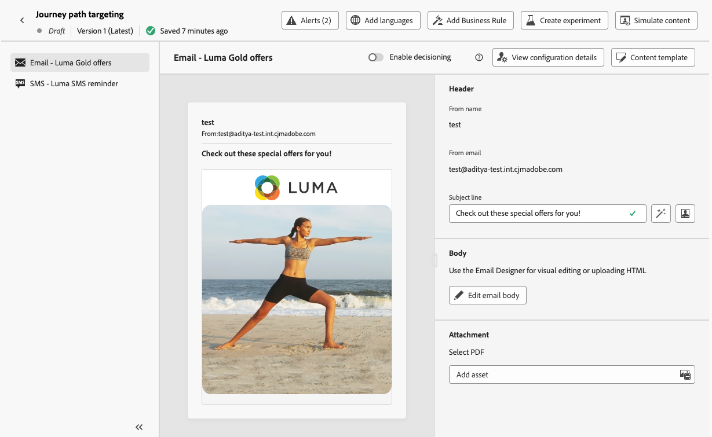

# Benadering van gebruikspad {#targeting}

>[!CONTEXTUALHELP]
>id="ajo_path_targeting_fallback"
>title="Wat is een fallback-pad?"
>abstract="Met alternatieven voor paden kunnen gebruikers een ander pad invoeren als er geen specifieke doelregels zijn.   als u deze optie niet selecteert, zal om het even welk publiek dat niet voor een het richten regel kwalificeert niet de reserveweg ingaan en de reis weggaan."

>[!AVAILABILITY]
>
>Deze mogelijkheid is momenteel beschikbaar met beperkte beschikbaarheid. Neem contact op met uw Adobe-vertegenwoordiger om toegang aan te vragen.

Het richten van regels staat u toe om specifieke regels of kwalificaties te bepalen die voor een klant moeten worden ontmoet om één van de reiswegen in te gaan, die op specifieke publiekssegmenten <!-- depending on profile attributes or contextual attributes--> wordt gebaseerd.

In tegenstelling tot experimenteren, een willekeurige toewijzing van een bepaald pad, is het kiezen voor een bepaald pad bepalend om ervoor te zorgen dat het juiste publiek of profiel het opgegeven pad ingaat.

<!--With targeting, specific rules can be defined based on:

* **User profile attributes** such as location (eg. geo-targeting), age, or preferences. For example, users in the US receive a "Golden Gate" promotion, while users in France receive an "Eiffel Tower" promotion.

* **Contextual data** such as device type (eg. device-targeting), time of day, or session details. For example, desktop users receive desktop-optimized content, while mobile users receive mobile-optimized content.

* **Audiences** which can be used to include or exclude profiles that have a particular audience membership.-->

Volg de onderstaande stappen om doelgericht te kiezen op een reis.

1. Sleep vanuit de sectie **[!UICONTROL Orchestration]** de **[!UICONTROL Optimize]** -activiteit naar het canvas van de reis.

1. Voeg een optioneel label toe, dat nuttig kan zijn om de activiteit in rapporterings- en testmoduslogboeken te identificeren.

1. Selecteer **[!UICONTROL Targeting rule]** in de vervolgkeuzelijst **[!UICONTROL Method]** .

   {width=60%}

1. Klik op **[!UICONTROL Create targeting rule]**.

1. Klik op **[!UICONTROL Create rule]** > **[!UICONTROL Create new]** en gebruik de regelbouwer om uw criteria te definiëren.

   {width=100%}

   U kunt bijvoorbeeld een regel definiëren voor Gold-leden van het Loyalty-programma (`loyalty.status.equals("Gold", false)`) en een regel voor de andere leden (`loyalty.status.notEqualTo("Gold", false)`).

   

1. U kunt ook op **[!UICONTROL Create rule]** > **[!UICONTROL Select rule]** klikken om een bestaande doelregel te selecteren die in het menu **[!UICONTROL Rules]** is gemaakt. [Meer informatie](../experience-decisioning/rules.md)

   {width=70%}

   In dit geval wordt de formule die de regel vormt, gewoon gekopieerd naar de reisactiviteit. Eventuele volgende wijzigingen in die regel in het menu **[!UICONTROL Rules]** hebben geen invloed op de kopie van de rit.

   >[!AVAILABILITY]
   >
   >[ Creërend het richten van regels ](../experience-decisioning/rules.md#create) van het specifieke [!DNL Journey Optimizer] menu is momenteel beschikbaar aan organisaties die het Besluit toe:voegen-op aanbieden hebben gekocht, en zij zijn beschikbaar op bestelling voor de andere organisaties (Beperkte Beschikbaarheid).
   >
   >Deze capaciteit zal geleidelijk aan aan alle klanten worden uitgebreid. Neem in de tussentijd contact op met uw Adobe-vertegenwoordiger voor toegang.

1. Nadat u een regel hebt toegevoegd, kunt u deze nog steeds wijzigen. Kies **[!UICONTROL Edit inline]** om de regel onderweg bij te werken met de regelbuilder of **[!UICONTROL Select rule]** om een andere bestaande regel op te halen.

   {width=100%}

   >[!NOTE]
   >
   >Het inline bewerken van een regel heeft geen invloed op de bestaande regel waaruit de regel afkomstig is.

1. Selecteer de optie **[!UICONTROL Enable fallback path]** naar wens. Met deze actie maakt u een fallback-pad voor het publiek dat niet voldoet aan een van de hierboven gedefinieerde doelregels.

   >[!NOTE]
   >
   >Als u deze optie niet selecteert, komt een publiek dat niet in aanmerking komt voor een doelregel niet in het terugvalpad terecht en wordt de reis verlaten.

1. Klik op **[!UICONTROL Create]** om de instellingen voor de doelregel op te slaan.

1. Plaats op de achtergrond de specifieke handelingen om elk pad aan te passen. Maak bijvoorbeeld een e-mailbericht met persoonlijke aanbiedingen voor leden van Gold Loyalty en een SMS-herinnering voor alle andere leden.

   

1. Als u bij het definiëren van de regelinstellingen de optie **[!UICONTROL Enable fallback content]** hebt geselecteerd, definieert u een of meer handelingen voor het terugvalpad dat automatisch is toegevoegd.

   {width=70%}

1. U kunt ook de **[!UICONTROL Add an alternative path in case of a timeout or an error]** gebruiken om een alternatieve actie te definiëren als er problemen optreden. [Meer informatie](using-the-journey-designer.md#paths)

1. Ontwerp aangewezen inhoud voor elke actie die aan elke groep beantwoordt die door uw het richten regelmontages wordt bepaald.

   In dit voorbeeld, ontwerp een e-mail met speciale aanbiedingen voor Gouden leden, en een herinnering van SMS voor de andere leden.<!--You can seamlessly navigate between the different contents for each action. -->

1. [ publiceer ](publish-journey.md) uw reis.

Zodra de reis levend is, wordt de weg die voor elk segment wordt gespecificeerd verwerkt zodat de Gouden leden de weg met de e-mailaanbiedingen ingaan, terwijl de andere leden de weg met de herinnering van SMS ingaan.

Volg het succes van je reis met het Journey-rapport. [Meer informatie](../reports/journey-global-report-cja.md#targeting)

## Gebruiksgevallen voor regel instellen {#uc-targeting}

In de volgende voorbeelden ziet u hoe u de **[!UICONTROL Optimize]** -activiteit met de **[!UICONTROL Targeting rule]** -methode kunt gebruiken om paden voor verschillende subdoelgroepen aan te passen.

+++Segmentspecifieke kanalen

Goudstatusloyaliteitsleden kunnen persoonlijke aanbiedingen via e-mail ontvangen, terwijl alle andere leden naar SMS-herinneringen worden gestuurd.

<!--➡️ Use the revenue per profile or conversion rate as the optimization metric.-->

+++

+++Op gedrag gebaseerde doelframes

Klanten die een e-mail hebben geopend maar niet hebben geklikt, kunnen een pushmelding ontvangen, terwijl zij die helemaal niet hebben geopend een SMS-bericht ontvangen.

<!--➡️ Use the click-through rate or downstream conversions as the optimization metric.-->

+++

+++Aankoopgeschiedenis als doel

Klanten die onlangs een aankoop hebben gedaan, kunnen een kort pad naar &quot;Bedankt + Cross-sell&quot; volgen, terwijl klanten zonder aankoopgeschiedenis een langere reis naar de verpleegkunde beginnen.

<!--➡️ Use the repeat purchase rate or engagement rate as the optimization metric.-->

+++
