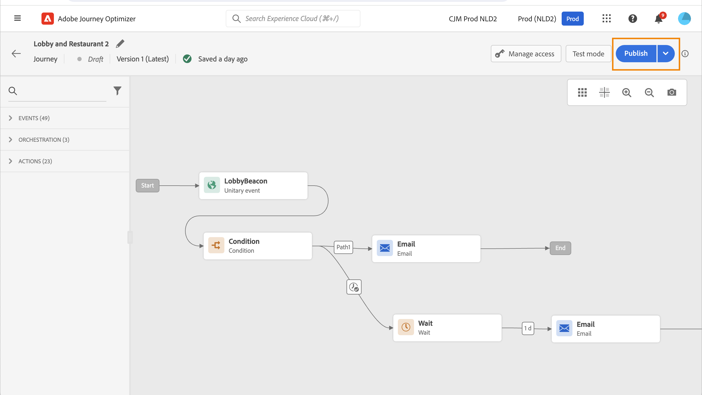

# Uw reis publiceren {#publishing-the-journey}

U moet een reis publiceren om het te activeren en het ter beschikking te stellen voor nieuwe profielen om de reis binnen te gaan. Voordat u uw reis publiceert, controleert u of deze geldig is en of er geen fouten zijn. U kunt geen reis met fouten publiceren.

>[!NOTE]
>
>Wanneer u een reis bewaart of publiceert, valideert Journey Optimizer de totale grootte van de reislading en kan publicatie waarschuwen of blokkeren als u de grens nadert of overschrijdt. Leer meer in [ bevestiging van de de ladingsgrootte van de Reis ](../start/guardrails.md#journey-payload-size).

➡️ [Ontdek deze functie in video](#video)

## Publicatieproces {#journey-publication}

De stappen om een reis te publiceren zijn hieronder gedetailleerd:

1. Voordat u uw reis publiceert, controleert u of deze geldig is en of er geen fouten zijn. U kunt geen reis met fouten publiceren.

   * Leer hoe te om uw reis op [ deze pagina ](testing-the-journey.md) te testen.
   * Leer hoe te om uw reisfouten in [ problemen op te lossen deze sectie ](../building-journeys/troubleshooting.md#activity-errors).

1. Als u de rit wilt publiceren, klikt u op de optie **[!UICONTROL Publish]** in het keuzemenu rechtsboven.

   >[!NOTE]
   >
   > Als uw reis aan een goedkeuringsbeleid onderworpen is, moet u om goedkeuring verzoeken om uw reis te publiceren. [Meer informatie](../test-approve/gs-approval.md)

    te activeren

Wanneer de reis wordt gepubliceerd, is het op **read-only** wijze. In de modus Alleen-lezen kunt u alleen de activiteitslabels en -beschrijvingen, de naam van de reis en de beschrijving van de reis wijzigen. Als u extra aanpassingen aan een gepubliceerde reis moet maken, creeer [ een nieuwe versie ](journey-ui.md#journey-filter) van uw reis.

Als je een reis stopt, wordt deze permanent gestopt. Alle personen die door de reis lopen, worden permanent tegengehouden en de reis maakt geen nieuwe inzendingen meer mogelijk. Als u de reis opnieuw moet leiden, dupliceer het en publiceer de nieuwe reis.

>[!IMPORTANT]
>
>* Als er wijzigingen worden aangebracht in een biedbesluit dat wordt gebruikt in een reisbericht, moet u de reis ongedaan maken en opnieuw publiceren. Dit zorgt ervoor dat de veranderingen in het bericht van de reis worden opgenomen en dat het bericht met de recentste updates verenigbaar is.
>
>* Assets/Images zijn maximaal 2 jaar (730 dagen) sinds de eerste publicatie ervan in een fragment/inline-bericht toegankelijk in de geleverde inhoud. Na deze vervaldatum (op een willekeurig tijdstip na 730 dagen) moet de publicatie opnieuw worden gepubliceerd om deze twee jaar toegankelijk te houden. Bij elke herpublicatie die binnen 730 dagen na de eerste publicatie wordt uitgevoerd, wordt het vervallen van de middelen/afbeeldingen niet tot de volgende 730 dagen verlengd.

## Journeyversies {#journey-versions}

In de reislijst, worden alle reisversies getoond met het versieaantal. Wanneer u een reis zoekt, verschijnen de nieuwste versies bij de eerste keer dat de toepassing wordt geopend boven aan de lijst. Vervolgens kunt u de gewenste sortering definiëren en wordt deze door de toepassing als gebruikervoorkeur behouden. De versie van de reis wordt ook weergegeven boven aan de interface van de reiseditie, boven het canvas.

>[!NOTE]
>
>Doorgaans kan een profiel niet meerdere keren op dezelfde reis tegelijk aanwezig zijn voor alle actieve versies van de reis. Als de terugkeer wordt toegelaten, kan een profiel een reis opnieuw ingaan, maar kan het niet doen tot zij dat vorige geval van de reis volledig verlaten. [Meer informatie](entry-management.md).

### Een nieuwe versie van een reis maken {#journey-create-new-version}

Als u zich aan een levende reis moet aanpassen, creeer een nieuwe versie van uw reis. Volg onderstaande stappen om een nieuwe versie van een bestaande reis te maken:

1. Open de meest recente versie van uw livereis, klik op **[!UICONTROL Create a new version]** en bevestig deze.

   

   >[!NOTE]
   >
   >U kunt alleen een nieuwe versie maken van de meest recente versie van een reis.

1. Breng uw wijzigingen aan, klik op **[!UICONTROL Publish]** en bevestig de selectie.

Vanaf het moment dat de reis wordt gepubliceerd, zullen individuen naar de recentste versie van de reis gaan. Mensen die al een vorige versie hebben ingevoerd, blijven er totdat ze klaar zijn met de reis. Als ze later weer dezelfde reis maken, gaan ze naar de meest recente versie.

Reisversies kunnen afzonderlijk worden gestopt. Alle versies van reizen hebben dezelfde naam.

Wanneer u een nieuwe versie van een reis publiceert, beëindigt de vorige versie automatisch en schakelt aan de **Gesloten** status. Er kan geen toegang tot de reis plaatsvinden. Zelfs als u de laatste versie stopt, blijft de vorige versie gesloten.

>[!NOTE]
>
>Specifieke garanties en beperkingen zijn van toepassing op de versiering van de reizen. Leer meer op [ deze pagina ](../start/guardrails.md#journey-versions-g).

## Hoe kan ik-video {#video}

Leer hoe u een reis publiceert in deze video:

>[!VIDEO](https://video.tv.adobe.com/v/3424998?quality=12)