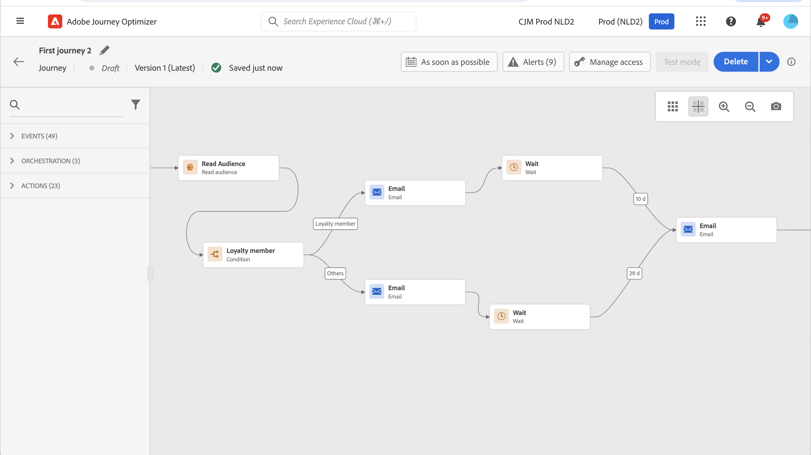

# Een publiek gebruiken voor een reis {#segment-trigger-activity}

## Informatie over de activiteit van het leespubliek {#about-segment-trigger-actvitiy}

>[!CONTEXTUALHELP]
>id="ajo_journey_read_segment"
>title="Activiteit publiek lezen"
>abstract="Met de activiteit &#39;Lezen publiek&#39; kunt u alle personen die tot een Adobe Experience Platform-publiek behoren een reis laten maken. Het betreden van een reis kan één keer of op regelmatige basis plaatsvinden."

Gebruik de **Gelezen activiteit van het Publiek** om alle individuen van een publiek te maken de reis ingaan. Het betreden van een reis kan één keer of op regelmatige basis plaatsvinden.

Neem als voorbeeld het &quot;toepassings het openen en controle van de Luma&quot;publiek dat in [ wordt gecreeerd bouwt publiek ](../audience/about-audiences.md) gebruiksgeval. Met de activiteit van het Leespubliek, kunt u alle individuen die tot dit publiek behoren tot een reis maken en hen tot geïndividualiseerde reizen maken die alle reisfunctionaliteit, voorwaarden, timers, gebeurtenissen, acties zullen hefboomwerking.

➡️ [Ontdek deze functie in video](#video)

>[!NOTE]
>
>Wanneer een activiteit van het publiek lezen uitvoert, produceert het systeem interne gebeurtenissen (genoemd `segmentExportJob` gebeurtenissen) om de levenscyclus van de publieksuitvoer verrichting te volgen. Deze gebeurtenissen worden geregistreerd op het activiteitsniveau, niet per individueel profiel, en kunnen voor controle en het oplossen van problemendoeleinden worden gevraagd. Leer meer over [ het vragen Gelezen gebeurtenissen van het Publiek ](../reports/query-examples.md#read-segment-queries).

>[!CAUTION]
>
>* Alvorens te beginnen gebruikend de Gelezen publieksactiviteit, [ lees uit de Grafieken en Beperkingen ](#must-read).

## De activiteit configureren {#configuring-segment-trigger-activity}

De stappen om de Gelezen activiteit van het Publiek te vormen zijn als volgt.

### Voeg een Lees publieksactiviteit toe en selecteer het publiek

1. Ontgrendel de categorie **[!UICONTROL Orchestration]** en zet een **[!UICONTROL Read Audience]** -activiteit neer op uw canvas.

   De activiteit moet als eerste stap van een reis worden geplaatst.

1. Voeg een **[!UICONTROL Label]** toe aan de activiteit (optioneel).

1. Kies in het veld **[!UICONTROL Audience]** de Adobe Experience Platform-doelgroep die de rit zal betreden en klik op **[!UICONTROL Save]** . U kunt om het even welk Adobe Experience Platform publiek selecteren dat gebruikend [ segmentdefinities ](../audience/creating-a-segment-definition.md) wordt geproduceerd.

   >[!NOTE]
   >
   >Bovendien kunt u het publiek van Adobe Experience Platform ook richten dat gebruikend [ wordt gecreeerd publiekssamenstellingen ](../audience/get-started-audience-orchestration.md) of [ van een Csv- dossier ](https://experienceleague.adobe.com/docs/experience-platform/segmentation/ui/overview.html#import-audience){target="_blank"} wordt geupload.

   U kunt de kolommen in de lijst aanpassen en sorteren.

   

   Nadat het publiek is toegevoegd, kunt u met de knop **[!UICONTROL Copy]** de naam en de id van het publiek kopiëren:

   `{"name":"Luma app opening and checkout","id":"8597c5dc-70e3-4b05-8fb9-7e938f5c07a3"}`

   

   >[!NOTE]
   >
   >Slechts zullen de individuen met de **Realized** status van de publieksparticipatie de reis ingaan. Voor meer op hoe te om een publiek te evalueren, verwijs naar de [ documentatie van de Dienst van de Segmentatie ](https://experienceleague.adobe.com/docs/experience-platform/segmentation/tutorials/evaluate-a-segment.html#interpret-segment-results){target="_blank"}.

1. Kies in het veld **[!UICONTROL Namespace]** de naamruimte die u wilt gebruiken om de personen te identificeren. Het veld wordt standaard voorgevuld met de laatst gebruikte naamruimte. [ Leer meer over namespaces ](../event/about-creating.md#select-the-namespace).

   >[!NOTE]
   >
   >Personen die tot een publiek behoren dat niet de geselecteerde identiteit (naamruimte) onder hun verschillende identiteiten heeft, kunnen de reis niet betreden. U kunt alleen een naamruimte selecteren die is gebaseerd op personen. Als u een namespace voor een raadplegingslijst (bijvoorbeeld: ProductID namespace voor een raadpleging van het Product) hebt bepaald, zal het niet in **Namespace** dropdown lijst beschikbaar zijn.

### Guardrails en aanbevelingen {#must-read}

* Er kan slechts één **[!UICONTROL Read Audience]** -activiteit worden gebruikt tijdens een rit en dit moet de eerste activiteit op het canvas zijn.

* De **[!UICONTROL Read audience]** -activiteit kan zich richten op slechts één publiek. Als er meerdere soorten publiek nodig zijn, kunt u die soorten publiek vóór gebruik samenvoegen tot één publiek. [ leer hoe te om publiek te combineren gebruikend samenstellingswerkschema&#39;s ](../audience/get-started-audience-orchestration.md)

* Voor reizen die a **gebruiken Gelezen de activiteit van het publiek**, is er een maximumaantal reizen dat precies tezelfdertijd kan beginnen. De pogingen zullen door het systeem worden uitgevoerd maar vermijden hebbend meer dan vijf reizen (met **Gelezen Publiek**, gepland of die &quot;zo spoedig mogelijk&quot;beginnen) tezelfdertijd. De beste manier is om ze over een tijdsverloop te verspreiden, bijvoorbeeld 5 tot 10 minuten na elkaar.

* De groepen van het de gebeurtenisgebied van de ervaring kunnen niet in reizen worden gebruikt die met a **beginnen gelezen publiek** activiteit, een **[kwalificatie van het Publiek](audience-qualification-events.md)** activiteit, of een bedrijfsgebeurtenisactiviteit.

* Als beste praktijken, adviseren wij u slechts partijpubliek in a **Gelezen publiek** activiteit. Dit zal een betrouwbare en consistente telling van de tijdens de reis gebruikte doelgroepen opleveren. Lees het publiek wordt ontworpen voor partijgebruik gevallen. Als uw gebruiksgeval gegevens in real time gelieve vereist te gebruiken {de kwalificatieactiviteit van 0} Audience **[.](audience-qualification-events.md)**

* Het publiek [ werd ingevoerd uit een Csv- dossier ](https://experienceleague.adobe.com/docs/experience-platform/segmentation/ui/overview.html#import-audience) of resulterend uit [ samenstellingswerkschema&#39;s ](../audience/get-started-audience-orchestration.md) kan in de **Gelezen activiteit van het Publiek** worden geselecteerd. Deze doelgroepen zijn niet beschikbaar in de **activiteit van de Kwalificatie van het publiek 0}.**

* Gelijktijdige leeslimiet per organisatie: elke organisatie kan maximaal vijf instanties van het type Audience lezen tegelijk uitvoeren. Dit omvat zowel geplande als door bedrijfsgebeurtenissen teweeggebrachte looppas, over alle zandbakken en reizen. Deze limiet wordt gehandhaafd om te zorgen voor een eerlijke en evenwichtige toewijzing van middelen in alle organisaties.

* Doorvoerbeheer voor sandbox: het systeem beheert dynamisch de verwerkingsdoorvoer per sandbox met een maximale limiet van 20.000 profielen per seconde die worden gedeeld door alle activiteiten van het leespubliek. De individuele Gelezen activiteiten van het Publiek kunnen met een minimumtarief van 500 profielen per seconde worden gevormd. Taken kunnen in de wachtrij worden geplaatst als de productielimieten op sandboxniveau worden bereikt om een eerlijke toewijzing van bronnen te garanderen.

* Tijdslimiet voor taakverwerking: taken van het type Audience lezen die niet binnen 12 uur kunnen worden verwerkt vanwege de limiet van de guardrail, worden automatisch opgeschoond en nooit uitgevoerd. Dit voorkomt het opbouwen van arbeidsplaatsen en zorgt voor stabiliteit van het systeem.

* Wanneer het gebruiken van partijsegmenten, verzeker uw opname en dagelijkse momentopname werkt ruim vóór de reis begint. Overweeg een extra wachttijdperiode als de segmenten op gegevens moeten wijzen die de zelfde dag worden opgenomen. Als onmiddellijke profielversheid kritiek is, denk na gebruikend een gebeurtenis-gebaseerd of het stromen gebruikscase in plaats van een dagelijkse partijbenadering, of neem een extra wachtend mechanisme op om bijgewerkte gegevens toe te staan om vóór de reisevaluatie te verspreiden.

De begeleiding met betrekking tot **Gelezen de activiteit van het publiek** wordt vermeld in [ deze pagina ](../start/guardrails.md#read-segment-g).

>[!CAUTION]
>
>[ Grafieken voor gegevens en segmentatie van het Profiel van de Klant in real time ](https://experienceleague.adobe.com/docs/experience-platform/profile/guardrails.html){target="_blank"} zijn ook op Adobe Journey Optimizer van toepassing.

### Profielinvoer op reis beheren

Stel de **[!UICONTROL Reading rate]** in. Dit is het maximumaantal profielen dat de reis per seconde kan ingaan. Dit tarief geldt alleen voor deze activiteit en niet voor andere activiteiten op de reis. Als u bijvoorbeeld een vertragingsfactor voor aangepaste handelingen wilt definiëren, moet u de vertragings-API gebruiken. Verwijs naar deze [ pagina ](../configuration/throttling.md).

Deze waarde wordt opgeslagen in de lading van de reisversie. De standaardwaarde is 5.000 profielen per seconde. U kunt deze waarde wijzigen van 500 tot 20.000 profielen per seconde.

>[!NOTE]
>
>De algemene leessnelheid per sandbox is ingesteld op 20.000 profielen per seconde. De leessnelheid van alle leessoorten die tegelijkertijd in dezelfde sandbox worden uitgevoerd, kan daarom maximaal 20.000 profielen per seconde bedragen. U kunt dit uiteinde niet wijzigen. Leer meer over de tarieven van de reisverwerking en productie in [ deze sectie ](entry-management.md#journey-processing-rate).

### Reizen plannen {#schedule}

>[!CONTEXTUALHELP]
>id="ajo_journey_read_segment_scheduler_start_date"
>title="Begindatum/-tijd"
>abstract="Bepaal de datum en de tijd u deze reis wilt teweegbrengen."

>[!CONTEXTUALHELP]
>id="ajo_journey_read_segment_scheduler_repeat_until"
>title="Herhalen tot"
>abstract="Geef de einddatum van de herhaling op."

>[!CONTEXTUALHELP]
>id="ajo_journey_read_segment_scheduler_repeat_every"
>title="Elke herhaling"
>abstract="Bepaal een frequentie van terugkomende planner."

>[!CONTEXTUALHELP]
>id="ajo_journey_read_segment_scheduler_incremental_read"
>title="Incrementeel lezen"
>abstract="Alleen nieuwe profielen die sinds de laatste lezing zijn gelezen, mogen de reis betreden."

>[!CONTEXTUALHELP]
>id="ajo_journey_read_segment_scheduler_force_reentrance"
>title="Ingang forceren"
>abstract="Zet alle deelnemers voor de reis neer voordat elk publiek leest."

>[!CONTEXTUALHELP]
>id="ajo_journey_read_segment_scheduler_synchronize_audience"
>title="Trigger na batchpublieksevaluatie"
>abstract="Schakel deze optie in om de uitvoering van de reis te starten na een nieuwe evaluatie van het batchpubliek."

>[!CONTEXTUALHELP]
>id="ajo_journey_read_segment_scheduler_synchronize_audience_wait_time"
>title="Wacht op tijd voor nieuwe publieksevaluatie"
>abstract="Geef de tijdsduur op gedurende welke de rit moet wachten tot het batchpubliek opnieuw wordt geëvalueerd. De wachttijd is beperkt tot gehele getallen, kan in minuten of uren worden opgegeven en moet tussen 1 en 6 uur liggen."

Door gebrek, wordt de reis gevormd om eens te lopen. Om een specifieke datum/tijd en frequentie te bepalen waarop de reis zou moeten lopen, volg de hieronder stappen.

>[!NOTE]
>
>Één-schot Gelezen publiekstrajecten bewegen zich aan de **Voltooide** status 91 dagen ([ reis globale onderbreking ](journey-properties.md#global_timeout)) na de reisuitvoering. Voor een gepland publiek van Lees, is het 91 dagen na de uitvoering van het laatste voorkomen.

1. Selecteer in de eigenschappen van de **[!UICONTROL Read audience]** -activiteit de optie pa,e **[!UICONTROL Edit journey schedule]** .

   

1. De eigendommen van de reis worden weergegeven. Selecteer in de vervolgkeuzelijst **[!UICONTROL Scheduler type]** de frequentie waarmee u de reis wilt uitvoeren.

   

Voor terugkerende reizen zijn specifieke opties beschikbaar om u te helpen de toegang van profielen tot de reis beheren. Vouw de onderstaande secties uit voor meer informatie over elke optie.

+++**[!UICONTROL Incremental read]**

Wanneer een reis met een terugkomende **gelezen publiek** voor het eerst uitvoert, gaan alle profielen in het publiek de reis in.

Met deze optie kunt u zich na de eerste keer richten op alleen de personen die het publiek zijn binnengekomen sinds de laatste uitvoering van de reis.

Als u a [ douane richt uploadt publiek ](../audience/about-audiences.md#about-segments) in uw reis, worden de profielen slechts teruggewonnen op de eerste herhaling als deze optie in een terugkomende reis wordt toegelaten, aangezien deze doelgroepen vast zijn.

>[!CAUTION]
>
>Incrementeel lezen is afhankelijk van momentopnamen in het dagelijkse profiel die zijn gemaakt door het segmentatieproces van de Adobe Experience Platform-batch. Als de geplande uitvoering van de reis plaatsvindt:
>
>* **alvorens een nieuwe momentopname wordt gecreeerd**: Profielen die voor het publiek na de laatste momentopname maar vóór de reis kwalificeerden zullen niet in die uitvoering inbegrepen zijn
>* **meer dan 24 uren na de laatste uitvoering** (zonder de &quot;Trekker na de optie van de partijpublieksevaluatie&quot;te gebruiken): Slechts worden de profielen van de meest recente momentopname binnen het terugblik-achtervenster van 24 uur inbegrepen. Profielen die tussen de laatste uitvoering en 24 uur vóór de huidige uitvoering zijn gekwalificeerd, worden uitgesloten
>
>U minimaliseert het risico van ontbrekende profielen door:
>* Schakel de optie **[!UICONTROL Trigger after batch audience evaluation]** in om de terugkijkperiode uit te breiden naar het tijdstip van de laatste geslaagde uitvoering van de reis, ongeacht hoelang deze zich heeft voorgedaan
>* Reizen plannen die lang moeten duren nadat de dagelijkse batchsegmentatietaken zijn voltooid (doorgaans 2-3 uur buffer)
>* Voor tijd-kritieke gebruiksgevallen die directe profielopname vereisen, denk na gebruikend [ activiteiten van de Kwalificatie van het publiek 0} {met het stromen publiek in plaats daarvan](audience-qualification-events.md)

+++

+++**[!UICONTROL Force reentrance on recurrence]**

Met deze optie kunt u alle profielen die nog aanwezig zijn op de reis automatisch laten afsluiten bij de volgende uitvoering.

Als u bijvoorbeeld een wachttijd van twee dagen hebt op een dagelijkse terugkerende reis door deze optie in te schakelen, worden profielen altijd verplaatst bij de volgende uitvoering van de reis (dus de dag erna), ongeacht of ze zich in het volgende publiek bevinden of niet.

Als de levensduur van uw profielen tijdens deze reis langer kan zijn dan de herhalingsfrequentie, activeer deze optie niet om ervoor te zorgen dat profielen hun reis kunnen voltooien.

+++

+++**[!UICONTROL Trigger after batch audience evaluation]**

Voor ritten die dagelijks worden gepland en die op partijpubliek gericht zijn, kunt u een tijdvenster van tot 6 uren voor de reis bepalen om op nieuwe publieksgegevens van batch segmentatietaken te wachten. Als de segmentatietaak binnen het tijdvenster wordt voltooid, wordt de rit geactiveerd. Anders slaat het de reis over tot de volgende keer. Met deze optie zorgt u ervoor dat reizen worden uitgevoerd met nauwkeurige en actuele publieksgegevens.

Als een reis bijvoorbeeld om 18.00 uur per dag gepland is, kunt u een aantal minuten of uren opgeven die moeten worden gewacht voordat de rit wordt uitgevoerd. Wanneer de reis om 18.00 uur wakker wordt, zoekt het naar een nieuw publiek, wat betekent dat een publiek nieuwer is dan het publiek dat in de vorige uitvoering van de reis werd gebruikt. Tijdens het gespecificeerde tijdvenster, zal de reis onmiddellijk na het ontdekken van het nieuwe publiek uitvoeren. Als er echter geen nieuw publiek wordt gedetecteerd, wordt de uitvoering van de reis die dag overgeslagen.

**bekijk-achterperiode voor stijgende gelezen reizen**

Wanneer **[!UICONTROL Trigger after batch audience evaluation]** is geselecteerd, zoekt [!DNL Journey Optimizer] naar een nieuwe publieksevaluatie. Voor het beginpunt van de terugkijkperiode, gebruikt het systeem de tijd van de laatste succesvolle reisuitvoering, zelfs als het meer dan 24 uur geleden voorkwam. Dit is van belang voor incrementele leestrachten die doorgaans een terugkijkperiode van 24 uur hebben.

Voorbeelden van dagelijkse incrementele leesreizen:

* Met &quot;Trigger na de evaluatie van het batchpubliek&quot; actief: als er drie dagen zijn verstreken sinds incrementele profielen de reis hebben betreden, duurt de terugkijkperiode drie dagen terug wanneer u naar incrementele profielen zoekt.
* Met &quot;Trigger na de evaluatie van het batchpubliek&quot; niet actief: als er drie dagen zijn verstreken sinds incrementele profielen de reis hebben betreden, zou de terugkijkperiode slechts 24 uur teruggaan wanneer u naar incrementele profielen zoekt.

+++

<!--

### Segment filters {#segment-filters}

[!CONTEXTUALHELP]
>id="jo_segment_filters"
>title="About segment filters"
>abstract="You can choose to target only the individuals who entered or exited a specific segment during a specific time window. For example, you can decide to only retrieve all the customers who entered the VIP segment since last week."

You can choose to target only the individuals who entered or exited a specific segment during a specific time window. For example, you can decide to only retrieve all the customers who entered the VIP segment since last week. Only the new VIP customers will be targeted. All the customers who were already part of the VIP segment before will be excluded.

To activate this mode, click the **Segment Filters** toggle. Two fields are displayed:

**Segment membership**: choose whether you want to listen to segment entrances or exits. 

**Lookback window**: define when you want to start to listen to entrances or exits. This lookback window is expressed in hours, starting from the moment the journey is triggered.  If you set this duration to 0, the journey will target all members of the segment. For recurring journeys, it will take into account all entrances/exits since the last time the journey was triggered.

-->

## De reis testen en publiceren {#testing-publishing}

Met de **[!UICONTROL Read Audience]** -activiteit kunt u de rit testen op een uniform profiel.

Activeer de testmodus om dit te doen.

Vorm en stel de testwijze in werking zoals gebruikelijk. [ leer hoe te om een reis ](testing-the-journey.md) te testen.

Wanneer de test is uitgevoerd, kunt u de testresultaten zien met de knop **[!UICONTROL Show logs]** . Voor meer op dit, verwijs naar [ deze sectie ](testing-the-journey.md#viewing_logs)

Zodra de tests succesvol zijn, kunt u uw reis publiceren (zie [ het Publiceren van de reis ](publish-journey.md)). Personen die tot het publiek behoren, nemen de reis op de datum/tijd in die is opgegeven in de sectie Eigenschappen van de reis **[!UICONTROL Scheduler]** .

>[!NOTE]
>
>Voor terugkerende, op het publiek gebaseerde reizen zal de reis automatisch sluiten zodra zijn laatste voorkomen wordt uitgevoerd. Als er geen einddatum/tijd is opgegeven, moet u de reis naar nieuwe ingangen handmatig sluiten om deze te beëindigen.

## Doelgerichtheid van het publiek bij reizen op basis van het publiek

De op publiek-gebaseerde reizen beginnen altijd met a **Gelezen activiteit van het Publiek** om individuen terug te winnen die tot een publiek van Adobe Experience Platform behoren.

Het publiek dat bij het publiek hoort, wordt één keer of op regelmatige basis opgehaald.

Na het betreden van de reis, kunt u publiek tot stand brengen orkestgebruik gevallen, die individuen van het aanvankelijke publiek in verschillende takken van de reis leiden.

**Segmentatie**

U kunt voorwaarden gebruiken om segmentatie uit te voeren gebruikend de **Condition** activiteit. U kunt bijvoorbeeld VIP-personen een bepaald pad laten volgen en niet-VIP-stromen in een ander pad.

De segmentatie kan worden gebaseerd op:

* gegevensbrongegevens
* de context van de gebeurtenissen maakt deel uit van de reisgegevens , bijvoorbeeld : heeft iemand op het bericht geklikt dat een uur geleden werd ontvangen ?
* een datum, bijvoorbeeld: zijn we in juni wanneer iemand de reis doorloopt?
* een tijd , bijvoorbeeld : is het &#39; s morgens in de tijdzone van de betrokkene ?
* een algoritme waarin het publiek dat de reis volgt wordt gesplitst op basis van een percentage , bijvoorbeeld : 90 % - 10 % om een controlegroep uit te sluiten

>[!NOTE]
>
>Wanneer u het plannertype ‘Dagelijks’ gebruikt met een **[!UICONTROL Read Audience]** -activiteit, kunt u een tijdvenster voor de reis definiëren om te wachten op nieuwe publieksgegevens. Dit zorgt ervoor dat u zich nauwkeurig kunt richten en voorkomt problemen die worden veroorzaakt door vertragingen in batchsegmentatietaken. [ leer hoe te om een reis ](#schedule) te plannen
>
>De optie **[!UICONTROL Trigger after batch audience evaluation]** is alleen beschikbaar voor een set organisaties (Beperkte beschikbaarheid). Neem contact op met uw Adobe-vertegenwoordiger voor toegang.

**Uitsluiting**

De zelfde **activiteit van de Voorwaarde 0} {die voor segmentatie (zie hierboven) wordt gebruikt staat u ook toe om een deel van de bevolking uit te sluiten.** U kunt bijvoorbeeld VIP-personen uitsluiten door deze naar een vertakking te laten gaan met een eindstap direct erna.

Deze uitsluiting kan direct na het opvragen van het publiek gebeuren, voor het tellen van de bevolking of langs een reis in meerdere stappen.

**Samenvoeging**

Met ritten kunt u N-vertakkingen maken en deze na een segmentatie samenvoegen. Hierdoor kunt u twee soorten publiek terugbrengen naar een algemene ervaring.

Zo kunnen VIP- en niet-VIP-klanten na een andere ervaring gedurende tien dagen op reis terugkeren naar hetzelfde pad. Na een vereniging, kunt u het publiek opnieuw verdelen door een segmentatie of een uitsluiting uit te voeren.

## Problemen met het aantal deelnemers oplossen {#audience-count-mismatch}

Houd rekening met het volgende als u discrepanties opmerkt tussen het geschatte aantal gebruikers, de gekwalificeerde profielen en de werkelijke profielen die uw reis betreden:

### Tijdstip en gegevensdoorgave

* **de baanvoltooiing van de segmentatie van de partij**: Voor partijpubliek, zorg ervoor dat de dagelijkse baan van de partijsegmentatie heeft voltooid en de momentopnamen worden bijgewerkt alvorens de reis loopt. Het publiek van de partij wordt klaar voor gebruik ongeveer **2 uren** na de voltooiing van de segmentatietaak. Leer meer over [ methodes van de publieksevaluatie ](https://experienceleague.adobe.com/docs/experience-platform/segmentation/home.html#evaluate-segments){target="_blank"}.

* **de ingangstijdstip van Gegevens**: Verifieer dat de opname van profielgegevens volledig vóór de reisuitvoering heeft voltooid. Als profielen kort voor het begin van de rit werden opgenomen, worden ze mogelijk nog niet in het publiek weergegeven. Leer meer over [ gegevensopname in Adobe Experience Platform ](https://experienceleague.adobe.com/docs/experience-platform/ingestion/home.html){target="_blank"}.

* **Gebruik &quot;Trekker na de optie van de partijpublieksevaluatie&quot;**: Voor dagelijkse geplande reizen die partijpubliek gebruiken, denk na toelatend de **[!UICONTROL Trigger after batch audience evaluation]** optie. Dit zorgt ervoor dat de reis op nieuwe publieksgegevens (tot 6 uur) alvorens uit te voeren wacht. [ Leer meer over het plannen ](#schedule)

* **voeg een Wacht activiteit** toe: Voor het stromen publiek met onlangs opgenomen gegevens, denk na toevoegend a **wacht** activiteit aan het begin van de reis om tijd voor gegevenspropagatie en profielkwalificatie toe te staan. [ Leer meer over de Wacht activiteit ](wait-activity.md)

### Validatie en bewaking van gegevens

* **de status van de segmentatietaak van de Controle**: De tijden van de taakvoltooiing van de batch van de batch in Adobe Experience Platform [ controledashboard ](https://experienceleague.adobe.com/docs/experience-platform/dataflows/ui/monitor-segments.html){target="_blank"} om te verifiëren wanneer de publieksgegevens klaar zijn.

* **verifieer samenvoegbeleid**: Zorg ervoor dat het fusiebeleid voor uw publiek wordt gevormd het verwachte gedrag aanpast om profielgegevens van verschillende bronnen te combineren. Leer meer over [ samenvoegbeleid in Adobe Experience Platform ](https://experienceleague.adobe.com/docs/experience-platform/profile/merge-policies/overview.html){target="_blank"}.

* **de segmentdefinities van het Overzicht**: Bevestig dat de segmentdefinities correct worden gevormd en alle verwachte kwalificatiecriteria omvatten. Leer meer over [ bouwend publiek ](../audience/creating-a-segment-definition.md). Let vooral op:
   * Op tijd gebaseerde voorwaarden die profielen op tijdstempels van gebeurtenissen kunnen uitsluiten
   * Kenmerkkwalificaties die afhankelijk zijn van recent bijgewerkte gegevens
   * Streaming versus batchevaluatiemethoden

* **bevestigt namespace configuratie**: Verzeker namespace die in **wordt geselecteerd gelezen de activiteit van het publiek** past de primaire identiteit aan die door profielen in uw publiek wordt gebruikt. Profielen zonder de geselecteerde naamruimte worden niet meegenomen. Leer meer over [ identiteitsnaamruimten ](../event/about-creating.md#select-the-namespace).

### Aanbevolen procedures om problemen te voorkomen

* **ritten van het Programma na segmentatie**: Voor partijpubliek, de uitvoering van de planningsreis minstens 2-3 uur na de typische tijd van de baanvoltooiing van de partijsegmentatie. [ leer meer over reis het plannen ](#schedule)

* **het stromen publiek van het Gebruik voor gebruiksgevallen in real time**: Als u directe profielkwalificatie en reisingang nodig hebt, gebruik [ de activiteiten van de Kwalificatie van het Publiek ](audience-qualification-events.md) met het stromen publiek in plaats van **Gelezen Publiek** met partijpubliek.

* **Test met kleiner publiek eerst**: Alvorens grote reizen te lanceren, test met een kleinere ondergroep om te bevestigen dat de tellingen gelijke verwachtingen aanpassen. [ leer hoe te om een reis ](testing-the-journey.md) te testen

* **Monitor regelmatig**: Opstelling regelmatig toezicht op publieksgrootte en de metriek van de reisingang om discrepanties vroeg te ontdekken. Leer meer over [ tarieven van de reisverwerking en ingangsbeheer ](entry-management.md).

Als het aantal wanverhoudingen na het volgen van deze stappen aanhoudt, contacteer de steun van Adobe met details over uw publiek, reisconfiguratie, en waargenomen discrepanties.

## Opnieuw {#read-audience-retry}

De pogingen worden toegepast door gebrek op publiek-getriggerde reizen (die met a **Gelezen Publiek** of a **BedrijfsGebeurtenis** beginnen) terwijl het terugwinnen van de uitvoerbaan. Als er een fout optreedt tijdens het maken van de exporttaak, worden de pogingen om de 10mn opnieuw uitgevoerd, tot maximaal 1 uur. Daarna zullen we het als een mislukking beschouwen. Deze soorten reizen kunnen daarom tot 1 uur na de geplande tijd worden uitgevoerd.

De onsuccesvolle **Gelezen trekkers van het publiek** worden gevangen en getoond in **Alarm**. Het **Gelezen alarm van het Publiek** waarschuwt u als de a **gelezen activiteit van het Publiek** geen profiel 10 min na geplande tijd van uitvoering heeft verwerkt. Deze fout kan worden veroorzaakt door technische problemen, of omdat het publiek leeg is. Als deze fout door technische problemen wordt veroorzaakt, moet u er rekening mee houden dat er nog steeds pogingen kunnen worden gedaan, afhankelijk van het type probleem (bijvoorbeeld: als het aanmaken van exportarbeidsplaatsen is mislukt, proberen we elke 10 miljoen opnieuw gedurende maximaal 1 uur). [Meer informatie](../reports/alerts.md#alert-read-audiences)

## Hoe kan ik-video {#video}

Begrijp de toepasselijke gebruiksgevallen voor een reis die door de gelezen publieksactiviteit wordt teweeggebracht. Leer hoe u op batches gebaseerde journeys kunt bouwen en welke aanbevolen procedures u kunt toepassen.

>[!VIDEO](https://video.tv.adobe.com/v/3424997?quality=12)
