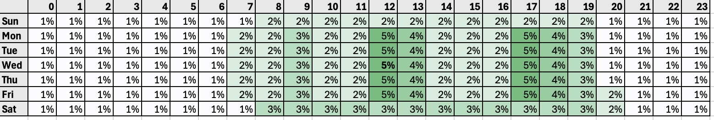
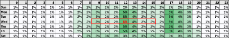

# Send-Time optimalisatie{#send-time-optimization}

>[!CONTEXTUALHELP]
>id="jo_bestsendtime_disabled"
>title="Optimalisatie van verzonden tijd"
>abstract="Met de functie Send-Time Optimization van [!DNL Adobe Journey Optimizer], aangedreven door Adobe AI-services, kunt u de beste tijd voorspellen om een e-mail- of pushbericht te verzenden om de betrokkenheid te maximaliseren op basis van een open historie en klikfrequentie."

>[!CONTEXTUALHELP]
>id="jo_bestsendtime_email"
>title="Send-Time optimaliseren activeren"
>abstract="Kies of u wilt optimaliseren bij het openen van e-mail of door op de e-mail te klikken. Selecteer hiervoor het juiste keuzerondje. U kunt er ook voor kiezen om de verzendtijden die door het systeem worden gebruikt te accentueren door een waarde voor Verzenden in te voeren binnen de volgende optie."

>[!CONTEXTUALHELP]
>id="jo_bestsendtime_push"
>title="Send-Time optimaliseren activeren"
>abstract="Pushberichten worden standaard ingesteld op de optie Openen, omdat klikken niet van toepassing zijn op pushberichten. U kunt er ook voor kiezen om de verzendtijden die door het systeem worden gebruikt te accentueren door een waarde voor Verzenden in te voeren binnen de volgende optie."

De functie Send-Time Optimization van [!DNL Adobe Journey Optimizer], aangedreven door Adobe Journey AI-services, kiest de optimale verzendtijd voor e-mail- en pushberichten om de betrokkenheid van klanten te maximaliseren op basis van de historische open en klikfunctionaliteit van uw klanten.

Send-Time optimalisatie is alleen beschikbaar voor ingebouwde e-mail- en push-actietypen van Journey Optimizer en is momenteel niet beschikbaar voor berichten die via aangepaste handelingen worden verzonden of voor andere actietypen. Send-Time optimalisatie is alleen beschikbaar voor acties via e-mail en push binnen reizen en is momenteel niet beschikbaar voor berichten die via campagnes worden verzonden.

>[!AVAILABILITY]
>
>* De functie Send-Time Optimization wordt op verzoek ingeschakeld voor [!DNL Adobe Journey Optimizer] -klanten. Neem contact op met de klantenservice van Adobe of uw Adobe-vertegenwoordiger om de functie voor uw organisatie te activeren.
>
>* De optimalisering van de Send-Time is slechts op **E-mail** en **Push- bericht** kanalen van toepassing.
>

## Optimalisatie voor verzenden gebruiken{#use-send-time-optimization}

Gebruik Send-Time Optimization op een e-mail of duw actie door de Send-Time Optimization schakelaar van de actieparameters aan te zetten.

De optimalisering van de Send-Time zou niet voor dringende, tijdgevoelige operationele berichten - bijvoorbeeld, een ordesbevestiging, een bericht van het wachtwoordterugstellen, of een bericht van de de gate verandering van de vlucht moeten worden gebruikt. De optimalisering van de Send-Time wordt het best gebruikt op minder-urgente marketing mededelingen - bijvoorbeeld, een wekelijkse advertentie, promotieinformatie over een nieuw product, of informatie over een maand-lange verkoop.

Kies bij e-mailberichten of u wilt optimaliseren bij het openen van een e-mail of door op het juiste keuzerondje te klikken. Pushberichten zijn altijd geoptimaliseerd voor openen.

>[!TIP]
>
>Voor de beste resultaten moeten de meeste e-mailberichten zijn geoptimaliseerd voor klikken. Kies deze optie voor Opens als uw e-mailbericht informatief van aard is en niet bedoeld is om een handeling rechtstreeks te sturen.

Kies voor zowel e-mail- als pushberichten het maximumaantal uren dat het systeem wacht voordat het bericht wordt verzonden door een waarde in te stellen voor de optie &quot;Verzenden binnen de volgende&quot;. U kunt een waarde kiezen tussen 1 en 168 uur.

>[!TIP]
>
>Voor de beste resultaten kiest u een maximale wachttijd tussen 6 en 24 uur. Als u een lagere waarde voor de maximale wachttijdtijd kiest, wordt het aantal beschikbare verzendtijden verminderd en kan de potentiële waarde van de optimalisatie voor de verzendtijd hierdoor afnemen. Als u een hogere waarde voor de maximale wachttijd kiest, kan een bericht verouderd of irrelevant zijn tegen de tijd dat het wordt verzonden.

Wanneer uw reis wordt geactiveerd en een klant de actie E-mail of Duw in de reis bereikt, zal de Optimalisering Send-Time kiezen de best voorspelde verzendtijd beschikbaar voor elke gebruiker binnen uw gespecificeerde grenzen.

## Hoe Send-Time Optimalisatie werkt {#how-send-time}

Het model van de Optimalisering van de Send-Time neemt de [!DNL Adobe Journey Optimizer] gegevens van het klantengedrag van uw organisatie op en kijkt open op gebruikersniveau en klikt gebeurtenissen om te bepalen wanneer uw klanten het meest waarschijnlijk met uw overseinen in dienst zullen nemen.

De optimalisering van de Send-Tijd maakt voorspellingen voor elk uur van de week, voor elke gebruiker, die op drie soorten gedragsgegevens wordt gebaseerd:

1. Het algemene gedrag van de gebruikers
1. Het gedrag van gebruikers in dezelfde tijdzone bekijken
1. Het gedrag van die individuele gebruiker

Deze voorspellingen worden gewogen en gecombineerd met behulp van een Bayesiaanse benadering, wat resulteert in een &quot;hittekaart&quot; voor elke metrische waarde (e-mail wordt geopend, e-mail klikt en push wordt geopend), die voor elke klant aangeeft hoeveel uren van de week contact met die gebruiker het meest en het minst waarschijnlijk zal leiden tot het gewenste betrokkenheidsresultaat (open/klik), zoals wordt geïllustreerd in het onderstaande voorbeeld van een verwarmingskaart:

 toont

Als een gebruiker met de bovengenoemde voorspelde waarschijnlijkheden voor een bericht bij 9 wordt gericht AM Woensdag met Send-Time die optimalisering wordt aangezet en een maximum 7 uur wachttijd tijd, geselecteerde verzendt tijd voor het bericht zal 12 PM zijn:

## Training over het optimalisatiemodel voor verzendtijd en informatie over scores  {#model-send-time}

Zodra de functie Send-Time optimalisatie voor uw organisatie is ingeschakeld, wordt het AIR-model opgeleid voor het verzenden via e-mail en push, openen en klikken op gebeurtenissen tijdens alle reizen en acties van uw organisatie in de afgelopen 16 weken, ongeacht of die acties de Optimalisatie Send-Time gebruiken. Hierdoor is Send-Time Optimization in staat om te profiteren van alle gegevens die door uw klanten worden gegenereerd.

Modellen worden aanvankelijk opgeleid en wekelijks gescurfd. Na 16 weken worden de modellen opnieuw opgeleid en maandelijks opnieuw gecorreleerd. Modelscore omvat alle klantprofielen - zowel bestaand als nieuw sinds de laatste scoring.

De berichten die door Send-Time Optimization worden verzonden ontvangen of een &quot;exploratie&quot;bericht verzendt tijd die wordt geselecteerd om verschillende verzendtijden te testen en waar te nemen hoe de klanten antwoorden, of een &quot;geoptimaliseerd&quot;bericht verzendt tijden die worden geselecteerd om klik/open tarieven te maximaliseren. 5% van de verzendgebeurtenissen ontvangt een &#39;exploratie&#39;-verzendtijd en 95% van de verzendgebeurtenissen is &#39;geoptimaliseerd&#39;.

De exploratie verzendt tijden wordt geselecteerd in willekeurige volgorde van verzendtijden die door uw gevormde maximum wachttijd ter beschikking worden gesteld. Bijvoorbeeld, in het geval dat een bericht om 9 AM Woensdag met Send-Time Optimalisering wordt geselecteerd en een maximum wachttijd van 3 uur wordt aangezet, verzendt de Exploratie tijden voor het bericht gelijkelijk tussen 9 AM, 10 AM, 11 AM en 12 PM.

## Veelgestelde vragen {#faq-send-time}

U vindt hieronder Veelgestelde vragen over Send-Time Optimization.

Wilt u meer details? Gebruik terugkoppelt opties bij de bodem van deze pagina om uw vraag op te heffen, of met [[!DNL Adobe Journey Optimizer]  gemeenschap &#x200B;](https://experienceleaguecommunities.adobe.com/t5/adobe-journey-optimizer/ct-p/journey-optimizer?profile.language=en){target="_blank"} te verbinden.

+++Hoe lang moet ik wachten alvorens Send-Time Optimalisering te gebruiken?

Uw organisatie moet de e-mailactie in Journey Optimizer minimaal 30 dagen gebruiken voordat u Send-Time Optimization in Email gebruikt, zodat sommige verzendingen, open en klikgebeurtenissen kunnen worden verzameld.

Uw organisatie moet de Push-actie in Journey Optimizer gebruiken gedurende minimaal 30 dagen voordat u Send-Time Optimization in Push gebruikt, zodat sommige push-verzendings- en open gebeurtenissen kunnen worden verzameld.

Als uw organisatie al minstens 30 dagen gebruikmaakt van de actietypen E-mail en/of Push, hoeft uw organisatie niet langer te wachten tot Send-Time Optimization wordt gebruikt nadat deze is ingeschakeld door Adobe. De resultaten zullen blijven verbeteren aangezien uw organisatie gegevens tot 16 weken verzamelt.

+++

+++Hoe kan ik zien verzendt tijd een bepaalde gebruiker een bericht bij zal ontvangen?

Om de invloed van het model op de profielrijkheid te minimaliseren, worden modelscores gecomprimeerd opgeslagen in 3 Profielkenmerken die zijn opgeslagen in `_experience.intelligentServices.journeyAI.sendTimeOptimization` en zijn niet ontworpen om leesbaar te zijn voor mensen.

+++

+++Wat is het gemiddelde voordeel van Send-Time Optimalisering?

Bij optimalisatie tijdens de verzendtijd kan de kliksnelheid in de e-mail toenemen en kan de openingssnelheid in het bereik van ongeveer 2% tot 10% toenemen voor alle berichten die door een organisatie zijn geoptimaliseerd.

Als een organisatie die e-mail verzendt zonder tijdoptimalisatie bijvoorbeeld gemiddeld een 5,0% kliktarief heeft, zou de zelfde reeks e-mail met verzend tijdoptimalisering in zo veel als een 5.5% kliktarief gemiddeld (5.0% * (1+10%) = 5.5%) kunnen resulteren.

Wegens variabiliteit binnen kleine steekproefgrootte, kan een voordeel van Optimalisering Send-Time niet waarneembaar zijn op enig bericht verzendt.

Organisaties zullen waarschijnlijk meer baat hebben bij het gebruik van Send-Time Optimization wanneer:

* Bestaande reizen maken gebruik van vaste en niet goed geoptimaliseerde verzendtijden
* Variaties in klantengedrag (klikken en openen) komen overeen met locatie van klant en voorkeuren van klant
* Organisaties gebruiken Send-Time Optimization voor een groter deel van de e-mail en de pushberichten
* Organisaties kiezen maximale wachttijden binnen het aanbevolen bereik van 6-12 uur

+++

+++Ik klik altijd op e-mails of push-berichten om 12.00 uur, waarom heeft het algoritme geen bericht naar me gestuurd om 12.00 uur?

Dit kan om meerdere redenen gebeuren:

* Uw bericht werd geselecteerd als &quot;Ontdekkingsbericht&quot;verzendt tijd in plaats van een &quot;Geoptimaliseerd&quot;bericht verzendt tijd.
* Het gedrag van lookende gebruikers beïnvloedde het model om een andere te adviseren verzendt tijd.

+++

+++Hoe kent de Optimalisering van de Send-Tijd de tijdzone van een gebruiker?

De optimalisering van de Send-Tijd gebruikt het `timeZone` profielgebied om de tijdzone van een gebruiker te bepalen. Als niet beschikbaar voor die gebruiker, probeert de Optimalisering van de Send-Time om de tijdzone van een gebruiker van andere geografische informatie in het profiel van de gebruiker zoals land en staat af te leiden.

+++

+++Zal de Optimalisering van de Send-Time Push berichten naar gebruikers tijdens de nacht in hun lokale tijdzone verzenden?

De optimalisering van de Send-Tijd kan de pushberichten naar gebruikers tijdens de nacht in hun lokale tijdzone in de volgende omstandigheden verzenden:

* Wanneer gebruikers gedrag vertonen dat aangeeft dat ze waarschijnlijk zullen reageren op een bericht dat &#39;s nachts wordt verzonden
* Wanneer het model een &quot;Exploratie&quot;kiest verzendt tijd

Om te vermijden verzendend de berichten van de Duw naar klanten tijdens nachttijd uren, verzendt het bericht van de de partij van de planningspartij om in de ochtend of vroege namiddag voor te komen en kiest een kortere duur voor Send-Time Optimalisering. (Bijvoorbeeld, verzendt 9 AM tijd en 8 uurmaximum wachttijd.)

+++

