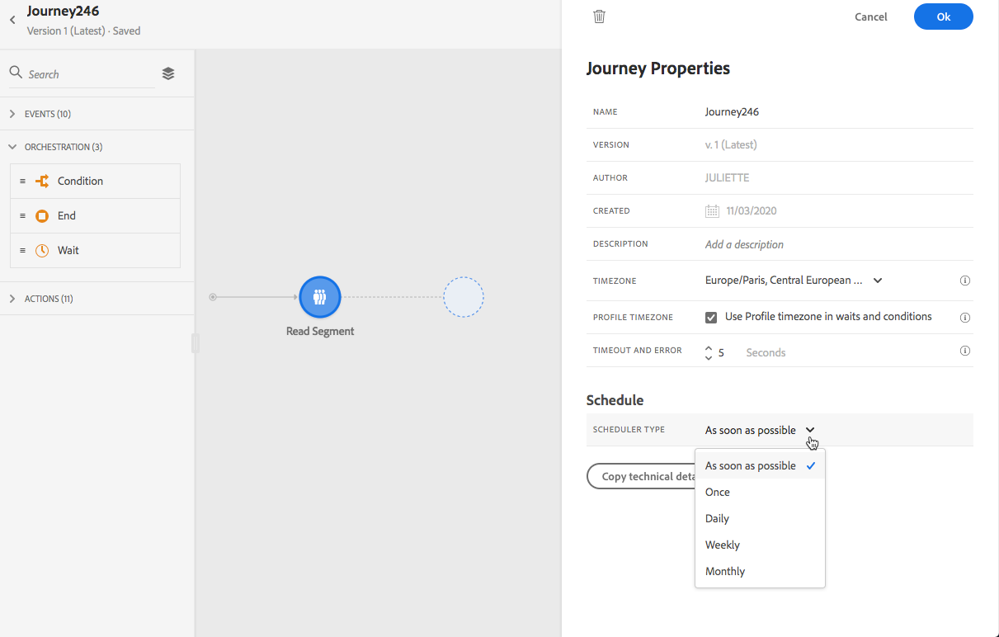

# Uitvoering van reizen {#message-execution}

## Uw reis testen

U kunt uw reis testen met testprofielen. Deze stap wordt aanbevolen om uw instellingen en berichten te valideren.

Meer informatie vindt u in deze [sectie](testing-the-journey.md).

## Uw reis activeren

U moet uw reis publiceren om het te activeren.

Meer informatie vindt u in deze [sectie](publishing-the-journey.md).

Na publicatie kunt u uw reis controleren met behulp van de speciale rapportagetools om de effectiviteit van uw reis te meten.

[Meer informatie over rapporten](../reports/live-report.md)

## Berichten verzenden {#send-messages}

Wanneer uw bericht een bepaalde inhoud heeft en wordt gepubliceerd, is het klaar om door een [reis](journey.md) worden verzonden.

>[!NOTE]
>
>U kunt een bericht toevoegen dat nog in ontwerpwijze aan een reis is, maar zorg ervoor het bericht wordt gepubliceerd alvorens de reis te publiceren.

Zodra een bericht wordt verzonden, kunt u zijn uitvoering door veelvoudige indicatoren controleren. [Meer weten over het controleren van de uitvoering](../message-monitoring.md) van berichten?

## Berichten plannen {#schedule-messages}

De berichten kunnen door de **[!UICONTROL Read Segment]** activiteit in een [reis](journey.md) worden gepland. U kunt specificeren wanneer het segment de reis zal ingaan. [Meer informatie over de activiteit](read-segment.md) Leessegment.

Volg de onderstaande stappen om dit te doen:

1. Bewerk een reis, sleep een **[!UICONTROL Read Segment]** activiteit en begin deze te configureren. [Meer informatie over het configureren van de activiteit](read-segment.md#configuring-segment-trigger-activity) Leessegment.

1. Klik op de koppeling **[!UICONTROL Edit journey schedule]** om de eigenschappen van de rit te openen.

   

1. Configureer het veld **[!UICONTROL Scheduler type]**: Selecteer de gewenste waarde in de lijst om ervoor te zorgen dat het segment de reis op een specifieke datum/tijd of op een terugkerende basis ingaat.

   >[!NOTE]
   >
   >De sectie **[!UICONTROL Schedule]** is alleen beschikbaar wanneer een activiteit **[!UICONTROL Read Segment]** op het canvas is neergezet.

   

1. Als u **[!UICONTROL Once]** selecteert, bepaal een specifieke datum en een tijd waarop het segment de reis zal ingaan.

   

1. Als u een terugkerende methode selecteert, bewerkt u de begindatum en -tijd. U kunt ook een optionele einddatum en -tijd definiëren.

   

   >[!NOTE]
   >
   >Standaard komen segmenten **[!UICONTROL As soon as possible]** op de reis. Dit betekent 1 uur na publicatie van de reis.

1. Klik **[!UICONTROL OK]** om uw veranderingen te bewaren.

<!--Unitary messages that are triggered by an event within a journey cannot be scheduled.-->
