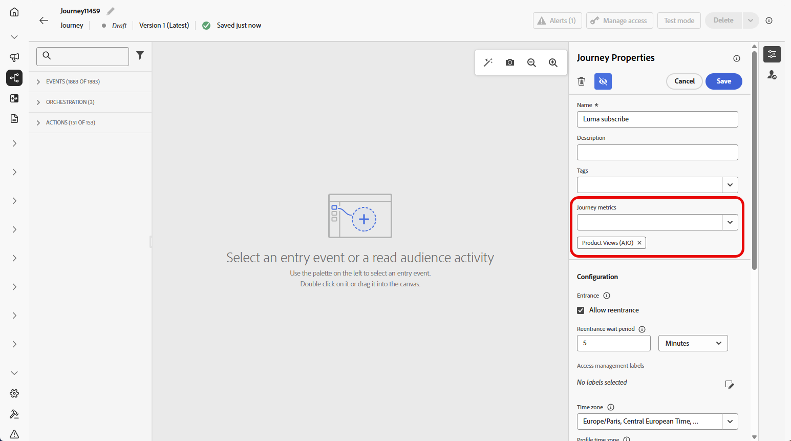

# Vorm en spoor uw reismetriek {#success-metrics}

Verbeter duidelijk zicht in de doeltreffendheid van uw klantenreizen met reismetriek. Met deze functie kunt u de prestaties bijhouden op basis van gedefinieerde PKI&#39;s, inzichten in wat werkt ontdekken en gebieden identificeren voor optimalisatie. Door impact in real time te meten, kunt u voortdurende verbetering drijven en gegeven-bewuste besluiten nemen die klantenbetrokkenheid verhogen.

## Vereisten {#prerequisites}

Alvorens uw reismetriek te gebruiken, moet u een dataset toevoegen die `Commerce Details`, `Web`, en `Mobile` [&#x200B; gebiedsgroepen &#x200B;](https://experienceleague.adobe.com/docs/experience-platform/xdm/tutorials/create-schema-ui.html?lang=nl-NL#field-group){target="_blank"} onder Configuratie > het Melden in Adobe Experience Platform omvat.

Deze veldgroepen moeten uit de ingebouwde opties worden geselecteerd, niet uit aangepaste groepen. Verwijs naar [&#x200B; datasets &#x200B;](../reports/reporting-configuration.md#add-datasets) sectie toevoegen.

## Beschikbare cijfers {#metrics}

De lijst van metriek varieert afhankelijk van de [&#x200B; gebiedsgroepen &#x200B;](https://experienceleague.adobe.com/docs/experience-platform/xdm/tutorials/create-schema-ui.html?lang=nl-NL#field-group){target="_blank"} inbegrepen aan uw dataset.

Als uw dataset niet wordt gevormd, slechts zullen de volgende metriek beschikbaar zijn: **[!UICONTROL Click]**, **[!UICONTROL Unique Click]**, **[!UICONTROL Clickthrough Rate]** en **[!UICONTROL Open Rate]**.

Met een Customer Journey Analytics-licentie kunt u aangepaste succeswaarden maken. [Meer informatie](https://experienceleague.adobe.com/nl/docs/analytics-platform/using/cja-components/cja-calcmetrics/cm-workflow/participation-metric)

| Metrics | Verwante veldgroep |
|-|-|
| Klikken | Geen veldgroep vereist |
| Unieke klikken | Geen veldgroep vereist |
| Doorkliksnelheid (CTR) | Geen veldgroep vereist |
| Klikken door open snelheid (CTOR) | Geen veldgroep vereist |
| Paginaweergaven | Webveldgroep |
| App Launches | Mobiele veldgroep |
| First App Launches | Mobiele veldgroep |
| App-installaties | Mobiele veldgroep |
| App-upgrades | Mobiele veldgroep |
| Aankopen | Commerce Details, veldgroep |
| Afbeeldingen | Commerce Details, veldgroep |
| Extra winkelwagentjes | Commerce Details, veldgroep |
| Kleurafopen | Commerce Details, veldgroep |
| Kleuraweergaven | Commerce Details, veldgroep |
| Winkelwagentjes verwijderen | Commerce Details, veldgroep |
| Productweergaven | Commerce Details, veldgroep |
| Opslaan voor later | Commerce Details, veldgroep |

## Attributie {#attribution}

Elke metrisch komt met een vastgestelde attributie die bepaalt welke aanraakpunten of interactie tot een specifiek resultaat hebben bijgedragen.

* **Attributie van Metriek met de vergunning van Journey Optimizer**:

  Met Journey Optimizer-licentie alleen wordt het maximale beschikbare terugzoekvenster voor elke geselecteerde metrische waarde ingesteld op 7 dagen. Voor deze metriek, wordt het attributiemodel geplaatst door gebrek aan **Laatste aanraking**, d.w.z. de meest recente interactie vóór omzetting.

  U kunt bijvoorbeeld bijhouden of een aankoop is gedaan nadat een klant de laatste 7 dagen met uw reis heeft gewerkt.

* **Attributie van Metriek met de vergunning van Customer Journey Analytics**:

  Met Journey Optimizer- en Customer Journey Analytics-licenties kunt u aangepaste metriek maken met specifieke attributie-instellingen of de kenmerken van de ingebouwde metriek wijzigen.

  Leer meer over [&#x200B; modellen van de Attributie &#x200B;](https://experienceleague.adobe.com/nl/docs/analytics-platform/using/cja-dataviews/component-settings/attribution#attribution-models)

## Uw reismetriek toewijzen {#assign}

>[!IMPORTANT]
>
>Per reis is slechts één maatstaf toegestaan.

Volg de onderstaande stappen om de gegevens van uw reis te volgen:

1. Klik in het menu **[!UICONTROL Journeys]** op **[!UICONTROL Create Journey]** .

1. Bewerk het configuratievenster van de rit om de naam van de rit te definiëren en de eigenschappen ervan in te stellen. Leer hoe te om de eigenschappen van uw reis op [&#x200B; te plaatsen deze pagina &#x200B;](../building-journeys/journey-properties.md).

1. Kies de **[!UICONTROL Journey metrics]** die wordt gebruikt om de effectiviteit van uw reis te meten.

   Merk op dat de meetgegevens van toepassing zijn op de reis zelf en van toepassing zijn op alle onderdelen van de reis.

   

1. Klik op **[!UICONTROL Save]**.

1. Ontwerp uw reis met de benodigde **[!UICONTROL Activities]** .

1. Test en publiceer uw reis.

1. Open uw reisrapport om de prestaties van uw toegewezen succesmetriek te volgen.

   Uw gekozen metriek worden getoond in de lijst van KPIs en van de Stats van de Reis van het rapport.

   

