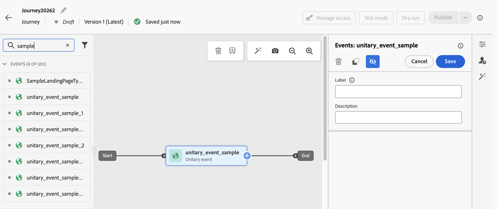

# Aanvullende id&#39;s gebruiken tijdens reizen {#supplemental-id}

>[!CONTEXTUALHELP]
>id="ajo_journey_parameters_supplemental_identifier"
>title="Aanvullende id gebruiken"
>abstract="De aanvullende identificatiecode is een secundaire identificatiecode die aanvullende context biedt voor de uitvoering van een reis. Als u deze wilt definiëren, selecteert u het veld dat u wilt gebruiken als de aanvullende id en kiest u een naamruimte die u hieraan wilt koppelen."

<table style="border-collapse: collapse; width: 100%;">
  <tr>
    <td style="vertical-align: top; padding-right: 20px; border: none;">
      <p>Door gebrek, worden de reizen uitgevoerd in de context van a <b> profielidentiteitskaart </b>. Dit betekent dat, zolang het profiel actief is op een bepaalde reis, het niet in staat zal zijn om een andere reis opnieuw te betreden. Om dit te verhinderen, staat Journey Optimizer u toe om a <b> supplementaire herkenningsteken </b>, zoals een orde identiteitskaart, abonnement identiteitskaart, recept identiteitskaart, naast profielidentiteitskaart te vangen.  
      <p>In dit voorbeeld, hebben wij a <b> het boeken identiteitskaart </b> als extra herkenningsteken toegevoegd.</p>
      <p>Op deze manier worden reizen uitgevoerd in de context van de profiel-id die aan de aanvullende identificatiecode (hier de boekings-id) is gekoppeld. Voor elke herhaling van de aanvullende identificator wordt één exemplaar van de reis uitgevoerd. Hierdoor zijn meerdere ingangen van dezelfde profiel-id mogelijk op reizen als ze verschillende boekingen hebben gemaakt.</p>
      <p>Bovendien staat Journey Optimizer u toe om attributen van het supplementaire herkenningsteken (b.v. boekingsaantal, receptvernieuwingsdatum, producttype) voor berichtaanpassing te hefboomwerking, die hoogst relevante mededelingen verzekeren.</p>
    </td>
    <td style="vertical-align: top; border: none; text-align: center; width: 40%;">
      
    </td>
  </tr>
</table>

➡️ [Ontdek deze functie in video](#video)

## Afbeeldingen en beperkingen {#guardrails}

* **Gesteunde reizen**: De Supplementaire herkenningstekens worden gesteund voor **gebeurtenis-teweeggebrachte** en **Lees publiek** reizen. Zij worden **niet gesteund** voor de kwalificatiereizen van het Publiek (d.w.z., reizen die met een de kwalificatieactiviteit van het Publiek beginnen).

* **Gelijktijdige instantielimieten**: De profielen kunnen niet meer dan 10 gezamenlijke reisinstanties hebben.

* **Regels van de Frequentie**: Elke die reisinstantie van het supplementaire gebruik wordt gecreeerd tellingen van het herkenningsteken naar frequentie het afschilderen, zelfs als het gebruik van supplementenherkenningstekens in veelvoudige reisinstanties resulteert.

* **het type van Gegevens en schemastructuur**: Het supplementaire herkenningsteken moet van type zijn `string`. Dit kan een onafhankelijk tekenreekskenmerk zijn of een tekenreekskenmerk binnen een array van objecten. Het onafhankelijke tekenreekskenmerk resulteert in één enkele instantie van de rit, terwijl het tekenreekskenmerk binnen een array van objecten resulteert in een unieke instantie van de reis per herhaling van de objectarray. Tekenreeksarrays en -maps worden niet ondersteund.

* **Reisingang**

  Het gedrag van de terugkeer van de reis met supplementaire herkenningstekens volgt het bestaande terugkeerbeleid:

   * Als de reis niet-deelnemer is, kan dezelfde profiel-ID + combinatie van aanvullende id de reis niet opnieuw binnenkomen.
   * Als de reis met een tijdvenster is gecentreerd, kan de zelfde profiel ID + supplementaire combinatie van identiteitskaart na het bepaalde tijdvenster opnieuw ingaan.

* **de Etikettering en de Handhaving van het Gebruik van Gegevens (DULE)** - Geen DULE bevestigingscontroles worden uitgevoerd op supplementaire identiteitskaart Dit betekent dat deze eigenschap niet in aanmerking zal worden genomen wanneer de reis op zoek is naar schendingen van het beleid inzake gegevensbeheer.

* **Downstream gebeurtenisconfiguratie**

  Als u een andere gebeurtenis stroomafwaarts in de reis gebruikt, moet het zelfde extra identiteitskaart gebruiken en zelfde identiteitskaart hebben namespace.

* **leest publiekstrajecten**

   * Aanvullende id is uitgeschakeld als u een bedrijfsgebeurtenis gebruikt.
   * De aanvullende id moet een veld uit het profiel zijn (dus geen gebeurtenis-/contextveld).
   * Voor leestuchtritten waarbij gebruik wordt gemaakt van aanvullende id&#39;s, is de leessnelheid van de activiteit van het leestopubliek voor elk reisexemplaar beperkt tot maximaal 500 profielen per seconde.
   * Alleen Unified Profile Service-publiek wordt ondersteund wanneer u leest-publiekstrajecten gebruikt met aanvullende id&#39;s.

## Criteria afsluiten met aanvullende id&#39;s {#exit-criteria}

Voorwaarde: reis ingeschakeld voor aanvullende id (via eenheidsgebeurtenis of activiteiten voor het lezen van het publiek)

In de onderstaande tabel wordt het gedrag van profielen in een extra ID-reis beschreven wanneer afsluitcriteria zijn geconfigureerd:

| Configuratie van afsluitcriteria | Gedrag wanneer aan afsluitcriteria is voldaan |
| ---------------------------- | ---------------------------------- |
| Gebaseerd op een niet-aanvullende id-gebeurtenis | Alle exemplaren van het overeenkomstige profiel in die reis worden verlaten. |
| Gebaseerd op een supplementaire gebeurtenis van identiteitskaart <br/>*Nota: Supplementale identiteitskaart namespace moet dat van de aanvankelijke knoop aanpassen.* | Alleen het overeenkomende profiel en de aanvullende id-instantie worden afgesloten. |
| Gebaseerd op een publiek | Alle exemplaren van het overeenkomstige profiel in die reis worden verlaten. |

## Voeg een aanvullende id toe en gebruik deze voor een reis {#add}

>[!BEGINTABS]

>[!TAB  gebeurtenis-teweeggebrachte reis ]

Voer de volgende stappen uit om een aanvullende id te gebruiken in een gebeurtenis-activering:

1. **teken de attributen als herkenningsteken in het gebeurtenisschema**

   1. Open het gebeurtenisschema en zoek het kenmerk dat u als aanvullende id wilt gebruiken (bijvoorbeeld de reserverings-id, de abonnement-id) en markeer het als een id. [ Leer hoe te met schema&#39;s ](../data/get-started-schemas.md) te werken

   1. Markeer de id als een **[!UICONTROL Identity]** .

      

      >[!IMPORTANT]
      >
      >Zorg ervoor u niet de attributen als **Primaire identiteit** merkt.

   1. Selecteer de naamruimte die u aan de aanvullende id wilt koppelen. Dit moet een naamruimte voor niet-persoonlijke id zijn.

      Nadat u de naamruimte voor niet-persoonlijke identiteit op een schema hebt toegepast, moet u een nieuwe gebeurtenis maken om de aanvullende id te kunnen gebruiken. Bestaande entiteiten kunnen niet worden vernieuwd om de nieuwe id te herkennen.

1. **voeg extra identiteitskaart aan de gebeurtenis toe**

   1. Maak of bewerk de gewenste gebeurtenis. [ Leer hoe te om een eenheidsgebeurtenis te vormen ](../event/about-creating.md)

   1. Controleer de optie **[!UICONTROL Use supplemental identifier]** in het scherm met gebeurtenisconfiguratie.

      

   1. Gebruik de uitdrukkingsredacteur om de attributen te selecteren u als supplementaire identiteitskaart merkte

      >[!NOTE]
      >
      >Gebruik de expressie-editor in **[!UICONTROL Advanced mode]** om het kenmerk te selecteren.

   1. Nadat u de aanvullende id hebt geselecteerd, wordt de bijbehorende naamruimte in het scherm voor gebeurtenisconfiguratie weergegeven als alleen-lezen.

1. **voeg de gebeurtenis aan de reis** toe

   Sleep de geconfigureerde gebeurtenis naar het reiscanvas. Het zal reizen op basis van zowel profiel-id als aanvullende id activeren.

    teweegbrengt

>[!TAB  Lees publiekstraject ]

Voer de volgende stappen uit om een extra id te gebruiken voor een leestoepreis:

1. **Teken de attributen als herkenningsteken in het unie/profielschema**

   1. Open het samenvoegings-/profielschema en zoek het kenmerk dat u als aanvullende id wilt gebruiken (bijv. reserverings-id, abonnement-id) en markeer het als een id. [ Leer hoe te met schema&#39;s ](../data/get-started-schemas.md) te werken

   1. Markeer de id als een **[!UICONTROL Identity]** .

      

      >[!IMPORTANT]
      >
      >Zorg ervoor u niet de attributen als **Primaire identiteit** merkt.

   1. Selecteer de naamruimte die u aan de aanvullende id wilt koppelen. Dit moet een naamruimte voor niet-persoonlijke id zijn.

      Nadat u de naamruimte voor niet-persoonlijke identiteit op een schema hebt toegepast, moet u een nieuwe veldgroep maken om de aanvullende id te kunnen gebruiken. Bestaande entiteiten kunnen niet worden vernieuwd om de nieuwe id te herkennen.

<!--1. **Add the supplemental ID field to the data source**

    1. Navigate to the **[!UICONTROL Configuration]** / **[!UICONTROL Data Sources]** menu, then locate the "ExperiencePlatformDataSource" data source.

        

    1. Open the field selector then select the attribute you want to use as a supplemental identifier (e.g., booking ID, subscription ID).-->

1. **voeg en vorm een Gelezen publieksactiviteit in de reis toe**

   1. Sleep een **[!UICONTROL Read audience]** activiteit in uw reis.

   1. Schakel in het deelvenster Eigenschappen activiteit de optie **[!UICONTROL Use supplemental identifier]** in.

      

   1. Gebruik in het veld **[!UICONTROL Supplement identifier]** de expressieeditor om het kenmerk te selecteren dat u als aanvullende id hebt gemarkeerd.

      >[!NOTE]
      >
      >Gebruik de expressie-editor in **[!UICONTROL Advanced mode]** om het kenmerk te selecteren.

   1. Nadat u de aanvullende id hebt geselecteerd, wordt de bijbehorende naamruimte in het veld **[!UICONTROL Supplemental namespace]** weergegeven als alleen-lezen.

>[!ENDTABS]

## Extra ID-kenmerken gebruiken

Gebruik de uitdrukkingsredacteur en de verpersoonlijkingsredacteur om attributen van het supplementaire herkenningsteken voor verpersoonlijking of voorwaardelijke logica van verwijzingen te voorzien. Kenmerken zijn toegankelijk via het menu **[!UICONTROL Contextual attributes]** .


Gebruik een formule voor gebeurtenisgestuurde reizen wanneer u met arrays werkt (bijvoorbeeld meerdere voorschriften of beleidsregels) om specifieke elementen te extraheren.

+++ Zie voorbeelden

In een objectarray met de aanvullende id als `bookingNum` en een kenmerk op hetzelfde niveau als `bookingCountry` , doorloopt de reis het arrayobject op basis van de bookingNum en wordt voor elk object een reisinstantie gemaakt.

* De volgende expressie in de voorwaardenactiviteit doorloopt de objectarray en controleert of de waarde van `bookingCountry` gelijk is aan &quot;FR&quot;:

  ```
  @event{<event_name>.<object_path>.<object_array_name>.all(currentEventField.<attribute_path>.bookingNum==${supplementalId}).at(0).<attribute_path>.bookingCountry}=="FR"
  ```

* De volgende expressie in de e-mailverpersoonlijkingseditor doorloopt de objectarray, haalt de `bookingCountry` uit die van toepassing is op de huidige instantie van de reis en geeft deze in de inhoud weer:

  ```
  {{#each context.journey.events.<event_ID>.<object_path>.<object_array_name> as |l|}} 
  
   {{l.<attribute_path>.bookingCountry}}  
  
  {{/each}}
  ```

* Voorbeeld van de gebeurtenis die wordt gebruikt om de reis te starten:

  ```
  "bookingList": [
        {
            "bookingInfo": {
                "bookingNum": "x1",
                      "bookingCountry": "US"
            }
        },
        {
            "bookingInfo": {
                "bookingNum": "x2",
                "bookingCountry": "FR"
            }
        }
    ]
  ```

+++

## Voorbeelden van gebruiksgevallen

### **Berichten van de Verlenging van het Beleid**

* **Scenario**: Een verzekeringsleverancier verzendt vernieuwingsherinneringen voor elk actief beleid dat door een klant wordt gehouden.
* **Uitvoering**:
   * Profiel: &quot;John&quot;.
   * Aanvullende id&#39;s: `"AutoPolicy123", "HomePolicy456"`.
   * De reis voert afzonderlijk voor elk beleid uit, met gepersonaliseerde vernieuwingsdata, dekkingsdetails, en premieinformatie.

### **Beheer van het Abonnement**

* **Scenario**: De abonnementendienst verzendt op maat gemaakte berichten voor elk abonnement wanneer een gebeurtenis voor dat abonnement wordt teweeggebracht.
* **Uitvoering**:
   * Profiel: &quot;Jane&quot;.
   * Aanvullende id&#39;s: `"Luma Yoga Program ", "Luma Fitness Program"`.
   * Elke gebeurtenis bevat een abonnement-id en gegevens over dat abonnement. De reis voert afzonderlijk voor elke gebeurtenis/abonnement uit, die gepersonaliseerde vernieuwingsaanbiedingen per abonnement toestaat.

### **Aanbevelingen van het Product**

* **Scenario**: Een e-handelsplatform verzendt aanbevelingen die op specifieke producten worden gebaseerd door een klant worden gekocht.
* **Uitvoering**:
   * Profiel: &quot;Alex&quot;.
   * Aanvullende id&#39;s: `"productID1234", "productID5678"`.
   * De reis voert afzonderlijk voor elk product uit, met gepersonaliseerde upsellingsmogelijkheden.

## Hoe kan ik-video {#video}

Leer hoe u een aanvullende id in [!DNL Adobe Journey Optimizer] kunt inschakelen en toepassen.

>[!VIDEO](https://video.tv.adobe.com/v/3464792?quality=12)
