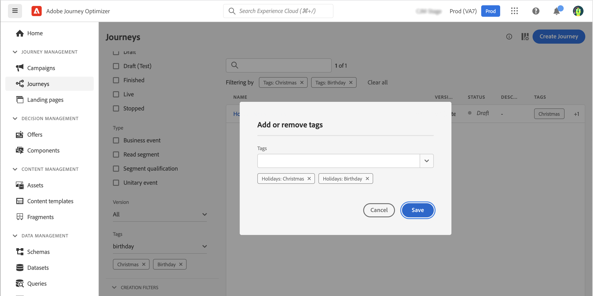

# Tags tijdens reizen beheren {#journey_tags}

Als Journey Optimizer-expert kunt u uw reizen organiseren met tags. Met tags kunt u objecten snel en eenvoudig classificeren om zoekopdrachten te verbeteren.

## Tags versus naamgevingsconventies {#tags-vs-naming}

De teams baseren zich vaak op complexe noemende overeenkomsten om meta-gegevens in reisnamen direct op te slaan — bijvoorbeeld: *Levenscyclusmarketing - Onderwijs - Klant Onboarding V2 - het Onderwijs van de app - Q3 2025*. Hoewel deze aanpak goed bedoeld is, heeft deze een belangrijke zwakte: naarmate het werk over teamleden wordt geschaald, wordt de conventie zelden consequent toegepast en wordt het moeilijk om door reislijsten te navigeren.

**de categorieën van de Markering** in Journey Optimizer bieden een beter alternatief aan. In plaats van metagegevens in de naam te coderen, voegt u gecategoriseerde tags toe aan elke reis (bijvoorbeeld team, doel, fase, kwartaal) en gebruikt u filters om deze te zoeken. De namen van de reis kunnen zich dan concentreren op wat werkelijk van belang is: de klantenmijlpaal die wordt gedreven.

Voordelen van tagcategorieën ten opzichte van naamgevingsconventies:

* **Consistentie** — de markeringen worden geselecteerd uit een gecontroleerde lijst, niet vrij getypt.
* **Filterability** - om het even welke combinatie markeringswaarden kunnen worden gebruikt om de reislijst onmiddellijk te segmenteren.
* **Duidelijkheid** — de namen van de reis blijven kort en mijlpaal-geconcentreerd.
* **Schaalbaarheid** — toevoegend een nieuwe meta-gegevensdimensie betekent het creëren van een nieuwe markeringscategorie, die een noemende overeenkomst niet herschrijft.

Voor een geadviseerde opstellingswerkschema, zie [&#x200B; de categorieën van de opstellingstag voor reisbeheer &#x200B;](#tags-setup) hieronder.

## Tags toevoegen aan een rit

Het **gebied van Markeringen**, in de reiseigenschappen, staat u toe om markeringen voor uw reis te bepalen. U kunt een bestaande tag selecteren of een nieuwe tag maken. Typ de naam van de gewenste tag en selecteer deze in de lijst. Als het niet beschikbaar is, creeert de klik **&#x200B;**&#x200B;om nieuwe tot stand te brengen en het toe te voegen aan uw reis. U kunt zo veel tags definiëren als nodig is.

De lijst van bepaalde markeringen wordt getoond onder het **gebied van Markeringen**.

>[!NOTE]
>
> Tags zijn hoofdlettergevoelig
> 
> Als u een reis dupliceert of een nieuwe versie maakt, blijven de labels behouden.

## Filteren op labels

De lijst van de Reis toont een specifieke kolom zodat kunt u uw markeringen gemakkelijk visualiseren.

Een filter is ook beschikbaar om alleen reizen met bepaalde tags weer te geven.

U kunt tags toevoegen aan of verwijderen uit elk type transport (live, concept, enz.). Klik het **Meer acties** pictogram naast de reis, en selecteer **uitgeven markeringen**.

## Tags beheren

De beheerders kunnen markeringen schrappen en hen door categorieën organiseren gebruikend het **menu van Codes**, onder **BEHEER**. Verwijs naar deze [&#x200B; documentatie &#x200B;](https://experienceleague.adobe.com/docs/experience-platform/administrative-tags/overview.html?lang=nl-NL).

>[!NOTE]
>
> Tags die zijn gedefinieerd tijdens reizen, worden toegevoegd aan de ingebouwde categorie &quot;Niet-gecategoriseerd&quot;.

## Tagcategorieën instellen voor reisbeheer {#tags-setup}

Voer de volgende stappen uit om een complexe naamgevingsconventie te vervangen door een op tags gebaseerde aanpak in uw team.

**Stap 1 — creeer markeringscategorieën (Admin)**

In **[!UICONTROL Administration]** > **[!UICONTROL Tags]**, creeer één categorie voor elk meta-gegevensattribuut uw team momenteel codeert in reisnamen - bijvoorbeeld: *Team*, *het in de handel brengen doelstelling*, *Campagne*, *Fase*, *Kwartaal*.

**Stap 2 — bevolk elke categorie met markeringswaarden (Admin)**

Maak binnen elke categorie de tags die alle mogelijke waarden vertegenwoordigen. Bijvoorbeeld, zou de *Categorie van de Fase* kunnen bevatten: *Bewustwording*, *onboarding*, *Behoud*, *Win-back*.

**Stap 3 — pas markeringen toe wanneer het creëren van reizen (Praktijken)**

Telkens wanneer een nieuwe reis wordt gecreeerd, selecteer de aangewezen markering van elke categorie in de reiseigenschappen. Een reis zal typisch één markering per categorie dragen.

**Stap 4 — De reizen van de naam voor de mijlpaal, filter door markeringen**

Houd de reisnaam die op de klantenmijlpaal wordt geconcentreerd het drijft (b.v. *Eerste loyaliteitstransactie*). Gebruik labelfilters in de reislijst om reizen te vinden met een willekeurige combinatie van metagegevens, zonder te hoeven vertrouwen op naamparsering.

>[!TIP]
>
>Voor een bredere bespreking van deze benadering en zijn voordelen op schaal, zie [&#x200B; Beste praktijken voor geavanceerde reizen in Journey Optimizer &#x200B;](https://experienceleague.adobe.com/nl/perspectives/best-practices-for-advanced-journeys-in-journey-optimizer){target="_blank"}.
