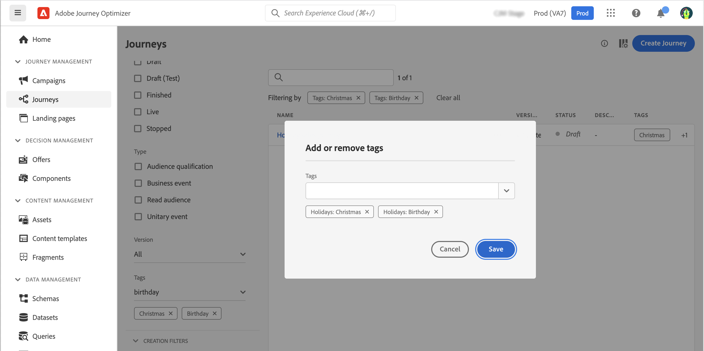

# Tags tijdens reizen beheren {#journey_tags}

Als Journey Optimizer-expert kunt u uw reizen organiseren met tags. Met tags kunt u objecten snel en eenvoudig classificeren om zoekopdrachten te verbeteren.

## Tags toevoegen aan een rit

Het **gebied van Markeringen**, in de reiseigenschappen, staat u toe om markeringen voor uw reis te bepalen. U kunt een bestaande tag selecteren of een nieuwe tag maken. Typ de naam van de gewenste tag en selecteer deze in de lijst. Als het niet beschikbaar is, creeert de klik **&#x200B;**&#x200B;om nieuwe tot stand te brengen en het toe te voegen aan uw reis. U kunt zo veel tags definiëren als nodig is.

De lijst van bepaalde markeringen wordt getoond onder het **gebied van Markeringen**.

>[!NOTE]
>
> Tags zijn hoofdlettergevoelig
> 
> Als u een reis dupliceert of een nieuwe versie maakt, blijven de labels behouden.

## Filteren op labels

De lijst van de Reis toont een specifieke kolom zodat kunt u uw markeringen gemakkelijk visualiseren.

Een filter is ook beschikbaar om alleen reizen met bepaalde tags weer te geven.

U kunt tags toevoegen aan of verwijderen uit elk type transport (live, concept, enz.). Klik het **Meer acties** pictogram naast de reis, en selecteer **uitgeven markeringen**.

## Tags beheren

De beheerders kunnen markeringen schrappen en hen door categorieën organiseren gebruikend het **menu van Codes**, onder **BEHEER**. Verwijs naar deze [&#x200B; documentatie &#x200B;](https://experienceleague.adobe.com/docs/experience-platform/administrative-tags/overview.html?lang=nl-NL).

>[!NOTE]
>
> Tags die zijn gedefinieerd tijdens reizen, worden toegevoegd aan de ingebouwde categorie &quot;Niet-gecategoriseerd&quot;.
