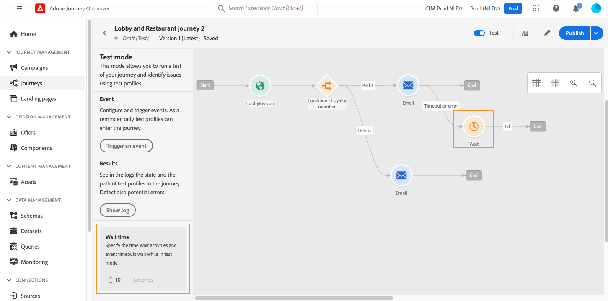

# Uw reis testen{#testing_the_journey}

>[!CONTEXTUALHELP]
>id="ajo_journey_test"
>title="Uw reis testen"
>abstract="Gebruik testprofielen om uw reis te testen voordat u deze publiceert. Dit staat u toe om te analyseren hoe de individuen in de reis stromen en problemen vóór publicatie oplossen."

Nadat u uw reis hebt gemaakt, kunt u deze testen voordat u de site publiceert. Journey Optimizer biedt &quot;testmodus&quot; als een manier om testprofielen te bekijken terwijl ze op reis gaan en mogelijke fouten vóór activering op te sporen. Door snelle tests uit te voeren kunt u controleren of de reizen correct werken, zodat u ze met vertrouwen kunt publiceren.

Alleen testprofielen kunnen een reis maken in de testmodus. U kunt nieuwe testprofielen maken of bestaande profielen omzetten in testprofielen. Leer meer over testprofielen in [ deze sectie ](../audience/creating-test-profiles.md).

>[!NOTE]
>
>Voordat u de reis kunt testen, moet u alle eventuele fouten oplossen. Leer hoe te om fouten te controleren alvorens in [ te testen deze sectie ](../building-journeys/troubleshooting.md). Als de testprofielen er niet in slagen om op testwijze te vooruitgang, zie [ overgangen van de het oplossen van problementest ](troubleshooting-execution.md#troubleshooting-test-transitions).

## Belangrijke opmerkingen {#important_notes}

### Algemene beperkingen

* **de profielen van de Test slechts** - slechts individuen die als &quot;testprofielen&quot;in de Dienst van het Profiel van de Klant in real time worden gemarkeerd kunnen een reis op testwijze ingaan. [ leer hoe te om testprofielen ](../audience/creating-test-profiles.md) tot stand te brengen.
* **Vereiste Namespace** - de wijze van de Test is beschikbaar slechts voor ontwerp reizen die een namespace gebruiken. In de testmodus moet worden nagegaan of een persoon die de reis betreedt een testprofiel is en moet hij dus Adobe Experience Platform kunnen bereiken.
* **de grens van het Profiel** - een maximum van 100 testprofielen kan een reis tijdens één enkele testzitting ingaan.
* **Gebeurtenis die** teweegbrengt - de Gebeurtenissen kunnen slechts van de interface worden in brand gestoken. Gebeurtenissen kunnen niet worden geactiveerd vanaf externe systemen die een API gebruiken.
* **uploadt de Douane publiek** - de testwijze van de Reis steunt niet [ douane uploadt publieksverrijking van het publiek ](../audience/custom-upload.md) attribuut.

### Gedrag tijdens en na de test

* **onbruikbaar makend testwijze** - wanneer u testwijze onbruikbaar maakt, worden alle profielen momenteel in of eerder ingegaan in de reis verwijderd, en het melden ontruimd.
* **flexibiliteit van de reactivering** - u kunt testwijze toelaten en onbruikbaar maken zo vaak als nodig.
* **Automatische deactivatie** - de Reizen die inactief op testwijze voor **over een week** blijven keren automatisch aan de status van het Ontwerp terug om prestaties te optimaliseren en verouderd middelgebruik te verhinderen.
* **het uitgeven en het publiceren** - terwijl de testwijze actief is, kunt u niet de reis wijzigen. U kunt de reis echter rechtstreeks publiceren, zodat u de testmodus niet hoeft te deactiveren.

### Execution

* **Gesplitst gedrag** - wanneer de reis een spleet bereikt, wordt de hoogste tak altijd geselecteerd. Vertakkingen opnieuw ordenen als u een ander pad wilt testen.
* **de timing van de Gebeurtenis** - als de reis*veelvoudige gebeurtenissen omvat, teweegbrengt elke gebeurtenis in opeenvolgingen.Verzendend een gebeurtenis te vroeg (alvorens de eerste wachttijdknoop) eindigt of te laat (na de gevormde onderbreking) zal de gebeurtenis verwerpen en het profiel naar een onderbrekingspad verzenden. Bevestig altijd alle verwijzingen naar velden voor gebeurtenislading geldig door de lading binnen het gedefinieerde venster te verzenden
* **Actief datumvenster** - zorg ervoor de reis gevormde verkies [ begin en eind data/tijd ](journey-properties.md#dates) venster de huidige tijd wanneer het in werking stellen van testwijze. Anders worden getriggerde testgebeurtenissen stilletjes genegeerd. Leer meer over het oplossen van problemen deze kwestie [ op deze pagina ](troubleshooting-execution.md#troubleshooting-test-transitions).
* **gebeurtenissen van de Reactie** - voor reactiegebeurtenissen met een onderbreking, is het minimum en gebrek wachttijd 40 seconden.
* **datasets van de Test** - Gebeurtenissen die op testwijze worden teweeggebracht worden opgeslagen in specifieke datasets als volgt geëtiketteerd: `JOtestmode - <schema of your event>`

<!--
* Fields from related entities are hidden from the test mode.
-->

## De testmodus activeren

Voer de volgende stappen uit om de testmodus te gebruiken:

1. Klik op de knop **[!UICONTROL Test mode]** in de rechterbovenhoek om de testmodus te activeren.

   

1. Als de reis minstens één **heeft wacht** activiteit, plaats de **[!UICONTROL Wait time]** parameter om de tijd te bepalen dat elk activiteit en gebeurtenisonderbreking op testwijze zal duren. De standaardtijd is 10 seconden voor wachttijden en gebeurtenisonderbrekingen. Zo krijgt u de testresultaten snel.

   

   >[!NOTE]
   >
   >Wanneer een reactiegebeurtenis met een onderbreking in een reis wordt gebruikt, is het gebrek van de wachttijdtijd en de minimumwaarde 40 seconden. Zie [deze sectie](../building-journeys/reaction-events.md).

1. Gebruik de knop **[!UICONTROL Trigger an event]** om gebeurtenissen te configureren en naar de rit te verzenden.

   

1. Configureer de verschillende verwachte velden. Op het **gebied van Identifier van het 0} Profiel {, ga de waarde van het gebied in dat wordt gebruikt om het testprofiel te identificeren.** Het kan bijvoorbeeld het e-mailadres zijn. Zorg ervoor dat u gebeurtenissen verzendt die betrekking hebben op testprofielen. Zie [deze sectie](#firing_events).

   

1. Nadat de gebeurtenissen zijn ontvangen, klikt u op de knop **[!UICONTROL Show log]** om het testresultaat weer te geven en te controleren. Zie [deze sectie](#viewing_logs).

   

1. Als er een fout optreedt, deactiveert u de testmodus, wijzigt u de journey en test u deze opnieuw. Wanneer de tests klaar zijn, kunt u uw reis publiceren. Zie [deze pagina](../building-journeys/publish-journey.md).

## Trigger uw gebeurtenissen {#firing_events}

>[!CONTEXTUALHELP]
>id="ajo_journey_test_configuration"
>title="De testmodus configureren"
>abstract="Als uw reis verscheidene gebeurtenissen bevat, gebruik de drop-down lijst om een gebeurtenis te selecteren. Configureer vervolgens voor elke gebeurtenis de doorgegeven velden en de uitvoering van de gebeurtenis die de gebeurtenis verzendt."

Gebruik de knop **[!UICONTROL Trigger an event]** om een gebeurtenis te configureren die een persoon de reis laat betreden.

### Vereisten {#trigger-events-prerequisites}

Als voorwaarde moet u weten welke profielen in Adobe Experience Platform zijn gemarkeerd als testprofielen. In de testmodus zijn deze profielen alleen toegestaan tijdens de reis.

De gebeurtenis moet een id bevatten. De verwachte id is afhankelijk van de gebeurtenisconfiguratie. Het kan bijvoorbeeld een ECID of een e-mailadres zijn. De waarde van deze sleutel moet op het **gebied van het Profiel worden toegevoegd 0} Identifier.**

Als uw reis er niet in slaagt testwijze met fout `ERR_MODEL_RULES_16` toe te laten, zorg ervoor de gebruikte gebeurtenis een [ identiteit namespace ](../audience/get-started-identity.md) omvat wanneer het gebruiken van een kanaalactie.

De naamruimte identity wordt gebruikt om de testprofielen op unieke wijze te identificeren. Bijvoorbeeld, als e-mail wordt gebruikt om de testprofielen te identificeren, zou de identiteit namespace **E-mail** moeten worden geselecteerd. Als het unieke herkenningsteken het telefoonaantal is, dan zou de identiteit namespace **Telefoon** moeten worden geselecteerd.

>[!NOTE]
>
>* Wanneer u een gebeurtenis in testmodus activeert, wordt een echte gebeurtenis gegenereerd. Dit betekent dat ook andere reizen naar deze gebeurtenis worden beïnvloed.
>
>* Zorg ervoor dat elke gebeurtenis in testwijze in de correcte orde en binnen het gevormde wachtende venster wordt teweeggebracht. Bijvoorbeeld, als er 60 seconden wacht is, moet de tweede gebeurtenis worden teweeggebracht slechts nadat die 60 seconde wacht is verstreken en alvorens de onderbrekingsgrens verloopt.
>

### Gebeurtenisconfiguratie {#trigger-events-configuration}

Als uw reis verscheidene gebeurtenissen bevat, gebruik de drop-down lijst om een gebeurtenis te selecteren. Configureer vervolgens voor elke gebeurtenis de doorgegeven velden en de uitvoering van de gebeurtenis die de gebeurtenis verzendt. De interface helpt u de juiste informatie in de gebeurtenislading over te gaan en ervoor te zorgen het informatietype correct is. In de testmodus worden de laatste parameters die in een testsessie worden gebruikt, opgeslagen voor later gebruik.

Met de interface kunt u eenvoudige gebeurtenisparameters doorgeven. Als u verzamelingen of andere geavanceerde objecten in de gebeurtenis wilt doorgeven, kunt u **[!UICONTROL Code View]** selecteren om de volledige code van de lading te zien en deze te wijzigen. U kunt bijvoorbeeld gebeurtenisgegevens kopiëren en plakken die door een technische gebruiker zijn voorbereid.

Een technische gebruiker kan deze interface ook gebruiken om gebeurtenislading samen te stellen en gebeurtenissen teweeg te brengen zonder het moeten een derdehulpmiddel gebruiken.

Wanneer u op de knop **[!UICONTROL Send]** klikt, wordt de test gestart. De voortgang van het individu tijdens de reis wordt weergegeven door een visuele stroom. Het pad wordt steeds groen naarmate het individu over de reis beweegt. Als er een fout optreedt, wordt er een waarschuwingssymbool weergegeven bij de bijbehorende stap. U kunt de cursor erop plaatsen om meer informatie over de fout weer te geven en volledige details te openen (indien beschikbaar).

Wanneer u een ander testprofiel in het scherm van de gebeurtenisconfiguratie selecteert en de test opnieuw in werking stelt, wordt de visuele stroom ontruimd en toont de weg van nieuw individu.

Wanneer u een rit tijdens de test opent, komt het weergegeven pad overeen met de laatste uitgevoerde test.

## Testmodus voor op regels gebaseerde reizen {#test-rule-based}

De testmodus is ook beschikbaar voor reizen die een op regels gebaseerde gebeurtenis gebruiken. Voor meer informatie over op regel-gebaseerde gebeurtenissen, verwijs naar [ deze pagina ](../event/about-events.md).

Wanneer het teweegbrengen van een gebeurtenis, staat het **scherm van de configuratie van de Gebeurtenis 0} u toe om de gebeurtenisparameters te bepalen om in de test over te gaan.** U kunt de voorwaarde van de gebeurtenis-identiteitskaart bekijken door het tooltip pictogram in de hoogste juiste hoek te klikken. Er is ook knopinfo beschikbaar naast elk veld dat deel uitmaakt van de regelevaluatie.

## Testmodus voor bedrijfsgebeurtenissen {#test-business}

Wanneer het gebruiken van a [ bedrijfsgebeurtenis ](../event/about-events.md), gebruik de testwijze om één enkele ingang van het testprofiel in de reis teweeg te brengen, de gebeurtenis te simuleren en juiste profiel ID over te gaan. U moet de gebeurtenisparameters en de identificatiecode van het testprofiel doorgeven die de reis tijdens de test zal betreden. In de testmodus is er geen modus &quot;Codeweergave&quot; beschikbaar voor reizen op basis van bedrijfsgebeurtenissen.

Wanneer u een bedrijfsgebeurtenis voor het eerst activeert, kunt u de definitie van een bedrijfsgebeurtenis niet in dezelfde testsessie wijzigen. U kunt alleen dezelfde persoon of een andere persoon dezelfde of een andere persoon de reis laten doorlopen met dezelfde of een andere id. Als u parameters voor bedrijfsgebeurtenissen wilt wijzigen, moet u de testmodus stoppen en opnieuw starten.

## Logboeken weergeven {#viewing_logs}

>[!CONTEXTUALHELP]
>id="ajo_journey_test_logs"
>title="Logboeken van testmodi"
>abstract="De **toon logboek** knoop toont testresultaten in formaat JSON. Deze resultaten geven het aantal individuen binnen de reis en hun status weer."

Met de knop **[!UICONTROL Show log]** kunt u de testresultaten bekijken. Op deze pagina worden de huidige gegevens van de reis in JSON-indeling weergegeven. Met een knop kunt u hele knooppunten kopiëren. U moet de pagina handmatig vernieuwen om de testresultaten van de reis bij te werken.

>[!NOTE]
>
>In de testlogboeken, in het geval van een fout wanneer het roepen van een derdesysteem (gegevensbron of actie), worden de foutencode en foutenreactie getoond.

Het aantal personen (technisch gesproken worden ze instanties genoemd) dat zich momenteel in de reis bevindt, wordt weergegeven. Hier volgt nuttige informatie die voor elk individu wordt weergegeven:

* _Identiteitskaart_: interne identiteitskaart van het individu in de reis. Dit kan voor het zuiveren doeleinden worden gebruikt.
* _huidige stap_: de stap waar het individu bij in de reis is. We raden u aan labels aan uw activiteiten toe te voegen om ze gemakkelijker te kunnen identificeren.
* _huidige stap_ > fase: het statuut van de reis van het individu (het lopen, gebeëindigd, fout of uit tijd). Zie hieronder voor meer informatie.
* _huidige stap_ > _extraInfo_: beschrijving van de fout en andere contextafhankelijke informatie.
* _huidige stap_ > _fetchErrors_: informatie over de fouten van de haalgegevens die tijdens deze stap voorkwamen.
* _externalKeys_: de waarde voor de belangrijkste formule die in de gebeurtenis wordt bepaald.
* _enrichedData_: de gegevens die de reis heeft teruggewonnen als de reis gegevensbronnen gebruikt.
* _transitionHistory_: de lijst van stappen die het individu volgde. Voor gebeurtenissen wordt de payload weergegeven.
* _actionExecutionErrors_ : informatie over de fouten die voorkwamen.

Hier zijn de verschillende statussen van de reis van een individu:

* _Lopend_: het individu is momenteel in de reis.
* _Voltooid_: Het individu is aan het eind van de reis.
* _Fout_: het individu wordt tegengehouden in de reis wegens een fout.
* _Timed out_: het individu wordt tegengehouden in de reis wegens een stap die teveel tijd kostte.

Wanneer een gebeurtenis gebruikend de testwijze wordt teweeggebracht, wordt een dataset automatisch geproduceerd met de naam van de bron.

In de testmodus wordt automatisch een Experience Event gemaakt en naar Adobe Experience Platform verzonden. De naam van de bron voor deze ervaringsgebeurtenis is &quot;Journey Orchestration Test Events&quot;.

