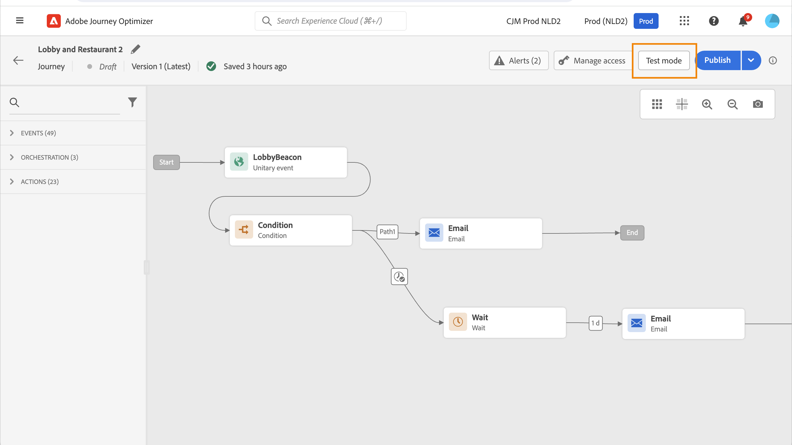

# Uw reis testen{#testing_the_journey}

>[!CONTEXTUALHELP]
>id="ajo_journey_test"
>title="Uw reis testen"
>abstract="Gebruik testprofielen om uw reis te testen voordat u deze publiceert. Dit staat u toe om te analyseren hoe de individuen in de reis stromen en problemen vóór publicatie oplossen."

Gebruik testprofielen om uw reis te testen voordat u deze publiceert. In deze modus kunt u een test van uw reis uitvoeren en problemen identificeren aan de hand van testprofielen.

Alleen testprofielen kunnen een reis maken in de testmodus. U kunt nieuwe testprofielen maken of bestaande profielen omzetten in testprofielen. Meer informatie over testprofielen vindt u in [deze sectie](../segment/creating-test-profiles.md).

>[!NOTE]
>
>Voordat u de reis kunt testen, moet u alle eventuele fouten oplossen. Leer hoe u fouten kunt controleren voordat u gaat testen [deze sectie](../building-journeys/troubleshooting.md#checking-for-errors-before-testing).

Voer de volgende stappen uit om de testmodus te gebruiken:

1. Als u de testmodus wilt activeren, activeert u de **[!UICONTROL Test]** in de rechterbovenhoek.

   

1. Indien de reis ten minste één **Wachten** activiteit instellen **[!UICONTROL Wait time]** parameter om de tijd te bepalen dat elke activiteit van de wachttijd en gebeurtenisonderbreking op testwijze zal duren. De standaardtijd is 10 seconden voor wachttijden en gebeurtenisonderbrekingen. Zo krijgt u de testresultaten snel.

   

   >[!NOTE]
   >
   >Wanneer een reactiegebeurtenis met een onderbreking in een reis wordt gebruikt, is het gebrek van de wachttijdtijd en de minimumwaarde 40 seconden. Zie [deze sectie](../building-journeys/reaction-events.md).

1. Gebruik de **[!UICONTROL Trigger an event]** om gebeurtenissen naar de reis te vormen en te verzenden.

   

1. Configureer de verschillende verwachte velden. In de **Profiel-id** Voer de waarde in van het veld dat wordt gebruikt om het testprofiel te identificeren. Het kan bijvoorbeeld het e-mailadres zijn. Zorg ervoor dat u gebeurtenissen verzendt die betrekking hebben op testprofielen. Zie [deze sectie](#firing_events).

   

1. Nadat de gebeurtenissen zijn ontvangen, klikt u op de knop **[!UICONTROL Show log]** om het testresultaat te bekijken en te verifiëren. Zie [deze sectie](#viewing_logs).

   

1. Als er een fout optreedt, deactiveert u de testmodus, wijzigt u de journey en test u deze opnieuw. Wanneer de tests klaar zijn, kunt u uw reis publiceren. Zie [deze pagina](../building-journeys/publishing-the-journey.md).

## Belangrijke opmerkingen {#important_notes}

* Er is een interface beschikbaar voor het afvuren van gebeurtenissen naar de geteste reis, maar evenementen kunnen ook door systemen van derden, zoals Postman, worden verzonden.
* Alleen personen die zijn gemarkeerd als &quot;testprofielen&quot; in de realtime klantenprofielservice mogen de geteste reis betreden. Zie dit [sectie](../segment/creating-test-profiles.md).
* De testmodus is alleen beschikbaar voor conceptochten waarbij een naamruimte wordt gebruikt. In de testmodus moet worden nagegaan of een persoon die de reis betreedt een testprofiel is en moet hij dus Adobe Experience Platform kunnen bereiken.
* Het maximumaantal testprofielen dat een reis tijdens een testsessie kan betreden, is 100.
* Wanneer u de testmodus uitschakelt, worden de reizen verwijderd van alle mensen die het in het verleden hebben betreden of die er momenteel in zitten. Ook wordt de rapportage gewist.
* U kunt de testmodus zo vaak als nodig in- en uitschakelen.
* U kunt uw reis niet wijzigen wanneer de testwijze wordt geactiveerd. In de testmodus kunt u de rit rechtstreeks publiceren. U hoeft de testmodus daarvoor niet te deactiveren.
* Bij het bereiken van een splitsing wordt altijd de bovenste vertakking gekozen. U kunt de positie van de gesplitste vertakkingen opnieuw ordenen als u wilt dat de test een ander pad kiest.
* Om prestaties te optimaliseren en verouderd middelgebruik te voorkomen, zullen alle reizen in testwijze die niet voor een week zijn teweeggebracht terug naar **Concept** status.

## Trigger uw gebeurtenissen {#firing_events}

>[!CONTEXTUALHELP]
>id="ajo_journey_test_configuration"
>title="De testmodus configureren"
>abstract="Als uw reis verscheidene gebeurtenissen bevat, gebruik de drop-down lijst om een gebeurtenis te selecteren. Configureer vervolgens voor elke gebeurtenis de doorgegeven velden en de uitvoering van de gebeurtenis die de gebeurtenis verzendt."

Gebruik de **[!UICONTROL Trigger an event]** knoop om een gebeurtenis te vormen die een persoon de reis zal maken.

>[!NOTE]
>
>Wanneer u een gebeurtenis in testmodus activeert, wordt een echte gebeurtenis gegenereerd. Dit betekent dat ook andere reizen naar deze gebeurtenis worden beïnvloed.

Als voorwaarde moet u weten welke profielen in Adobe Experience Platform zijn gemarkeerd als testprofielen. In de testmodus zijn deze profielen alleen toegestaan tijdens de reis en moet het evenement een id bevatten. De verwachte id is afhankelijk van de gebeurtenisconfiguratie. Het kan bijvoorbeeld een ECID of een e-mailadres zijn. De waarde van deze sleutel moet worden toegevoegd aan de **Profiel-id** veld.

Als uw reis verscheidene gebeurtenissen bevat, gebruik de drop-down lijst om een gebeurtenis te selecteren. Configureer vervolgens voor elke gebeurtenis de doorgegeven velden en de uitvoering van de gebeurtenis die de gebeurtenis verzendt. De interface helpt u de juiste informatie in de gebeurtenislading overgaan en ervoor zorgen het informatietype correct is. In de testmodus worden de laatste parameters die in een testsessie worden gebruikt, opgeslagen voor later gebruik.

Met de interface kunt u eenvoudige gebeurtenisparameters doorgeven. Als u verzamelingen of andere geavanceerde objecten wilt doorgeven in de gebeurtenis, kunt u op **[!UICONTROL Code View]** om de volledige code van de lading te zien en het te wijzigen. U kunt bijvoorbeeld gebeurtenisgegevens kopiëren en plakken die door een technische gebruiker zijn voorbereid.

Een technische gebruiker kan deze interface ook gebruiken om gebeurtenislading samen te stellen en gebeurtenissen teweeg te brengen zonder het moeten een derdehulpmiddel gebruiken.

Wanneer u op de knop **[!UICONTROL Send]** de test begint. De voortgang van het individu tijdens de reis wordt weergegeven door een visuele stroom. Het pad wordt steeds groen naarmate het individu over de reis beweegt. Als er een fout optreedt, wordt er een waarschuwingssymbool weergegeven bij de bijbehorende stap. U kunt de cursor erop plaatsen om meer informatie over de fout weer te geven en volledige details te openen (indien beschikbaar).

Wanneer u een ander testprofiel in het scherm van de gebeurtenisconfiguratie selecteert en de test opnieuw in werking stelt, wordt de visuele stroom ontruimd en toont de weg van nieuw individu.

Wanneer u een rit tijdens de test opent, komt het weergegeven pad overeen met de laatste uitgevoerde test.

De visuele stroom werkt of de gebeurtenis via de interface of extern (bijvoorbeeld met Postman) wordt geactiveerd.

## Testmodus voor op regels gebaseerde reizen {#test-rule-based}

De testmodus is ook beschikbaar voor reizen die een op regels gebaseerde gebeurtenis gebruiken. Voor meer informatie over op regel-gebaseerde gebeurtenissen, verwijs naar [deze pagina](../event/about-events.md).

Wanneer u een gebeurtenis activeert, worden de **Gebeurtenisconfiguratie** kunt u de gebeurtenisparameters definiëren die tijdens de test moeten worden doorgegeven. U kunt de voorwaarde van de gebeurtenis-identiteitskaart bekijken door het tooltip pictogram in de hoogste juiste hoek te klikken. Er is ook knopinfo beschikbaar naast elk veld dat deel uitmaakt van de regelevaluatie.

## Testmodus voor bedrijfsgebeurtenissen {#test-business}

Wanneer u een [business, gebeurtenis](../event/about-events.md), gebruikt u de testmodus om één enkele ingang van het testprofiel in de rit te activeren, de gebeurtenis te simuleren en de juiste profiel-id te doorstaan. U moet de gebeurtenisparameters en de identificatiecode van het testprofiel doorgeven die de reis tijdens de test zal betreden. U kunt de **[!UICONTROL Up to 100 profiles at once]** optie die bestaat voor andere op segmenten gebaseerde reizen. In de testmodus is er geen modus &quot;Codeweergave&quot; beschikbaar voor reizen op basis van bedrijfsgebeurtenissen.

Wanneer u een bedrijfsgebeurtenis voor het eerst activeert, kunt u de definitie van een bedrijfsgebeurtenis niet in dezelfde testsessie wijzigen. U kunt alleen dezelfde persoon of een andere persoon dezelfde of een andere persoon de reis laten doorlopen met dezelfde of een andere id. Als u parameters voor bedrijfsgebeurtenissen wilt wijzigen, moet u de testmodus stoppen en opnieuw starten.

## Logboeken weergeven {#viewing_logs}

>[!CONTEXTUALHELP]
>id="ajo_journey_test_logs"
>title="Logboeken van testmodi"
>abstract="Met de knop Logbestand tonen worden de testresultaten in JSON-indeling weergegeven. Deze resultaten geven het aantal individuen binnen de reis en hun status weer."

De **[!UICONTROL Show log]** kunt u de testresultaten bekijken. Op deze pagina worden de huidige gegevens van de reis in JSON-indeling weergegeven. Met een knop kunt u hele knooppunten kopiëren. U moet de pagina handmatig vernieuwen om de testresultaten van de reis bij te werken.

>[!NOTE]
>
>In de testlogboeken, in het geval van een fout wanneer het roepen van een derdesysteem (gegevensbron of actie), worden de foutencode en foutenreactie getoond.

Het aantal personen (technisch gesproken worden ze instanties genoemd) dat zich momenteel in de reis bevindt, wordt weergegeven. Hier volgt nuttige informatie die voor elk individu wordt weergegeven:

* _Id_: de interne identiteitskaart van de persoon tijdens de reis. Dit kan voor het zuiveren doeleinden worden gebruikt.
* _huidige stap_: de stap waar het individu op de reis is. We raden u aan labels aan uw activiteiten toe te voegen om ze gemakkelijker te kunnen identificeren.
* _huidige stap_ > fase: de status van de reis van de betrokkene (aflopend, voltooid, fout of time-out). Zie hieronder voor meer informatie.
* _huidige stap_ > _extraInfo_: beschrijving van de fout en andere contextuele informatie.
* _huidige stap_ > _fetchErrors_: informatie over de fouten van de ophaalgegevens die tijdens deze stap voorkwamen.
* _externalKeys_: de waarde voor de sleutelformule die in de gebeurtenis wordt bepaald.
* _enrichedData_: de gegevens die de reis heeft opgehaald als de reis gegevensbronnen gebruikt.
* _transitionHistory_: de lijst met stappen die de persoon heeft gevolgd. Voor gebeurtenissen wordt de payload weergegeven.
* _actionExecutionErrors_ : informatie over de fouten die zijn opgetreden.

Hier zijn de verschillende statussen van de reis van een individu:

* _Wordt uitgevoerd_: het individu is momenteel onderweg .
* _Voltooid_: het individu bevindt zich aan het einde van de reis .
* _Fout_: het individu tijdens de reis wordt gestopt als gevolg van een fout.
* _Onderbroken_: het individu wordt tijdens de reis tegengehouden vanwege een stap die te veel tijd heeft gekost .

Wanneer een gebeurtenis gebruikend de testwijze wordt teweeggebracht, wordt een dataset automatisch geproduceerd met de naam van de bron.

In de testmodus wordt automatisch een Experience Event gemaakt en naar Adobe Experience Platform verzonden. De naam van de bron voor deze ervaringsgebeurtenis is &quot;Journey Orchestration Test Events&quot;.

