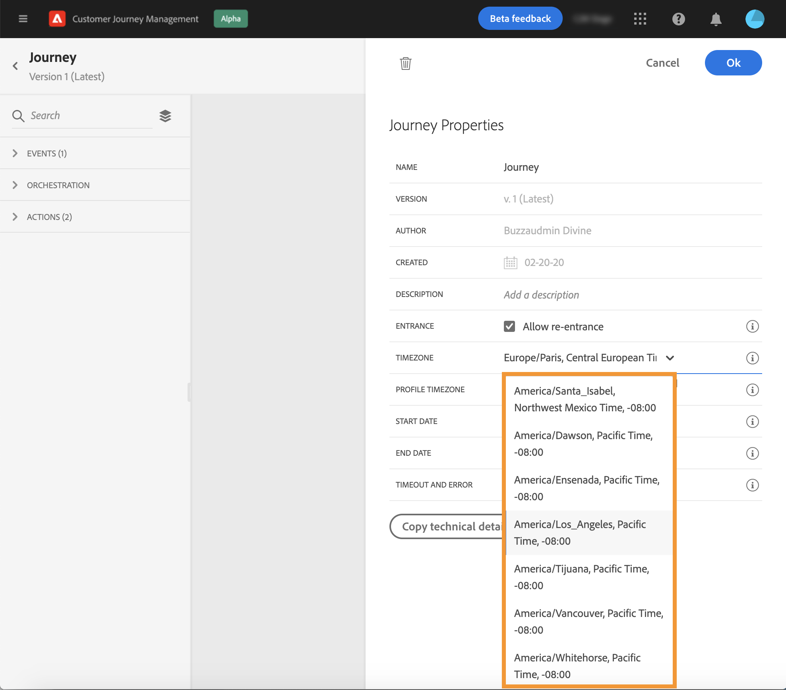
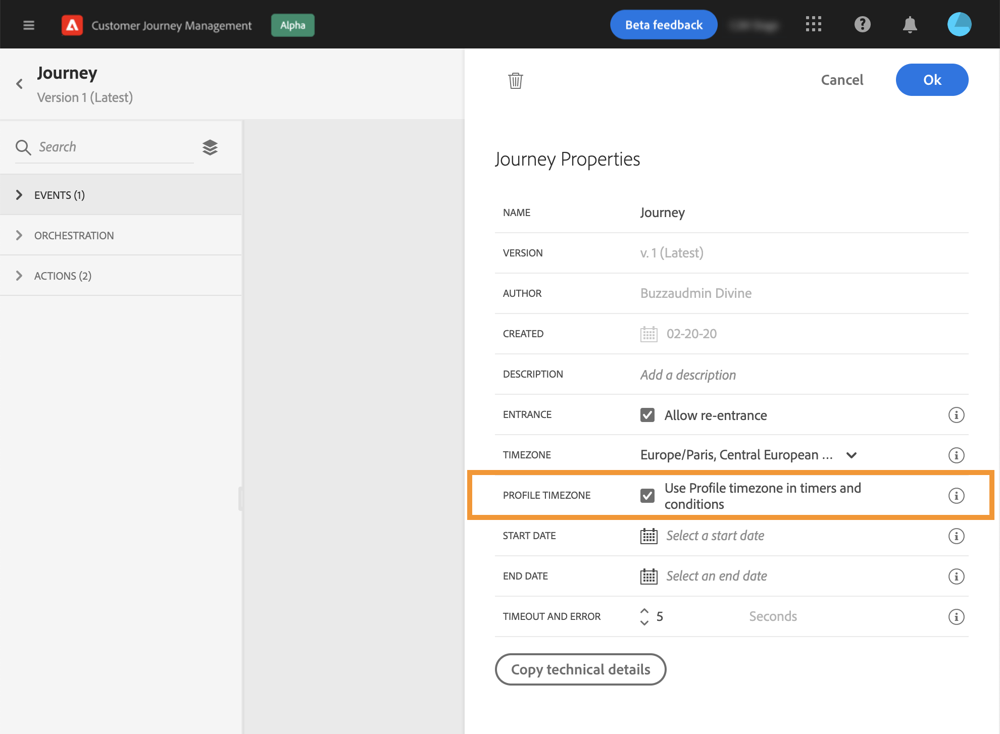

# Tijdzonebeheer {#timezone_management}

U kunt een tijdzone definiëren in het dialoogvenster [eigenschappen](../building-journeys/journey-gs.md#change-properties) van je reis.

Als u eigenschappen wilt openen, klikt u op het potloodpictogram rechtsboven in het scherm.

Deze tijdzone wordt gebruikt voor elke activiteit van de reis die een tijdselement bevat, zoals:

* [Tijdvoorwaarde](../building-journeys/condition-activity.md#time_condition)
* [Datumvoorwaarde](../building-journeys/condition-activity.md#date_condition)
* [Aangepast wachten](../building-journeys/wait-activity.md#custom)
* [Wachttijd voor vaste datum](../building-journeys/wait-activity.md#fixed_date)

U kunt een tijdzone selecteren of de tijdzone gebruiken die is gedefinieerd in het gebruikersprofiel.

>[!NOTE]
>
>De tijdzone van het profiel werkt met **timeZone** in het **Voorkeursdetails** veldgroep.

## Een vaste tijdzone definiëren {#fixed-timezone}

De tijdzone kan ook worden vastgesteld. Wis de vooraf gedefinieerde tijdzone en kies een tijdzone in de vervolgkeuzelijst. Als je een vaste tijdzone gebruikt, zal dat hetzelfde zijn voor iedereen die de reis binnenkomt.

Daartoe, in **[!UICONTROL Journey Properties]** selecteert u een tijdzone.

## Profielen gebruiken om de tijdzone voor het transport te definiëren {#timezone-from-profiles}

Als de entry-gebeurtenis van de reis een naamruimte heeft, wat betekent dat de reis de Real-time dienst van het Profiel van de Klant van Adobe Experience Platform kan bereiken, is de tijdzone vooraf gedefinieerd met die gespecificeerd in het profiel van de individuele die in de reis stroomt.

Als een tijdzone in Adobe Experience Platform-profiel is gedefinieerd, kan deze tijdens de reis worden opgehaald.

Als het profiel van het individu geen tijdzone bevat, wordt de opgehaalde tijdzone gedefinieerd in het tijdzoneveld.

Daartoe, in **[!UICONTROL Properties]**, controle **[!UICONTROL Use Profile timezone in waits and conditions]**.

## Tijdzones gebruiken in expressies {#timezone-in-expressions}

De begin- en einddatum van een reis kunnen niet worden gekoppeld aan een specifieke tijdzone. Ze worden automatisch gekoppeld aan de tijdzone van de instantie.
