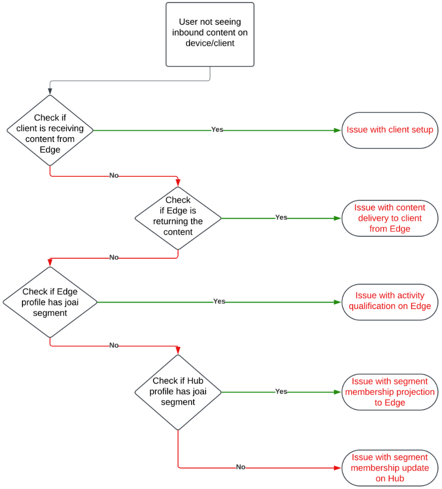
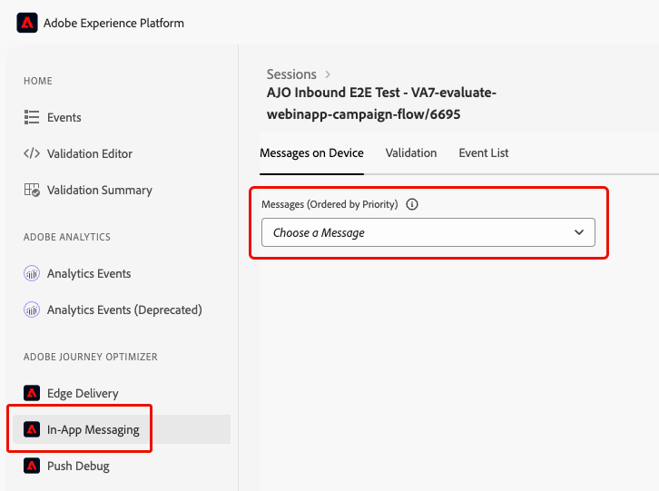

# Binnenkomende acties tijdens reizen oplossen {#troubleshooting-inbound-actions}

Binnenkomende acties, zoals In-app, Web, en code-gebaseerde ervaringen, zijn kritieke componenten van [!DNL Journey Optimizer] aangezien zij persoonlijke betrokkenheid met gebruikers tijdens hun reis toelaten. Onverwacht gedrag, zoals ontbrekende binnenkomende inhoud of doorlopende levering nadat een profiel de reis verlaat, kan echter voorkomen.

Deze gids verstrekt een geleidelijke proces om kwesties met betrekking tot binnenkomende acties in een reis te zuiveren, om u te helpen hen identificeren en oplossen onafhankelijk alvorens uit te gaan om te steunen.

<!--This guide addresses the two most common scenarios with inbound actions in a journey. They are as follows:

* A profile enters the inbound step, but the user does not receive the expected inbound content.
* A user continues to receive inbound content even after the profile exits the journey.
-->

## Vereisten {#prerequisites}

Controleer het volgende voordat u begint met het oplossen van problemen:

1. Opstelling een **Assurance** zitting. Leer hoe in de [[!DNL Adobe Experience Platform]  documentatie van Assurance &#x200B;](https://experienceleague.adobe.com/nl/docs/experience-platform/assurance/tutorials/using-assurance){target="_blank"}.

1. Navigeer naar de reis die de binnenkomende actie bevat om de reisnaam en versie-id op te halen.

   >[!NOTE]
   >
   >De identiteitskaart van de reisversie kan in URL na &quot;reis/&quot;worden gevonden (bijvoorbeeld: *86232fb1-2932-4036-8198-55dfec606fd7*).

   

1. Klik op de binnenkomende actie om de details ervan weer te geven. Haal het label en de id van de binnenkomende actie op.

   

1. Haal de profielnaamruimte en -id op om te bepalen bij welk profiel problemen optreden. Gebaseerd op uw configuratie, kan namespace ECID, e-mail, of klant identiteitskaart zijn Leer hoe te omhoog een profiel in de [&#x200B; documentatie van Experience Platform &#x200B;](https://experienceleague.adobe.com/nl/docs/experience-platform/profile/ui/user-guide#browse-identity){target="_blank"} kijken.

## Scenario 1: De gebruiker heeft niet de binnenkomende inhoud ontvangen {#scenario-1}

In dit scenario, is een profiel de binnenkomende actie in de reis ingegaan, maar zelfs na 30 minuten, verschijnt de overeenkomstige binnenkomende inhoud niet in het apparaat/de cliënt bij de stap van de opstellingstrekker.

### Voorcontroles {#pre-checks}

1. **Reis Binnenkomende dataset wordt toegelaten voor profielopname**

   De binnenkomende actie gebruikt de **Binnenkomende** dataset van de Reis voor de profielupdates tijdens uitvoering. Controleer of de gegevensset is ingeschakeld voor profielen in de huidige sandbox. [&#x200B; leer meer over datasets &#x200B;](../data/get-started-datasets.md)

2. **&#39;joai&#39;-identiteit gedefinieerd in platform-id&#39;s**

   De binnenkomende actie gebruikt **joai** namespace in het profiel `segmentMembership` voor het activeren van het profiel voor de binnenkomende stap. Controleer of deze is gedefinieerd in Platform-id&#39;s voor de sandbox. Leer meer op [&#x200B; Dienst van de Identiteit van Experience Platform &#x200B;](https://experienceleague.adobe.com/nl/docs/experience-platform/identity/home){target="_blank"}

### Foutopsporingsstappen {#debugging-steps}

In het onderstaande diagram ziet u de reeks stappen voor foutopsporing die u kunt volgen:

{width="70%" align="center"}

### Stap 1: Controleer of het apparaat of de client de inhoud van de Edge Network ontvangt {#step-1}

Begin door te controleren of het apparaat/de cliënt de verwachte inhoud krijgt.

>[!BEGINTABS]

>[!TAB  In-app kanaal ]

1. Ga naar [&#x200B; Assurance &#x200B;](https://experienceleague.adobe.com/nl/docs/experience-platform/assurance/tutorials/using-assurance){target="_blank"} zitting en selecteer de **[!UICONTROL In-App Messaging]** sectie van het linkerpaneel.

1. Klik in het tabblad **[!UICONTROL Messages on Device]** op de vervolgkeuzelijst **[!UICONTROL Messages]** .

   {width="80%"}

1. Zoek naar een bericht met de reisnaam gevolgd door &#39;- In-app bericht&#39;. Indien aanwezig betekent dit dat het bericht in de app aanwezig is op het apparaat/de client en dat het probleem gerelateerd kan zijn aan de trigger in de app.

1. Als het bericht niet wordt gevonden, is het bericht in de app niet ontvangen door het apparaat/de client. <!--Go to the [next step](#step-2) for further debugging.-->

>[!TAB  het kanaal van het Web ]

Bezoek de pagina en inspecteer het voorzien van een netwerklusje, of controleer de antwoordlading van Edge in de **[!UICONTROL Edge Delivery]** sectie van de [&#x200B; Assurance &#x200B;](https://experienceleague.adobe.com/nl/docs/experience-platform/assurance/tutorials/using-assurance){target="_blank"} zitting.

>[!TAB  op code-Gebaseerd ervaringskanaal ]

Voer een curl verzoek uit gebruikend [&#x200B; Adobe API &#x200B;](https://developer.adobe.com/data-collection-apis/docs/api/) en controleer de antwoordlading van Edge in de **[!UICONTROL Edge Delivery]** sectie van de [&#x200B; Assurance &#x200B;](https://experienceleague.adobe.com/nl/docs/experience-platform/assurance/tutorials/using-assurance){target="_blank"} zitting.

>[!ENDTABS]

### Stap 2: Controleer of de Edge Network de inhoud retourneert {#step-2}

In deze stap moet u ervoor zorgen dat de Edge Network de verwachte inkomende inhoud retourneert die op het apparaat/de client moet worden gerenderd.

Wanneer een profiel een binnenkomende actie in een reis ingaat, wordt het automatisch gekwalificeerd in een speciaal publiekssegment (in **joai** namespace) die aan de binnenkomende reisactie beantwoorden.

Wanneer een cliënt een verzoek aan Edge Network voor een bepaald profiel en oppervlakte indient, kwalificeert het profiel om inhoud voor de binnenkomende reisacties te ontvangen die dat oppervlakte richten - slechts als het profiel momenteel een lid van het overeenkomstige **joai** segment is.

Voer de onderstaande stappen uit om fouten op te sporen in het Edge Network-gedrag.

1. Open de weergave **[!UICONTROL Edge Delivery]** in de Assurance-sessie. Deze weergave bevat informatie over de uitvoering van de binnenkomende actie op de Edge Network-server. Leer meer in de [&#x200B; documentatie van Experience Platform &#x200B;](https://experienceleague.adobe.com/nl/docs/experience-platform/assurance/view/edge-delivery){target="_blank"}.

1. Controleer of de Edge-activiteit die overeenkomt met de binnenkomende actie wordt vermeld in de secties **[!UICONTROL Qualified Activities]** of **[!UICONTROL Unqualified Activities]** .

    worden verzonden

   * Als in de **Gekwalificeerde sectie van Activiteiten**, het profiel voor de binnenkomende reisactie wordt gekwalificeerd, en de inhoud zou moeten zijn teruggekeerd.
   * Als in de **Ongekwalificeerde sectie van Activiteiten**, kwalificeerde het profiel niet voor de binnenkomende reisactie. Zie de redenen voor uitsluiting voor meer informatie.
   * Als in **geen van beide sectie**, of er een probleem met het publiceren van de binnenkomende reisactie aan Edge Network was, of de gevraagde oppervlakte URI niet de montages van de kanaalconfiguratie voor de binnenkomende actie aanpaste.

   >[!NOTE]
   >
   >Om uw activiteit van Edge in de **Assurance** zitting te vinden, zoek de activiteit waar **[!UICONTROL audienceNamespace]** **joai** is en **[!UICONTROL audienceSegmentId]** is &lt;*JourneyVersionID*>_&lt; *JourneyActionID*> (bijvoorbeeld: *86232fb1-2932-4 036-8198-55dfec606fd7_708f718d-8503-4427-ad8d-8e28979b554c*).

   {width="70%"}

1. Als uw activiteit in de **[!UICONTROL Unqualified Activities]** sectie is en de uitsluitingsreden *&quot;Segment is niet actief&quot;*, betekent het de leveringsserver van Edge Network denkt niet het profiel deel van het relevante **joai** publiekssegment uitmaakt.

   U kunt controleren of het **joai** segment in de mening van de de leveringsserver van Edge Network van het profiel aanwezig is door het **te openen segmentsMap** element van de sectie van het Profiel en het zoeken naar de aanwezigheid van **joai** segmentidentiteitskaart.

1. Als de de leveringsserver van Edge Network niet het profiel zoals het zijn in het relevante **joai** segment bekijkt, ga naar de volgende stap.<!--use the Platform Profile viewer UI to check if the expected **joai** segment is in a realized state in the Edge profile. Learn more in the [Experience Platform Profile UI documentation](https://experienceleague.adobe.com/nl/docs/experience-platform/profile/ui/user-guide){target="_blank"}-->

### Stap 3: Controleer of het &#39;joai&#39;-publiek is doorgegeven aan de Edge Network {#step-3}

Deze stap moet verifiëren dat het profiel van Edge correct werd bijgewerkt toen het profiel de binnenkomende reisactie inging en het profiel in het overeenkomstige **joai** segment werd gekwalificeerd.

Wanneer een profiel in a **wordt gekwalificeerd joai** segment, wordt het profiel eerst bijgewerkt op de Hub en dan wordt het segmentlidmaatschap geprojecteerd aan het Profiel van Edge voor gebruik door de leveringsserver van Edge Network.

>[!NOTE]
>
>De propagatie van Hub aan Edge kan tot 15-30 minuten van het ogenblik vergen het profiel op de Hub wordt bijgewerkt.

Om de aanwezigheid van het **joai** segment in het 2&rbrace; attribuut van het profiel van Edge te controleren &lbrace;, volg hieronder de stappen.`segmentMembership`

1. Navigeer naar het menu **[!UICONTROL Customer]** > **[!UICONTROL Profiles]** in het navigatievenster [!DNL Journey Optimizer] links en blader naar het profiel met behulp van naamruimte en id. Leer meer op [&#x200B; Real-time Profielen van de Klant &#x200B;](../audience/get-started-profiles.md)

1. Selecteer de tab **[!UICONTROL Attributes]** en kies de weergave **[!UICONTROL Edge]** .

1. Klik op **[!UICONTROL View JSON]** om de JSON-weergave voor het profiel te openen.

   {width="80%"}

1. Ga naar het `segmentMembership` attribuut en controleer als segmentidentiteitskaart &lt; *JourneyVersionID>* _&lt; *JourneyActionID*> in **aanwezig is joai** namespace en als in **[!UICONTROL realized]** <!--or existing?--> status.

   {width="90%"}

   * Indien aanwezig, werd het **joai** segment dat aan de binnenkomende reisactie beantwoordt correct verspreid aan het profiel van Edge.

   * Als het profiel niet wordt weergegeven in de weergave van de Edge Network-leveringsserver, kan er een probleem optreden met de manier waarop de leveringsserver het Edge-profiel laadt.

1. Als **joai** segmentidentiteitskaart niet aanwezig is of in **[!UICONTROL exited]** staat is, betekent het het (nog) niet aan Edge werd verspreid.

   Wacht 15 tot 30 minuten op de `segmentMembership` waarden die van de Hub aan Edge moeten worden verspreid. Ga naar de volgende stap als deze nog niet aanwezig is.

<!--The next step is to check whether the audience segment is present in the profile on the Hub.-->

### Stap 4: Controle als het &quot;joai&quot;publieksenlidmaatschap in het profiel op de Hub aanwezig is {#step-4}

Deze stap moet verifiëren dat het profiel van de Hub correct werd bijgewerkt toen het profiel de binnenkomende reisactie inging en het profiel in het overeenkomstige **joai** segment werd gekwalificeerd.

>[!NOTE]
>
>De opname van het **joai** segmentlidmaatschap in het profiel van de Hub kan tot 15-30 minuten van het ogenblik vergen het profiel de binnenkomende reisactie inging.

Om de aanwezigheid van het **joai** segment in het 2&rbrace; attribuut van het profiel van de Hub te controleren &lbrace;, volg hieronder de stappen.`segmentMembership`

1. Navigeer naar het menu **[!UICONTROL Customer]** > **[!UICONTROL Profiles]** in het navigatievenster [!DNL Journey Optimizer] links en blader naar het profiel met behulp van naamruimte en id. Leer meer op [&#x200B; Real-time Profielen van de Klant &#x200B;](../audience/get-started-profiles.md)

1. Selecteer de tab **[!UICONTROL Attributes]** en kies de weergave **[!UICONTROL Hub]** .

1. Klik op **[!UICONTROL View JSON]** om de JSON-weergave voor het profiel te openen.

1. Ga naar het **[!UICONTROL segmentMembership]** attribuut en controleer als segmentidentiteitskaart &lt; *JourneyVersionID>* _&lt; *JourneyActionID*> in **aanwezig is joai** namespace en als in **[!UICONTROL realized]** <!--or existing?--> status.

   * Indien aanwezig, werd het **joai** segment dat aan de binnenkomende reisactie beantwoordt correct opgenomen in het profiel van de Hub.

   * Als het Edge-profiel na ten minste 30 minuten niet wordt gevonden, kan er een probleem optreden met het Edge-projectiesysteem.

1. Als **joai** segmentidentiteitskaart niet aanwezig is of in **[!UICONTROL exited]** staat is, betekent het het profiel (nog) niet correct gekwalificeerd in het speciale **joai** publiekssegment op ingang in de overeenkomstige binnenkomende reisactie was.

   Wacht 15 tot 30 minuten op de `segmentMembership` waarden die in het profiel op de Hub moeten worden opgenomen. Ga naar de volgende stap als deze nog niet aanwezig is.

### Stap 5: als de client/het apparaat nog steeds niet de verwachte inhoud krijgt {#step-5}

Als u alle bovenstaande stappen hebt doorlopen en het verwachte gedrag niet ziet nadat u 30 tot 60 minuten hebt gewacht voordat het segmentlidmaatschap naar de Edge Network is doorgegeven, neemt u contact op met de klantenservice van Adobe of uw Adobe-vertegenwoordiger.

Neem zoveel mogelijk details op van de foutopsporingsstappen, zoals:

* de stap waar u het onverwachte gedrag ziet;
* de reisversie-ID;
* de actie-ID van de reis;
* de volledige Assurance trace;
* de JSON-weergave van het Edge-profiel;
* de JSON-weergave van het hubprofiel;
* enz.

## Scenario 2: De gebruiker ontvangt nog steeds de binnenkomende inhoud {#scenario-2}

Dit scenario is het omgekeerde van [&#x200B; Scenario 1 &#x200B;](#scenario-1): het profiel heeft de reis verlaten, maar de gebruiker ontvangt nog de binnenkomende inhoud.

Nochtans, wanneer een profiel een reis weggaat, zou het niet meer voor de **joai** publiekssegmenten moeten kwalificeren die aan de binnenkomende acties in de reis beantwoorden.

Ga door de zelfde het zuiveren stappen zoals voor [&#x200B; Scenario 1 &#x200B;](#debugging-steps) om te controleren of het profiel van de Hub, het profiel van Edge en de leveringsserver van Edge Network correct op de status van het segmentlidmaatschap van het relevante **joai** segment wijzen, en of de cliënt niet meer de binnenkomende inhoud ontvangt.

<!--

## Reference Section {#reference-section}

- [Assurance Setup Guide](https://experienceleague.adobe.com/nl/docs/experience-platform/assurance/tutorials/using-assurance)
- [[!DNL Adobe Experience Platform] Documentation](https://experienceleague.adobe.com/docs/experience-platform/home.html)
- [Streaming Ingestion APIs Troubleshooting](https://experienceleague.adobe.com/docs/experience-platform/ingestion/streaming/troubleshooting.html?lang=nl-NL)

-->
