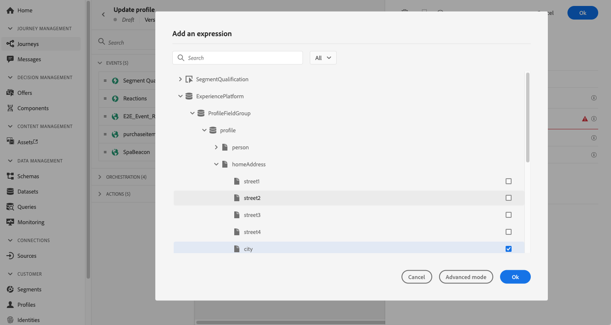
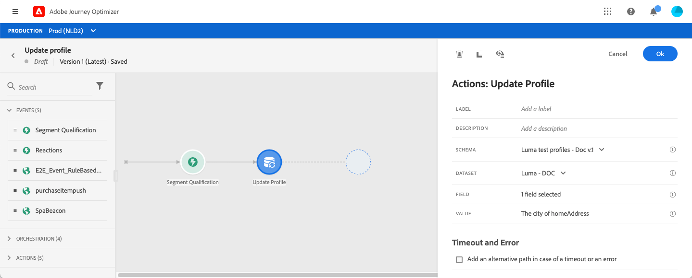

# Profiel bijwerken {#update-profile}

Met de actieactiviteit **[!UICONTROL Update profile]** kunt u een bestaand Adobe Experience Platform-profiel bijwerken met informatie die afkomstig is van de gebeurtenis, een gegevensbron of het gebruik van een specifieke waarde.

## Belangrijke opmerkingen

* De handeling **Update profile** kan alleen worden gebruikt tijdens reizen die beginnen met een gebeurtenis met een naamruimte.
* Met de handeling worden alleen bestaande velden bijgewerkt. Er worden geen nieuwe profielvelden gemaakt.
* U kunt de handeling **Update profile** niet gebruiken om ervaringsgebeurtenissen te genereren, bijvoorbeeld een aankoop.
* Net als bij andere acties kunt u een alternatief pad definiëren in het geval van een fout of time-out. U kunt geen twee acties parallel plaatsen.
* Het updateverzoek dat naar het Platform wordt verzonden, wordt snel verzonden, maar niet onmiddellijk/binnen een seconde. Het duurt normaal een paar seconden, maar soms nog meer zonder garantie. Als een handeling bijvoorbeeld &#39;field 1&#39; gebruikt die is bijgewerkt met een handeling Profiel bijwerken die eerder is geplaatst, mag u niet verwachten dat &#39;field 1&#39; wordt bijgewerkt in de handeling.
* Gegevensbronnen hebben een begrip van cacheduur, op het niveau van de gebiedsgroep. Als u tijdens een rit een profielveld wilt gebruiken dat onlangs is bijgewerkt, moet u zorgvuldig een zeer korte cache-duur definiëren.

## De testmodus {#using-the-test-mode} gebruiken

In de testmodus wordt de profielupdate niet gesimuleerd. De update wordt uitgevoerd op het testprofiel.

Alleen testprofielen kunnen een reis maken in de testmodus. U kunt een nieuw testprofiel maken of een bestaand profiel omzetten in een testprofiel. In het Platform van de Ervaring van Adobe, kunt u profielattributen via csv- dossierinvoer of API vraag bijwerken. Een eenvoudigere methode is om een **Actie-activiteit van het Update profiel** te gebruiken en het booleaanse veld van het testprofiel te wijzigen van false in true.

Raadpleeg deze [sectie](../building-journeys/creating-test-profiles.md#create-test-profiles-csv) voor meer informatie over de manier waarop u een bestaand profiel in een testprofiel kunt omzetten.

## De profielupdate gebruiken

1. Ontwerp uw reis door met een gebeurtenis te beginnen. Zie deze [sectie](../building-journeys/journey.md).

1. Plaats in de sectie **Actie** van het palet de **Actie bijwerken** op het canvas.

   

1. Selecteer een schema in de lijst.

1. Klik op **Fields** om het gebied te selecteren u wilt bijwerken. Er kan slechts één veld worden geselecteerd.

   

1. Selecteer een gegevensset in de lijst. De selectie van de dataset zal bepalen waar de nieuwe waarde van het profielgebied zal worden opgeslagen.

1. Klik op het veld **Waarde** om de waarde te definiëren die u wilt gebruiken:

   * Met de eenvoudige expressieeditor kunt u een veld uit een gegevensbron of uit de binnenkomende gebeurtenis selecteren.

      

   * Als u een specifieke waarde wilt definiëren of geavanceerde functies wilt gebruiken, klikt u op **Geavanceerde modus**.

      

Het **Update profiel** wordt nu gevormd.

