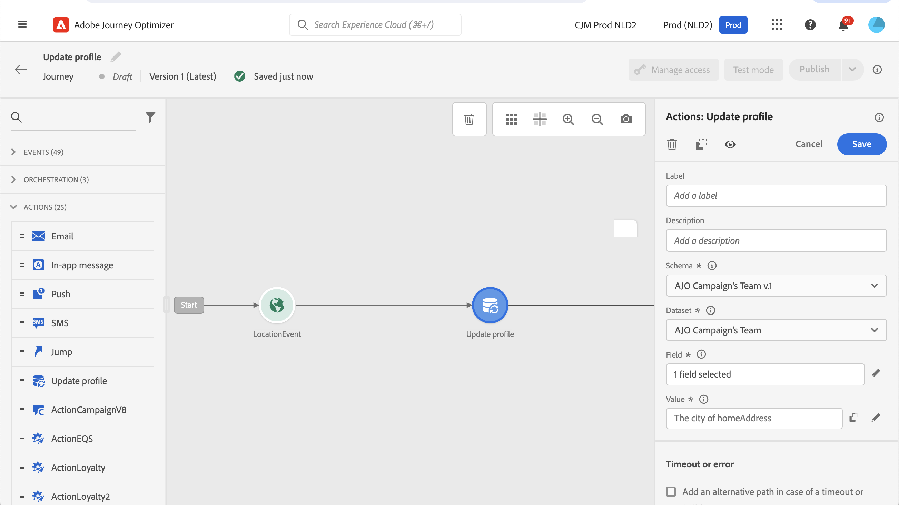

# Profiel bijwerken {#update-profile}

>[!CONTEXTUALHELP]
>id="ajo_journey_update_profiles"
>title="Profielactiviteit bijwerken"
>abstract="Met de actie Profiel bijwerken kunt u een bestaand Adobe Experience Platform-profiel bijwerken met informatie die afkomstig is van de gebeurtenis, een gegevensbron of een specifieke waarde gebruiken."

Met de **[!UICONTROL Update Profile]** -actieactiviteit kunt u een bestaand Adobe Experience Platform-profiel bijwerken met informatie die afkomstig is van een gebeurtenis, gegevensbron of met een specifieke waarde.

## Belangrijkste concepten {#key-concepts}

* De **actie van het Profiel van de Update** kan slechts in reizen worden gebruikt die een namespace hebben.
* Met de handeling worden alleen bestaande velden bijgewerkt. Er worden geen nieuwe profielvelden gemaakt.
* U kunt niet de **actie van het Profiel van de Update gebruiken** om ervaringsgebeurtenissen, bijvoorbeeld een aankoop te produceren.
* Net als bij andere acties kunt u een alternatief pad definiëren in het geval van een fout of time-out. U kunt geen twee acties parallel plaatsen.
* Het updateverzoek dat naar Adobe Experience Platform wordt verzonden, is onmiddellijk of binnen een seconde. Het duurt normaal een paar seconden, maar soms nog meer zonder garantie. Dientengevolge, bijvoorbeeld, als een actie &quot;gebied 1&quot;gebruikt dat door een **wordt bijgewerkt actie van het Profiel van de Update** wordt geplaatst juist vóór, zou u niet moeten verwachten dat &quot;gebied 1&quot;in de actie zal worden bijgewerkt.
* De **het profiel van de Update** activiteit steunt geen gebieden XDM die als opsommingen of voorgestelde waarden worden bepaald.
* De **[!UICONTROL Update profile]** activiteit werkt slechts de [ Opslag van het Profiel ](https://experienceleague.adobe.com/docs/experience-platform/profile/home.html#profile-data-store){target="_blank"} bij, niet het meer van Gegevens.

## Selectie gegevensset {#dataset-selection}

De **activiteit van het Profiel van de Update** vereist een specifieke dataset om updates op te slaan. Aangezien deze activiteit slechts de opslag van het Profiel (niet Datalake) bijwerkt, zouden alle updates in een profiel-toegelaten dataset specifiek moeten worden bewaard die voor **wordt aangewezen de acties van het Profiel van de Update**. Het gebruiken van een dataset die voor partij of het stromen ingeslikt wordt gebruikt zal in onlangs onberen gegevens resulteren die de veranderingen beschrijven die door de **actie van het Profiel van de Update** worden aangebracht.

Bovendien, vereist de **activiteitenconfiguratie van het Profiel van de 0} Update {geen identiteit namespace.** Als dusdanig, zorg ervoor dat de geselecteerde dataset het zelfde **Gebruik van de Identiteit namespace** dat door de actie werd gebruikt die de reis lanceerde aangezien het dit namespace is deze updates zullen gebruiken. De identiteitskaart kan ook door de geselecteerde dataset worden gebruikt. Als u geen gegevensset selecteert met de juiste naamruimte of met een identiteitskaart, mislukt de activiteit Profiel bijwerken.

## De profielupdate gebruiken

1. Ontwerp uw reis door met een gebeurtenis te beginnen. Zie deze [ sectie ](../building-journeys/journey.md).

1. In de **sectie van de Actie** van het palet, laat vallen de **activiteit van het Profiel van de Update** in het canvas.

   

1. Selecteer een schema in de lijst.

1. Klik op **Gebied** om het gebied te selecteren u wilt bijwerken. Er kan slechts één veld worden geselecteerd.

   

1. Selecteer een gegevensset in de lijst.

   >[!NOTE]
   >
   >De **actie van het Profiel van de Update** werkt de profielgegevens in real time bij, maar het werkt geen datasets bij. De datasetselectie is nodig aangezien het profiel een verslag met betrekking tot een dataset is.

1. Klik op het **gebied van de Waarde** om de waarde te bepalen u wilt gebruiken:

   * Met de eenvoudige expressieeditor kunt u een veld uit een gegevensbron of uit de binnenkomende gebeurtenis selecteren.

     

   * Als u een specifieke waarde of hefboomwerking geavanceerde functies wilt bepalen, selecteer **Geavanceerde wijze**.

     

Het **Profiel van de Update** wordt nu gevormd.

## De testmodus gebruiken {#using-the-test-mode}

In de testmodus wordt het profiel niet bijgewerkt. De update wordt uitgevoerd op het testprofiel.

Alleen testprofielen kunnen een reis maken in de testmodus. U kunt een nieuw testprofiel maken of een bestaand profiel omzetten in een testprofiel. In Adobe Experience Platform kunt u profielkenmerken bijwerken via een CSV-bestand importeren of API-aanroepen. Een eenvoudigere methode moet een **actie van het Profiel van de Update** gebruiken en het de actiesector veranderen van het de profielbooleaanse gebied van de test van vals in waar.

Voor meer informatie over hoe te om een bestaand profiel in een testprofiel te veranderen, verwijs naar deze [ sectie ](../audience/creating-test-profiles.md#create-test-profiles-csv).
