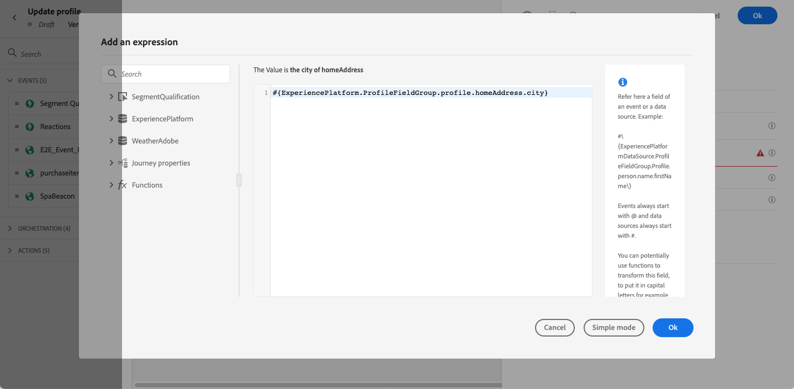

# Profiel bijwerken {#update-profile}

>[!CONTEXTUALHELP]
>id="ajo_journey_update_profiles"
>title="Profielactiviteit bijwerken"
>abstract="Met de actie Profiel bijwerken kunt u een bestaand [!DNL Adobe Experience Platform] -profiel bijwerken met informatie die afkomstig is van de gebeurtenis, een gegevensbron of een specifieke waarde gebruiken."

Gebruik de **[!UICONTROL Update Profile]** -actieactiviteit om een bestaand [!DNL Adobe Experience Platform] -profiel te verrijken of te corrigeren terwijl een klant een reis maakt. U kunt veldwaarden instellen die afkomstig zijn van een reisgebeurtenis, een geconfigureerde gegevensbron of een statische waarde, zodat u de profielgegevens nauwkeurig en handelbaar kunt houden zonder het canvas van de reis te verlaten. Alvorens deze activiteit te vormen, herzie [&#x200B; guardrails en beperkingen &#x200B;](#guardrails) die van toepassing zijn.

## Selectie gegevensset {#dataset-selection}

De **[!UICONTROL Update Profile]** -activiteit vereist een speciale dataset om updates op te slaan. Aangezien deze activiteit slechts de [&#x200B; Opslag van het Profiel &#x200B;](https://experienceleague.adobe.com/docs/experience-platform/profile/home.html#profile-data-store){target="_blank"} (niet Datalake) bijwerkt, zouden alle updates in a [&#x200B; profiel-toegelaten dataset &#x200B;](https://experienceleague.adobe.com/en/docs/experience-platform/catalog/datasets/user-guide#enable-profile){target="_blank"} specifiek moeten worden bewaard die voor **[!UICONTROL Update Profile]** acties wordt aangewezen.

>[!CAUTION]
>
>Gebruik geen dataset die ook voor partij of het stromen opname wordt gebruikt. Bij andere insluitingsbewerkingen worden de wijzigingen overschreven die door de handeling **[!UICONTROL Update Profile]** zijn aangebracht, waardoor de profielkenmerken verdwijnen of terugkeren naar de vorige waarden. Als u dit gedrag waarneemt, verifieer in Adobe Experience Platform dat geen andere opname aan de zelfde dataset schrijft. Voor het oplossen van problemenstappen, zie [&#x200B; Oplossende mislukkingen van de profielupdate in Adobe Journey Optimizer &#x200B;](https://experienceleague.adobe.com/en/docs/experience-cloud-kcs/kbarticles/ka-26352){target="_blank"}.

Bovendien, vereist de **[!UICONTROL Update Profile]** activiteitenconfiguratie geen [&#x200B; identiteit namespace &#x200B;](https://experienceleague.adobe.com/en/docs/experience-platform/identity/features/namespaces){target="_blank"}. Als dusdanig, zorg ervoor dat de geselecteerde dataset het zelfde **[!UICONTROL Identity namespace]** gebruikt dat door de actie werd gebruikt die de reis lanceerde aangezien het deze namespace is deze updates zullen gebruiken. De identiteitskaart kan ook door de geselecteerde dataset worden gebruikt. Als u geen gegevensset selecteert met de juiste naamruimte voor identiteit of met een identiteitsoverzicht, mislukt de activiteit van **[!UICONTROL Update Profile]** .

## De activiteit Profiel bijwerken configureren {#use-profile-update}

Volg de onderstaande stappen om de **[!UICONTROL Update Profile]** activiteit in uw reis te vormen.

1. Begin uw reis te ontwerpen. Leer meer in [&#x200B; creeer uw eerste reis &#x200B;](../building-journeys/journey-gs.md).

1. Verplaats de **[!UICONTROL Action]** -activiteit in de sectie **[!UICONTROL Update Profile]** van het palet naar het canvas.

   

1. Selecteer een schema in de lijst.

   >[!NOTE]
   >
   >Alleen velden die al voorkomen in het geselecteerde XDM-profielschema zijn beschikbaar voor selectie. Als het gewenste veld niet in de lijst staat, voegt u het eerst toe aan het schema in Adobe Experience Platform.

1. Klik op **[!UICONTROL Field]** om het veld te selecteren dat u wilt bijwerken.

    bij te werken

1. Selecteer een gegevensset in de lijst.

   >[!NOTE]
   >
   >Met de handeling **[!UICONTROL Update Profile]** worden de profielgegevens in realtime bijgewerkt, maar worden gegevenssets niet bijgewerkt. De datasetselectie is nodig aangezien het profiel een verslag met betrekking tot een dataset is.

1. Klik in het veld **[!UICONTROL Value]** om de waarde te definiëren die u wilt gebruiken:

   * Met de eenvoudige expressieeditor kunt u een veld uit een gegevensbron of uit de binnenkomende gebeurtenis selecteren.

     

   * Selecteer [**[!UICONTROL Advanced mode]**](expression/expressionadvanced.md) als u een specifieke waarde wilt definiëren of geavanceerde functies wilt gebruiken.

     

1. Als u aanvullende profielkenmerken in dezelfde handeling wilt bijwerken, klikt u op **[!UICONTROL Update another field]** en herhaalt u de selectie van het veld en de waarde. U kunt maximaal vijf veld-/waardeparen toevoegen in één **[!UICONTROL Update Profile]** -actie. Zie [&#x200B; Grafieken en beperkingen &#x200B;](#guardrails).

De **[!UICONTROL Update Profile]** -activiteit is nu geconfigureerd.

## De profielupdate testen {#using-the-test-mode}

Houd er rekening mee dat in [&#x200B; testmodus &#x200B;](testing-the-journey.md) de profielupdates onmiddellijk van kracht worden op het testprofiel en niet worden gesimuleerd.

Alleen testprofielen kunnen een reis maken in de testmodus. U kunt een nieuw testprofiel maken of een bestaand profiel omzetten in een testprofiel. In [!DNL Adobe Experience Platform] kunnen profielkenmerken worden bijgewerkt via een CSV-bestand importeren of API-aanroepen. Een sneller alternatief is het gebruik van een **[!UICONTROL Update Profile]** -activiteit binnen de rit zelf om het booleaanse veld voor het testprofiel in te stellen op true.

Voor meer informatie over hoe te om een bestaand profiel in een testprofiel te veranderen, verwijs naar deze [&#x200B; sectie &#x200B;](../audience/creating-test-profiles.md#create-test-profiles-csv).

## Afvoerkanalen en beperkingen {#guardrails}

* De **[!UICONTROL Update Profile]** actie kan slechts in reizen worden gebruikt die a [&#x200B; namespace &#x200B;](../event/about-creating.md#select-the-namespace) hebben.
* Met de handeling worden alleen bestaande velden bijgewerkt. Er worden geen nieuwe profielvelden gemaakt.
* De handeling ondersteunt alleen eenvoudige veldtypen (tekenreeks, getal, boolean). XDM-velden die zijn gedefinieerd als opsommingen, voorgestelde waarden, objectarrays of complexe verzamelingen (bijvoorbeeld productlijsten), worden niet ondersteund.
* U kunt niet de **[!UICONTROL Update Profile]** actie gebruiken om [&#x200B; ervaringsgebeurtenissen &#x200B;](../event/about-events.md), zoals een aankoop te produceren.
* Als een andere actie, kunt u een [&#x200B; alternatieve weg in het geval van fout of onderbreking &#x200B;](using-the-journey-designer.md#paths) bepalen. Twee handelingen kunnen niet parallel worden geplaatst.
* Profielupdates zijn niet gegarandeerd direct beschikbaar stroomafwaarts op dezelfde reis. Plaats een handeling waarmee een veld direct wordt gelezen na de handeling **[!UICONTROL Update Profile]** die deze schrijft, omdat de bijgewerkte waarde mogelijk nog niet wordt gereflecteerd.
* De **[!UICONTROL Update profile]** activiteit werkt slechts de [&#x200B; Opslag van het Profiel &#x200B;](https://experienceleague.adobe.com/docs/experience-platform/profile/home.html#profile-data-store){target="_blank"} bij, niet het meer van Gegevens.
* U kunt maximaal vijf veld-/waardeparen bijwerken in één **[!UICONTROL Update Profile]** -actie. Gebruik de knop **[!UICONTROL Update another field]** om meer paren toe te voegen.
* Voor betere prestaties groepeert u meerdere kenmerkupdates in één **[!UICONTROL Update Profile]** -actie in plaats van één actie per kenmerk te gebruiken.
