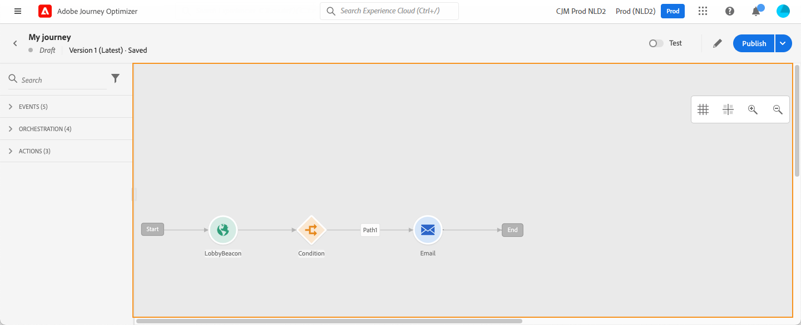
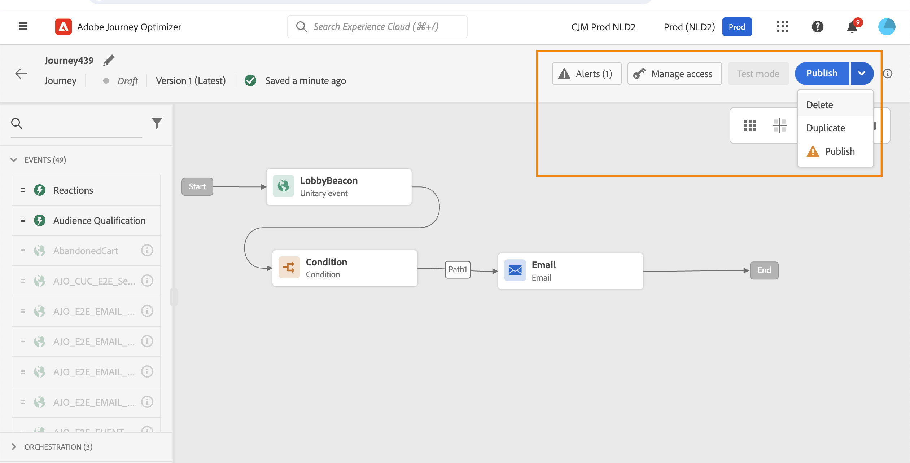

# Uw reis ontwerpen {#design-your-journey}

>[!CONTEXTUALHELP]
>id="ajo_journey_canvas"
>title="Uw reis ontwerpen"
>abstract="Met de interface voor reizen kunt u activiteiten van het palet gemakkelijk naar het canvas slepen. U kunt ook dubbelklikken op een activiteit om deze in het canvas toe te voegen bij de volgende beschikbare stap."

[!DNL Adobe Journey Optimizer] bevat een omnichannel orchestration canvas dat marketers in staat stelt marketingactiviteiten te harmoniseren met een-op-een-klantenservice. Met de gebruikersinterface kunt u activiteiten van het palet naar het canvas slepen om uw reis te maken. U kunt ook op een activiteit dubbelklikken om deze in het canvas toe te voegen, bij de volgende beschikbare stap.

Gebeurtenissen, organisatie en activiteiten hebben een specifieke rol en plaats in het proces. De activiteiten worden gerangschikt: wanneer een activiteit wordt gebeëindigd, gaat de stroom verder en verwerkt de volgende activiteit, etc.

## Aan de slag met het ontwerpen van de reis {#gs-journey-design}

Het **palet** is op de linkerkant van het scherm. Alle beschikbare activiteiten worden gesorteerd in verscheidene categorieën: [&#x200B; Gebeurtenissen &#x200B;](#jo-event), [&#x200B; Orchestration &#x200B;](#jo-orch) en [&#x200B; Acties &#x200B;](#jo-actions). U kunt de verschillende categorieën uit- of samenvouwen door op de naam ervan te klikken. Als u een activiteit wilt gebruiken tijdens uw reis, sleept u deze van het palet naar het canvas.

Bij het starten van een nieuwe rit worden elementen die niet op het canvas kunnen worden neergezet als de eerste stap, verborgen. Dit heeft betrekking op alle handelingen, de activiteit van de aandoening, de wachttijd en de reactie.

Met het pictogram **[!UICONTROL Filter items]** in de linkerbovenhoek kunt u de volgende filters weergeven:

* **toon slechts beschikbare punten**: verberg of toon niet beschikbare elementen in het palet, bijvoorbeeld de gebeurtenissen die een verschillende namespace dan degenen gebruiken die in uw reis worden gebruikt. Niet-beschikbare items worden standaard verborgen. Als u deze weergeeft, worden ze grijs weergegeven.

* **toon slechts recente punten**: dit filter staat u toe om de laatste vijf gebruikte gebeurtenissen en acties slechts te tonen, naast uit-van-de-doos degenen. Dit geldt specifiek voor elke gebruiker. Standaard worden alle items weergegeven.

U kunt ook het veld **[!UICONTROL Search]** gebruiken. Alleen gebeurtenissen en handelingen worden gefilterd.

Het **canvas** is de centrale streek in de reisontwerper. Het is in deze streek dat u uw activiteiten kunt laten vallen en hen vormen. Klik op een activiteit op het canvas om deze te configureren. Dit opent de ruit van de activiteitenconfiguratie op de rechterkant.

De **toolbar**, die in de hoogste juiste hoek van het canvas wordt gevestigd, staat u toe om het net te tonen/te verbergen, binnen te zoemen/uit en een het schermschot van het canvas te downloaden. Zie deze [&#x200B; sectie &#x200B;](../building-journeys/journey-properties.md#timeout_and_error).

<!--and show/hide timeout and error paths-->

{width="70%" align="left"}

De **ruit van de activiteitenconfiguratie** verschijnt wanneer u op een activiteit in het palet klikt. Vul de vereiste velden in. Klik op het pictogram **[!UICONTROL Delete]** om de activiteit te verwijderen. Klik op **[!UICONTROL Cancel]** om de wijzigingen te annuleren of op **[!UICONTROL Ok]** om te bevestigen. Als u activiteiten wilt verwijderen, kunt u ook één activiteit (of meerdere activiteiten) selecteren en op de backspace-toets drukken. Als u op de escape-toets drukt, wordt het deelvenster voor activiteitenconfiguratie gesloten.

Velden met het kenmerk Alleen-lezen zijn standaard verborgen. Om read-only gebieden te tonen, klik **read-only gebieden** pictogram bij de bovenkant verlaten van de ruit van de activiteitenconfiguratie tonen. Deze instelling geldt voor alle activiteiten op alle reizen.

Afhankelijk van de reisstatus kunt u verschillende handelingen op uw reis uitvoeren met behulp van de knoppen in de rechterbovenhoek: **[!UICONTROL Publish]**, **[!UICONTROL Duplicate]**, **[!UICONTROL Delete]**, **[!UICONTROL Test mode]**, **[!UICONTROL Manage access]**, **[!UICONTROL Alerts]** . Deze knoppen worden weergegeven wanneer er geen activiteit is geselecteerd. Sommige knoppen worden contextueel weergegeven. De knop Logbestand van de testmodus verschijnt wanneer de testmodus wordt geactiveerd.

## Begin uw reis {#start-your-journey}

Wanneer je je reis ontwerpt, wil je je eerst afvragen hoe profielen de reis zullen betreden.

Er zijn twee mogelijkheden:

1. **Begin met een gebeurtenis**: wanneer een reis wordt geplaatst om aan gebeurtenissen te luisteren, gaan de individuen de reis **unitatically** in real time in. Berichten die in uw reis zijn opgenomen, worden verzonden naar de persoon die momenteel op reis gaat. [&#x200B; Leer meer over gebeurtenissen &#x200B;](../event/about-events.md)

1. **Begin met Gelezen Publiek**: u kunt uw reis plaatsen om aan [!DNL Adobe Experience Platform] publiek te luisteren. In dit geval betreden alle personen die tot het opgegeven publiek behoren de reis. Berichten die deel uitmaken van uw reis worden verzonden naar de personen die tot het publiek behoren. Leer meer over [&#x200B; leest publiek &#x200B;](read-audience.md). Voor meer informatie over hoe te om publiek in Journey Optimizer te produceren en te richten, verwijs naar [&#x200B; deze sectie &#x200B;](../audience/about-audiences.md).

## De volgende stappen definiëren{#define-next-steps}

Na uw eerste gebeurtenis of Lees publiek, kunt u de verschillende activiteiten combineren om uw scenario&#39;s met meerdere stappen voor meerdere kanalen samen te stellen. Kies in het palet de gewenste stappen.

### Gebeurtenissen{#jo-event}

Gebeurtenissen zijn de aanleiding voor een persoonlijke reis, zoals een online aankoop. Wanneer iemand een reis binnengaat, beweegt hij als individu en bewegen geen twee individuen zich met dezelfde snelheid of langs dezelfde weg.

Wanneer u uw reis met een gebeurtenis begint, wordt de reis teweeggebracht wanneer de gebeurtenis wordt ontvangen. Elke persoon op de reis volgt dan, individueel, de volgende stappen die in uw reis worden bepaald.

U kunt **verscheidene gebeurtenissen** in uw reis toevoegen, zolang zij zelfde namespace gebruiken. Gebeurtenissen worden vooraf geconfigureerd. [&#x200B; leer meer over reisgebeurtenissen &#x200B;](about-journey-activities.md#event-activities)

U kunt de gebeurtenis van de Reactie van de a **&#x200B;**&#x200B;na een bericht ook toevoegen om op het volgen van gegevens met betrekking tot het bericht te reageren. Op deze manier kunt u bijvoorbeeld een ander bericht verzenden als de persoon het vorige bericht heeft geopend of erin heeft geklikt. [&#x200B; Leer meer over reactiegebeurtenissen &#x200B;](reaction-events.md).

De gebeurtenisactiviteit van de Kwalificatie van het publiek van het gebruik **om individuen te maken ingaan of zich voorwaarts in een reis die op** kijkposten en uitgang wordt gebaseerd. [!DNL Adobe Experience Platform] U kunt alle nieuwe zilverklanten een reis maken en gepersonaliseerde berichten verzenden. Leer meer in deze [&#x200B; sectie &#x200B;](audience-qualification-events.md).

### Orchestratie{#jo-orch}

Orchestratieactiviteiten zijn verschillende omstandigheden die helpen de volgende stap in de reis te bepalen.

Van de orkestactiviteiten, gebruik de **Gelezen activiteit van het Publiek** om uw reis te plaatsen om aan een [!DNL Adobe Experience Platform] publiek te luisteren. [&#x200B; leer meer over de Gelezen activiteit van het Publiek &#x200B;](read-audience.md).

Met de andere activiteiten kunt u voorwaarden aan uw reis toevoegen om meerdere paden te definiëren, een wachttijd in te stellen voordat u de volgende activiteit uitvoert of uw reis beëindigen. [&#x200B; Leer meer over orkestactiviteiten &#x200B;](about-journey-activities.md#orchestration-activities).

### Acties{#jo-actions}

Handelingen zijn wat u wilt doen als gevolg van een of andere trigger, zoals het verzenden van een bericht. Het is het traject dat de klant ervaart. Dit kan een e-mail-, SMS- of pushbericht zijn of een actie van een derde, zoals een Slack-bericht.

Met de activiteiten van de kanaalhandeling kunt u een bericht opnemen dat is ontworpen in [!DNL Journey Optimizer] . [&#x200B; leer meer over de activiteiten van de kanaalactie &#x200B;](journey-action.md)

Gebruik aangepaste handelingen vanuit de actieactiviteiten om berichten te verzenden met systemen van derden. [&#x200B; Leer meer over douaneacties &#x200B;](about-journey-activities.md#action-activities).

## Alternatieve paden toevoegen {#paths}

U kunt een fallback-actie definiëren in het geval van een fout of time-out voor de volgende reisactiviteiten: **[!UICONTROL Condition]** en **[!UICONTROL Action]** .

Als u een fallback-actie voor een activiteit wilt toevoegen, schakelt u het vakje **[!UICONTROL Add an alternative path in case of a timeout or an error]** in de eigenschappen activity in: na de activiteit wordt een ander pad toegevoegd. De onderbrekingsduur wordt bepaald door Admin gebruikers in de [&#x200B; reiseigenschappen &#x200B;](../building-journeys/journey-properties.md). Als het bijvoorbeeld te lang duurt om een e-mail te verzenden of als er een fout optreedt, kunt u een pushmelding verzenden.

Met verschillende activiteiten (gebeurtenis, handeling, wachten) kunt u verschillende paden na deze toevoegen. Plaats de cursor op de activiteit en klik op het plusteken (+). Alleen gebeurtenis- en wachtactiviteiten kunnen parallel worden ingesteld. Als meerdere gebeurtenissen parallel worden ingesteld, is het gekozen pad het eerste evenement dat plaatsvindt.

Wanneer u naar een gebeurtenis luistert, raden we u aan niet oneindig op de gebeurtenis te wachten. Het is niet verplicht, maar slechts een goede praktijk. Als u slechts gedurende een bepaalde tijd naar een of meerdere gebeurtenissen wilt luisteren, plaatst u een of meerdere gebeurtenissen en een wachtbewerking parallel. Zie [deze sectie](../building-journeys/general-events.md#events-specific-time).

Als u het pad wilt verwijderen, plaatst u de cursor op het pad en klikt u op het pictogram **[!UICONTROL Delete path]** .

 te verwijderen

Wanneer twee activiteiten op het canvas worden losgekoppeld, wordt een waarschuwing weergegeven. Plaats de cursor op het waarschuwingspictogram om het foutbericht weer te geven. U kunt het probleem verhelpen door de ontkoppelde activiteit te verplaatsen en deze aan te sluiten op de vorige activiteit.

## Kopiëren en plakken {#copy-paste}

U kunt een of meer activiteiten van een reis kopiëren en deze in dezelfde of een andere reis plakken. Dit staat u toe om tijd te besparen als u talrijke activiteiten wilt hergebruiken die reeds in een vorige reis zijn gevormd.

**Belangrijke nota&#39;s**

* U kunt kopiëren/plakken over verschillende tabbladen en browsers. U kunt alleen activiteiten kopiëren/plakken binnen dezelfde instantie.
* U kunt een gebeurtenis niet kopiëren/plakken als de doelreis een gebeurtenis heeft die een andere naamruimte gebruikt.
* Geplakte activiteiten kunnen verwijzen naar gegevens die niet aanwezig zijn in de doelreis, bijvoorbeeld als u kopieert/plakt over verschillende sandboxen. Controleer altijd op fouten en breng de vereiste aanpassingen aan.
* Houd er rekening mee dat u een handeling niet ongedaan kunt maken. Als u geplakte activiteiten wilt verwijderen, moet u deze selecteren en verwijderen. Zorg er daarom voor dat u alleen de activiteiten selecteert die u nodig hebt voordat u deze kopieert.
* U kunt activiteiten van om het even welke reis kopiëren, zelfs degenen die in read-only zijn.
* U kunt elke activiteit selecteren, ook als deze niet is gekoppeld. Gekoppelde activiteiten blijven gekoppeld na het plakken.

Hier volgen de stappen voor het kopiëren/plakken van activiteiten:

1. Open een reis.
1. Selecteer de activiteiten die u wilt kopiëren door de muis te verplaatsen terwijl u klikt. U kunt op elke activiteit ook klikken terwijl het drukken van de **CTRL/sleutel van het Bevel**. Het gebruik **CTRL/Bevel + A** als u alle activiteiten wilt selecteren.
   
1. Pers **CTRL/Bevel + C**.
Als u één activiteit wilt slechts kopiëren, kunt u op het klikken en het **pictogram van het Exemplaar** in de bovenkant verlaten van de ruit van de activiteitenconfiguratie gebruiken.
   
1. In om het even welke reis, druk **CTRL/Bevel + V** om de activiteiten te kleven zonder hen aan een bestaand knooppunt te verbinden. Geplakte activiteiten worden in dezelfde volgorde geplaatst. Na het plakken blijven de activiteiten geselecteerd zodat u ze gemakkelijk kunt verplaatsen. U kunt de curseur op een lege plaatshouder ook plaatsen en **CTRL/Bevel + V** raken. Geplakte activiteiten worden gekoppeld aan het knooppunt.
   
