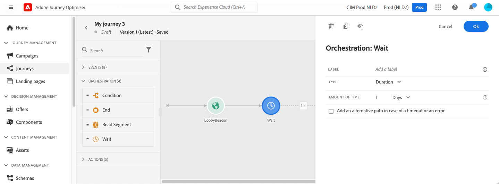

# Wachtactiviteit{#wait-activity}

>[!CONTEXTUALHELP]
>id="ajo_journey_wait"
>title="Wachtactiviteit"
>abstract="Als u wilt wachten alvorens de volgende activiteit in de weg uit te voeren, kunt u een Wacht activiteit gebruiken. Hiermee kunt u bepalen wanneer de volgende activiteit wordt uitgevoerd. Er zijn drie opties beschikbaar: duur, vaste datum en aangepaste datum."

Als u wilt wachten voordat u de volgende activiteit in het pad uitvoert, kunt u een **[!UICONTROL Wait]** activiteit. Hiermee kunt u bepalen wanneer de volgende activiteit wordt uitgevoerd. Er zijn drie opties beschikbaar:

* [Duur](#duration)
* [Vaste datum](#fixed_date)
* [Aangepast](#custom)

<!--* [Email send time optimization](#email_send_time_optimization)-->

## Informatie over de activiteit Wachten{#about_wait}

Hier is hoe de wacht voorrang krijgt wanneer u verscheidene wacht parallel gebruikt. Als zij de zelfde tijdconfiguratie en een verschillende maar overlappende voorwaarde hebben, hierboven gepositioneerde wachttijd zal aan voorrang gegeven zijn. De eerste wachttijd is bijvoorbeeld &#39;een vrouw zijn&#39; en de tweede wachttijd is &#39;een VIP zijn&#39;. De eerste wachtbewerking krijgt prioriteit.

Houd er ook rekening mee dat als twee verschillende wachttijden parallel lopen, de eerste prioriteit krijgt, ongeacht de verticale positie. Bijvoorbeeld, als een 1 uur wacht boven is en een 30 minuut wacht onder is, na 30 minuten, zal het 30 minieme ogenblik worden verwerkt.

>[!NOTE]
>
>De maximale wachttijd is 30 dagen.
>
>In de testmodus **[!UICONTROL Wait time in test]** parameter staat u toe om de tijd te bepalen dat elke wachttijdactiviteit zal duren. De standaardtijd is 10 seconden. Zo krijgt u de testresultaten snel. Zie [deze pagina](../building-journeys/testing-the-journey.md)

## Wachttijd duur{#duration}

Selecteer de duur van de wachttijd voordat de volgende activiteit wordt uitgevoerd.

## Wachttijd voor vaste datum{#fixed_date}

Selecteer de datum voor de uitvoering van de volgende activiteit.

## Aangepast wachten{#custom}

Met deze optie kunt u een aangepaste datum definiëren, bijvoorbeeld 12 juli 2020 om 17.00 uur, met een geavanceerde expressie die is gebaseerd op een veld dat afkomstig is van een gebeurtenis of gegevensbron. U kunt hiermee geen aangepaste duur definiëren, bijvoorbeeld 7 dagen. De expressie in de expressie-editor moet een dateTimeOnly-indeling hebben. Zie [Journey Orchestration-documentatie](expression/expressionadvanced.md). Voor meer informatie over de DateTimeOnly-indeling raadpleegt u [Journey Orchestration-documentatie](expression/data-types.md).

>[!NOTE]
>
>U kunt een dateTimeOnly-expressie gebruiken of een functie gebruiken om om te zetten in een dateTimeOnly. Bijvoorbeeld: toDateTimeOnly(@{Event.biedOpened.activity.endTime}), waarbij het veld in de gebeurtenis de vorm 2016-08-12T09 heeft:46:06Z.
>
>De **tijdzone** wordt verwacht in de eigenschappen van uw reis. Dientengevolge, is het vandaag van de interface niet mogelijk om bij volledig ISO-8601 timestamp het mengen tijd en tijdzonecompensatie zoals 2016-08-12T09 direct te richten:46:06.982-05. Zie [deze pagina](../building-journeys/timezone-management.md).

<!--## Email send time optimization{#email_send_time_optimization}

This type of wait uses a score calculated in Adobe Experience Platform. The score calculates the propensity to click or open an email in the future based on past behavior. Note that the algorithm calculating the score needs a certain amount of data to work. As a result, when it does not have enough data, the default wait time will apply. At publication time, you’ll be notified that the default time applies.

>[!NOTE]
>
>The first event of your journey must have a namespace.
>
>This capability is only available after an **[!UICONTROL Email]** activity. You need to have Adobe Campaign Standard.

1. In the **[!UICONTROL Amount of time]** field, define the number of hours to consider to optimize email sending.
1. In the **[!UICONTROL Optimization type]** field, choose if the optimization should increase clicks or opens.
1. In the **[!UICONTROL Default time]** field, define the default time to wait if the predictive send time score is not available.

    >[!NOTE]
    >
    >Note that the send time score can be unavailable because there is not enough data to perform the calculation. In this case, you will be informed, at publication time, that the default time applies.

-->
