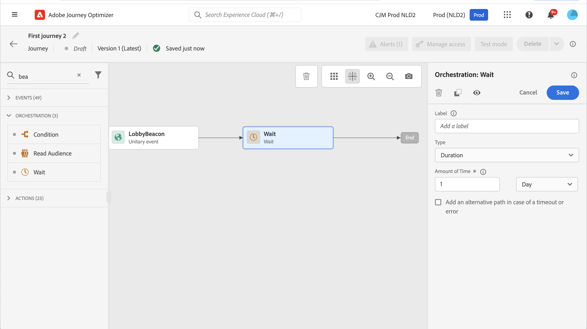

# Wacht op activiteit {#wait-activity}

>[!CONTEXTUALHELP]
>id="ajo_journey_wait"
>title="Wacht op activiteit"
>abstract="Als u wilt wachten alvorens de volgende activiteit in de weg uit te voeren, kunt u een Wacht activiteit gebruiken. Hiermee kunt u bepalen wanneer de volgende activiteit wordt uitgevoerd. Er zijn twee opties beschikbaar: duur en aangepast."

U kunt een **[!UICONTROL Wait]** activiteit om een duur te bepalen alvorens de volgende activiteit uit te voeren. De volgende opties zijn beschikbaar:

* [Duur](#duration)
* [Aangepast](#custom)

<!--
* [Email send time optimization](#email_send_time_optimization)
* [Fixed date](#fixed_date) 
-->

## Informatie over de activiteit Wachten {#about_wait}

De maximale wachttijd is 29 dagen. In de testmodus **[!UICONTROL Wait time in test]** parameter staat u toe om de tijd te bepalen dat elke wachttijdactiviteit zal duren. De standaardtijd is 10 seconden. Zo krijgt u de testresultaten snel. Meer informatie in [deze pagina](../building-journeys/testing-the-journey.md).

Wees voorzichtig bij het gebruik van meerdere **Wachten** activiteiten op een reis, aangezien de totale reistijd 30 dagen bedraagt, wat betekent dat een profiel altijd buiten de reis zal vallen, maximaal 30 dagen nadat hij of zij de reis is binnengekomen. Meer informatie in [deze pagina](../building-journeys/journey-gs.md#global_timeout).

Een individu kan een **Wachten** alleen als zij voldoende tijd hebben om de wachttijd voor de 30 dagen durende reistijd af te ronden. Als u bijvoorbeeld twee **Wachten** het systeem detecteert dat de tweede **Wachten** activiteit eindigt na de periode van 30 dagen. De tweede **Wachten** deze activiteit zal derhalve worden genegeerd en de betrokkene zal de reis verlaten voordat hij of zij begint . In dat voorbeeld zal de klant in totaal 20 dagen op de reis blijven.

Een beste werkwijze om niet te gebruiken **Wachten** activiteiten om hertoetreding te blokkeren. Gebruik in plaats daarvan de opdracht **Hernieuwde toegang toestaan** optie op het niveau van de reiseigenschappen. Meer informatie in [deze pagina](../building-journeys/journey-gs.md#entrance).

## Wachten op duur {#duration}

Selecteer de duur van de wachttijd voordat de volgende activiteit wordt uitgevoerd. De maximale duur is 29 dagen.

<!--
## Fixed date wait{#fixed_date}

Select the date for the execution of the next activity.

-->

## Aangepast wachten {#custom}

Gebruik de **Aangepast** type om een douanedatum te bepalen, gebruikend een geavanceerde uitdrukking die op een gebied wordt gebaseerd dat van een gebeurtenis of een reactie van de douaneactie komt. U kunt een relatieve duur niet rechtstreeks definiëren, bijvoorbeeld 7 dagen, maar u kunt functies gebruiken om de duur te berekenen als dat nodig is (bijvoorbeeld 2 dagen na aankoop).

De expressie in de editor moet een `dateTimeOnly` gebruiken. Zie [deze pagina](expression/expressionadvanced.md). Voor meer informatie over de DateTimeOnly-notatie raadpleegt u [deze pagina](expression/data-types.md).

De beste manier is om aangepaste datums te gebruiken die specifiek zijn voor uw profielen en om te voorkomen dat voor iedereen dezelfde datum wordt gebruikt. Definieer bijvoorbeeld niet `toDateTimeOnly('2024-01-01T01:11:00Z')` maar eerder `toDateTimeOnly(@event{Event.productDeliveryDate})` die specifiek is voor elk profiel. Houd er rekening mee dat het gebruik van vaste datums problemen kan veroorzaken bij het uitvoeren van de reis.

>[!NOTE]
>
>U kunt een `dateTimeOnly` expressie of gebruik een functie om te zetten in een `dateTimeOnly`. Bijvoorbeeld: `toDateTimeOnly(@event{Event.offerOpened.activity.endTime})`, waarbij het veld in het geval de vorm 2023-08-12T09 heeft:46:06Z.
>
>De **tijdzone** wordt verwacht in de eigenschappen van uw reis. Als gevolg hiervan is het vanuit de gebruikersinterface niet mogelijk om rechtstreeks te wijzen naar een volledige ISO-8601 tijdstempelmixtijd en tijdzoneverschuiving zoals 2023-08-12T09:46:06.982-05. [Meer informatie](../building-journeys/timezone-management.md).

Om te bevestigen dat de wachttijdactiviteit zoals verwacht werkt, kunt u step gebeurtenissen gebruiken. [Meer informatie](../reports/query-examples.md#common-queries).

<!--## Email send time optimization{#email_send_time_optimization}

This type of wait uses a score calculated in Adobe Experience Platform. The score calculates the propensity to click or open an email in the future based on past behavior. Note that the algorithm calculating the score needs a certain amount of data to work. As a result, when it does not have enough data, the default wait time will apply. At publication time, you'll be notified that the default time applies.

>[!NOTE]
>
>The first event of your journey must have a namespace.
>
>This capability is only available after an **[!UICONTROL Email]** activity. You need to have Adobe Campaign Standard.

1. In the **[!UICONTROL Amount of time]** field, define the number of hours to consider to optimize email sending.
1. In the **[!UICONTROL Optimization type]** field, choose if the optimization should increase clicks or opens.
1. In the **[!UICONTROL Default time]** field, define the default time to wait if the predictive send time score is not available.

    >[!NOTE]
    >
    >Note that the send time score can be unavailable because there is not enough data to perform the calculation. In this case, you will be informed, at publication time, that the default time applies.

-->
