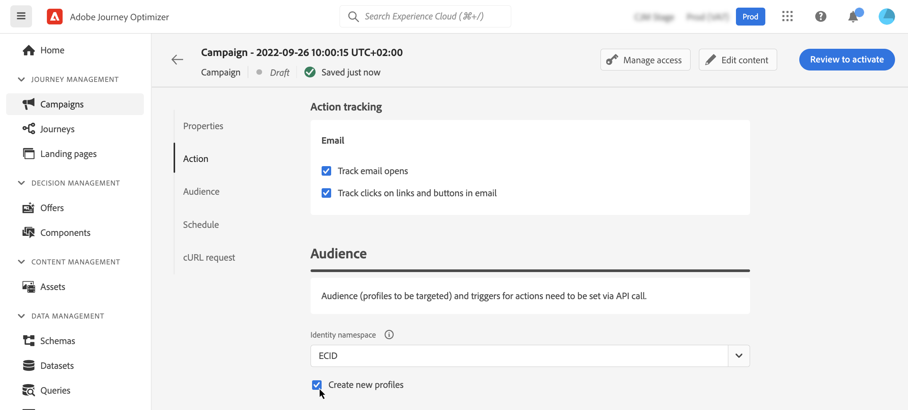

# Het publiek van de door de API geactiveerde campagne definiëren {#api-audience}

Gebruik het tabblad **[!UICONTROL Audience]** om het publiek van de campagne te definiëren.

## De doelgroep selecteren

**voor de Marketing API teweeggebrachte campagnes**, klik de **[!UICONTROL Select audience]** knoop om de lijst van beschikbare publiek van Adobe Experience Platform te tonen. [ leer meer over publiek ](../audience/about-audiences.md).

>[!IMPORTANT]
>
>Het gebruik van publiek en attributen van [ publiekssamenstelling ](../audience/get-started-audience-orchestration.md) is momenteel niet beschikbaar voor gebruik met het Schild van de Gezondheidszorg of Privacy en het Schild van de Veiligheid.

**voor Transactionele API teweeggebrachte campagnes**, moeten de gerichte profielen in de API vraag worden bepaald. Eén API-aanroep ondersteunt maximaal 20 unieke ontvangers. Elke ontvanger moet een unieke gebruikersnaam hebben. Dubbele gebruikers-id&#39;s zijn niet toegestaan. Leer meer in de [ Interactieve documentatie van API van de Uitvoering van het Bericht ](https://developer.adobe.com/journey-optimizer-apis/references/messaging/#tag/execution/operation/postIMUnitaryMessageExecution){target="_blank"}

## Selecteer het identiteitstype

Kies in het veld **[!UICONTROL Identity type]** het type sleutel dat u wilt gebruiken om de personen van het geselecteerde publiek te identificeren. U kunt een bestaand identiteitstype gebruiken of een nieuw type maken met de Adobe Experience Platform Identity Service. De standaard naamruimten van de Identiteit zijn vermeld op [ deze pagina ](https://experienceleague.adobe.com/en/docs/experience-platform/identity/features/namespaces#standard){target="_blank"}.

Per campagne is slechts één identiteitstype toegestaan. Individuen die tot een segment behoren dat niet het geselecteerde identiteitstype onder hun verschillende identiteiten heeft kunnen niet door de campagne worden gericht. Leer meer over identiteitstypes en namespaces in de [ documentatie van Adobe Experience Platform ](https://experienceleague.adobe.com/docs/experience-platform/identity/home.html?lang=nl){target="_blank"}.

## Het maken van profielen activeren tijdens de uitvoering van de campagne

In sommige gevallen moet u mogelijk transactieberichten verzenden naar profielen die niet in het systeem bestaan. Bijvoorbeeld als een onbekende gebruiker het wachtwoord op uw website opnieuw probeert in te stellen. Wanneer een profiel niet in de database bestaat, kunt u het door Journey Optimizer automatisch maken tijdens het uitvoeren van de campagne om het verzenden van het bericht naar dit profiel toe te staan.

Schakel de optie **[!UICONTROL Create new profiles]** in als u het maken van profielen tijdens de uitvoering van de campagne wilt activeren. Als deze optie is uitgeschakeld, worden onbekende profielen voor verzending geweigerd en mislukt de API-aanroep.

>[!IMPORTANT]
>
>Deze optie wordt verstrekt voor **zeer kleine verwezenlijking van het volumeprofiel** in een grote volumetransactie die gebruiksgeval verzendt, met het grootste deel van profielen reeds bestaand in platform.
>
>De onbekende profielen worden gecreeerd in de **Dataset van het Profiel van het Overseinen van AJO Interactive** dataset, in drie standaard namespace (e-mail, telefoon en ECID) respectievelijk voor elke uitgaande kanalen (E-mail, SMS en Duw). Als u echter een aangepaste naamruimte gebruikt, wordt de identiteit gemaakt met dezelfde aangepaste naamruimte.
>
>De verwezenlijking van het profiel bij uitvoering is niet beschikbaar voor [ Hoge campagnes van de Output ](../campaigns/api-triggered-high-throughput.md), aangezien deze wijze zich niet op de profielen van Adobe baseert: Het systeem zal niet controleren of de profielen bestaan of niet.

## Webhaken inschakelen {#webhook}

Voor Transactionele API getriggerde campagnes kunt u webhooks in staat stellen real-time feedback te ontvangen over de uitvoeringsstatus van uw berichten. Om dit te doen, knevel de **[!UICONTROL Enable webhooks]** optie om de gebeurtenissen van de leveringsstatus naar een gevormde webhaak te verzenden.

Webhaakconfiguraties worden centraal beheerd in het menu **[!UICONTROL Administration]** / **[!UICONTROL Channels]** / **[!UICONTROL Feedback Webhook]** . Vanaf dat punt kunnen beheerders webhaakeindpunten maken en bewerken. [ Leer hoe te om Terugkoppeling Webhooks ](../configuration/feedback-webhooks.md) tot stand te brengen

## Volgende stappen {#next}

Zodra uw campagneconfiguratie en inhoud klaar zijn, kunt u zijn uitvoering plannen. [Meer informatie](api-triggered-campaign-schedule.md)
