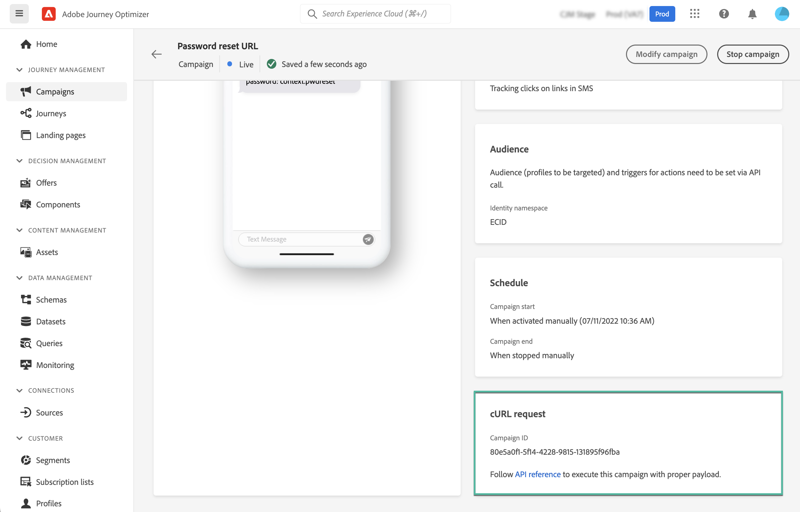

# Campagnes activeren met API&#39;s {#trigger-campaigns}

## Informatie over API-gestuurde campagnes {#about}

Met [!DNL Journey Optimizer]kunt u campagnes maken en deze vervolgens aanroepen vanuit een extern systeem op basis van een gebruikerstrigger met behulp van de [Interactive Message Execution REST API](https://developer.adobe.com/journey-optimizer-apis/references/messaging/#tag/execution). Dit staat u toe om diverse operationele en transactionele overseinenbehoeften zoals wachtwoordterugstellen, het teken van OTP, onder andere te behandelen.

Hiervoor moet u eerst een API-getriggerde campagne in Journey Optimizer maken en vervolgens de uitvoering starten via een API-aanroep.

Beschikbare kanalen voor API-getriggerde campagnes zijn E-mail, SMS en Push berichten.

## Een API-gestuurde campagne maken {#create}

Het proces om API-teweeggebrachte campagnes tot stand te brengen blijft het zelfde als geplande campagnes, behalve de publieksselectie die in de API lading wordt uitgevoerd. Gedetailleerde informatie over het maken van een campagne is beschikbaar in [deze sectie](create-campaign.md).

Voer de volgende stappen uit om een API-gestuurde campagne te maken:

1. Maak een nieuwe campagne met de **[!UICONTROL API-triggered]** type.

1. Kies het kanaal en de kanaaloppervlakte om uw bericht te verzenden, dan klik **[!UICONTROL Create]**.

   

1. Specificeer een titel en een beschrijving voor de campagne, dan vorm het te verzenden bericht.

   

   >[!NOTE]
   >
   >U kunt aanvullende gegevens doorgeven in de API-lading die u kunt gebruiken om uw bericht aan te passen. [Meer informatie](#contextual)
   >
   >Het gebruik van een groot aantal of zware contextafhankelijke gegevens in uw inhoud kan van invloed zijn op de prestaties.

1. In de **[!UICONTROL Audience]** , geeft u de naamruimte op die moet worden gebruikt om de personen van het segment te identificeren.

   De **[!UICONTROL Create new profiles]** kunt u automatisch profielen maken die niet in de database voorkomen. [Meer informatie over het maken van profielen tijdens de uitvoering van de campagne](#profile-creation)

1. De begin- en einddatum van de campagne configureren.

   Als u een specifieke begin en/of einddatum voor een campagne vormt, zal het niet buiten deze data worden uitgevoerd, en API vraag zal ontbreken als de campagne door APIs teweeggebracht wordt.

1. In de **[!UICONTROL cURL request]** van de **[!UICONTROL Campaign ID]** gebruiken in de API-payload.

   

1. Klikken **[!UICONTROL Review to activate]** om te controleren dat uw campagne correct wordt gevormd, dan activeer het.

## Contextafhankelijke kenmerken gebruiken in door API&#39;s geactiveerde campagnes {#contextual}

Met API-getriggerde campagnes kunt u aanvullende gegevens doorgeven in de API-lading en deze gebruiken in de campagne om uw bericht aan te passen.

Neem dit voorbeeld, waar de klanten hun wachtwoord willen terugstellen, en u hen een wachtwoord wilt verzenden terugstellen URL die in een derdehulpmiddel wordt geproduceerd. Met API-getriggerde campagnes kunt u deze gegenereerde URL doorgeven in de API-lading en deze gebruiken in de campagne om deze toe te voegen aan het bericht.

>[!NOTE]
>
>In tegenstelling tot voor profielen geschikte gebeurtenissen, worden de contextuele gegevens die in de REST API worden doorgegeven, gebruikt voor eenmalige communicatie en niet opgeslagen tegen profiel. Als er geen naamruimte is gevonden, wordt er maximaal een profiel gemaakt met de naamruimtedetails.

Als u deze gegevens in uw campagnes wilt gebruiken, moet u ze doorgeven aan de API-payload en ze in uw bericht toevoegen met de Expressieeditor. Om dit te doen, gebruik `{{context.<contextualAttribute>}}` syntaxis, waarbij `<contextualAttribute>` moet overeenkomen met de naam van de variabele in de API-lading die de gegevens bevat die u wilt doorgeven.

De `{{context.<contextualAttribute>}}` syntaxis wordt alleen toegewezen aan een gegevenstype String.

>[!IMPORTANT]
>
>De `context.system` syntaxis is beperkt tot Adobe intern gebruik en mag niet worden gebruikt om contextuele kenmerken door te geven.
Let op: voorlopig is er geen contextueel kenmerk beschikbaar voor gebruik in het menu Linkerspoor. De attributen moeten direct in uw verpersoonlijkingsuitdrukking worden getypt, zonder controle die door wordt uitgevoerd [!DNL Journey Optimizer].

## De campagne uitvoeren {#execute}

Om een API-teweeggebrachte campagne uit te voeren, moet u eerst zijn identiteitskaart terugwinnen en het in de API lading overgaan. Om dit te doen, open de campagne, dan kopieer-kleef identiteitskaart van **[!UICONTROL cURL request]** sectie.

Vervolgens kunt u deze id in uw API-payload gebruiken om de campagne te starten. Zie de [Interactieve API-documentatie voor berichtuitvoering](https://developer.adobe.com/journey-optimizer-apis/references/messaging/#tag/execution) voor meer informatie .

Merk op dat als u een specifieke begin en/of einddatum toen het creëren van de campagne hebt gevormd, het niet buiten deze data zal worden uitgevoerd, en API vraag zal ontbreken.

## Profiel maken tijdens uitvoering van de campagne {#profile-creation}

In sommige gevallen moet u mogelijk transactieberichten verzenden naar profielen die niet in het systeem bestaan. Bijvoorbeeld als een onbekende gebruiker het wachtwoord op uw website opnieuw probeert in te stellen.

Wanneer een profiel niet in de database bestaat, kunt u het door Journey Optimizer automatisch maken tijdens het uitvoeren van de campagne om het verzenden van het bericht naar dit profiel toe te staan.

>[!IMPORTANT]
>
>Deze functie is beschikbaar voor **zeer kleine profielcreatie** in een grote transactie die gebruikscase verzendt, met het grootste deel van profielen reeds bestaand in platform.

Als u het maken van profielen wilt activeren tijdens de uitvoering van de campagne, schakelt u het **[!UICONTROL Create new profiles]** in de **[!UICONTROL Audience]** sectie.

>[!NOTE]
>
>Onbekende profielen worden gemaakt in het dialoogvenster **Gegevensset AJO Interactive Messaging Profile** dataset, in drie standaardnaamruimte (e-mail, telefoon en ECID) respectievelijk voor elke uitgaande kanalen (E-mail, SMS en Push).
