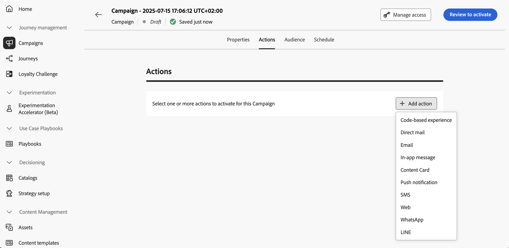

# Campagne configureren {#action-campaign-action}

Gebruik het tabblad **[!UICONTROL Actions]** om een kanaalconfiguratie voor uw bericht te selecteren en aanvullende instellingen te configureren, zoals het bijhouden van inhoud, het experimenteren met inhoud of meertalige inhoud.

1. **kies het kanaal**

   Navigeer naar de tab **[!UICONTROL Actions]** , klik op de knop **[!UICONTROL Add action]** en selecteer het communicatiekanaal.

   

   >[!NOTE]
   >
   >Voor meer informatie over de gesteunde kanalen, verwijs naar de lijst in deze sectie: [&#x200B; Kanalen in reizen &amp; campagnes &#x200B;](../channels/gs-channels.md#channels).
   >
   >Welke kanalen beschikbaar zijn, is afhankelijk van uw licentiemodel en invoegtoepassingen.

   Als u een binnenkomend kanaal selecteert (code-based ervaring, In-app bericht, de Actie van de Kaart van de Inhoud of van het Web), kunt u meer binnenkomende acties toevoegen - voor een totaal van tot 10 acties in één enkele campagne. [&#x200B; leer hoe &#x200B;](#multi-action)

1. **selecteer een kanaalconfiguratie**

   Een configuratie wordt bepaald door de Beheerder van het a [&#x200B; Systeem &#x200B;](../start/path/administrator.md). Het bevat alle technische parameters voor het verzenden van het bericht, zoals headerparameters, subdomein, mobiele apps, enzovoort. [&#x200B; leer hoe te de configuraties van het opstellingskanaal &#x200B;](../configuration/channel-surfaces.md)

   

1. **Optimalisering van de Leverage**

   Gebruik de sectie **[!UICONTROL Optimization]** om inhoudexperimenten uit te voeren, of hefboomwerking het richten van regels, of geavanceerde combinaties van zowel experimenteren als richten te gebruiken. Deze verschillende opties en de te volgen stappen zijn gedetailleerd in [&#x200B; deze sectie &#x200B;](gs-message-optimization.md).
<!--
1. **Create a content experiment**

    Use the **[!UICONTROL Content experiment]** section to define multiple delivery treatments in order to measure which one performs best for your target audience. Click the **[!UICONTROL Create experiment]** button then follow the steps detailed in this section: [Create a content experiment](../content-management/content-experiment.md).-->

1. **voeg meertalige inhoud** toe

   Gebruik de sectie **[!UICONTROL Languages]** om inhoud in meerdere talen binnen uw campagne te maken. Klik hiertoe op de knop **[!UICONTROL Add languages]** en selecteer de gewenste **[!UICONTROL Language settings]** . De gedetailleerde informatie over hoe te opstelling en gebruik meertalige mogelijkheden zijn beschikbaar in [&#x200B; deze sectie &#x200B;](../content-management/multilingual-gs.md).

Afhankelijk van het geselecteerde communicatiekanaal zijn aanvullende instellingen beschikbaar. Vouw de onderstaande secties uit voor meer informatie.

+++**pas het begrenzen regels** toe (E-mail, Directe post, Duw, SMS)

Selecteer in de vervolgkeuzelijst **[!UICONTROL Business rules]** een regel die is ingesteld om de afkapregels toe te passen op uw campagne. De reeksen van de kanaalregel van hefboomwerking staan u toe om frequentie het begrenzen door communicatie type te plaatsen om het overbelasten van klanten met gelijkaardige berichten te verhinderen. [&#x200B; leer hoe te met regelreeksen &#x200B;](../conflict-prioritization/rule-sets.md) werken

+++

+++**Overeenkomst van het Spoor** (E-mail, SMS).

In de sectie **[!UICONTROL Action tracking]** kunt u bijhouden hoe de ontvangers op uw e-mail- of SMS-berichten reageren. De resultaten van het bijhouden van de campagne zijn toegankelijk vanuit het campagnerapport nadat de campagne is uitgevoerd. [&#x200B; leer meer over campagnerapporten &#x200B;](../reports/campaign-global-report-cja.md)

+++

+++**laat Snelle leveringswijze** toe (Duw).

De snelle leveringswijze is een [!DNL Journey Optimizer] toe:voegen-op die zeer snelle pushbericht toestaat die in grote volumes door campagnes verzenden. Snelle levering wordt gebruikt wanneer de vertraging in berichtlevering zaken-kritiek is, wanneer u een dringende duwalarm op mobiele telefoons wilt verzenden, bijvoorbeeld een breekbericht aan gebruikers die uw nieuwskanaal app hebben geïnstalleerd. Leer hoe te om Snelle leveringswijze voor de Duw berichten [&#x200B; op deze pagina &#x200B;](../push/create-push.md#rapid-delivery) toe te laten.

Voor meer informatie over prestaties wanneer het gebruiken van Snelle leveringswijze, verwijs naar [&#x200B; het productbeschrijving van Adobe Journey Optimizer &#x200B;](https://helpx.adobe.com/nl/legal/product-descriptions/adobe-journey-optimizer.html){target="_blank"}.

+++

+++**wijs prioritaire scores** toe (Web, in-app, op code-gebaseerd)

Als u een prioriteitsscore toewijst aan de campagne, kunt u prioriteiten stellen aan een binnenkomende campagne wanneer er een opgelegde beperking zoals een frequentiegrens is. Voer een numerieke waarde in (tussen 0 en 100). Let op: hoe hoger het getal, hoe hoger de prioriteit. [&#x200B; Leer hoe te om prioritaire scores aan reizen &amp; campagnes toe te wijzen &#x200B;](../conflict-prioritization/priority-scores.md)

+++

+++**plaats extra leveringsregels** (de kaarten van de Inhoud)

Voor inhoudskaartcampagnes kunt u aanvullende leveringsregels inschakelen om de gebeurtenis(sen) en criteria te kiezen die uw bericht activeren. [&#x200B; leer hoe te om inhoudskaarten &#x200B;](../content-card/create-content-card.md) tot stand te brengen

+++

+++**bepaalt trekkers** (in-app)

Voor in-app berichten kunt u de knop **[!UICONTROL Edit triggers]** gebruiken om de gebeurtenis(sen) en criteria te kiezen die uw bericht activeren. [&#x200B; Leer hoe te om een In-app bericht &#x200B;](../in-app/create-in-app.md) te creëren

+++

## Meerdere binnenkomende handelingen toevoegen {#multi-action}

>[!CONTEXTUALHELP]
>id="ajo_multi_action"
>title="Meerdere binnenkomende handelingen toevoegen"
>abstract="U kunt meerdere binnenkomende acties selecteren in één campagne. Met deze functie kunt u meerdere op code gebaseerde ervaringen, In-app-berichten, Content Cards of Web-acties tegelijk op verschillende locaties aanbieden, waarbij elke actie een specifieke inhoud bevat."

Om uw campagneorchestratie te vereenvoudigen, kunt u verscheidene binnenkomende acties binnen één enkele campagne bepalen, elke actie die een specifieke inhoud bevat.

>[!NOTE]
>
>Dit vermogen is slechts beschikbaar voor binnenkomende kanalen. Uitgaande kanalen zoals E-mail worden momenteel niet ondersteund.

Dit vermogen laat u toe om diverse op code-gebaseerde ervaringen, In-app berichten, de Kaarten van de Inhoud of acties van het Web aan verschillende plaatsen tezelfdertijd te leveren, zonder de behoefte om veelvoudige campagnes te creëren. Het maakt de plaatsing van uw campagne gemakkelijker en staat voor vlottere rapportering toe, met alle gegevens geconsolideerd in één enkele campagne.

U kunt bijvoorbeeld een op code gebaseerde ervaring naar meerdere eindpunten met iets verschillende inhoud verzenden. Om dit te doen, creeer veelvoudige op code-gebaseerde acties binnen de zelfde campagne, elk met een verschillende eindpuntconfiguratie.

Voer de onderstaande stappen uit als u meerdere binnenkomende acties in een campagne wilt definiëren.

1. Selecteer een binnenkomende actie (**code-Gebaseerde ervaring**, **In-app bericht**, **Kaart van de Inhoud** of **Web**) van de **[!UICONTROL Actions]** sectie.

1. Selecteer de kanaalconfiguratie en definieer een specifieke inhoud voor die actie.

1. Gebruik de knop **[!UICONTROL Add action]** om een andere binnenkomende actie in de vervolgkeuzelijst te selecteren.

   {width="80%"}

1. Ga op dezelfde manier verder om meer acties toe te voegen. U kunt maximaal 10 binnenkomende acties toevoegen aan een campagne.

Zodra de campagne [&#x200B; levend &#x200B;](review-activate-campaign.md) is, worden alle acties gelijktijdig geactiveerd.

## Volgende stappen {#next}

Zodra uw actie van de campagne klaar is, kunt u zijn inhoud ontwerpen. [Meer informatie](campaign-content.md)
