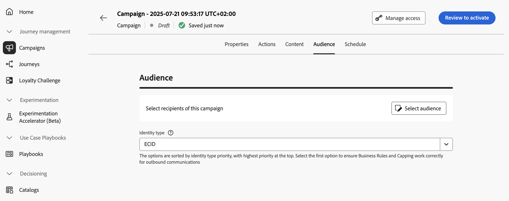

# Het doelpubliek van de actiecampagne definiëren {#action-campaign-audience}

Gebruik het tabblad **[!UICONTROL Audience]** om het publiek van de campagne te definiëren.

1. **De doelgroep selecteren**

   Klik voor Marketingcampagnes op de knop **[!UICONTROL Select audience]** om de lijst met beschikbare Adobe Experience Platform-doelgroepen weer te geven. [ leer meer over publiek ](../audience/about-audiences.md).

   >[!IMPORTANT]
   >
   >Het gebruik van publiek en attributen van [ publiekssamenstelling ](../audience/get-started-audience-orchestration.md) is momenteel niet beschikbaar voor gebruik met het Schild van de Gezondheidszorg of Privacy en het Schild van de Veiligheid.

1. **selecteer het identiteitstype**

   Kies in het veld **[!UICONTROL Identity type]** het type sleutel dat u wilt gebruiken om de personen van het geselecteerde publiek te identificeren. U kunt een bestaand identiteitstype gebruiken of een nieuw type maken met de Adobe Experience Platform Identity Service. De standaard naamruimten van de Identiteit zijn vermeld op [ deze pagina ](https://experienceleague.adobe.com/nl/docs/experience-platform/identity/features/namespaces#standard){target="_blank"}.

   Per campagne is slechts één identiteitstype toegestaan. Individuen die tot een segment behoren dat niet het geselecteerde identiteitstype onder hun verschillende identiteiten heeft kunnen niet door de campagne worden gericht. Leer meer over identiteitstypes en namespaces in de [ documentatie van Adobe Experience Platform ](https://experienceleague.adobe.com/docs/experience-platform/identity/home.html?lang=nl){target="_blank"}.

## Volgende stappen {#next}

Zodra het publiek van uw actiecampagne klaar is, kunt u de campagne plannen. [Meer informatie](campaign-schedule.md)
