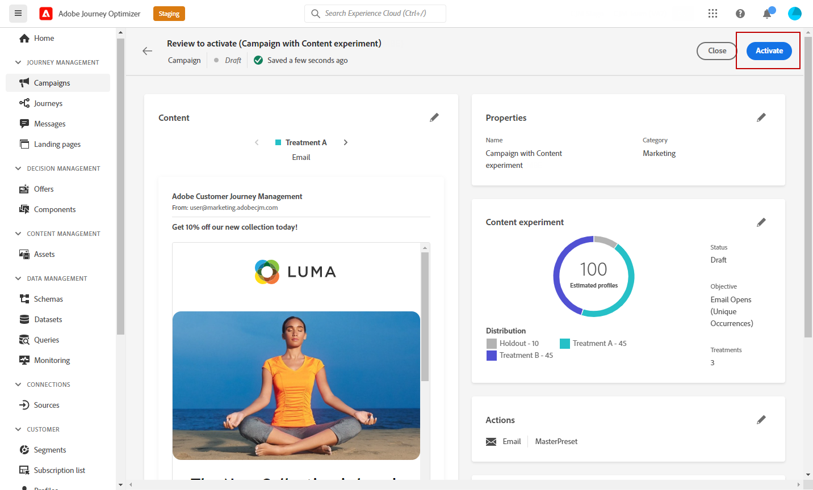

# Een inhoudexperiment maken {#content-experiment}

Met de functie voor het experimenteren met inhoud kunt u meerdere leveringsbehandelingen definiëren. Het betrokken publiek wordt willekeurig toegewezen aan elke behandeling om te bepalen welke behandeling het best presteert ten opzichte van de maatstaf van belangstelling. U kunt de inhoud, het onderwerp of de afzender van de e-mail variëren.

In het onderstaande voorbeeld is de leveringsdoelstelling opgesplitst in twee groepen, die elk 45% van de doelpopulatie vertegenwoordigen, en een holdoutgroep van 10%, die de levering niet zal ontvangen.

Elke persoon in het doelpubliek ontvangt één versie van het e-mailbericht, met een onderwerpregel die een van de volgende twee is:

* een rechtstreekse bevordering van een aanbod van 10 % voor de nieuwe collectie en een afbeelding .
* de andere reclame maakt alleen reclame voor een speciale aanbieding zonder de 10 % korting zonder afbeelding te specificeren .

Het doel is hier te zien of zullen de ontvangers met e-mail afhankelijk van het ontvangen experiment interactie aangaan. Daarom zullen wij **[!UICONTROL Email Opens]** als het primaire doel metrisch in deze Content Experiment.

## Uw campagne maken {#campaign-experiment}

1. Van de **[!UICONTROL Campaigns]** pagina, klikt u op **[!UICONTROL Create Campaign]**.

   

1. Selecteren **[!UICONTROL Email]** dan de **[!UICONTROL Surface]** wilt u gebruiken voor deze levering. Raadpleeg voor meer informatie de [Kanaaloppervlakken](../configuration/channel-surfaces.md) pagina.

   

1. Klik op **[!UICONTROL Create]**.

1. Stel de **[!UICONTROL Properties]** van je levering:
   * **[!UICONTROL Title]**
   * **[!UICONTROL Description]**
   * **[!UICONTROL Category]**: **[!UICONTROL Marketing]** / **[!UICONTROL Transactional]**

1. Als u uw inhoudexperiment wilt starten, schakelt u het **[!UICONTROL Content experiment]** optie. De **[!UICONTROL Content experiment]** wordt weergegeven.

   

1. Stel de **[!UICONTROL Audience]** en **[!UICONTROL Schedule]** parameters voor uw leveringen. [Meer informatie](create-campaign.md)

1. Klikken **[!UICONTROL Edit content]** om uw verschillende functies aan te passen **[!UICONTROL Treatments]**.

   

## Uw behandelingen maken {#treatment-experiment}

1. Van de **[!UICONTROL Edit content]** venster toevoegen **[!UICONTROL Subject line]** voor uw behandeling A e-mail en klik **[!UICONTROL Save]**.

   Voor deze behandeling specificeren wij het aanbod rechtstreeks in de onderwerpregel.

   

1. Klikken **[!UICONTROL Email designer]** om uw leveringen aan te passen.

   

1. Klik op **[!UICONTROL Save]** en terug naar de **[!UICONTROL Edit content]** venster om Behandeling B te maken.

1. Van de **[!UICONTROL More actions]** klikt u op **[!UICONTROL Duplicate]**.

   U kunt er ook voor kiezen een nieuwe behandeling helemaal opnieuw te starten door op de knop **[!UICONTROL Content experiment]** om toegang te krijgen tot de geavanceerde opties **[!UICONTROL Add treatment]**.

   

1. Wijzig de **[!UICONTROL Title]** van uw behandeling om ze beter te onderscheiden.

   

1. Selecteer de e-maillevering die is gekoppeld aan uw nieuwe versie **[!UICONTROL Treatment]**.

1. Voeg de **[!UICONTROL Subject line]** voor levering.

   Voor deze behandeling kiezen we ervoor het aanbod niet op te geven in het **[!UICONTROL Subject line]**.

   

1. Klikken **[!UICONTROL Email designer]** indien nodig de behandeling B verder aanpassen.

Zodra uw behandelingen gepersonaliseerd zijn, kunt u beginnen uw inhoudexperiment te vormen.

## Uw inhoudexperiment configureren {#configure-experiment}

1. Wanneer beide leveringen zijn gepersonaliseerd, wordt vanaf de **[!UICONTROL Edit content]** venster, selecteert u **[!UICONTROL Configure content experiment]**.

   

1. Selecteer de doelstellingen die u voor uw experiment wilt instellen.

   Voor ons experiment selecteren we **[!UICONTROL Email open]** om te testen of ontvangers hun e-mails zullen openen als de promotiecode zich op de onderwerpregel bevindt.

   

1. Kies of u een **[!UICONTROL Holdout]** groeperen voor levering. Deze groep zal geen inhoud van deze campagne ontvangen.

   Als u de schakelbalk inschakelt, neemt dit automatisch 10% van uw bevolking in beslag. Indien nodig kunt u dit percentage aanpassen.

   

1. Vervolgens kunt u een exact percentage toewijzen aan elk **[!UICONTROL Treatment]** of schakelt u gewoon de **[!UICONTROL Distribute evenly]** schakelbalk.

   

1. Klikken **[!UICONTROL Save]** wanneer uw configuratie wordt geplaatst.

1. Wanneer uw inhoudexperiment gereed is, kunt u klikken **[!UICONTROL Review to activate]** om een overzicht van de campagne weer te geven. Waarschuwt de weergave als een parameter onjuist is of ontbreekt.

   

1. Controleer of uw campagne correct is geconfigureerd en klik vervolgens op **[!UICONTROL Activate]** om te starten.

   

