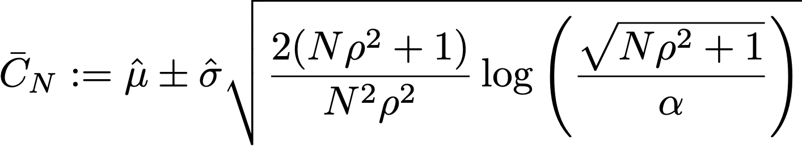

# Statistische berekeningen in het verslag over experimenten {#experiment-report-calculations}

>[!BEGINSHADEBOX]

Wat u in deze documentatie zult vinden:

* [Aan de slag met het experimenteren met inhoud](get-started-experiment.md)
* [Een inhoudexperiment maken](content-experiment.md)
* [Statistische berekeningen begrijpen](experiment-calculations.md)
* [Testrapporten configureren](reporting-configuration.md)
* **[Statistische berekeningen in het verslag over experimenten](experiment-report-calculations.md)**

>[!ENDSHADEBOX]

Op deze pagina worden de gedetailleerde statistische berekeningen beschreven die in het Experimentatierapport voor campagnes in Adobe Journey Optimizer worden gebruikt.

Deze pagina is bedoeld voor technische gebruikers.

## Omzetsnelheid

de omrekeningskoers of **gemiddelde**, μν voor elke behandeling `ν` in een experiment wordt gedefinieerd als een verhouding tussen de som van de metrische waarden en het aantal profielen dat aan die meting is toegewezen, Nν:

{width="125" align="center"}

Hier, Yν is de waarde van de objectieve metrische waarde voor elk profiel `i`, die is toegewezen aan een bepaalde variant *ν*. Wanneer de objectieve metrische waarde een &quot;unieke&quot; metrische waarde is, d.w.z., is het een telling van het aantal profielen dat een bepaalde actie doet, wordt dit getoond als omzettingspercentage, en geformatteerd als percentage. Wanneer metrisch een &quot;telling&quot;of &quot;totale waarde&quot;metrisch (b.v. opent e-mail, opbrengst respectievelijk) is, wordt de gemiddelde schatting voor metrisch getoond als &quot;Aantal per Profiel&quot;, of &quot;Waarde per Profiel&quot;.

Waar nodig wordt de standaardafwijking van het monster gebruikt met de uitdrukking:

{width="225" align="center"}

## Optillen {#lift}

De lift tussen een variant  *ν* en de besturingsvariant  *ν0* is de relatieve &quot;delta&quot; in omrekeningskoersen, gedefinieerd als de berekening hieronder waarbij de individuele omrekeningskoersen zoals hierboven gedefinieerd zijn. Dit wordt weergegeven als een percentage.

{width="125" align="center"}

 

## Intervallen voor altijd geldige betrouwbaarheidsintervallen voor individuele behandelingen

In het deelvenster Journey Experimentation worden &#39;op elk moment geldige&#39; betrouwbaarheidsintervallen (betrouwbaarheidsreeksen) weergegeven voor afzonderlijke behandelingen in een experiment.

De betrouwbaarheidsvolgorde voor een individuele variant `ν` staat centraal in de door Adobe gebruikte statistische methodologie. U kunt de definitie ervan vinden in [deze pagina](https://doi.org/10.48550/arXiv.2103.06476) (gereproduceerd uit [Waudby-Smith et al.]).

Als u een doelparameter wilt schatten `ψ` De conversiesnelheid van een variant in een experiment, de tweedeling tussen een sequentie van betrouwbaarheidsintervallen (CI&#39;s) voor &quot;vaste tijd&quot; en een tijduniforme betrouwbaarheidssequentie (CS) kunnen als volgt worden samengevat:

{width="500" align="center"}

Voor een regelmatig Interval van het Vertrouwen, de probabilistische garantie dat de doelparameter binnen de waaier van waarden Ċ ligtn is slechts geldig voor één vaste waarde van `n` waarbij `n` het aantal monsters). Omgekeerd geldt voor een betrouwbaarheidsreeks dat altijd/alle waarden van de monstergrootte `t`De &quot;werkelijke&quot; waarde van de parameter van belang ligt binnen de grenzen.

Dit heeft een aantal diepgaande implicaties die zeer belangrijk zijn voor online tests:

* Het CS kan desgewenst worden bijgewerkt wanneer nieuwe gegevens beschikbaar komen.
* Experimenten kunnen continu worden bewaakt, adaptief worden gestopt of voortgezet.
* De type-I fout wordt gecontroleerd bij alle stoptijden, met inbegrip van gegeven-afhankelijke tijden.

Adobe maakt gebruik van Asymptotic Betrouwbaarheidssequences, die voor een individuele variant met gemiddelde schatting `μ` heeft de vorm:

{width="300" align="center"}

Waar:

* `N` het aantal eenheden voor die variant.
* `σ` een steekproefschatting van de standaardafwijking (hierboven gedefinieerd).
* `α` het gewenste niveau van type-I-fout (of de kans op een onjuiste dekking) is. Dit is altijd ingesteld op 0,05.
* μ2 is een constante waarmee de samplegrootte wordt ingesteld waarbij de CS het strengst is. Adobe heeft gekozen voor een universele waarde van μn2 = 10-2,8, die geschikt is voor de soorten omrekeningskoersen die in online-experimenten worden waargenomen.

## Vertrouwen {#confidence}

Het vertrouwen dat door Adobe wordt gebruikt is een &quot;op elk moment geldig&quot; vertrouwen, dat wordt verkregen door de betrouwbaarheidsvolgorde voor het gemiddelde behandelingseffect om te keren.

Om precies te zijn, in twee monsters *t* de test op het verschil in gemiddelden tussen twee varianten bestaat uit een 1:1-afbeelding tussen de *p*-waarde voor deze test en het betrouwbaarheidsinterval voor het verschil in gemiddelden. Naar analogie geldt een tijdsduur *p*-value kan worden verkregen door de (op elk moment geldige) betrouwbaarheidssequentie voor de gemiddelde schatting van het effect van de behandeling om te keren:

{width="200" align="center"}

Hier, *E* is een verwachting. De gebruikte schatter is een inverse propensiteit gewogen (IPW) schatter. Overweeg N = N0 +N1 eenheden, de varianttoewijzingen voor elke eenheid `i` geëtiketteerd door Ai=0,1 indien de eenheid is toegewezen aan variant `ν`=0,1. Indien de gebruikers met een vaste waarschijnlijkheid (neiging) worden toegewezen π0, (1-π0), en de uitkomst is YiDe IPW-schatting voor het gemiddelde behandelingseffect is:

{width="400" align="center"}

Merk op dat *f* Waudby-Smith et al. toonde aan dat de Vertrouwensvolgorde voor deze schatter is:

{width="500" align="center"}

De toewijzingswaarschijnlijkheid vervangen door de empirische schattingen: π0 = N0/N, kan de variantieterm worden uitgedrukt in gemiddelde ramingen van de individuele steekproef.0,1 en standaardafwijkingsschattingen, σ0,1 als:

{width="500" align="center"}

Herhaal vervolgens dat voor een reguliere hypothesetest met teststatistiek z = (μ g)A-μ0/σp) er een verband bestaat tussen `p`-waarden en betrouwbaarheidsintervallen:

{width="500" align="center"}

waar `Φ` de cumulatieve verdeling van de normale waarde. Voor altijd geldig `p`-waarden, gezien de betrouwbaarheidsvolgorde voor het hierboven gedefinieerde gemiddelde behandelingseffect, kunnen we deze relatie omkeren:

{width="600" align="center"}

Tot slot **altijd geldig vertrouwen** is:

{width="200" align="center"}

## Een experiment declareren als &quot;Sluiten&quot;

Voor een experiment met twee armen wordt in het deelvenster Experimentatie van Journey Optimizer een bericht weergegeven dat een experiment is **overtuigend** wanneer het geldige betrouwbaarheidsinterval meer dan 95% bedraagt (d.w.z. `p`-waarde is lager dan 5%).

Als er meer dan twee varianten aanwezig zijn, wordt de Bonferoni-correctie toegepast om het gezinssgewijze foutenpercentage te regelen. Voor een experiment met `K` en een enkele basisbehandeling (controle) `K-1` onafhankelijke hypothesetests. De Bonferoni-correctie betekent dat wij de nulhypothese verwerpen dat de controle en een bepaalde variant gelijke middelen hebben, als dat ooit zo is `p`-waarde (hierboven gedefinieerd) is lager dan een drempelwaarde van `α/(K-1)`.

## Best presterende arm

Wanneer een experiment overtuigend wordt verklaard, wordt de best presterende arm getoond. Dit is de arm met de beste prestaties (hoogste gemiddelde of omzettingspercentage), onder de Reeks die de controle omvat, en alle armen die een `p`-waarde die onder de Bonferonni-drempel ligt.
