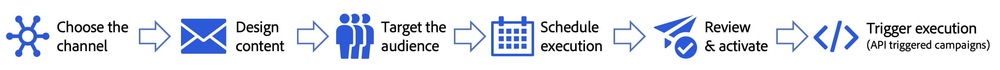

# Aan de slag met campagnes {#get-started-campaigns}

>[!CONTEXTUALHELP]
>id="ajo_homepage_card3"
>title="Campagnes maken"
>abstract="Gebruik **Adobe Journey Optimizer** om eenmalige inhoud aan een specifiek publiek te leveren gebruikend diverse kanalen. Wanneer u reizen gebruikt, worden handelingen op volgorde uitgevoerd. Met campagnes, worden de acties uitgevoerd gelijktijdig, of onmiddellijk, of gebaseerd op een gespecificeerd programma."

>[!CONTEXTUALHELP]
>id="campaigns_list"
>title="Campagnes"
>abstract="Maak campagnes om eenmalige inhoud aan een specifiek publiek op verschillende kanalen te leveren. Voordat u uw campagne maakt, moet u ervoor zorgen dat u een kanaalconfiguratie hebt en een Adobe Experience Platform-publiek klaar voor gebruik."

Gebruik Journey Optimizer-campagnes om via verschillende kanalen eenmalige inhoud aan een specifiek publiek te leveren. Wanneer u reizen gebruikt, worden handelingen op volgorde uitgevoerd. Met campagnes, worden de acties uitgevoerd gelijktijdig, of onmiddellijk, of gebaseerd op een gespecificeerd programma.

U kunt twee typen campagnes maken:

* **Geplande campagnes** staan voor eenvoudige ad hoc partijmededelingen voor marketing gebruiksgevallen zoals promotionele aanbiedingen, betrokkenheidscampagnes, aankondigingen, wettelijke berichten, of beleidsupdates toe.
* **API-teweeggebrachte campagnes** staan of voor marketing mededelingen toe om uit te reiken aan een publiek in de juiste tijd, of voor transactie/operationele berichten aan een individu zoals het terugstellen van een wachtwoord, waar de behoefte personalisatie kan impliceren door niet alleen profielattributen te gebruiken maar ook de contextgegevens in real time in de trekker die een nuttige lading van de WEERGAVE API is.

De belangrijkste stappen voor het opzetten van een campagne zijn:

➡️ [ ontdekt deze eigenschap in video ](#video)

## Voordat u begint {#campaign-prerequisites}

Controleer de volgende voorwaarden voordat u begint met het maken van uw eerste campagne in Journey Optimizer:

1. **u hebt juiste toestemmingen** nodig. Campagnes zijn alleen beschikbaar voor gebruikers met toegang tot een campagne-gerelateerde **[!UICONTROL Product profile]** , zoals Campagnebeheerder, Campagneontwikkelaar, Campagnemanager en/of Campagneviewer. Als u geen toegang kunt krijgen tot campagnes, moeten de machtigingen worden uitgebreid.

   +++Meer informatie over het toewijzen van een aan een campagne gerelateerde rol

   1. Als u een rol wilt toewijzen aan een gebruiker in het [!DNL Permissions] -product, navigeert u naar het tabblad **[!UICONTROL Roles]** en selecteert u een van de ingebouwde campagneonderdelen **[!UICONTROL Roles]** : Campagnebeheerder, campagnefiatteur, Campagnebeheerder of Campagneviewer.

   1. Klik op het tabblad **[!UICONTROL Users]** op **[!UICONTROL Add user]**.

   1. Typ de naam of het e-mailadres van de gebruiker of selecteer de gebruiker in de lijst en klik op **[!UICONTROL Save]** .

      Als de gebruiker niet eerder werd gecreeerd, verwijs naar [ gebruikersdocumentatie ](https://experienceleague.adobe.com/nl/docs/experience-platform/access-control/ui/users) toevoegen.

   Uw gebruiker moet dan een e-mail ontvangen die aan uw instantie opnieuw richt.

   +++

1. **u hebt een publiek** nodig. De doelgroepen moeten beschikbaar zijn voordat ze de campagne kunnen opzetten. Leer meer over publiek [ op deze pagina ](../audience/about-audiences.md).
1. **u hebt een kanaalconfiguratie** nodig. Als u een kanaal wilt kunnen selecteren, moet de corresponderende kanaalconfiguratie (d.w.z. vooraf ingesteld) zijn gemaakt en beschikbaar. Leer meer over kanaalconfiguraties [ op deze pagina ](../configuration/channel-surfaces.md).

## Hoe kan ik-video {#video}

Leer hoe u uw eerste campagne kunt maken.

>[!VIDEO](https://video.tv.adobe.com/v/346680?quality=12)
