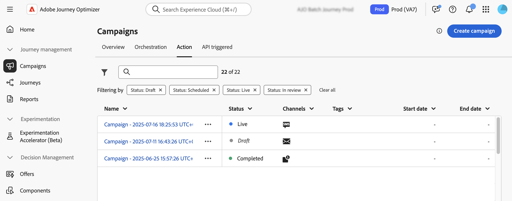

# Aan de slag met campagnes {#get-started-campaigns}

>[!CONTEXTUALHELP]
>id="ajo_campaigns_schedule"
>title="Campagne"
>abstract="De campagnes beginnen standaard bij handmatige activering en eindigen direct nadat het bericht eenmaal is verzonden. U hebt de flexibiliteit om een specifieke datum en tijd voor het te verzenden bericht te plaatsen. Bovendien kunt u een einddatum voor terugkerende campagnes van de Actie specificeren. In de triggers van Actie kunt u de verzendfrequentie van berichten ook configureren om deze aan te passen aan uw voorkeuren."

>[!CONTEXTUALHELP]
>id="ajo_campaigns_schedule_start"
>title="Start campagne"
>abstract="Geef een datum en tijd op waarop het bericht moet worden verzonden."

>[!CONTEXTUALHELP]
>id="ajo_campaigns_schedule_end"
>title="Einde campagne"
>abstract="Geef op wanneer een terugkerende campagne moet stoppen met uitvoeren."

>[!CONTEXTUALHELP]
>id="ajo_campaigns_schedule_triggers"
>title="actieftriggers voor campagne"
>abstract="Definieer de frequentie waarmee het campagnebericht moet worden verzonden."

>[!CONTEXTUALHELP]
>id="ajo_campaigns_throttling"
>title="Snelheidbeheersing"
>abstract="Plaats de controle van het Tarief voor uw campagne door de gewenste tariefgrenzen te specificeren. Deze functie is vooral handig om overbelasting op downstreamsystemen, zoals pagina&#39;s voor landingen of platforms voor klantenservice, te voorkomen."

>[!CONTEXTUALHELP]
>id="ajo_homepage_card3"
>title="Campagnes maken"
>abstract="Gebruik **Adobe Journey Optimizer** om eenmalige inhoud aan een specifiek publiek te leveren gebruikend diverse kanalen. Wanneer u reizen gebruikt, worden handelingen op volgorde uitgevoerd. Met campagnes, worden de acties uitgevoerd gelijktijdig, of onmiddellijk, of gebaseerd op een gespecificeerd programma."

>[!CONTEXTUALHELP]
>id="campaigns_list"
>title="Campagnes"
>abstract="Maak campagnes om eenmalige inhoud aan een specifiek publiek op verschillende kanalen te leveren. Voordat u uw campagne maakt, moet u ervoor zorgen dat u een kanaalconfiguratie hebt en een Adobe Experience Platform-publiek klaar voor gebruik."

>[!CONTEXTUALHELP]
>id="ajo_campaigns_campaign_type"
>title="Type campagne"
>abstract="Selecteer het type campagne. Welke kanalen beschikbaar zijn, is afhankelijk van het geselecteerde type.  **Geplande campagnes** (de campagnes van de Actie) - Ideaal voor eenvoudige, eenmalig partijmededelingen die u kunt plannen om in een specifieke tijd te lopen. **API-teweeggebrachte campagnes** - geactiveerd door een API vraag, toelatend geautomatiseerd, gebeurtenis-gebaseerd overseinen direct van externe systemen. **Geordende campagnes** - verstrek een visueel, belemmering-en-dalingscanvas om complexe, multi-step marketing werkschema&#39;s te ontwerpen en te automatiseren, van publiekssegmentatie aan gepersonaliseerde berichtlevering over kanalen."

>[!CONTEXTUALHELP]
>id="ajo_campaigns_create_orchestration"
>title="Campagnes"
>abstract="Maak uw segmentatiestroom, maak uw berichten over meerdere kanalen en plan uw campagnes. Ondersteunde kanalen: e-mail, SMS, pushmelding."

>[!CONTEXTUALHELP]
>id="ajo_campaigns_create_scheduled_marketing"
>title="Campagnes"
>abstract="Lever enige of terugkomende uitgaande leveringen of lopende binnenkomende acties."

>[!CONTEXTUALHELP]
>id="ajo_campaigns_create_scheduled_transactional"
>title="Campagnes"
>abstract="Lever enige of terugkomende uitgaande transactionele acties."

>[!CONTEXTUALHELP]
>id="ajo_campaigns_create_api_marketing"
>title="Campagnes"
>abstract="Aangepaste marketingcommunicatie leveren aan doelgroepen. Ondersteunde kanalen: e-mail, sms, pushberichten."

>[!CONTEXTUALHELP]
>id="ajo_campaigns_create_api_transactional"
>title="Campagnes"
>abstract="Transactiecommunicatie leveren aan afzonderlijke profielen of groepen profielen. Ondersteunde kanalen: e-mail, sms, pushberichten."

Gebruik [!DNL Journey Optimizer] -campagnes om eenmalige inhoud aan een specifiek publiek via meerdere kanalen te leveren. In tegenstelling tot reizen, die acties stap voor stap uitvoeren, voeren de campagnes acties gelijktijdig uit — of onmiddellijk of op een bepaald programma.

## Typen campagne

[!DNL Journey Optimizer] ondersteunt drie soorten campagnes. Elk type past op verschillende gebruiksgevallen en ondersteunt verschillende kanalen.

>[!BEGINTABS]

>[!TAB  Geordende campagnes ]

**Geordende campagnes** macht gesofisticeerde, merk-in werking gestelde marketing campagnes over kanalen, die u bevordering betrokkenheid, opbrengst, en klantenloyaliteit bij schaal bevorderen.

Hoewel de marketing over de kanalen essentieel is, maken de geordende campagnes het naadloos. Met een visuele, belemmering-en-dalingsinterface, kunt u complexe marketing werkschema&#39;s ontwerpen en automatiseren, van segmentatie aan berichtlevering, over veelvoudige kanalen. Alles gebeurt in één intuïtieve omgeving, gebouwd voor snelheid, controle en efficiëntie.

➡️ [&#x200B; Leer hoe te met Geordende campagnes &#x200B;](../orchestrated/gs-orchestrated-campaigns.md) te werken.

>[!TAB  campagnes van de Actie (of Geplande campagnes) ]

**campagnes van de Actie**, die ook als Geplande campagnes worden bekend, staan voor eenvoudige ad hoc partijmededelingen toe.

* **Gepland - marketing** - voor marketing gebruiksgevallen zoals promotieaanbiedingen, betrokkenheidscampagnes, aankondigingen, wettelijke berichten, of beleidsupdates. Ontvangers moeten worden ingeschakeld.
* **Gepland - Transactioneel** - in tegenstelling tot de campagnes van de Marketing, vereisen de Transactionele campagnes geen ontvangers om worden geopend. Gebruik deze categorie voor communicatie in verband met storingen, noodsituaties en annuleringen. Ondersteunde kanalen: e-mail, SMS, pushmelding.

➡️ [&#x200B; Leer hoe te met actiecampagnes &#x200B;](create-campaign.md) te werken

>[!TAB  API teweeggebrachte campagnes ]

**API-teweeggebrachte campagnes** staan u toe om de uitvoering van de campagne teweeg te brengen gebruikend een API vraag. Deze mededelingen kunnen worden verzonden waar de behoefte personalisatie door niet alleen een wachtwoord kan impliceren die profielattributen opnieuw instelt maar ook de contextgegevens in real time in de trekker die een nuttige lading van de WEERSTAPI is.

* **API teweeggebracht - marketing** - verzend gepersonaliseerde marketing mededelingen aan gericht publiek.
* **API teweeggebracht - Transactioneel** - verzend berichten na een actie die door een individu zoals het verzoek van het wachtwoordterugstellen wordt uitgevoerd, kartaankoop, enz.

➡️ [&#x200B; Leer hoe te met API-teweeggebrachte campagnes &#x200B;](api-triggered-campaigns.md) te werken

>[!ENDTABS]

## Ondersteunde kanalen per type campagne {#channels}

In de onderstaande tabel ziet u de beschikbaarheid van elk kanaal voor verschillende campagneretypen, waarbij de locatie van de kanalen wordt aangegeven.

| Kanaal | Handeling (marketing) | Handeling (transactief) | API-geactiveerd (marketing) | API-geactiveerd (transactioneel) | Geordend |
|----------------------|---------------------|-------------------------|----------------------------|--------------------------------|--------------|
| Email | ✅ | ✅ | ✅ | ✅ | ✅ |
| Sms | ✅ | ✅ | ✅ | ✅ | ✅ |
| Pushmelding | ✅ | ✅ | ✅ | ✅ | ✅ |
| In-app | ✅ | — | — | — | — |
| Direct mail | ✅ | — | — | — | — |
| Web | ✅ | — | — | — | — |
| Op code gebaseerde exp. | ✅ | — | — | — | — |
| Inhoudskaarten | ✅ | — | — | — | — |
| WhatsApp | ✅ | — | — | — | — |
| Lijn | ✅ | — | — | — | — |

## Vereisten {#prerequisites}

Controleer voordat u met campagnes gaat werken of u de onderstaande voorwaarden hebt gecontroleerd.

* **Soorten publiek** Soorten publiek moeten beschikbaar zijn alvorens de campagne te creëren. [&#x200B; krijgt begonnen met publiek &#x200B;](../audience/about-audiences.md).

* **configuraties van het Kanaal** - om een kanaal te kunnen selecteren, moet u de overeenkomstige die kanaalconfiguratie (d.w.z. vooraf ingesteld) hebben wordt gecreeerd en beschikbaar. [&#x200B; leer hoe te de configuraties van het opstellingskanaal &#x200B;](../configuration/channel-surfaces.md).

* **Toestemmingen** - de campagnes zijn slechts beschikbaar aan gebruikers met aangewezen hieronder vermelde toestemmingen. Als u geen toegang hebt tot campagnefuncties, neemt u contact op met uw beheerder om de benodigde machtigingen aan te vragen. [&#x200B; leer meer over ingebouwde rollen van Journey Optimizer &#x200B;](../administration/ootb-product-profiles.md)

  | Type campagne | Machtigingen |
  |----------------------------|----------------------------------------------------------------------------|
  | **campagnes van de Actie** | De beheerder van de campagne   Campagne goedkeurde &lbrace;  Manager van de Campagne   de kijker van de Campagne |
  | **API teweeggebrachte campagnes** | De beheerder van de campagne   Campagne goedkeurde &lbrace;  Manager van de Campagne   de kijker van de Campagne |
  | **Geordende campagnes** | De geordende Beheerder van de Campagne   Geordende Begeleidende fiatteur van de Campagne &lbrace;  Geordende Manager van de Campagne   Geordende Kijker van de Campagne |

  +++Leer hoe u een rol met betrekking tot een campagne toewijst

   1. Als u een rol wilt toewijzen aan een gebruiker in het [!DNL Permissions] -product, navigeert u naar het tabblad **[!UICONTROL Roles]** en selecteert u een van de hierboven beschreven geïntegreerde campagnes voor **[!UICONTROL Roles]** .

   1. Klik op het tabblad **[!UICONTROL Users]** op **[!UICONTROL Add user]**.

   1. Typ de naam of het e-mailadres van de gebruiker of selecteer de gebruiker in de lijst en klik op **[!UICONTROL Save]** .

      Als de gebruiker niet eerder werd gecreeerd, verwijs naar [&#x200B; gebruikersdocumentatie &#x200B;](https://experienceleague.adobe.com/nl/docs/experience-platform/access-control/ui/users) toevoegen.

  Uw gebruiker moet dan een e-mail ontvangen die aan uw instantie opnieuw richt.

  +++

## Laten we dieper duiken

Nu u de campagnes in [!DNL Journey Optimizer] begrijpt, is het tijd om dieper in deze documentatiesecties te duiken om uw eerste campagnes te beginnen creëren.

<table style="table-layout:fixed"><tr style="border: 0; text-align: center;">
<td> <a href="create-campaign.md">Actiecampagnes</a></td>
<td> <a href="api-triggered-campaigns.md">API-actiecampagnes</a></td>
<td><a href="../orchestrated/gs-orchestrated-campaigns.md">Geordende campagnes</a></td>
</tr></table>
