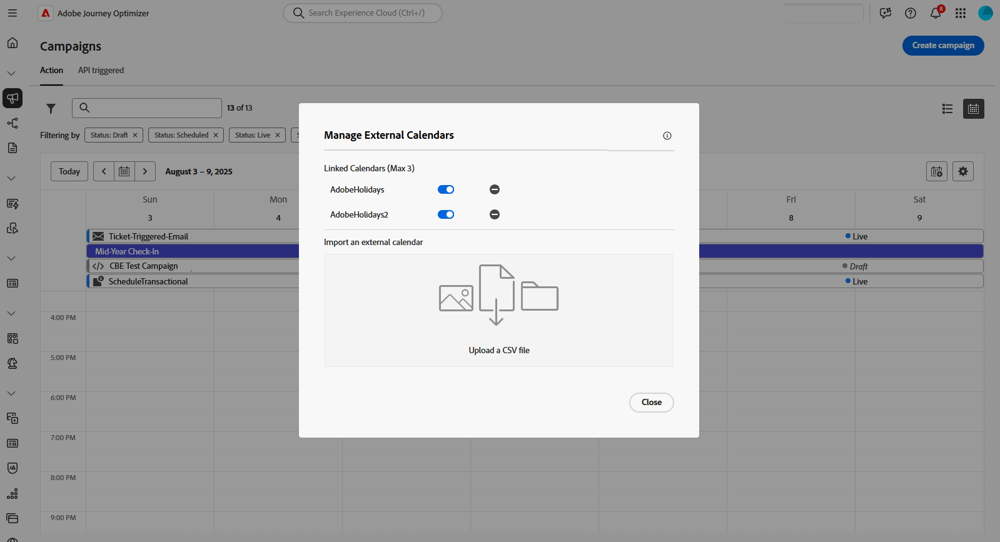

# Campagnes openen en beheren {#manage-campaigns}

>[!CONTEXTUALHELP]
>id="ajo_targeting_workflow_list"
>title="Geordende inventarisatie van campagnes"
>abstract="In dit scherm, kunt u tot de volledige lijst van Geordende campagnes toegang hebben, hun huidige status, laatste/volgende uitvoeringsdata controleren, en een nieuwe Geordende campagne creëren."

>[!CONTEXTUALHELP]
>id="ajo_orchestration_campaign_action"
>title="Actie"
>abstract="In deze secties worden alle acties weergegeven die in de geordende campagne worden gebruikt."

Campagnes zijn toegankelijk via het menu **[!UICONTROL Campaigns]** . Gebruik de lusjes om campagnes door type te doorbladeren: **actie** campagnes, **API-teweeggebrachte** campagnes, en **Geordende** campagnes. Leer meer over de [ types van campagnes ](get-started-with-campaigns.md#get-started-with-campaigns). Welke typen beschikbaar zijn, is afhankelijk van uw licentieovereenkomst en uw machtigingen.

>[!BEGINTABS]

>[!TAB  campagnes van de Actie ]

Selecteer het tabblad **[!UICONTROL Action]** voor toegang tot de lijst met actiecampagnes.

Standaard worden in de lijst alle campagnes met de statussen **[!UICONTROL Draft]** , **[!UICONTROL Scheduled]** en **[!UICONTROL Live]** weergegeven. Om gestopt, voltooide, en gearchiveerde campagnes te tonen, moet u de filter ontruimen.

>[!TAB  API teweeggebrachte campagnes ]

Selecteer het tabblad **[!UICONTROL API triggered]** voor toegang tot de lijst met API-geactiveerde campagnes.

Standaard worden in de lijst alle campagnes met de statussen **[!UICONTROL Draft]** , **[!UICONTROL Scheduled]** en **[!UICONTROL Live]** weergegeven. Om gestopt, voltooide, en gearchiveerde campagnes te tonen, moet u de filter ontruimen.

>[!TAB  Geordende campagnes ]

Selecteer het tabblad **[!UICONTROL Orchestration]** voor toegang tot de lijst met geordende campagnes.

{zoomable="yes"}{zoomable="yes"} toont

Elk Geordende campagne in de lijst toont informatie zoals de huidige [ status van de campagne ](#status), het bijbehorende kanaal en de markeringen, of de laatste tijd het werd gewijzigd. U kunt de getoonde kolommen aanpassen door .

>[!ENDTABS]

Bovendien zijn er een zoekbalk en filters beschikbaar waarmee u gemakkelijk in de lijst kunt zoeken. U kunt bijvoorbeeld campagnes filteren om alleen de campagnes weer te geven die aan een bepaald kanaal of een bepaalde tag zijn gekoppeld, of de campagnes die tijdens een bepaald datumbereik zijn gemaakt.

Het  in de campagneinventaris toont staat u toe om diverse hieronder gedetailleerde verrichtingen uit te voeren.

 toont

* **[!UICONTROL View all time report]** / **[!UICONTROL View last 24 hours report]** - Gebruik rapporten om de impact en prestaties van uw campagnes te meten en te visualiseren. Leer meer over [ campagnerapporten ](../reports/campaign-global-report-cja.md).
* **[!UICONTROL Edit tags]** - Bewerk de tags die aan de campagne zijn gekoppeld. Leer hoe te [ gebruiks markeringen in uw campagnes ](../start/search-filter-categorize.md#add-tags-to-an-object)
* **[!UICONTROL Duplicate]** - Gebruik deze optie om een campagne te dupliceren, bijvoorbeeld om een geordende campagne uit te voeren die is gestopt. [Meer informatie](#duplicate-a-campaign)
* **[!UICONTROL Delete]** - Gebruik deze optie om een campagne te verwijderen. [Meer informatie](#delete-a-campaign)
* **[!UICONTROL Archive]** - Archiveer de campagne. Alle gearchiveerde campagnes worden 30 dagen na de laatste gewijzigde datum gewist. Deze actie is beschikbaar voor alle campagnes behalve **[!UICONTROL Draft]** campagnes. Leer meer over [ campagnearchief ](#archive-a-campaign).

Voor actie- en API-campagnes zijn de volgende aanvullende acties beschikbaar:

* **[!UICONTROL Add to package]** - Voeg de campagne toe aan een pakket om deze naar een andere sandbox te exporteren. Leer hoe te [ voorwerpen naar een andere zandbak ](../configuration/copy-objects-to-sandbox.md) uitvoeren
* **[!UICONTROL Open draft version]** - Als een nieuwe versie van de campagne is gemaakt en nog niet is geactiveerd, kunt u de conceptversie van de campagne openen met deze actie.

## Campagnelevenscyclus {#statuses}

In Adobe Journey Optimizer beweegt elke campagne zich door een levenscyclus die door zijn status in de interface wordt weerspiegeld. De beschikbare statussen variëren afhankelijk van het type van campagne-actie, API-teweeggebracht, of Geordend. Gebruik de onderstaande tabbladen om de levenscyclus en status te bekijken die specifiek zijn voor elk type campagne.

>[!BEGINTABS]

>[!TAB  campagnes van de Actie ]

* **[!UICONTROL Draft]**: De campagne wordt bewerkt en is niet geactiveerd.
* **[!UICONTROL Scheduled]**: De campagne is geconfigureerd om te worden geactiveerd op een specifieke startdatum.
* **[!UICONTROL Live]**: De campagne is geactiveerd.
* **[!UICONTROL In review]**: De campagne is ter goedkeuring voorgelegd om te worden gepubliceerd. [ leer hoe te met goedkeuringen ](../test-approve/gs-approval.md) werken
* **[!UICONTROL Stopped]**: de campagne is handmatig gestopt. U kunt het niet meer activeren of opnieuw gebruiken. [ Leer hoe te om een campagne ](manage-campaigns.md#stop) tegen te houden
* **[!UICONTROL Completed]**: de campagne is voltooid. Deze status wordt automatisch toegewezen 3 dagen nadat een campagne is geactiveerd, of op de einddatum van de campagne als de campagne een terugkerende uitvoering heeft.
* **[!UICONTROL Failed]**: De uitvoering van de campagne is mislukt. Controleer de logboeken om de kwestie te identificeren.
* **[!UICONTROL Archived]**: De campagne is gearchiveerd. [ Leer hoe te om campagnes te archiveren ](manage-campaigns.md#archive)

>[!NOTE]
>
>Het pictogram &#39;Conceptversie openen&#39; naast de status **[!UICONTROL Live]** of **[!UICONTROL Scheduled]** geeft aan dat er een nieuwe versie van een actie of een API-activering is gemaakt en nog niet is geactiveerd.

>[!TAB  API teweeggebrachte campagnes ]

* **[!UICONTROL Draft]**: De campagne wordt bewerkt en is niet geactiveerd.
* **[!UICONTROL Scheduled]**: De campagne is geconfigureerd om te worden geactiveerd op een specifieke startdatum.
* **[!UICONTROL Live]**: De campagne is geactiveerd.
* **[!UICONTROL In review]**: De campagne is ter goedkeuring voorgelegd om te worden gepubliceerd. [ leer hoe te met goedkeuringen ](../test-approve/gs-approval.md) werken
* **[!UICONTROL Stopped]**: de campagne is handmatig gestopt. U kunt het niet meer activeren of opnieuw gebruiken. [ Leer hoe te om een campagne ](manage-campaigns.md#stop) tegen te houden
* **[!UICONTROL Completed]**: de campagne is voltooid. Deze status wordt automatisch toegewezen 3 dagen nadat een campagne is geactiveerd, of op de einddatum van de campagne als de campagne een terugkerende uitvoering heeft.
* **[!UICONTROL Failed]**: De uitvoering van de campagne is mislukt. Controleer de logboeken om de kwestie te identificeren.
* **[!UICONTROL Archived]**: De campagne is gearchiveerd. [ Leer hoe te om campagnes te archiveren ](manage-campaigns.md#archive)

>[!NOTE]
>
>Het pictogram &#39;Conceptversie openen&#39; naast de status **[!UICONTROL Live]** of **[!UICONTROL Scheduled]** geeft aan dat er een nieuwe versie van een actie of een API-activering is gemaakt en nog niet is geactiveerd.

>[!TAB  Geordende campagnes ]

* **[!UICONTROL Draft]**: De geordende campagne is gemaakt. Het is nog niet gepubliceerd.
* **[!UICONTROL Publishing]**: De geordende campagne wordt gepubliceerd.
* **[!UICONTROL Live]**: De geordende campagne is gepubliceerd en wordt uitgevoerd.
* **[!UICONTROL Scheduled]**: De uitvoering van de geordende campagne is gepland.
* **[!UICONTROL Completed]**: De uitvoering van de geordende campagne is voltooid. De voltooide status wordt automatisch toegewezen tot 3 dagen nadat een campagne berichten die zonder fout verzenden heeft voltooid.
* **[!UICONTROL Closed]**: Deze status wordt weergegeven wanneer een terugkerende campagne is gesloten. De campagne gaat door tot alle activiteiten zijn voltooid, maar er kunnen geen profielen meer worden opgenomen in de campagne.
* **[!UICONTROL Archived]**: De geordende campagne is gearchiveerd. Alle gearchiveerde campagnes worden verwijderd als de planning 30 dagen na de laatste gewijzigde datum wordt gewijzigd. U kunt een gearchiveerde campagne zo nodig dupliceren om eraan te kunnen blijven werken.
* **[!UICONTROL Stopped]**: De uitvoering van de geordende campagne is gestopt. Als u de campagne opnieuw wilt starten, moet u deze dupliceren.

>[!ENDTABS]

Als er een fout optreedt in een van uw campagnes, verschijnt er een waarschuwingspictogram naast de status van de campagne. Klik erop om informatie over de waarschuwing weer te geven. Deze waarschuwingen kunnen zich in verschillende situaties voordoen, bijvoorbeeld wanneer het campagnebericht niet is gepubliceerd of wanneer de gekozen configuratie onjuist is.

## Campagne-kalender {#calendar}

>[!CONTEXTUALHELP]
>id="ajo_campaigns_view"
>title="Lijst- en kalenderweergaven van campagnes"
>abstract="Naast de lijst met campagnes biedt [!DNL Journey Optimizer] een kalenderweergave van uw campagnes en een duidelijke visuele weergave van hun programma&#39;s. Met deze knoppen kunt u op elk gewenst moment schakelen tussen de lijst- en de kalenderweergave."

Naast de lijst met campagnes biedt [!DNL Journey Optimizer] een kalenderweergave van uw campagnes en een duidelijke visuele weergave van hun programma&#39;s.

Hoe campagnes worden vertegenwoordigd:

* Standaard worden in het kalenderraster alle live en geplande campagnes voor de geselecteerde week weergegeven. Aanvullende filteropties kunnen voltooide, gestopt en voltooide activeringen of activeringen van een bepaald type of kanaal weergeven.
* Conceptcampagnes worden niet weergegeven.
* Campagnes die meerdere dagen beslaan, worden boven in het kalenderraster weergegeven.
* Als er geen begintijd is opgegeven, wordt de dichtstbijzijnde handmatige activeringstijd gebruikt om deze in de kalender te plaatsen.
* Campagnes worden getoond als timespans van 1 uur, maar dit weerspiegelt geen daadwerkelijke verzend of voltooiingstijd.

Navigeren in de agenda voor uw campagnes:

1. Klik het  pictogram om tot uw kalender van Campagnes toegang te hebben.

1. Gebruik de pijlknoppen of de datumkiezer boven de kalender om tussen weken te gaan.

   In de kalender worden alle campagnes weergegeven die voor de huidige week zijn gepland.

   

1. Klik het  pictogram om de vertoning van punten van een knevel te voorzien die veelvoudige dagen of weken overspannen.

   

1. Klik  pictogram om tot drie externe kalenders te beheren en toe te voegen.

   

1. Sleep de CSV-bestanden met namen van gebeurtenissen, begindatums en einddatums.

   Geüploade gebeurtenissen worden voor alle gebruikers in uw organisatie weergegeven en worden zowel op de kalenders Reis als Campagne weergegeven.

   +++De CSV-indeling moet als volgt zijn:

   | Kolom1 | Kolom2 | Kolom3 |
   |-|-|-|
   | Gebeurtenisnaam | Begindatum in mm/dd/jj-formaat | Einddatum in mm/dd/yformaat |

   +++

1. Indien nodig, kunt u toegevoegde externe kalenders verbergen, verbergen of verwijderen.

   

1. Voor meer informatie over een campagne klikt u op het visuele blok om de details ervan te openen. Er wordt een informatievenster geopend met verschillende informatie over de campagne, zoals het type, de toegang tot de rapporten of de tags die zijn toegewezen.

   

## Herhaalde handelingscampagnes wijzigen en stoppen {#modify}

### Een handelingscampagne wijzigen

Voer de volgende stappen uit om een nieuwe versie van een terugkerende campagne te wijzigen en te maken:

1. Open de campagne en klik op de knop **[!UICONTROL Modify campaign]** .

1. Er wordt een nieuwe versie van de campagne gemaakt. U kunt de live versie controleren door op **[!UICONTROL Open live version]** te klikken.

   

   In de lijst met campagnes worden geactiveerde campagnes met een conceptversie in uitvoering weergegeven met een specifiek pictogram in de kolom **[!UICONTROL Status]** . Klik op dit pictogram om de conceptversie van de campagne te openen.

   

1. Zodra uw veranderingen klaar zijn, kunt u de nieuwe versie van de campagne (zie [ Overzicht activeren en een campagne ](create-campaign.md#review-activate) activeren).

   >[!IMPORTANT]
   >
   >Als u het concept activeert, wordt de live versie van de campagne vervangen.

### Een actiecampagne stoppen {#stop}

Als u een terugkerende campagne wilt stoppen, opent u deze en klikt u op de knop **[!UICONTROL Stop campaign]** .

>[!IMPORTANT]
>
>Als een campagne wordt gestopt, wordt het verzenden niet gestopt, maar wordt het geplande verzenden gestopt of het volgende verzenden als het verzenden al aan de gang is.

## Een campagne archiveren {#archive}

Met de tijd groeit de lijst met campagnes en wordt het uiteindelijk moeilijker om door voltooide en stopgezette campagnes te bladeren.

Om dit te voorkomen, kunt u voltooide en gestopt campagnes archiveren die u niet meer nodig hebt. Klik hiertoe op de knop voor ovaal en selecteer **[!UICONTROL Archive]** .

Gearchiveerde campagnes kunnen vervolgens worden opgehaald met het speciale filter in de lijst.

## Een campagne verwijderen {#delete}

Om een campagne te schrappen, gebruik het ellips  toont en **[!UICONTROL Delete]** selecteert.

{width="70%" align="left"}

>[!IMPORTANT]
>
>Deze optie is alleen beschikbaar voor **[!UICONTROL Draft]** -campagnes.

## Een campagne dupliceren {#duplicate}

Om een campagne te dupliceren, bijvoorbeeld als het is tegengehouden, gebruik het ellips  toont en **[!UICONTROL Duplicate]** selecteert.

Voer de naam van de campagne in en bevestig deze.

De campagne wordt gemaakt en toegevoegd aan de lijst met campagnes.
