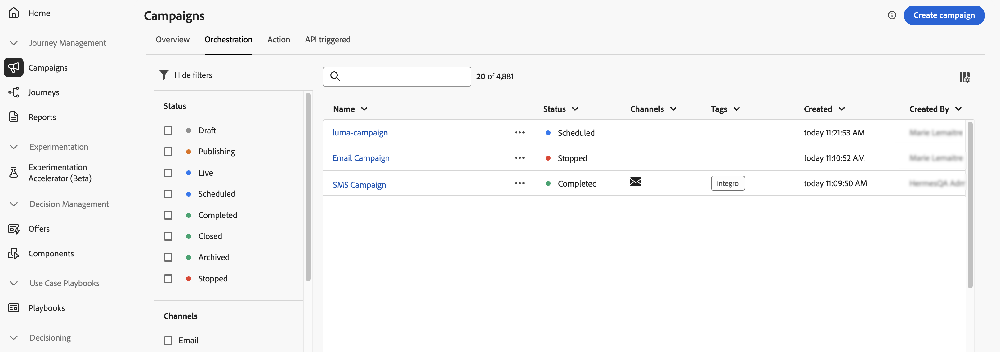

# Campagnes openen en beheren {#manage-campaigns}

>[!CONTEXTUALHELP]
>id="ajo_targeting_workflow_list"
>title="Geordende inventarisatie van campagnes"
>abstract="In dit scherm, kunt u tot de volledige lijst van Geordende campagnes toegang hebben, hun huidige status, laatste/volgende uitvoeringsdata controleren, en een nieuwe Geordende campagne creëren."

>[!CONTEXTUALHELP]
>id="ajo_orchestration_campaign_action"
>title="Actie"
>abstract="In deze secties worden alle acties weergegeven die in de geordende campagne worden gebruikt."

Leer hoe u uw campagnes in Adobe Journey Optimizer kunt openen, organiseren en beheren. Deze handleiding omvat alles, van het zoeken naar campagnes tot het begrijpen van statussen, het uitvoeren van algemene bewerkingen en het onderhouden van uw campagnewerkruimte.

## Snel starten: Algemene taken {#quick-tasks}

Ga direct naar wat u nodig hebt:

* **creeer een nieuwe campagne** → [&#x200B; kies uw campagnetype &#x200B;](get-started-with-campaigns.md#campaign-types)
   * [Handelscampagne maken](create-campaign.md)
   * [API-gestuurde campagne maken](api-triggered-campaigns.md)
   * [Geordende campagne maken](../orchestrated/gs-orchestrated-campaigns.md)
* **vinden bestaande campagnes** → [&#x200B; Onderzoek en filter &#x200B;](#access)
* **campagneprestaties van de Mening** → [&#x200B; de rapporten van de Campagne &#x200B;](../reports/campaign-global-report-cja.md)
* **campagnes van het Programma** → [&#x200B; Gebruik de kalender &#x200B;](#calendar)
* **beheert conflicten** → [&#x200B; het beheershandleiding van het Conflict &#x200B;](../conflict-prioritization/gs-conflict-prioritization.md)

## Campagnes openen en doorbladeren {#access}

Campagnes zijn toegankelijk via het menu **[!UICONTROL Campaigns]** . Gebruik de lusjes om campagnes door type te doorbladeren: **actie** campagnes, **API-teweeggebrachte** campagnes, en **Geordende** campagnes. Leer meer over de [&#x200B; types van campagnes &#x200B;](get-started-with-campaigns.md#campaign-types). Welke typen beschikbaar zijn, is afhankelijk van uw licentieovereenkomst en uw machtigingen.

>[!BEGINTABS]

>[!TAB  campagnes van de Actie ]

Selecteer het tabblad **[!UICONTROL Action]** voor toegang tot de lijst met actiecampagnes.

Standaard worden in de lijst alle campagnes met de statussen **[!UICONTROL Draft]** , **[!UICONTROL Scheduled]** en **[!UICONTROL Live]** weergegeven. Om gestopt, voltooide, en gearchiveerde campagnes te tonen, moet u de filter ontruimen.

>[!TAB  API teweeggebrachte campagnes ]

Selecteer het tabblad **[!UICONTROL API triggered]** voor toegang tot de lijst met API-geactiveerde campagnes.

Standaard worden in de lijst alle campagnes met de statussen **[!UICONTROL Draft]** , **[!UICONTROL Scheduled]** en **[!UICONTROL Live]** weergegeven. Om gestopt, voltooide, en gearchiveerde campagnes te tonen, moet u de filter ontruimen.

>[!TAB  Geordende campagnes ]

Selecteer het tabblad **[!UICONTROL Orchestration]** voor toegang tot de lijst met geordende campagnes.

{zoomable="yes"} toont

Elk Geordende campagne in de lijst toont informatie zoals de huidige [&#x200B; status van de campagne &#x200B;](#statuses), het bijbehorende kanaal en de markeringen, of de laatste tijd het werd gewijzigd. U kunt de getoonde kolommen aanpassen door .

>[!ENDTABS]

### Zoeken en filteren {#search-filter}

Bovendien zijn er een zoekbalk en filters beschikbaar waarmee u gemakkelijk in de lijst kunt zoeken. U kunt bijvoorbeeld campagnes filteren om alleen de campagnes weer te geven die aan een bepaald kanaal of een bepaalde tag zijn gekoppeld, of de campagnes die tijdens een bepaald datumbereik zijn gemaakt.

## Campagne {#operations}

Het  in de campagneinventaris toont staat u toe om diverse verrichtingen uit te voeren.

 toont

### Beschikbare acties

**voor alle campagneretypen:**

* **[!UICONTROL View all time report]** / **[!UICONTROL View last 24 hours report]** - Gebruik rapporten om de impact en prestaties van uw campagnes te meten en te visualiseren. [&#x200B; leer meer over campagnerapporten → &#x200B;](../reports/campaign-global-report-cja.md)
* **[!UICONTROL Edit tags]** - Bewerk de tags die aan de campagne zijn gekoppeld. [&#x200B; leren hoe te om markeringen te gebruiken → &#x200B;](../start/search-filter-categorize.md#add-tags)
* **[!UICONTROL Duplicate]** - Gebruik deze optie om een campagne te dupliceren, bijvoorbeeld om een geordende campagne uit te voeren die is gestopt. [&#x200B; leer meer over het dupliceren → &#x200B;](#duplicate-a-campaign)
* **[!UICONTROL Delete]** - Gebruik deze optie om een campagne te verwijderen. [&#x200B; Leer meer over het schrappen → &#x200B;](#delete-a-campaign)
* **[!UICONTROL Archive]** - Archiveer de campagne. Alle gearchiveerde campagnes worden 30 dagen na de laatste gewijzigde datum gewist. Deze actie is beschikbaar voor alle campagnes behalve **[!UICONTROL Draft]** campagnes. [&#x200B; Leer meer over het archiveren → &#x200B;](#archive-a-campaign)

**voor Actie en API teweeggebrachte slechts campagnes:**

* **[!UICONTROL Add to package]** - Voeg de campagne toe aan een pakket om deze naar een andere sandbox te exporteren. [&#x200B; leer hoe te om voorwerpen uit te voeren → &#x200B;](../configuration/copy-objects-to-sandbox.md)
* **[!UICONTROL Open draft version]** - Als een nieuwe versie van de campagne is gemaakt en nog niet is geactiveerd, kunt u de conceptversie van de campagne openen met deze actie.

## Inzicht in campagestatus {#statuses}

Elke campagne beweegt zich door een levenscyclus die door zijn status in de interface wordt weerspiegeld. Als u deze statussen begrijpt, weet u beter welke handelingen beschikbaar zijn en wat u daarna moet doen.

| Status | Actiecampagnes | API-gestuurde campagnes | Geordende campagnes | Wat het betekent | Volgende handelingen |
|--------|:----------------:|:-----------------------:|:----------------------:|---------------|--------------|
| **[!UICONTROL Draft]** | ✅ | ✅ | ✅ | Wordt bewerkt, niet geactiveerd | Ga het uitgeven of [&#x200B; activeer campagne &#x200B;](review-activate-campaign.md) verder |
| **[!UICONTROL Scheduled]** | ✅ | ✅ | ✅ | Gevormd voor specifieke begindatum | Wacht op lancering, [&#x200B; wijzigt indien nodig &#x200B;](#modify), of [&#x200B; mening in kalender &#x200B;](#calendar) |
| **[!UICONTROL Live]** | ✅ | ✅ | ✅ | Geactiveerd en actief | [&#x200B; prestaties van de Monitor &#x200B;](../reports/campaign-global-report-cja.md), [&#x200B; creeer nieuwe versie &#x200B;](#modify) indien nodig |
| **[!UICONTROL In review]** | ✅ | ✅ | — | Ter goedkeuring ingediend | Wacht op [&#x200B; goedkeuring &#x200B;](../test-approve/gs-approval.md) of wijzig |
| **[!UICONTROL Stopped]** | ✅ | ✅ | ✅ | Handmatig gestopt. Kan niet opnieuw activeren | [&#x200B; Dupliceren aan hergebruik &#x200B;](#duplicate-a-campaign) |
| **[!UICONTROL Completed]** | ✅ | ✅ | ✅ | Uitvoering voltooid (automatisch toegewezen 3 dagen na activering of op einddatum voor terugkerend) | [&#x200B; rapporten van de Mening &#x200B;](../reports/campaign-global-report-cja.md), [&#x200B; archief &#x200B;](#archive-a-campaign), of [&#x200B; dupliceert &#x200B;](#duplicate-a-campaign) |
| **[!UICONTROL Failed]** | ✅ | ✅ | — | Uitvoering mislukt | De logboeken van de controle, bevestigen kwesties, [&#x200B; dupliceren om &#x200B;](#duplicate-a-campaign) opnieuw te proberen |
| **[!UICONTROL Archived]** | ✅ | ✅ | ✅ | Gearchiveerd (automatisch verwijderd na 30 dagen) | [&#x200B; wint het gebruiken van filter &#x200B;](#access) terug indien nodig |
| **[!UICONTROL Closed]** | — | — | ✅ | Recurrecampagne gesloten, geen nieuwe ingangen toegestaan (blijft tot alle activiteiten voltooien) | Wacht op voltooiing |
| **[!UICONTROL Publishing]** | — | — | ✅ | Wordt gepubliceerd | Wacht tot publicatie is voltooid |

>[!NOTE]
>
>Voor actie- en API-getriggerde campagnes geeft het pictogram &#39;Concepten openen&#39; naast de status **[!UICONTROL Live]** of **[!UICONTROL Scheduled]** aan dat een nieuwe versie is gemaakt en nog niet is geactiveerd.

### Foutindicatoren

Als er een fout optreedt in een van uw campagnes, verschijnt er een waarschuwingspictogram naast de status van de campagne. Klik erop om informatie over de waarschuwing weer te geven. Deze waarschuwingen kunnen zich in verschillende situaties voordoen, bijvoorbeeld wanneer het campagnebericht niet is gepubliceerd of wanneer de gekozen configuratie onjuist is.

>[!NOTE]
>
>Assets/Images zijn maximaal 2 jaar (730 dagen) sinds de eerste publicatie ervan in een fragment/inline-bericht toegankelijk in de geleverde inhoud. Na deze vervaldatum (op een willekeurig tijdstip na 730 dagen) moet de publicatie opnieuw worden gepubliceerd om deze twee jaar toegankelijk te houden. Bij elke herpublicatie die binnen 730 dagen na de eerste publicatie wordt uitgevoerd, wordt het vervallen van de middelen/afbeeldingen niet tot de volgende 730 dagen verlengd.

## Campagne-kalender {#calendar}

>[!CONTEXTUALHELP]
>id="ajo_campaigns_view"
>title="Lijst- en kalenderweergaven van campagnes"
>abstract="Naast de lijst met campagnes biedt [!DNL Journey Optimizer] een kalenderweergave van uw campagnes en een duidelijke visuele weergave van hun programma&#39;s. Met deze knoppen kunt u op elk gewenst moment schakelen tussen de lijst- en de kalenderweergave."

Naast de lijst met campagnes biedt [!DNL Journey Optimizer] een kalenderweergave van uw campagnes en een duidelijke visuele weergave van hun programma&#39;s.

### De werking van de kalender

Hoe campagnes worden vertegenwoordigd:

* Standaard worden in het kalenderraster alle live en geplande campagnes voor de geselecteerde week weergegeven. Aanvullende filteropties kunnen voltooide, gestopt en voltooide activeringen of activeringen van een bepaald type of kanaal weergeven.
* Conceptcampagnes worden niet weergegeven.
* Campagnes die meerdere dagen beslaan, worden boven in het kalenderraster weergegeven.
* Als er geen begintijd is opgegeven, wordt de dichtstbijzijnde handmatige activeringstijd gebruikt om deze in de kalender te plaatsen.
* Campagnes worden getoond als timespans van 1 uur, maar dit weerspiegelt geen daadwerkelijke verzend of voltooiingstijd.

### Navigeren door de kalender

1. Klik het  pictogram om tot uw kalender van Campagnes toegang te hebben.

1. Gebruik de pijlknoppen of de datumkiezer boven de kalender om tussen weken te gaan.

   In de kalender worden alle campagnes weergegeven die voor de huidige week zijn gepland.

   

1. Klik het  pictogram om de vertoning van punten van een knevel te voorzien die veelvoudige dagen of weken overspannen.

   

1. Klik  pictogram om tot drie externe kalenders te beheren en toe te voegen.

   

1. Sleep de CSV-bestanden met namen van gebeurtenissen, begindatums en einddatums.

   Geüploade gebeurtenissen worden voor alle gebruikers in uw organisatie weergegeven en worden zowel op de kalenders Reis als Campagne weergegeven.

   +++De CSV-indeling moet als volgt zijn:

   | Kolom1 | Kolom2 | Kolom3 |
   |-|-|-|
   | Gebeurtenisnaam | Begindatum in mm/dd/jj-formaat | Einddatum in mm/dd/yformaat |

   +++

1. Indien nodig, kunt u toegevoegde externe kalenders verbergen, verbergen of verwijderen.

   

1. Voor meer informatie over een campagne klikt u op het visuele blok om de details ervan te openen. Er wordt een informatievenster geopend met verschillende informatie over de campagne, zoals het type, de toegang tot de rapporten of de tags die zijn toegewezen.

   

## Herhaalde handelingscampagnes wijzigen en stoppen {#modify}

### Een handelingscampagne wijzigen {#modify-an-action-campaign}

Voer de volgende stappen uit om een nieuwe versie van een terugkerende campagne te wijzigen en te maken:

1. Open de campagne en klik op de knop **[!UICONTROL Modify campaign]** .

1. Er wordt een nieuwe versie van de campagne gemaakt. U kunt de live versie controleren door op **[!UICONTROL Open live version]** te klikken.

   

   In de lijst met campagnes worden geactiveerde campagnes met een conceptversie in uitvoering weergegeven met een specifiek pictogram in de kolom **[!UICONTROL Status]** . Klik op dit pictogram om de conceptversie van de campagne te openen.

   

1. Zodra uw veranderingen klaar zijn, kunt u de nieuwe versie van de campagne (zie [&#x200B; Overzicht activeren en een campagne &#x200B;](review-activate-campaign.md) activeren).

   >[!IMPORTANT]
   >
   >Als u het concept activeert, wordt de live versie van de campagne vervangen.

**Verwante onderwerpen:**
* [Campagneigenschappen](campaign-properties.md)
* [Campagne](campaign-action.md)
* [Campagneinhoud](campaign-content.md)
* [Campagnepubliek](campaign-audience.md)
* [Campagne](campaign-schedule.md)

### Een actiecampagne stoppen {#stop}

Als u een terugkerende campagne wilt stoppen, opent u deze en klikt u op de knop **[!UICONTROL Stop campaign]** .

>[!IMPORTANT]
>
>Als een campagne wordt gestopt, wordt het verzenden niet gestopt, maar wordt het geplande verzenden gestopt of het volgende verzenden als het verzenden al aan de gang is.

## Een campagne archiveren {#archive-a-campaign}

Met de tijd groeit de lijst met campagnes en wordt het uiteindelijk moeilijker om door voltooide en stopgezette campagnes te bladeren.

Om dit te voorkomen, kunt u voltooide en gestopt campagnes archiveren die u niet meer nodig hebt. Klik hiertoe op de knop voor ovaal en selecteer **[!UICONTROL Archive]** .

Gearchiveerde campagnes kunnen vervolgens worden opgehaald met het speciale filter in de lijst.

## Een campagne verwijderen {#delete-a-campaign}

Om een campagne te schrappen, gebruik het ellips  toont en **[!UICONTROL Delete]** selecteert.

{width="70%" align="left"}

>[!IMPORTANT]
>
>Deze optie is alleen beschikbaar voor **[!UICONTROL Draft]** -campagnes.

## Een campagne dupliceren {#duplicate-a-campaign}

Om een campagne te dupliceren, bijvoorbeeld als het is tegengehouden, gebruik het ellips  toont en **[!UICONTROL Duplicate]** selecteert.

Voer de naam van de campagne in en bevestig deze.

De campagne wordt gemaakt en toegevoegd aan de lijst met campagnes.

## Aanvullende bronnen

* **Begonnen het worden** - [&#x200B; begonnen met campagnes &#x200B;](get-started-with-campaigns.md) | [&#x200B; creeer uw eerste campagne van de Actie &#x200B;](create-campaign.md) | [&#x200B; API-teweeggebrachte campagnegids &#x200B;](api-triggered-campaigns.md) | [&#x200B; Geordende campagnegids &#x200B;](../orchestrated/gs-orchestrated-campaigns.md)

* **configuratie van de Campagne** - [&#x200B; eigenschappen van de Campagne &#x200B;](campaign-properties.md) | [&#x200B; acties en kanalen van de Campagne &#x200B;](campaign-action.md) | [&#x200B; het inhoudsontwerp van de Campagne &#x200B;](campaign-content.md) | [&#x200B; de publieksselectie van de campagne &#x200B;](campaign-audience.md) | [&#x200B; Campagne die &#x200B;](campaign-schedule.md) plant

* **Geavanceerde eigenschappen** - [&#x200B; de werkschema&#39;s van de Goedkeuring &#x200B;](../test-approve/gs-approval.md) | [&#x200B; Conflict beheer &amp; prioritering &#x200B;](../conflict-prioritization/gs-conflict-prioritization.md) | [&#x200B; Het in kaart brengen van de Frequentie door kanaal &#x200B;](../conflict-prioritization/channel-capping.md) | [&#x200B; Prioriteitsscores &#x200B;](../conflict-prioritization/priority-scores.md) | [&#x200B; campagnes van de Uitvoer aan andere zandbakken &#x200B;](../configuration/copy-objects-to-sandbox.md)

* **Controle &amp; optimalisering** - [&#x200B; de rapporten van de Campagne (CJA) &#x200B;](../reports/campaign-global-report-cja.md) | [&#x200B; Het alarm van de opstelling &#x200B;](../reports/alerts.md)

* **Organisatie** - [&#x200B; Werk met markeringen &#x200B;](../start/search-filter-categorize.md) | [&#x200B; leiden toestemmingen &#x200B;](../administration/ootb-product-profiles.md)
