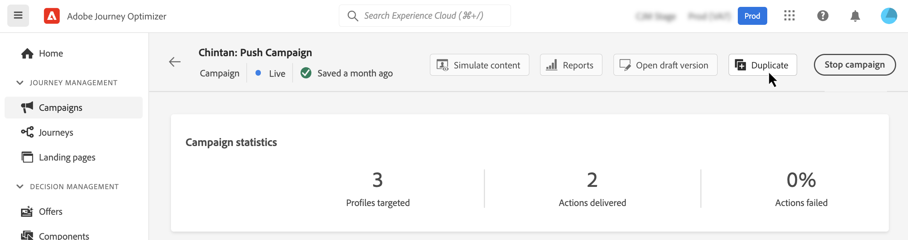

# Campagnes beheren {#modify-stop-campaign}

Nadat een campagne is geactiveerd, kunt u deze op elk gewenst moment wijzigen of stoppen. Deze bewerkingen zijn alleen beschikbaar voor campagnes met een terugkerende uitvoering.

Daarnaast kunt u live campagnes (die één keer of met een terugkerende uitvoering worden uitgevoerd) dupliceren om nieuwe campagnes te maken en voltooide of gestopt campagnes archiveren.

## Campagnes openen {#access}

>[!CONTEXTUALHELP]
>id="ajo_campaigns_view"
>title="Tabel- en tijdlijnweergaven van CAmpaigreert"
>abstract="Campagne voor tabel- en tijdlijnweergaven"

Campagnes zijn toegankelijk via het menu **[!UICONTROL Campaigns]** .

Standaard worden in de lijst alle campagnes met de statussen **[!UICONTROL Draft]** , **[!UICONTROL Scheduled]** en **[!UICONTROL Live]** weergegeven. Om gestopt, voltooide, en gearchiveerde campagnes te tonen, moet u de filter ontruimen.

Bovendien kunt u de lijst filteren op basis van het type en het kanaal van de campagne of de tags die aan de campagnes zijn toegewezen tijdens het maken van de campagnes. [ Leer hoe te om markeringen aan een campagne toe te wijzen ](create-campaign.md#create)

## Statistieken en waarschuwingen voor campagnes {#statuses}

Campagnes kunnen meerdere statussen hebben:

* **[!UICONTROL Draft]**: De campagne wordt bewerkt en is niet geactiveerd.
* **[!UICONTROL Activating]**: De campagne wordt geactiveerd.
* **[!UICONTROL Processing]** *(e-mailcampagnes slechts)*: De publieksuitvoer is volledig, wordt de campagne gepubliceerd.
* **[!UICONTROL Live]**: De campagne is geactiveerd.
* **[!UICONTROL Scheduled]**: De campagne is geconfigureerd om te worden geactiveerd op een specifieke startdatum.
* **[!UICONTROL Stopped]**: de campagne is handmatig gestopt. U kunt het niet meer activeren of opnieuw gebruiken. [ Leer hoe te om een campagne ](modify-stop-campaign.md#stop) tegen te houden
* **[!UICONTROL Completed]**: de campagne is voltooid. Deze status wordt automatisch toegewezen 3 dagen nadat een campagne is geactiveerd, of op de einddatum van de campagne als de campagne een terugkerende uitvoering heeft.
* **[!UICONTROL Archived]**: De campagne is gearchiveerd. [ Leer hoe te om campagnes te archiveren ](modify-stop-campaign.md#archive)

>[!NOTE]
>
>Het pictogram &#39;Conceptversie openen&#39; naast de status **[!UICONTROL Live]** of **[!UICONTROL Scheduled]** geeft aan dat een nieuwe versie van de campagne is gemaakt en nog niet is geactiveerd. [Meer informatie](modify-stop-campaign.md#modify).

Als er een fout optreedt in een van uw campagnes, verschijnt er een waarschuwingspictogram naast de status van de campagne. Klik erop om informatie over de waarschuwing weer te geven. Deze waarschuwingen kunnen zich in verschillende situaties voordoen, bijvoorbeeld wanneer het campagnebericht niet is gepubliceerd of wanneer de gekozen configuratie onjuist is.

## Een terugkerende campagne wijzigen {#modify}

Voer de volgende stappen uit om een terugkerende campagne te wijzigen en een nieuwe versie ervan te maken:

1. Open de campagne en klik op de knop **[!UICONTROL Modify campaign]** .

1. Er wordt een nieuwe versie van de campagne gemaakt. U kunt de live versie controleren door op **[!UICONTROL Open live version]** te klikken.

   

   In de lijst met campagnes worden geactiveerde campagnes met een conceptversie in uitvoering weergegeven met een specifiek pictogram in de kolom **[!UICONTROL Status]** . Klik op dit pictogram om de conceptversie van de campagne te openen.

   

1. Zodra uw veranderingen klaar zijn, kunt u de nieuwe versie van de campagne (zie [ Overzicht activeren en een campagne ](create-campaign.md#review-activate) activeren).

   >[!IMPORTANT]
   >
   >Als u het concept activeert, wordt de live versie van de campagne vervangen.

## Een terugkerende campagne stoppen {#stop}

Als u een terugkerende campagne wilt stoppen, opent u deze en klikt u op de knop **[!UICONTROL Stop campaign]** .

>[!IMPORTANT]
>
>Als een campagne wordt gestopt, wordt het verzenden niet gestopt, maar wordt het geplande verzenden gestopt of het volgende verzenden als het verzenden al bezig is.

<!-- inbound campaign (inapp): can stop and resume -->

## Een campagne dupliceren {#duplicate}

U kunt een live campagne dupliceren om een nieuwe te maken. U doet dit door de campagne te openen en vervolgens op **[!UICONTROL Duplicate]** te klikken.

## Een campagne archiveren {#archive}

Met de tijd groeit de lijst met campagnes en wordt het uiteindelijk moeilijker om door voltooide en stopgezette campagnes te bladeren.

Om dit te voorkomen, kunt u voltooide en gestopt campagnes archiveren die u niet meer nodig hebt. Klik hiertoe op de knop voor ovaal en selecteer **[!UICONTROL Archive]** .

Gearchiveerde campagnes kunnen vervolgens worden opgehaald met het speciale filter in de lijst. [ Leer hoe te om tot campagnes toegang te hebben ](get-started-with-campaigns.md#access)
