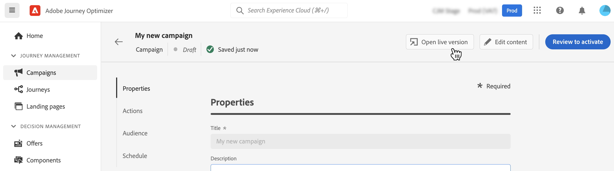

# Een campagne wijzigen of stoppen {#modify-stop-campaign}

Nadat een campagne is geactiveerd, kunt u deze op elk gewenst moment bewerken of stoppen. Volg de onderstaande stappen om dit te doen.

## Een geactiveerde campagne wijzigen {#modify}

Voer de volgende stappen uit om een nieuwe versie van een campagne te wijzigen en te maken:

1. Open de campagne en klik op de knop **[!UICONTROL Modify campaign]** knop.

1. Er wordt een nieuwe versie van de campagne gemaakt. U kunt de live versie controleren door op **[!UICONTROL Open live version]**.

   

   In de lijst met campagnes worden geactiveerde campagnes met een conceptversie in uitvoering weergegeven met een specifiek pictogram in het dialoogvenster **[!UICONTROL Status]** kolom. Klik op dit pictogram om de conceptversie van de campagne te openen.

   

1. Als uw wijzigingen gereed zijn, kunt u de nieuwe versie van de campagne activeren (zie [Een campagne bekijken en activeren](create-campaign.md#review-activate)).

   >[!IMPORTANT]
   >
   >Als u het concept activeert, wordt de live versie van de campagne vervangen.

## Een campagne stoppen {#stop}

Als u een campagne wilt stoppen, opent u deze en klikt u op de knop **[!UICONTROL Stop campaign]** knop.

>[!IMPORTANT]
>
>Nadat een campagne is gestopt, is deze alleen beschikbaar in de modus Alleen-lezen. U kunt de toepassing niet opnieuw activeren of gebruiken om een nieuwe campagne te maken.

## Aanvullende bronnen

* [Aan de slag met campagnes](get-started-with-campaigns.md)
* [Een campagne maken](create-campaign.md)
* [API-gestuurde campagnes maken](api-triggered-campaigns.md)
* [Campagne live-rapport](campaign-live-report.md)
* [Globaal verslag campagne voeren](campaign-global-report.md)
