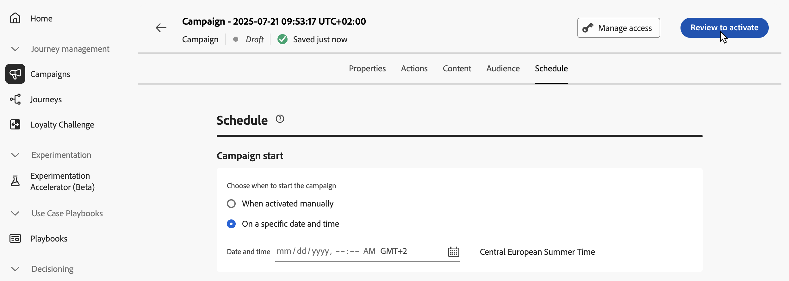

# De door de API geactiveerde campagne controleren en activeren {#api-review}

Zodra uw API teweeggebrachte campagne is gevormd, moet u zijn parameter en inhoud herzien alvorens het te activeren. Ga als volgt te werk om dit te doen:

>[!IMPORTANT]
>
> Als uw campagne onderworpen is aan een goedkeuringsbeleid, zult u goedkeuring moeten vragen om uw campagne te kunnen verzenden. [Meer informatie](../test-approve/gs-approval.md)

1. Klik in het scherm Campagneconfiguratie op **[!UICONTROL Review to activate]** om een overzicht van de campagne weer te geven.

   

1. Een samenvatting van de vertoningen van de campagneconfiguratie, die u toestaan om te controleren of om het even welke parameter of mist en uw campagne te wijzigen indien nodig.

   In het geval van fouten kunt u de campagne niet activeren. Los de fouten op voordat u verdergaat.

   

1. Controleer of uw campagne correct is geconfigureerd en klik op **[!UICONTROL Activate]** .

1. De campagne wordt geactiveerd. De status is **[!UICONTROL Live]** of **[!UICONTROL Scheduled]** als u een begindatum hebt ingevoerd.

   De **[!UICONTROL Completed]** -status wordt automatisch toegewezen aan de campagne drie dagen nadat deze is geactiveerd of op de einddatum van de campagne als deze een terugkerende uitvoering heeft. [ leer meer over campagnestatussen ](manage-campaigns.md#statuses).

   Als er geen einddatum is opgegeven, behoudt de campagne de status **[!UICONTROL Live]** . Als u deze wilt wijzigen, moet u de campagne handmatig stoppen. [ Leer hoe te om een campagne ](manage-campaigns.md) tegen te houden

1. Nadat een campagne is geactiveerd, kunt u op elk gewenst moment de informatie controleren door deze te openen. Met dit overzicht kunt u statistieken opvragen over het aantal doelprofielen en geleverde en mislukte acties.

   U kunt ook aanvullende statistieken in speciale rapporten weergeven door op de knop **[!UICONTROL Reports]** te klikken. [Meer informatie](../reports/campaign-global-report-cja.md)

   

## Volgende stappen {#next}

Zodra de API getriggerde campagne klaar is, kunt u de uitvoering ervan starten met behulp van API&#39;s. [Meer informatie](trigger-campaigns.md)
