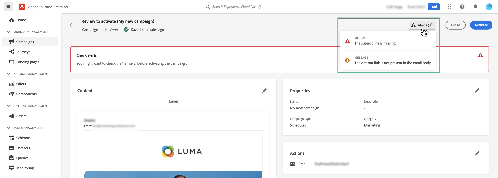
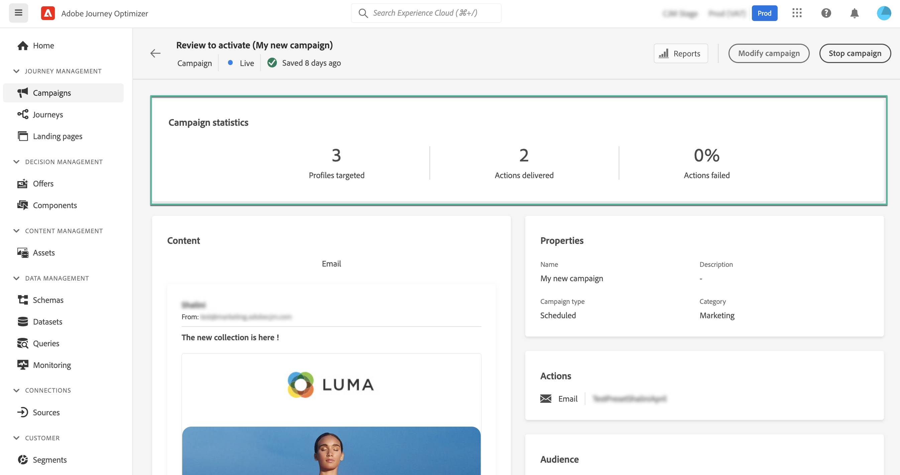

# Een campagne bekijken en activeren {#review-activate}

Zodra uw campagne is gevormd, moet u zijn parameter en inhoud herzien alvorens het te activeren. Ga als volgt te werk om dit te doen:

1. Klik in het scherm Campagneconfiguratie op **[!UICONTROL Review to activate]** om een overzicht van de campagne weer te geven.

   In het overzicht kunt u uw campagne desgewenst wijzigen en controleren of een parameter onjuist is of ontbreekt.

   >[!IMPORTANT]
   >
   >In het geval van fouten kunt u de campagne niet activeren. Los de fouten op voordat u verdergaat.

   

1. Controleer of uw campagne correct is geconfigureerd en klik vervolgens op **[!UICONTROL Activate]**.

   

1. De campagne is nu geactiveerd. Zijn status is **[!UICONTROL Live]**, of **[!UICONTROL Scheduled]** als u een begindatum hebt ingevoerd. [Meer informatie over de status van campagnes](get-started-with-campaigns.md#statuses).

   Het bericht dat in de campagne wordt gevormd wordt verzonden onmiddellijk of op de gespecificeerde datum.

   >[!NOTE]
   >
   >De **[!UICONTROL Completed]** de status wordt automatisch toegewezen aan een campagne drie dagen nadat deze is geactiveerd of op de einddatum van de campagne als deze een terugkerende uitvoering heeft.
   >
   >Als er geen einddatum is opgegeven, blijft de campagne **[!UICONTROL Live]** status. Als u deze wilt wijzigen, moet u de campagne handmatig stoppen. [Leer hoe u een campagne kunt stoppen](modify-stop-campaign.md)

1. Nadat een campagne is geactiveerd, kunt u op elk gewenst moment de informatie controleren door deze te openen. Met dit overzicht kunt u statistieken opvragen over het aantal doelprofielen en geleverde en mislukte acties.

   U kunt extra statistieken in specifieke rapporten ook krijgen door te klikken op **[!UICONTROL Reports]** knop. [Meer informatie](../reports/campaign-global-report.md)

   
