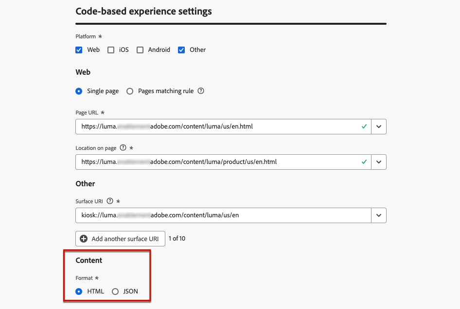

# Uw op code gebaseerde ervaring configureren {#code-based-configuration}

>[!CONTEXTUALHELP]
>id="ajo_code_based_surface"
>title="Definieer een op code gebaseerde ervaringsconfiguratie"
>abstract="Een op code-gebaseerde configuratie bepaalt de weg en de plaats binnen uw toepassing, uniek geïdentificeerd door URI in de toepassingsimplementatie, waar de inhoud zal worden geleverd en worden verbruikt."

Alvorens [&#x200B; bouwend uw ervaring &#x200B;](create-code-based.md), moet u een op code-gebaseerde ervaringsconfiguratie tot stand brengen waarin u bepaalt waar de inhoud binnen uw toepassing zal worden geleverd en worden verbruikt.

Een op code-gebaseerde ervaringsconfiguratie moet naar de oppervlakte verwijzen, die fundamenteel de plaats is waar u uw veranderingen wilt teruggeven. Volgens het geselecteerde platform moet u een locatie/pad of de volledige oppervlakte-URI invoeren. [Meer informatie](code-based-surface.md)

>[!NOTE]
>
>Wanneer u veelvoudige code-gebaseerde ervaringsacties gebruikend de zelfde kanaalconfiguratie (en zo lopend op de zelfde oppervlakte) hebt, bepaalt de campagne of reis **[!UICONTROL Priority score]** wat aan de eindgebruiker wordt geleverd als zij voor meer dan één actie kwalificeren. [&#x200B; leer meer op prioritaire scores &#x200B;](../conflict-prioritization/priority-scores.md)

## Een op code gebaseerde ervaringsconfiguratie maken {#create-code-based-configuration}

>[!CONTEXTUALHELP]
>id="ajo_admin_location"
>title="Geef de specifieke locatie op uw pagina of app aan"
>abstract="In dit veld wordt de exacte bestemming aangegeven binnen een pagina of in de app waartoe gebruikers toegang moeten hebben. Het kan een bepaalde sectie binnen een webpagina zijn, of een pagina diep binnen de navigatiestructuur van de app."

>[!CONTEXTUALHELP]
>id="ajo_admin_default_mobile_url"
>title="Een URL definiëren voor het maken en voorvertonen van inhoud"
>abstract="Met dit veld zorgt u ervoor dat de pagina&#39;s die door de regel worden gegenereerd of waaraan de regel is gekoppeld, een opgegeven URL hebben die essentieel is voor een effectieve weergave van inhoud en voor een voorvertoning."

Ga als volgt te werk om een op code gebaseerde configuratie van het ervaringskanaal te maken:

1. Open het menu **[!UICONTROL Channels]** > **[!UICONTROL General settings]** > **[!UICONTROL Channel configurations]** en klik op **[!UICONTROL Create channel configuration]** .

   

1. Voer een naam en beschrijving (optioneel) voor de configuratie in.

   >[!NOTE]
   >
   > Namen moeten beginnen met een letter (A-Z). Het mag alleen alfanumerieke tekens bevatten. U kunt ook onderstrepingsteken `_` -, punt `.` - en afbreekstreepjes `-` gebruiken.

1. Als u aangepaste of basislabels voor gegevensgebruik aan de configuratie wilt toewijzen, kunt u **[!UICONTROL Manage access]** selecteren. [&#x200B; leer meer over de Controle van de Toegang van het Niveau van Objecten (OLAC) &#x200B;](../administration/object-based-access.md)

1. Selecteer **[!UICONTROL Marketing action]**(s) om het toestemmingsbeleid aan de berichten te associëren gebruikend deze configuratie. Alle toestemmingsbeleid verbonden aan de marketing actie wordt gebruikt om de voorkeur van uw klanten te respecteren. [Meer informatie](../action/consent.md#surface-marketing-actions)

1. Selecteer het **op code-Gebaseerde ervarings** kanaal.

   

1. Selecteer het platform waarop de basiscode wordt toegepast:

   * [Web](#web)
   * [iOS en/of Android](#mobile)
   * [Overige](#other)

   >[!NOTE]
   >
   >U kunt verschillende platforms selecteren. Wanneer u meerdere platforms kiest, wordt de inhoud geleverd aan alle geselecteerde pagina&#39;s of apps.

1. Kies de indeling die de toepassing voor deze specifieke locatie verwacht. Dit wordt gebruikt wanneer het ontwerpen van de code-gebaseerde ervaring in campagnes en reizen.

   

1. Klik op **[!UICONTROL Submit]** om de wijzigingen op te slaan.

U kunt deze configuratie nu selecteren wanneer [&#x200B; creërend een code-gebaseerde ervaring &#x200B;](create-code-based.md) in uw campagnes en reizen.

>[!NOTE]
>
>Het implementatieteam van uw app is verantwoordelijk voor het uitvoeren van expliciete API- of SDK-aanroepen om inhoud op te halen voor de oppervlakken die zijn gedefinieerd in de geselecteerde op code gebaseerde ervaringsconfiguratie. Leer meer over de verschillende klantenimplementaties in [&#x200B; deze sectie &#x200B;](code-based-implementation-samples.md).

### Webplatforms {#web}

>[!CONTEXTUALHELP]
>id="ajo_admin_default_web_url"
>title="Een URL definiëren voor het ontwerpen en voorvertonen van inhoud"
>abstract="Met dit veld zorgt u ervoor dat de pagina&#39;s die door de regel worden gegenereerd of waaraan de regel is gekoppeld, een opgegeven URL hebben die essentieel is voor een effectieve weergave van inhoud en voor een voorvertoning."

Volg onderstaande stappen om de op code gebaseerde instellingen voor ervaringsconfiguratie voor webplatforms te definiëren.

1. Selecteer een van de volgende opties:

   * **[!UICONTROL Single page]** - Als u de wijzigingen uitsluitend op één pagina wilt toepassen, voert u een **[!UICONTROL Page URL]** in.

     

   * **[!UICONTROL Pages matching rule]** - Als u meerdere URL&#39;s met dezelfde regel als doel wilt instellen, maakt u een of meer regels. [Meer informatie](../web/web-configuration.md#web-page-matching-rule)

     <!--This could be used to apply changes universally across a website, such as updating a hero banner across all pages or adding a top image to display on every product page.-->

     Als u bijvoorbeeld elementen wilt bewerken die op alle pagina&#39;s met vrouwenproducten van uw Luma-website worden weergegeven, selecteert u **[!UICONTROL Domain]** > **[!UICONTROL Starts with]** > `luma` en **[!UICONTROL Page]** > **[!UICONTROL Contains]** > `women` .

     

1. Het volgende is van toepassing op de voorbeeld-URL:

   * Als er één pagina-URL wordt ingevoerd, wordt die URL gebruikt voor de voorvertoning. U hoeft geen andere URL in te voeren.
   * Als a [&#x200B; pagina&#39;s passende regel &#x200B;](../web/web-configuration.md#web-page-matching-rule) wordt geselecteerd, moet u a **[!UICONTROL Default authoring and preview URL]** ingaan die aan voorproef de ervaring in browser zal worden gebruikt. [Meer informatie](test-code-based.md#preview-on-device)

     

1. In het veld **[!UICONTROL Location on page]** wordt de exacte bestemming opgegeven binnen de pagina waartoe gebruikers toegang moeten krijgen. Het kan een bepaalde sectie op een pagina binnen de navigatie-structuur van de plaats, zoals &quot;held-banner&quot; of &quot;product-rail&quot; zijn.

   >[!CAUTION]
   >
   >De tekenreeks of het pad dat u in dit veld invoert, moet overeenkomen met de tekenreeks of het pad dat u in uw app of pagina-implementatie opgeeft. Dit zorgt ervoor dat de inhoud wordt geleverd op de gewenste locatie binnen de opgegeven app of pagina. [Meer informatie](code-based-surface.md#uri-composition)

   

### Mobiele platforms (iOS en Android) {#mobile}

>[!CONTEXTUALHELP]
>id="ajo_admin_app_id"
>title="Geef uw toepassings-id op"
>abstract="Voer de toepassings-id in voor nauwkeurige identificatie en configuratie binnen de operationele omgeving van de toepassing, zodat u verzekerd bent van naadloze integratie en functionaliteit."

>[!CONTEXTUALHELP]
>id="ajo_admin_mobile_url_preview"
>title="Geef de URL voor het voorvertonen van inhoud op"
>abstract="Dit veld is essentieel voor het inschakelen van de simulatie en voorvertoning van uw inhoud rechtstreeks op uw apparaat in de toepassing."

Volg onderstaande stappen om de op code gebaseerde instellingen voor ervaringsconfiguratie voor mobiele platforms te definiëren.

1. Voer uw **[!UICONTROL App id]** in. Dit zorgt voor een nauwkeurige identificatie en configuratie binnen de operationele omgeving van de app en voor naadloze integratie en functionaliteit.

1. Geef de **[!UICONTROL Location or path inside the app]** op. In dit veld wordt de exacte bestemming aangegeven in de app waartoe gebruikers toegang moeten krijgen. Het kan een bepaalde sectie of pagina diep binnen de navigatiestructuur van de app zijn, zoals &#39;hero-banner&#39; of &#39;product-rail&#39;.

   

1. Vul het veld **[!UICONTROL Preview URL]** in om voorvertoningen op het apparaat in te schakelen. Deze URL informeert de voorbeeldservice over de specifieke URL die moet worden gebruikt wanneer voorvertoning op apparaat wordt geactiveerd. [Meer informatie](test-code-based.md#preview-on-device)

   De URL van de voorvertoning is een diepe koppeling die door de ontwikkelaar van de app in uw app is geconfigureerd. Zo zorgt u ervoor dat alle URL&#39;s die overeenkomen met het deep link-schema, in de app worden geopend in plaats van in een mobiele webbrowser. Neem contact op met de ontwikkelaar van de app om het deep link-schema voor uw app te verkrijgen.

+++  De volgende bronnen kunnen u helpen bij het configureren van diepe koppelingen voor uw app-implementatie

   * Voor Android:

      * [&#x200B; creeer Diepe Verbindingen aan de Context van de Toepassing &#x200B;](https://developer.android.com/training/app-links/deep-linking)

   * Voor iOS:

      * [&#x200B; het bepalen van een Regeling van Douane URL voor Uw app &#x200B;](https://developer.apple.com/documentation/xcode/defining-a-custom-url-scheme-for-your-app)

      * [&#x200B; ondersteunend Universele Verbindingen in Uw app &#x200B;](https://developer.apple.com/documentation/xcode/supporting-universal-links-in-your-app)

+++

   >[!NOTE]
   >
   >Als u kwesties terwijl het previewing van de ervaring ontmoet, gelieve te verwijzen naar [&#x200B; deze documentatie &#x200B;](https://experienceleague.adobe.com/nl/docs/experience-platform/assurance/troubleshooting#app-does-not-open-link).

### Andere platforms {#other}

Volg de onderstaande stappen om de op code gebaseerde instellingen voor ervaringsconfiguratie voor andere platforms te definiëren (zoals videoconsoles, met tv verbonden apparaten, slimme tv&#39;s, kiosken, ATM&#39;s, spraakassistenten, IoT-apparaten, enz.).

1. Selecteer **[!UICONTROL Other]** als het platform als uw implementatie niet voor Web, iOS of Android is, of als u specifieke URI&#39;s moet instellen.

1. Voer de **[!UICONTROL Surface URI]** in. Een oppervlakte-URI is een unieke identificatie die correspondeert met de entiteit waar u uw ervaring wilt leveren. [Meer informatie](code-based-surface.md#surface-uri)

   

   >[!CAUTION]
   >
   >Zorg ervoor u een oppervlakte URI ingaat die in uw eigen implementatie wordt gebruikt. Anders kunnen de wijzigingen niet worden uitgevoerd. [Meer informatie](code-based-surface.md#uri-composition)

1. **[!UICONTROL Add another surface URI]** indien nodig. U kunt maximaal 10 URI&#39;s toevoegen.

   >[!NOTE]
   >
   >Wanneer u meerdere URI&#39;s toevoegt, wordt de inhoud aan alle vermelde componenten geleverd.
