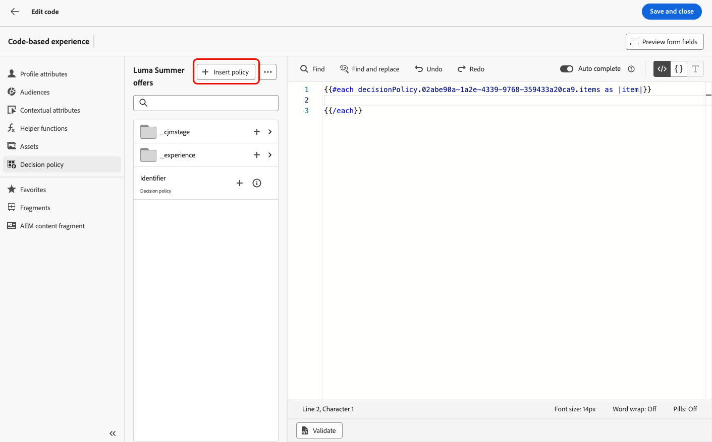

# Bewerkbare formuliervelden gebruiken in op code gebaseerde ervaringen {#code-based-form-fields}

Voor zowel meer flexibiliteit als controle over de op code-gebaseerde ervaringen, staat [!DNL Journey Optimizer] uw ontwikkelingsteam toe om JSON of HTML inhoudsmalplaatjes tot stand te brengen die specifieke vooraf bepaalde editable gebieden bevatten.

Wanneer het creëren van een op code-gebaseerde ervaring, kunnen de niet-technische marketers deze gebieden in de interface direct uitgeven, zonder de behoefte om de verpersoonlijkingsredacteur zelfs te openen, of om het even welke andere codeelementen in hun reis of campagne te raken.

Deze mogelijkheid biedt een vereenvoudigde ervaring voor marketinggebruikers, terwijl ontwikkelaars meer controle kunnen uitoefenen over de code-inhoud, wat resulteert in minder ruimte voor fouten.

## De syntaxis van formuliervelden begrijpen {#form-field-syntax}

Als u delen van een HTML of een JSON-code bewerkbaar wilt maken, moet u een specifieke syntaxis gebruiken in de expressie-editor. Dit impliceert het verklaren van a **veranderlijke** met een standaardwaarde die de gebruikers na het toepassen van het inhoudsmalplaatje op hun op code-gebaseerde ervaring kunnen met voeten treden.

Stel bijvoorbeeld dat u een inhoudssjabloon wilt maken om deze toe te passen op uw ervaringen met code en gebruikers de mogelijkheid wilt geven om een specifieke kleur aan te passen die op verschillende locaties wordt gebruikt, zoals de achtergrondkleuren van frames of knoppen.

Wanneer het creëren van uw inhoudsmalplaatje, moet u een variabele met a **unieke identiteitskaart** verklaren, bijvoorbeeld &quot;*kleur*&quot;, en het roepen bij de gewenste plaatsen in de inhoud roepen waar u deze kleur wilt toepassen.

Wanneer gebruikers de inhoudssjabloon op hun inhoud toepassen, kunnen ze de kleur aanpassen die wordt gebruikt op de plaats waar naar de variabele wordt verwezen.

## Bewerkbare velden toevoegen aan HTML- of JSON-inhoudssjablonen {#add-editable-fields}

>[!CONTEXTUALHELP]
>id="ajo_cbe_preview_form_fields"
>title="De weergave van formuliervelden controleren"
>abstract="In JSON- of HTML-inhoudssjablonen kunt u specifieke bewerkbare velden definiëren waarmee niet-technische gebruikers inhoud gemakkelijk kunnen bewerken in op code gebaseerde ervaringen zonder dat code hoeft te worden bewerkt. Maak die velden met de toegewezen syntaxis en bekijk een voorvertoning ervan met deze knop."

Om sommige van uw code van JSON of van HTML editable te maken, begin door een code-gebaseerde ervaring [&#x200B; inhoudsmalplaatje &#x200B;](../content-management/content-templates.md) te creëren waar u specifieke vormgebieden kunt bepalen.

>[!NOTE]
>
>Deze stap wordt gewoonlijk uitgevoerd door een ontwikkelaar persona.

➡️ [&#x200B; Leer hoe te om editable gebieden aan code-gebaseerde ervaringsmalplaatjes in deze video toe te voegen &#x200B;](#video)

1. Maak een inhoudssjabloon en selecteer het kanaal **[!UICONTROL Code-based experience]** . [&#x200B; Leer hoe te om malplaatjes &#x200B;](../content-management/create-content-templates.md) tot stand te brengen

1. Selecteer de ontwerpmodus: HTML of JSON.

   >[!CAUTION]
   >
   >Als u de ontwerpmodus wijzigt, gaan al uw huidige code verloren. De op code-gebaseerde ervaringen die op dit malplaatje worden gebaseerd moeten de zelfde auteurswijze gebruiken.

1. Open de [&#x200B; verpersoonlijkingsredacteur &#x200B;](../personalization/personalization-build-expressions.md) om uw codeinhoud uit te geven.

1. Om een editable vormgebied <!--To declare the variable you want users to edit--> te bepalen, navigeer aan het **[!UICONTROL Helper functions]** menu in de linkernavigatieruit en voeg de **gealigneerde** attributen toe. De syntaxis voor het declareren en aanroepen van de variabele wordt automatisch toegevoegd aan de inhoud.

   {width="85%"}

1. Vervang `"name"` door een unieke id om het bewerkbare veld te identificeren. Voer bijvoorbeeld &quot;imgURL&quot; in.

   >[!NOTE]
   >
   >De veld-id moet uniek zijn en mag geen spaties bevatten. Deze id moet overal in de inhoud worden gebruikt waar u de waarde van de variabele wilt weergeven.

1. Pas de syntaxis aan uw behoeften aan door parameters toe te voegen die in de onderstaande tabel worden beschreven:

   | Actie | Parameter | Voorbeeld |
   | ------- | ------- | ------- |
   | Declareer een editable gebied met a **standaardwaarde**. Als u de sjabloon aan uw inhoud toevoegt, wordt deze standaardwaarde gebruikt als u de sjabloon niet aanpast. | Voeg de standaardwaarde tussen de inline-tags toe. | `{{#inline "editableFieldID"}}default_value{{/inline}}` |
   | Bepaal a **etiket** voor het editable gebied. Dit label wordt in de code-editor weergegeven wanneer u de velden van de sjabloon bewerkt. | `name="title"` | `{{#inline "editableFieldID" name="title"}}default_value{{/inline}}` |

   <!--
    | Action | Parameter| Example |
    | ------- | ------- | ------- |
    |Declare an editable field containing an **image source** that needs to be published.|`assetType="image"`|`{{#inline "editableFieldID" assetType="image"}}default_value{{/inline}}`|
    |Declare an editable field containing an **URL** that needs to be tracked.br/>Note that out-of-the-box "Mirror page URL" and "Unsubscribe link" predefined blocks cannot become editable fields.>|`assetType="url"`|`{{#inline "editableFieldID" assetType="url"}}default_value{{/inline}}`|
    -->

1. Klik op **[!UICONTROL Preview form fields]** om te controleren hoe de bewerkbare formuliervelden worden weergegeven in de op code gebaseerde ervaringen bij het toepassen van deze sjabloon.

   {width="85%"}

1. Gebruik de syntaxis `{{{name}}}` in uw code op elke plaats waar u de waarde van het bewerkbare veld wilt weergeven. Vervang `name` door de unieke id van het veld dat u eerder hebt gedefinieerd.

   {width="85%"}

1. Ga op dezelfde manier verder om andere bewerkbare velden toe te voegen, waarbij u elk veld met de tags `{{#inline}}` en `{{/inline}}` inpakt.

1. Bewerk indien nodig de rest van de code, inclusief de id&#39;s die overeenkomen met de bewerkbare velden die u hebt gedefinieerd. [&#x200B; leer hoe &#x200B;](create-code-based.md#edit-code)

   

1. Sla de sjabloon op.

### Beslissingsbeleid gebruiken in bewerkbare veldformulieren {#decision-policy-in-form-fields}

Wanneer u een op code gebaseerde sjabloon voor ervaringsinhoud maakt, kunt u een beslissingsbeleid gebruiken om aanbiedingen in bewerkbare formuliervelden te benutten.

1. Creeer een op code-gebaseerd ervaringsmalplaatje zoals hierboven beschreven [&#x200B; &#x200B;](#add-editable-fields).

1. Klik op **[!UICONTROL Add decision policy]** met het pictogram **[!UICONTROL Show Decisioning]** in de rechterraster van het scherm voor de editie of in de editor voor expressies in de sectie **[!UICONTROL Decision policy]** in het linkermenu.

   Leer hoe te om een besluitvormingsbeleid in [&#x200B; tot stand te brengen deze sectie &#x200B;](../experience-decisioning/create-decision.md#add-decision).

1. Klik op de knop **[!UICONTROL Insert policy]**. De code die overeenkomt met het beslissingsbeleid wordt toegevoegd.

   

1. Na de `{{#each}}` markering, neem de code op die aan het editable vormgebied (s) beantwoordt dat u wilt toevoegen, gebruikend de **gealigneerde** syntaxis hierboven beschreven [&#x200B; &#x200B;](#add-editable-fields). Vervang `"name"` door een unieke id om het bewerkbare veld te identificeren. In dit voorbeeld gebruikt u &quot;title&quot;.

   {width="90%"}

1. Klik op **[!UICONTROL Preview form fields]** om te controleren hoe de bewerkbare formuliervelden worden weergegeven in de op code gebaseerde ervaringen bij het toepassen van deze sjabloon.

   {width="70%"}

1. Voeg de rest van de code in boven de tag `{{/each}}` . Gebruik de syntaxis van `{{{name}}}` in uw code op elke plaats waar u de waarde van uw editable gebied wilt tonen. In dit voorbeeld vervangt u `name` door &quot;title&quot;.

   {width="85%"}

1. Sla de sjabloon op.

### Codevoorbeelden {#code-examples}

Hieronder volgen een paar voorbeelden van JSON- en HTML-sjablonen, waarvan er enkele het besluitvormingsbeleid omvatten.

**malplaatje JSON:**

```
{{#inline "title" name="Title"}}Best gear for winter is here for you!{{/inline}} 
{{#inline "description" name="Description"}}Add description{{/inline}} 
{{#inline "imgURL" name="Image Link"}}Add link{{/inline}} 
{{#inline "number_of_items" name="Number of items"}}23{{/inline}}

{
  "title": "{{{title}}}",
  "description": "{{{description}}}",
  "imageUrl": "{{{imgURL}}}",
  "number_of_items": {{{number_of_items}}}, 
  "code": "DEFAULT"
}
```

>[!NOTE]
>
>Bij het verwijzen naar de inline velden in de JSON-payload:
>
>* Tekenreeksvelden moeten tussen dubbele aanhalingstekens staan.
>* Gehele getallen of laarzen mogen NIET tussen dubbele aanhalingstekens staan. (Zie het veld `number_of_items` in het bovenstaande voorbeeld.)

**malplaatje JSON met besluit:**

```
{ 
"offer": [ 
{{#each decisionPolicy.fff709b7-7fef-4e4e-83d7-594fbcf196c1.items as |item|}} 
{{#inline "title" name="Title"}}{{item._mobiledx.Title1}}{{/inline}} {{#inline "description" name="Description"}}{{item._mobiledx.Title2}}{{/inline}} {{#inline "imgURL" name="Image Link"}}https://luma.enablementadobe.com/content/luma/us/en/experience/warming-up/_jcr_content/root/hero_image.coreimg.jpeg{{/inline}} 

{ 
"title": "{{{title}}}", 
"description": "{{{description}}}", 
"imageUrl": "{{{imgURL}}}", 
"link": "https://lumaenablement.adobe.com/web/luma/home", "code": "DEFAULT" 
}, 
{{/each}}
] 
}
```

>[!NOTE]
>
>De gealigneerde gebieden waarvoor u beslissingspunten wilt gebruiken moeten binnen het blok van het besluitvormingsbeleid worden geplaatst - tussen `{{#each}}` en `{{/each}}` markeringen.

**malplaatje van HTML:**

```
{{#inline "title" name="Title"}}Please enter title here{{/inline}} 
{{#inline "imgSrc" name="Image link"}}{{/inline}} 

<div class="TopRibbon__content">{{{title}}}</div> 
<style> .theme-luma .TopRibbon { background-color: #200098; }</style>
```

**malplaatje van HTML met besluit:**

```
{{#each decisionPolicy.f112884a-5654-43ad-9d6d-dbd32ae23ee6.items as |item|}} 
{{#inline "title" name="Title"}}Title is: {{item._mobiledx.Title1}}{{/inline}} 

<div class="TopRibbon__content">{{{title}}}</div> 
<style> .theme-luma .TopRibbon { background-color: #200098; }</style> 

{{/each}}
```

## Formuliervelden bewerken in een op code gebaseerde ervaring {#edit-form-fields}

>[!CONTEXTUALHELP]
>id="ajo_code_based_form_fields"
>title="Wat zijn formuliervelden?"
>abstract="Deze op code gebaseerde ervaring bevat formuliervelden die u eenvoudig kunt bewerken zonder dat u code hoeft te bewerken in de verpersoonlijkingseditor."

Nu de inhoudssjabloon met vooraf gedefinieerde bewerkbare formuliervelden is gemaakt, kunt u een op code gebaseerde ervaring opbouwen met deze inhoudssjabloon.

U kunt de formuliervelden eenvoudig bewerken vanuit een ervaringstraject of -campagne op basis van code, zonder de personalisatie-editor te openen.

>[!NOTE]
>
>Deze stap wordt gewoonlijk uitgevoerd door een markeringspersoneel.

1. Selecteer vanuit het scherm van de reisactiviteit of de campagneeditie de inhoudssjabloon met bewerkbare formuliervelden. [&#x200B; leer hoe te om inhoudsmalplaatjes &#x200B;](../content-management/use-content-templates.md) te gebruiken

   {width="60%"}

   >[!CAUTION]
   >
   >De sjablonen die u kunt kiezen, vallen binnen het bereik van HTML of JSON op basis van de vooraf geselecteerde kanaalconfiguratie. Alleen compatibele sjablonen worden weergegeven.

1. De velden die vooraf zijn gedefinieerd in de geselecteerde inhoudssjabloon, zijn beschikbaar in het rechterdeelvenster. <!--The code preview is displayed with the rest of the code.-->

   

1. In de sectie **[!UICONTROL Editable form fields]** kunt u:

   * Bewerk elke waarde rechtstreeks in de bewerkbare velden, zonder de code-editor te openen.

   {width="60%"}

   * Klik het verpersoonlijkingspictogram om elk gebied uit te geven gebruikend de [&#x200B; coderedacteur &#x200B;](../personalization/personalization-build-expressions.md).

   {width="70%"}

   >[!NOTE]
   >
   >In beide gevallen kunt u slechts één veld tegelijk bewerken en kunt u de rest van de ervaringsinhoud op basis van code niet bewerken.

1. Als het a [&#x200B; besluitvormingsbeleid &#x200B;](#decision-policy-in-form-fields) aan het inhoudsmalplaatje werd toegevoegd, komt het met alle attributen beschikbaar in het [&#x200B; catalogusschema van aanbiedingen &#x200B;](../experience-decisioning/catalogs.md). U kunt het besluitpunt inline of gebruikend de uitdrukkingsredacteur uitgeven.

1. Als u de rest van de code wilt bewerken, klikt u op de knop **[!UICONTROL Edit code]** en werkt u de volledige code-gebaseerde ervaringsinhoud bij, inclusief de bewerkbare formuliervelden. [Meer informatie](create-code-based.md#edit-code)

## Hoe kan ik-video {#video}

Leer hoe u bewerkbare velden kunt toevoegen aan op code gebaseerde ervaringskanaal-inhoudssjablonen.

>[!VIDEO](https://video.tv.adobe.com/v/3463997/?captions=dut&learn=on&#x26;enablevpops)
