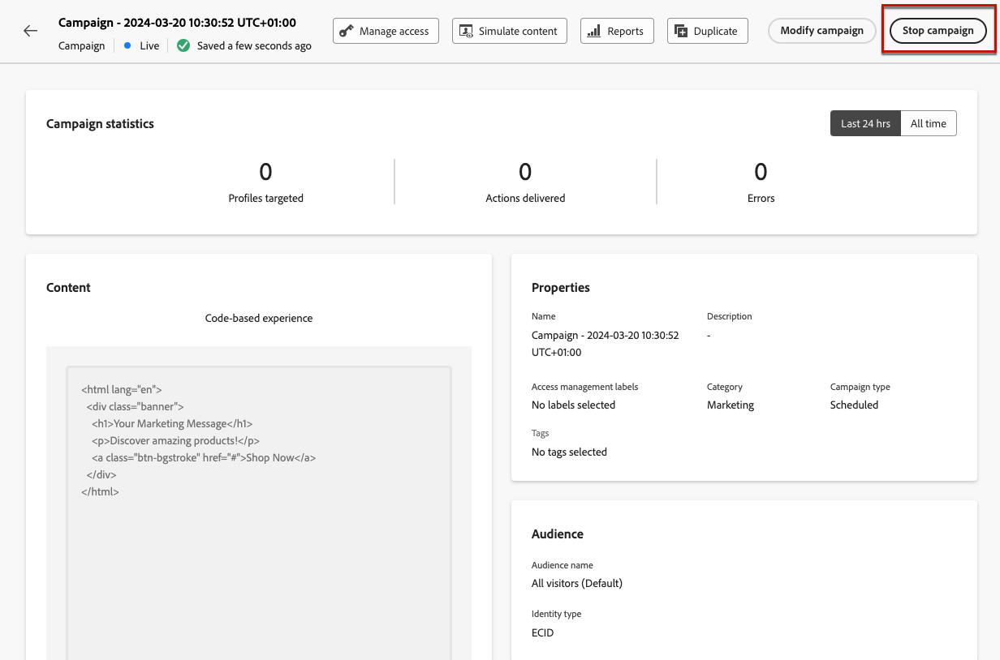
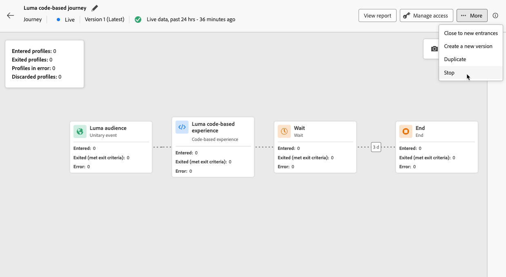

# Op code gebaseerde ervaringen beheren {#publish-code-based}

## Uw op code gebaseerde ervaring live maken {#code-based-experience-live}

>[!IMPORTANT]
>
> Als uw campagne onderworpen is aan een goedkeuringsbeleid, zult u goedkeuring moeten vragen om uw code-gebaseerde ervaringen te kunnen activeren. [Meer informatie](../test-approve/gs-approval.md)

Zodra u uw op code-gebaseerde ervaring bepaalde en uw inhoud zoals gewenst gebruikend de [&#x200B; code-gebaseerde redacteur &#x200B;](create-code-based.md#edit-code) gebruikte, kunt u uw reis of campagne activeren om uw veranderingen zichtbaar aan uw publiek te maken.

U kunt ook een voorvertoning van uw code-gebaseerde ervaringsinhoud weergeven voordat u deze live maakt. [Meer informatie](test-code-based.md)

>[!NOTE]
>
>Als u een op code gebaseerde reis/campagne activeert die dezelfde pagina&#39;s beïnvloedt als een andere reis of campagne die al actief is, worden alle wijzigingen toegepast op uw inhoud.
>
>Als meerdere op code gebaseerde reizen of campagnes hetzelfde element of dezelfde elementen van uw inhoud bijwerken, heeft de hoogste prioriteit prioriteit voor de reis/campagne. [&#x200B; leer meer op prioritaire scores &#x200B;](../conflict-prioritization/priority-scores.md)

Zodra uw op code-gebaseerde reis of campagne levend is, is uw team van de app implementatie verantwoordelijk voor het maken van expliciete API of SDK vraag om inhoud voor de oppervlakken te halen die in de geselecteerde [&#x200B; op code-gebaseerde ervaringsconfiguratie &#x200B;](code-based-configuration.md) worden bepaald. Leer meer over de verschillende klantenimplementaties in [&#x200B; deze sectie &#x200B;](code-based-implementation-samples.md).

### Een op code gebaseerde reis publiceren {#publish-code-based-journey}

Volg de onderstaande stappen om uw op code gebaseerde ervaring live te maken van een reis.

1. Controleer of uw reis geldig is en of er geen fout optreedt. [Meer informatie](../building-journeys/troubleshooting.md#checking-for-errors-before-testing)

1. Selecteer tijdens de rit de optie **[!UICONTROL Publish]** in de rechterbovenkeuzelijst.

   

   >[!NOTE]
   >
   >Leer meer over het publiceren reizen in [&#x200B; deze sectie &#x200B;](../building-journeys/publishing-the-journey.md).

Uw op code-gebaseerde reis neemt de **[!UICONTROL Live]** status en is nu zichtbaar aan het geselecteerde publiek. Elke ontvanger van uw reis kan uw wijzigingen zien.

>[!NOTE]
>
>Nadat u op **[!UICONTROL Publish]** hebt geklikt, kan het maximaal 15 minuten duren voordat de wijzigingen live beschikbaar zijn.

### Een op code gebaseerde campagne activeren {#activate-code-based-campaign}

1. Selecteer **[!UICONTROL Review to activate]** in uw op code gebaseerde campagne.

   

1. Controleer en bewerk indien nodig de inhoud, eigenschappen, configuratie, publiek en planning.

1. Selecteer **[!UICONTROL Activate]**.

   

   >[!NOTE]
   >
   >Leer meer over het activeren van campagnes in [&#x200B; deze sectie &#x200B;](../campaigns/review-activate-campaign.md).

Uw op code gebaseerde campagne neemt de **[!UICONTROL Live]** status en is nu zichtbaar voor het geselecteerde publiek. Elke ontvanger van de campagne kan de wijzigingen zien die u aan uw inhoud hebt toegevoegd.

>[!NOTE]
>
>Nadat u op **[!UICONTROL Activate]** hebt geklikt, kan het 15 minuten duren voordat de wijzigingen live beschikbaar zijn.
>
>Als u een schema voor uw op code-gebaseerde campagne bepaalde, heeft het de **[!UICONTROL Scheduled]** status tot de begindatum en de tijd worden bereikt.

## Een op code gebaseerde reis of campagne stoppen {#stop-code-based-experience}

Wanneer een code-gebaseerde ervaring levend is, kunt u het tegenhouden om uw publiek te verhinderen uw wijzigingen te zien. Voer de onderstaande stappen uit.

1. Selecteer een live reis of campagne in de lijst.

1. Voer de relevante actie uit volgens uw geval:

   * Selecteer **[!UICONTROL Stop campaign]** in het bovenste menu van de campagne.

     

   * Klik in het bovenste menu van de rit op de knop **[!UICONTROL More]** en selecteer **[!UICONTROL Stop]** .

     

1. De wijzigingen die u hebt toegevoegd, zijn niet meer zichtbaar voor het publiek dat u hebt gedefinieerd.

>[!NOTE]
>
>Nadat een op code gebaseerde reis of campagne is gestopt, kunt u deze niet meer bewerken of activeren. U kunt deze alleen dupliceren en de gedupliceerde reis/campagne activeren.

<!--Reporting TBC

## Check the code-based experience reports {#check-code-based-reports}

Once your code-based experience is live, you can check the **[!UICONTROL Code-based]** tab of the  [Journey report](../reports/journey-global-report-cja.md#web-cja) and [Campaign report](../reports/campaign-global-report-cja.md#web) to compare elements such as the number of experiences delivered to your audience, and the number of engagements with your content.-->

<!--## Code-based reports

You can access code-based journey or campaign reports from the summary screen.

Global reports display events that occurred at least two hours ago and cover events over a selected time period. In comparison, Live reports focus on events that took place within the past 24 hours, with a minimum time interval of two minutes from the event occurrence.

### Code-based live report {#live-report-code-based}

From your campaign **[!UICONTROL Live report]**, the **[!UICONTROL Code-based experience]** tab details the main information relative to your apps or web pages. [Learn more about live report](../reports/campaign-live-report.md)

+++Learn more about the different metrics and widgets available for the Code-based experience report.

The **[!UICONTROL Code-based experience performance]** KPIs detail the main information relative to your visitors' engagement with your code-based experiences, such as:

* **[!UICONTROL Impressions]**: total number of experiences delivered to all users.

* **[!UICONTROL Interactions]**:  total number of engagements with your app/page. This includes any actions taken by the users, such as clicks or any other interactions.

The **[!UICONTROL Code-based experience summary]** graph shows the evolution of your experiences (impressions, unique impressions and interactions) for the last 24 hours.

TBC: The **[!UICONTROL Interactions by element]** table details the main information relative to your visitors' engagement with the various elements on your app/pages.
+++

### Code-based global report {#global-report-code-based}

Code-based campaign global report can be accessed directly from your journey or campaign with the **[!UICONTROL View report]** button. [Learn more about global report](../reports/campaign-global-report-cja.md)

From your Campaign **[!UICONTROL Global report]**, the **[!UICONTROL Code-based experience]** tab details the main information relative to your apps or web pages.

Add image TBC

+++Learn more about the different metrics and widgets available for the Code-based experience report.

The **[!UICONTROL Code-based experience performance]** KPIs detail the main information relative to your visitors' engagement with your experiences, such as:

* **[!UICONTROL Unique impressions]**: number of unique users to whom the experience was delivered.

* **[!UICONTROL Impressions]**: total number of experiences delivered to all users.

* **[!UICONTROL Interactions]**: percentage of engagements with your app/page. This includes any actions taken by the users, such as clicks or any other interactions.

The **[!UICONTROL Code-based experience summary]** graph shows the evolution of your experiences (unique impressions, impressions and interactions) for the concerned period.

TBC: The **[!UICONTROL Interactions by element]** table details the main information relative to your visitors' engagement with the various elements on your apps/pages.
+++

-->
