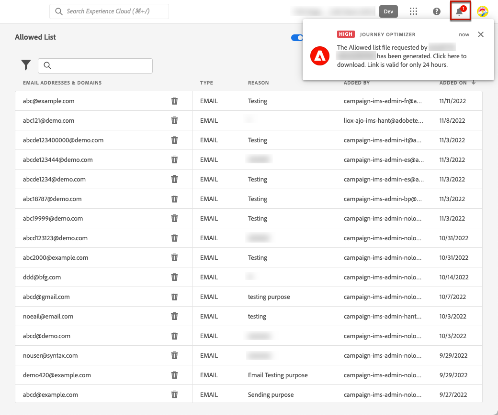

# Een lijst van gewenste personen instellen {#allow-list}

Het is mogelijk om een specifieke het verzenden-veilige lijst op het [&#x200B; zandbak &#x200B;](../administration/sandboxes.md) niveau te bepalen.

Met deze lijst van gewenste personen kunt u afzonderlijke e-mailadressen of domeinen opgeven die de enige ontvangers of domeinen zijn die geautoriseerd zijn om de e-mails te ontvangen die u vanuit een specifieke sandbox verzendt.

>[!CAUTION]
>
>Deze functie geldt alleen voor het e-mailkanaal. Het is beschikbaar voor productie- en niet-productie-sandboxen.

Bijvoorbeeld, op een niet-productiegeval, waar de fouten kunnen voorkomen, verzekert de lijst van gewenste personen u geen risico hebt om ongewenste berichten naar echte klantenadressen uit te zenden, en verstrekt daarom een beveiligd milieu voor het testende doel.

Wanneer de lijst van gewenste personen actief maar leeg is, gaat er ook geen e-mail uit. Als u een belangrijk probleem tegenkomt, kunt u deze functie gebruiken om alle uitgaande communicatie vanuit [!DNL Journey Optimizer] te stoppen totdat u het probleem verhelpt. Leer meer over de [&#x200B; logica van de lijst van gewenste personen &#x200B;](#logic).

Bovendien kunt u hefboomwerkingJourney Optimizer **HULPMIDDELEN API van de Onderdrukking** om uw uitgaande berichten te controleren gebruikend onderdrukking en lijsten van gewenste personen. [&#x200B; Leer hoe te met de HULPMIDDEL te werken REST API &#x200B;](https://developer.adobe.com/journey-optimizer-apis/references/suppression/){target="_blank"}

## Toegang tot de lijst van gewenste personen {#access-allowed-list}

Ga naar **[!UICONTROL Administration]** > **[!UICONTROL Channels]** > **[!UICONTROL Email settings]** en selecteer **[!UICONTROL Allowed list]** om de gedetailleerde lijst met toegestane e-mailadressen en domeinen te openen.


>[!CAUTION]
>
>De toestemmingen om de lijst van gewenste personen te bekijken, uit te voeren en te leiden zijn beperkt tot [&#x200B; Beheerders van de Reis &#x200B;](../administration/ootb-product-profiles.md#journey-administrator). Leer meer over het beheren van [!DNL Journey Optimizer] de toegangsrechten van gebruikers in [&#x200B; deze sectie &#x200B;](../administration/permissions-overview.md).

Selecteer de knop **[!UICONTROL Download CSV]** als u de lijst van gewenste personen als een CSV-bestand wilt exporteren.

Gebruik de knop **[!UICONTROL Delete]** om een item permanent te verwijderen.

U kunt zoeken op de e-mailadressen of -domeinen en filteren op de **[!UICONTROL Address type]** . Als deze optie is geselecteerd, kunt u het filter wissen dat boven op de lijst wordt weergegeven.


## De lijst van gewenste personen activeren {#enable-allow-list}

Volg onderstaande stappen om de lijst van gewenste personen te activeren.

1. Open het menu **[!UICONTROL Channels]** > **[!UICONTROL Email configuration]** > **[!UICONTROL Allow list]** .

1. Selecteer de schakelknop.

   

1. Selecteer **[!UICONTROL Activate allowed list]**. De lijst van gewenste personen is nu actief.

   

   >[!NOTE]
   >
   >Nadat u de lijst van gewenste personen hebt geactiveerd, duurt het 10 minuten voordat deze tijdens uw reizen en campagnes van kracht wordt. Ook het bijwerken van de lijst met lijsten van gewenste personen en onderdrukking kan 10 minuten duren.

De logica lijst van gewenste personen is van toepassing wanneer de functie actief is. Lees meer in [deze sectie](#logic).

>[!NOTE]
>
>Wanneer geactiveerd, wordt de eigenschap van de lijst van gewenste personen geëerd wanneer het uitvoeren van reizen, maar ook wanneer het testen van berichten met [&#x200B; proeven &#x200B;](../content-management/proofs.md) en het testen reizen gebruikend de [&#x200B; testwijze &#x200B;](../building-journeys/testing-the-journey.md).

## De lijst van gewenste personen deactiveren {#deactivate-allow-list}

Volg onderstaande stappen om de lijst van gewenste personen te deactiveren.

1. Open het menu **[!UICONTROL Channels]** > **[!UICONTROL Email configuration]** > **[!UICONTROL Allow list]** .

1. Selecteer de schakelknop.

   

1. Selecteer **[!UICONTROL Deactivate allowed list]**. De lijst van gewenste personen is niet meer actief.

   

   >[!NOTE]
   >
   >Nadat u de lijst van gewenste personen hebt gedeactiveerd, is er een vertraging van 10 minuten voordat deze van kracht wordt tijdens uw reizen en campagnes. Ook het bijwerken van de lijst met lijsten van gewenste personen en onderdrukking kan 10 minuten duren.

De logica lijst van gewenste personen is niet van toepassing wanneer de functie wordt gedeactiveerd. Lees meer in [deze sectie](#logic).

## Entiteiten toevoegen aan de lijst van gewenste personen {#add-entities}

Om nieuwe e-mailadressen of domeinen aan de lijst van gewenste personen voor een specifieke zandbak toe te voegen, kunt u of [&#x200B; manueel de lijst &#x200B;](#manually-populate-list) bevolken, of een [&#x200B; API vraag &#x200B;](#api-call-allowed-list) gebruiken.

>[!NOTE]
>
>De lijst van gewenste personen kan maximaal 1.000 items bevatten.

### De lijst van gewenste personen handmatig vullen {#manually-populate-list}

>[!CONTEXTUALHELP]
>id="ajo_admin_allowed_list_add_header"
>title="Voeg adressen of domeinen aan de lijst van gewenste personen toe"
>abstract="U kunt handmatig nieuwe e-mailadressen of domeinen aan de lijst van gewenste personen toevoegen door deze een voor een te selecteren."

>[!CONTEXTUALHELP]
>id="ajo_admin_allowed_list_add"
>title="Voeg adressen of domeinen aan de lijst van gewenste personen toe"
>abstract="U kunt handmatig nieuwe e-mailadressen of domeinen aan de lijst van gewenste personen toevoegen door deze een voor een te selecteren."

U kunt de lijst van gewenste personen [!DNL Journey Optimizer] handmatig vullen door een e-mailadres of een domein toe te voegen via de gebruikersinterface.

>[!NOTE]
>
>U kunt slechts één e-mailadres of domein tegelijk toevoegen.

Volg de onderstaande stappen om dit te doen.

1. Selecteer de knop **[!UICONTROL Add email or domain]**.

   

1. Kies het adrestype: **[!UICONTROL Email address]** of **[!UICONTROL Domain address]**.

1. Voer het e-mailadres of domein in waarnaar u e-mails wilt verzenden.

   >[!NOTE]
   >
   >Controleer of u een geldig e-mailadres (zoals abc@company.com) of domein (zoals abc.company.com) invoert.

1. Geef indien nodig een reden op.

   

   >[!NOTE]
   >
   >Alle ASCII-tekens tussen 32 en 126 zijn toegestaan in het veld **[!UICONTROL Reason]** . De volledige lijst kan op [&#x200B; worden gevonden deze pagina &#x200B;](https://en.wikipedia.org/wiki/ASCII#Printable_characters){target="_blank"} bijvoorbeeld.

1. Klik op **[!UICONTROL Submit]**.

### Entiteiten toevoegen met een API-aanroep {#api-call-allowed-list}

Als u de lijst van gewenste personen wilt vullen, kunt u de API voor onderdrukking ook aanroepen met de `ALLOWED` -waarde voor het `listType` -kenmerk. Bijvoorbeeld:


U kunt **uitvoeren voeg** toe, **schrapt** en **krijgt** verrichtingen.

Leer meer over het maken van API vraag in [&#x200B; Adobe Experience Platform APIs &#x200B;](https://experienceleague.adobe.com/docs/experience-platform/landing/platform-apis/api-guide.html){target="_blank"} verwijzingsdocumentatie.

## De lijst van gewenste personen downloaden {#download-allowed-list}

Voer de volgende stappen uit om de lijst van gewenste personen als een CSV-bestand te exporteren:

1. Selecteer de knop **[!UICONTROL Download CSV]**.

   

1. Wacht tot het bestand is gegenereerd.

   

   >[!NOTE]
   >
   >De downloadtijd is afhankelijk van de bestandsgrootte. Dit betekent het aantal adressen in de lijst van gewenste personen.
   >
   >Voor een bepaalde sandbox kan één downloadverzoek tegelijkertijd worden verwerkt.

1. Nadat het bestand is gegenereerd, ontvangt u een melding. Klik op het belpictogram rechtsboven op het scherm om het scherm weer te geven.

1. Klik op de melding zelf om het bestand te downloaden.

   

   >[!NOTE]
   >
   >De koppeling is 24 uur geldig.

## Lijst van gewenste personen-logica {#logic}

>[!CONTEXTUALHELP]
>id="ajo_admin_allowed_list_logic"
>title="De lijst van gewenste personen beheren"
>abstract="Wanneer de lijst van gewenste personen wordt geactiveerd, ontvangen alleen de ontvangers die zijn opgenomen in de lijst van gewenste personen e-mailberichten van deze sandbox. Wanneer deze functie is gedeactiveerd, ontvangen alle ontvangers e-mailberichten."

Wanneer de lijst van gewenste personen [&#x200B; actief &#x200B;](#enable-allow-list) is, is de volgende logica van toepassing:

* Als de lijst van gewenste personen **&#x200B;**&#x200B;leeg is, zal geen e-mail worden verzonden.

* Als een entiteit **op de lijst van gewenste personen** is, en niet op de suppressielijst, wordt e-mail verzonden naar de overeenkomstige ontvanger(s). Nochtans, als de entiteit ook op de [&#x200B; suppressielijst &#x200B;](../reports/suppression-list.md) is, zullen de overeenkomstige ontvanger(s) niet e-mail ontvangen, de reden die **[!UICONTROL Suppressed]** is.

* Als een entiteit **niet op de lijst van gewenste personen** (en niet op de onderdrukkingslijst) is, zullen de overeenkomstige ontvanger(s) niet e-mail ontvangen, de reden die **[!UICONTROL Not allowed]** is.

>[!NOTE]
>
>De profielen met de status **[!UICONTROL Not allowed]** worden tijdens het verzenden van berichten uitgesloten. Daarom terwijl de **rapporten van de Reis** deze profielen zullen tonen zoals die door de reis ([&#x200B; gelezen Publiek &#x200B;](../building-journeys/read-audience.md) en [&#x200B; berichtactiviteiten &#x200B;](../building-journeys/journey-action.md)) zijn bewogen, zullen de **E-mail rapporten** niet hen in de **[!UICONTROL Sent]** metriek omvatten aangezien zij voorafgaand aan e-mail het verzenden worden uitgefilterd.
>
>Leer meer over het [&#x200B; Levende Rapport &#x200B;](../reports/live-report.md) en [&#x200B; rapport van Customer Journey Analytics &#x200B;](../reports/report-gs-cja.md).

Wanneer de lijst van gewenste personen [&#x200B; &#x200B;](#deactivate-allow-list) wordt gedeactiveerd, worden alle e-mails die u van de huidige zandbak verzendt verzonden naar alle ontvangers (mits zij niet op de suppressielijst), met inbegrip van echte klantenadressen zijn.

## Uitsluitingsrapportage {#reporting}

Wanneer de lijst van gewenste personen actief is, kunt u e-mailadressen of domeinen terugwinnen die van het verzenden werden uitgesloten omdat zij niet op de lijst van gewenste personen waren. Om dit te doen, kunt u de [&#x200B; Dienst van de Vraag van Adobe Experience Platform &#x200B;](https://experienceleague.adobe.com/docs/experience-platform/query/api/getting-started.html){target="_blank"} gebruiken om de API hieronder vraag te maken.

Om het **aantal e-mails** te krijgen die niet werden verzonden omdat de ontvangers niet op de lijst van gewenste personen waren, gebruik de volgende vraag:

```sql
SELECT count(distinct _id) from cjm_message_feedback_event_dataset WHERE
_experience.customerJourneyManagement.messageExecution.messageExecutionID = '<MESSAGE_EXECUTION_ID>' AND
_experience.customerJourneyManagement.messageDeliveryfeedback.feedbackStatus = 'exclude' AND
_experience.customerJourneyManagement.messageDeliveryfeedback.messageExclusion.reason = 'EmailNotAllowed'
```

Om de **lijst van e-mailadressen** te krijgen die niet werden verzonden omdat de ontvangers niet op de lijst van gewenste personen waren, gebruik de volgende vraag:

```sql
SELECT distinct(_experience.customerJourneyManagement.emailChannelContext.address) from cjm_message_feedback_event_dataset WHERE
_experience.customerJourneyManagement.messageExecution.messageExecutionID IS NOT NULL AND
_experience.customerJourneyManagement.messageDeliveryfeedback.feedbackStatus = 'exclude' AND
_experience.customerJourneyManagement.messageDeliveryfeedback.messageExclusion.reason = 'EmailNotAllowed'
```
