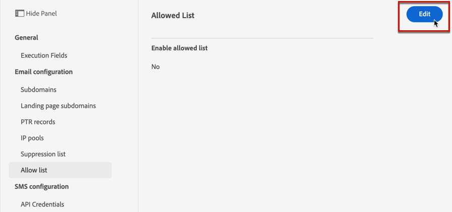
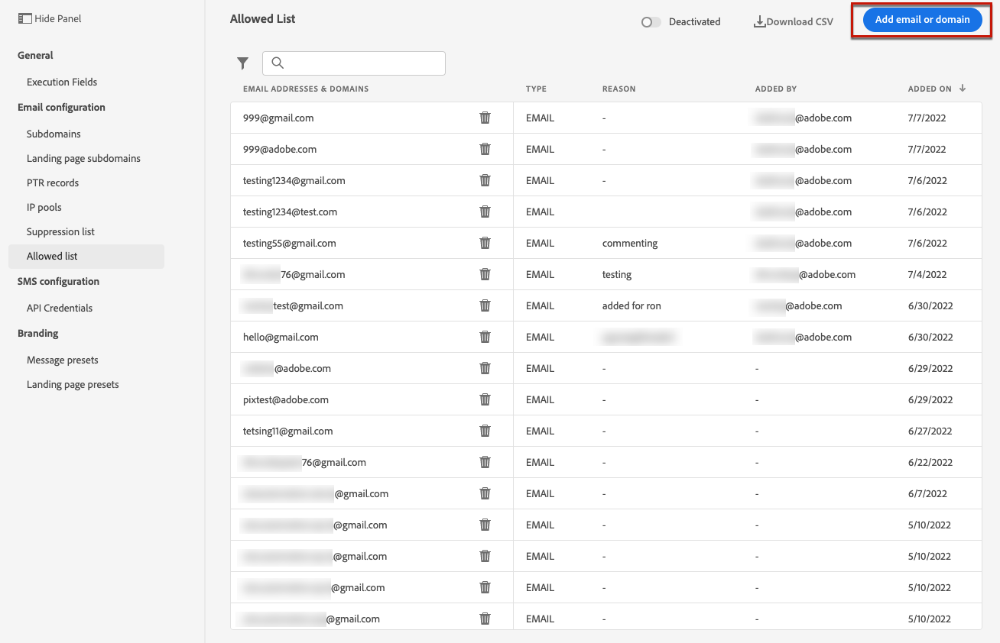
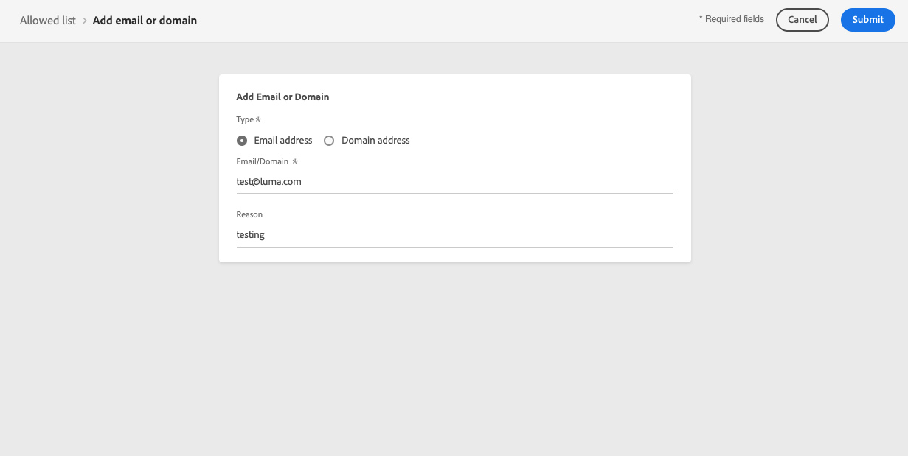

# Lijst van gewenste personen {#allow-list}

Het is mogelijk om een specifieke verzendende-veilige lijst bij te bepalen [sandbox](../administration/sandboxes.md) niveau.

Met deze lijst van gewenste personen kunt u afzonderlijke e-mailadressen of domeinen opgeven die de enige ontvangers of domeinen zijn die geautoriseerd zijn om de e-mails te ontvangen die u vanuit een specifieke sandbox verzendt.

>[!NOTE]
>
>Deze functie is beschikbaar voor productie- en niet-productie-sandboxen.

Bijvoorbeeld, op een niet-productiegeval, waar de fouten kunnen voorkomen, verzekert de lijst van gewenste personen u geen risico hebt om ongewenste berichten naar echte klantenadressen uit te zenden, en verstrekt daarom een beveiligd milieu voor het testende doel.

Wanneer de lijst van gewenste personen actief maar leeg is, gaat er ook geen e-mail uit. Vandaar als u één of andere belangrijke kwestie ontmoet, kunt u deze eigenschap gebruiken om alle uitgaande mededelingen van tegen te houden [!DNL Journey Optimizer] totdat u het probleem verhelpt. Meer informatie over de [lijst van gewenste personen-logica](#logic).

>[!CAUTION]
>
>Deze functie is alleen van toepassing op het e-mailkanaal.

## Toegang tot de lijst van gewenste personen {#access-allowed-list}

Ga naar **[!UICONTROL Administration]** > **[!UICONTROL Channels]** > **[!UICONTROL Email configuration]** en selecteert u **[!UICONTROL Allowed list]**.


>[!CAUTION]
>
>Machtigingen om de lijst van gewenste personen weer te geven, te exporteren en te beheren zijn beperkt tot [Reisbeheerders](../administration/ootb-product-profiles.md#journey-administrator). Meer informatie over beheren [!DNL Journey Optimizer] toegangsrechten van gebruikers in [deze sectie](../administration/permissions-overview.md).

Als u de lijst van gewenste personen als een CSV-bestand wilt exporteren, selecteert u de optie **[!UICONTROL Download CSV]** knop.

Gebruik de **[!UICONTROL Delete]** om een item permanent te verwijderen.

U kunt zoeken op de e-mailadressen of domeinen en filteren op de **[!UICONTROL Address type]**. Als deze optie is geselecteerd, kunt u het filter wissen dat boven op de lijst wordt weergegeven.


## De lijst van gewenste personen activeren {#enable-allow-list}

Volg onderstaande stappen om de lijst van gewenste personen te activeren.

1. Open het menu **[!UICONTROL Channels]** > **[!UICONTROL Email configuration]** > **[!UICONTROL Allow list]**.

1. Selecteer de schakelknop.

   

1. Selecteer **[!UICONTROL Activate allowed list]**. De lijst van gewenste personen is nu actief.

   

   >[!NOTE]
   >
   >Nadat u de lijst van gewenste personen hebt geactiveerd, is er een vertraging van 5 minuten om deze in te voeren tijdens uw reizen en campagnes.

De logica lijst van gewenste personen is van toepassing wanneer de functie actief is. Meer informatie in [deze sectie](#logic).

>[!NOTE]
>
>Wanneer deze functie wordt geactiveerd, wordt de functie lijst van gewenste personen gerespecteerd bij het uitvoeren van reizen, maar ook bij het testen van berichten met [proefdrukken](../design/preview.md#send-proofs) en het testen van reizen met behulp van de [testmodus](../building-journeys/testing-the-journey.md).

## De lijst van gewenste personen deactiveren {#deactivate-allow-list}

Volg onderstaande stappen om de lijst van gewenste personen te deactiveren.

1. Open het menu **[!UICONTROL Channels]** > **[!UICONTROL Email configuration]** > **[!UICONTROL Allow list]**.

1. Selecteer de schakelknop.

   

1. Selecteer **[!UICONTROL Deactivate allowed list]**. De lijst van gewenste personen is niet meer actief.

   

   >[!NOTE]
   >
   >Nadat u de lijst van gewenste personen hebt gedeactiveerd, is er een vertraging van 5 minuten om deze in te voeren tijdens uw reizen en campagnes.

De logica lijst van gewenste personen is niet van toepassing wanneer de functie wordt gedeactiveerd. Meer informatie in [deze sectie](#logic).

## Entiteiten toevoegen aan de lijst van gewenste personen {#add-entities}

Als u nieuwe e-mailadressen of domeinen wilt toevoegen aan de lijst van gewenste personen voor een specifieke sandbox, kunt u [de lijst handmatig vullen](#manually-populate-list)of gebruik een [API-aanroep](#api-call-allowed-list).

>[!NOTE]
>
>De lijst van gewenste personen kan maximaal 1.000 items bevatten.

### De lijst van gewenste personen handmatig vullen {#manually-populate-list}

>[!CONTEXTUALHELP]
>id="ajo_admin_allowed_list_add_header"
>title="Voeg adressen of domeinen aan de lijst van gewenste personen toe"
>abstract="U kunt handmatig nieuwe e-mailadressen of domeinen aan de lijst van gewenste personen toevoegen door deze een voor een te selecteren."

>[!CONTEXTUALHELP]
>id="ajo_admin_allowed_list_add"
>title="Voeg adressen of domeinen aan de lijst van gewenste personen toe"
>abstract="U kunt handmatig nieuwe e-mailadressen of domeinen aan de lijst van gewenste personen toevoegen door deze een voor een te selecteren."

U kunt de [!DNL Journey Optimizer] lijst van gewenste personen door een e-mailadres of een domein via de gebruikersinterface toe te voegen.

>[!NOTE]
>
>U kunt slechts één e-mailadres of domein tegelijk toevoegen.

Volg de onderstaande stappen om dit te doen.

1. Selecteer de knop **[!UICONTROL Add email or domain]**.

   

1. Kies het adrestype: **[!UICONTROL Email address]** of **[!UICONTROL Domain address]**.

1. Voer het e-mailadres of domein in waarnaar u e-mails wilt verzenden.

   >[!NOTE]
   >
   >Zorg ervoor dat u een geldig e-mailadres (zoals abc@company.com) of domein (zoals abc.company.com) opgeeft.

1. Geef indien nodig een reden op.

   

   >[!NOTE]
   >
   >Alle ASCII-tekens tussen 32 en 126 zijn toegestaan in het dialoogvenster **[!UICONTROL Reason]** veld. De volledige lijst is te vinden op [deze pagina](https://en.wikipedia.org/wiki/Wikipedia:ASCII#ASCII_printable_characters){target=&quot;_blank&quot;} bijvoorbeeld.

1. Klik op **[!UICONTROL Submit]**.

### Entiteiten toevoegen met een API-aanroep {#api-call-allowed-list}

Als u de lijst van gewenste personen wilt vullen, kunt u de API voor onderdrukking ook aanroepen met de `ALLOWED` waarde voor de `listType` kenmerk. Bijvoorbeeld:


U kunt de opdracht **Toevoegen**, **Verwijderen** en **Get** bewerkingen.

Meer informatie over het maken van API-aanroepen in het dialoogvenster [Adobe Experience Platform API&#39;s](https://experienceleague.adobe.com/docs/experience-platform/landing/platform-apis/api-guide.html){target=&quot;_blank&quot;} naslagdocumentatie.

## Lijst van gewenste personen-logica {#logic}

>[!CONTEXTUALHELP]
>id="ajo_admin_allowed_list_logic"
>title="De lijst van gewenste personen beheren"
>abstract="Wanneer de lijst van gewenste personen wordt geactiveerd, ontvangen alleen de ontvangers die zijn opgenomen in de lijst van gewenste personen e-mailberichten van deze sandbox. Wanneer deze functie is gedeactiveerd, ontvangen alle ontvangers e-mailberichten."

Wanneer de lijst van gewenste personen [actief](#enable-allow-list), is de volgende logica van toepassing:

* Als de lijst van gewenste personen **leeg**, er wordt geen e-mail verzonden.

* Indien een entiteit **op de lijst van gewenste personen** en niet op de suppressielijst, wordt de e-mail naar de desbetreffende ontvanger(s) verzonden. Indien de entiteit zich echter ook op de [onderdrukkingslijst](../reports/suppression-list.md), de overeenkomstige ontvanger(s) de e-mail niet zullen ontvangen, omdat **[!UICONTROL Suppressed]**.

* Indien een entiteit **niet op de lijst van gewenste personen** (en niet op de suppressielijst) ontvangt de desbetreffende ontvanger(s) de e-mail niet, omdat **[!UICONTROL Not allowed]**.

>[!NOTE]
>
>De profielen met **[!UICONTROL Not allowed]** status worden uitgesloten tijdens het verzenden van berichten. Daarom moet **Reisrapporten** geeft aan dat deze profielen door de reis zijn gegaan ([Segment lezen](../building-journeys/read-segment.md) en [berichtactiviteiten](../building-journeys/journeys-message.md)), de **E-mailrapporten** worden niet opgenomen in de **[!UICONTROL Sent]** Metrische gegevens worden uitgefilterd voordat e-mail wordt verzonden.
>
>Meer informatie over de [Live rapport](../reports/live-report.md) en [Algemeen rapport](../reports/global-report.md).

Wanneer de lijst van gewenste personen [gedeactiveerd](#deactivate-allow-list), worden alle e-mails die u vanuit de huidige sandbox verzendt, verzonden naar alle ontvangers (mits deze zich niet in de suppressielijst bevinden), inclusief de adressen van echte klanten.

## Uitsluitingsrapportage {#reporting}

Wanneer de lijst van gewenste personen actief is, kunt u e-mailadressen of domeinen terugwinnen die van het verzenden werden uitgesloten omdat zij niet op de lijst van gewenste personen waren. Om dit te doen, kunt u gebruiken [Adobe Experience Platform Query Service](https://experienceleague.adobe.com/docs/experience-platform/query/api/getting-started.html){target=&quot;_blank&quot;} om de API-aanroepen hieronder uit te voeren.

Om de **aantal e-mails** die niet werden verzonden omdat de ontvangers niet op de lijst van gewenste personen waren, gebruik de volgende vraag:

```sql
SELECT count(distinct _id) from cjm_message_feedback_event_dataset WHERE
_experience.customerJourneyManagement.messageExecution.messageExecutionID = '<MESSAGE_EXECUTION_ID>' AND
_experience.customerJourneyManagement.messageDeliveryfeedback.feedbackStatus = 'exclude' AND
_experience.customerJourneyManagement.messageDeliveryfeedback.messageExclusion.reason = 'EmailNotAllowed'
```

Om de **lijst met e-mailadressen** die niet werden verzonden omdat de ontvangers niet op de lijst van gewenste personen waren, gebruik de volgende vraag:

```sql
SELECT distinct(_experience.customerJourneyManagement.emailChannelContext.address) from cjm_message_feedback_event_dataset WHERE
_experience.customerJourneyManagement.messageExecution.messageExecutionID IS NOT NULL AND
_experience.customerJourneyManagement.messageDeliveryfeedback.feedbackStatus = 'exclude' AND
_experience.customerJourneyManagement.messageDeliveryfeedback.messageExclusion.reason = 'EmailNotAllowed'
```
