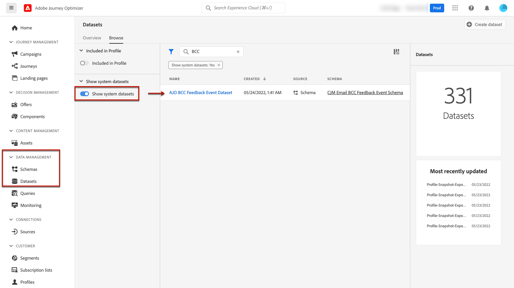
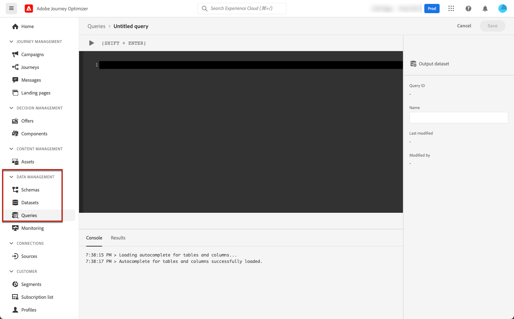

# Ondersteuning voor archivering {#archiving-support}

## Berichten archiveren {#about-archiving}

Regels zoals HIPAA schrijven voor dat [!DNL Journey Optimizer] moeten een manier bieden om berichten die aan individuen worden verzonden, te archiveren. Als uw klanten een claim indienen, moeten zij een kopie van het verzonden bericht kunnen krijgen voor controledoeleinden.

* Voor het e-mailkanaal: [!DNL Journey Optimizer] biedt een ingebouwde BCC e-mailmogelijkheid. [Meer informatie](#bcc-email)

* Daarnaast kunt u voor alle kanalen het veld Sjabloon gebruiken in het dialoogvenster **Entiteitsgegevens**, die de details van de niet-gepersonaliseerde berichtmalplaatjes bevat. Exporteer de gegevensset met dit veld om metagegevens op te slaan, zoals: wie het bericht heeft verzonden, aan wie en wanneer. Persoonlijke gegevens worden niet geëxporteerd. Alleen de sjabloon (indeling en structuur van het bericht) wordt in aanmerking genomen. [Meer informatie](../data/datasets-query-examples.md#entity-dataset)

>[!NOTE]
>
>[!DNL Journey Optimizer] heeft geen eigen ondersteuning voor de archiveringsvereisten voor SMS. Voor specifieke archiefondersteuning werkt u samen met uw SMS-leverancier (Synch of Twilio).

## BCC gebruiken voor e-mailberichten {#bcc-email}

>[!CONTEXTUALHELP]
>id="ajo_admin_preset_bcc"
>title="Een BCC-e-mailadres definiëren"
>abstract="U kunt een kopie van verzonden e-mailberichten bewaren door deze naar een BCC-postvak te verzenden. Voer het e-mailadres van uw keuze in, zodat elke verzonden e-mail blind wordt gekopieerd naar dit BCC-adres. Merk op dat het BCC adresdomein niet het zelfde zou moeten zijn als om het even welk subdomain die aan Adobe wordt gedelegeerd. Deze functie is optioneel."

U kunt een identieke kopie (of blinde koolstofkopie) van een e-mailbericht verzenden dat is verzonden door [!DNL Journey Optimizer] naar een BCC-postvak. Met deze optionele functie kunt u kopieën behouden van e-mailberichten die u naar uw gebruikers verzendt voor compatibiliteits- en/of archiefdoeleinden. Dit zal onzichtbaar zijn voor de leverende ontvangers.

### BCC-e-mail inschakelen {#enable-bcc}

Om het **[!UICONTROL BCC email]** voert u het e-mailadres van uw keuze in in het desbetreffende veld van het dialoogvenster [kanaaloppervlak](channel-surfaces.md) (d.w.z. voorinstelling bericht). U kunt elk extern adres opgeven in de juiste indeling, behalve een e-mailadres dat is gedefinieerd voor een subdomein dat is gedelegeerd aan de Adobe. Als u bijvoorbeeld de opdracht *marketing.luma.com* subdomein voor Adobe, elk adres zoals *abc@marketing.luma.com* is verboden.

>[!CAUTION]
>
>U kunt slechts één BCC-e-mailadres definiëren. Zorg ervoor dat het BCC-adres voldoende ontvangstcapaciteit heeft om alle e-mails op te slaan die via het huidige kanaaloppervlak worden verzonden.
>
>Meer aanbevelingen worden weergegeven in [deze sectie](#bcc-recommendations-limitations).

>[!NOTE]
>
>Als u de add-on aanbieding van het Schild van de Gezondheid hebt gekocht, moet u ervoor zorgen dat ISP van uw BCC adres het protocol TLS 1.2 steunt.


Alle e-mailberichten die op dit oppervlak worden weergegeven, worden blind gekopieerd naar het e-mailadres dat u hebt ingevoerd. Van daaruit kunnen ze worden verwerkt en gearchiveerd met behulp van een extern systeem.

>[!CAUTION]
>
>Het gebruik van de BCC-functie wordt afgeboekt op het aantal berichten waarvoor u een licentie hebt. Vandaar, laat slechts het in de oppervlakken toe die voor kritieke mededelingen worden gebruikt die u wenst te archiveren. Controleer uw contract op volumes met licentie.

De instelling voor het BCC-e-mailadres wordt direct opgeslagen en verwerkt op oppervlakteneniveau. Wanneer u een nieuw bericht gebruikend dit oppervlak creeert, wordt het e-mailadres BCC automatisch getoond.


Nochtans, wordt het adres BCC opgepikt voor het verzenden van mededelingen na de beschreven logica [hier](../email/email-settings.md).

### Recommendations en beperkingen {#bcc-recommendations-limitations}

* Om ervoor te zorgen dat uw privacy wordt nageleefd, moeten BCC-e-mails worden verwerkt door een archiveringssysteem dat PII&#39;s (Secure Persoonlijke Identifier Information) kan opslaan.

* Aangezien de berichten gevoelige of privé gegevens, zoals persoonlijk identificeerbare informatie (PII) kunnen bevatten, zorg ervoor het adres BCC correct is, en beveilig de toegang tot berichten.

* De inbox die voor BCC wordt gebruikt, moet correct worden beheerd voor ruimte en levering. Als het postvak inbox bellen retourneert, worden sommige e-mails mogelijk niet ontvangen en worden deze daarom niet gearchiveerd.

* De berichten kunnen aan het BCC e-mailadres vóór de doelontvangers worden geleverd. BCC-berichten kunnen ook worden verzonden, ook al hebben de oorspronkelijke berichten mogelijk [afgezwakt](../reports/suppression-list.md#delivery-failures).

   <!--OR: Only successfully sent emails are taken in account. [Bounces](../reports/suppression-list.md#delivery-failures) are not. TO CHECK -->

* Open of klik niet door de e-mails die naar het BCC-adres worden verzonden, aangezien hiermee rekening wordt gehouden bij het openen van het totaal en klikken op de verzendanalyse, wat tot onjuiste berekeningen kan leiden bij: [rapporten](../reports/global-report.md).

* Markeer geen berichten als spam in de BCC-postvak, omdat dit invloed heeft op alle andere e-mails die naar dit adres worden verzonden.


>[!CAUTION]
>
>Klik niet op de koppeling Abonnement opzeggen in de e-mails die naar het BCC-adres worden verzonden, omdat u het abonnement op de desbetreffende ontvangers meteen opzegt.

### GDPR-conformiteit {#gdpr-compliance}

In verordeningen zoals de GDPR is bepaald dat betrokkenen hun toestemming te allen tijde kunnen wijzigen. Omdat de BCC-e-mails die u verzendt met de functie Reis Optimizer beveiligde, persoonlijk identificeerbare gegevens bevatten, moet u de **[!UICONTROL CJM Email BCC Feedback Event Schema]** deze PII te kunnen beheren in overeenstemming met de GDPR en soortgelijke voorschriften.

Volg de onderstaande stappen om dit te doen.

1. Ga naar **[!UICONTROL Data management]** > **[!UICONTROL Schemas]** > **[!UICONTROL Browse]** en selecteert u **[!UICONTROL CJM Email BCC Feedback Event Schema]**.

   

1. Klik om uit te vouwen **[!UICONTROL _experience]**, **[!UICONTROL customerJourneyManagment]** dan **[!UICONTROL secondaryRecipientDetail]**.

1. Selecteren **[!UICONTROL originalRecipientAddress]**.

1. In de **[!UICONTROL Field properties]** rechts, omlaag schuiven naar de **[!UICONTROL Identity]** selectievakje.

1. Selecteer het en selecteer ook **[!UICONTROL Primary identity]**.

1. Selecteer een naamruimte in de vervolgkeuzelijst.

   

1. Klikken **[!UICONTROL Apply]**.

>[!NOTE]
>
>Meer informatie over het beheren van privacy en de toepasselijke regels in het dialoogvenster [Documentatie Experience Platform](https://experienceleague.adobe.com/docs/experience-platform/privacy/home.html){target=&quot;_blank&quot;}.

### BCC-rapportagegegevens {#bcc-reporting}

Rapportage als zodanig over BCC is niet beschikbaar in de reis- en berichtrapporten. Nochtans, wordt de informatie opgeslagen op een systeemdataset genoemd **[!UICONTROL AJO BCC Feedback Event Dataset]**. U kunt vragen tegen deze dataset in werking stellen om nuttige informatie voor het zuiveren doel bijvoorbeeld te vinden.

U kunt tot deze dataset door het gebruikersinterface toegang hebben. Selecteren **[!UICONTROL Data management]** > **[!UICONTROL Datasets]** > **[!UICONTROL Browse]** en de **[!UICONTROL Show system datasets]** knevel van de filter om de systeem-geproduceerde datasets te tonen. Leer meer over hoe te om tot datasets in toegang te hebben [deze sectie](../data/get-started-datasets.md#access-datasets).



Om vragen tegen deze dataset in werking te stellen, kunt u de Redacteur van de Vraag gebruiken die door wordt verstrekt [Adobe Experience Platform Query Service](https://experienceleague.adobe.com/docs/experience-platform/query/api/getting-started.html){target=&quot;_blank&quot;}. Selecteer **[!UICONTROL Data management]** > **[!UICONTROL Queries]** en klik op **[!UICONTROL Create query]**. [Meer informatie](../data/get-started-queries.md)



Afhankelijk van welke informatie u zoekt, kunt u de volgende vragen in werking stellen.

1. Voor alle andere hieronder vragen, zult u identiteitskaart van de reisactie nodig hebben. Voer deze query uit om alle actie-id&#39;s op te halen die zijn gekoppeld aan een bepaalde versie-id voor de reis binnen de laatste twee dagen:

   ```
   SELECT
   DISTINCT
   CAST(TIMESTAMP AS DATE) AS EventTime,
   _experience.journeyOrchestration.stepEvents.journeyVersionID,
   _experience.journeyOrchestration.stepEvents.actionName, 
   _experience.journeyOrchestration.stepEvents.actionID 
   FROM journey_step_events 
   WHERE 
   _experience.journeyOrchestration.stepEvents.journeyVersionID = '<journey version id>' AND 
   _experience.journeyOrchestration.stepEvents.actionID is not NULL AND 
   TIMESTAMP > NOW() - INTERVAL '2' DAY 
   ORDER BY EventTime DESC;
   ```

   >[!NOTE]
   >
   >Om de `<journey version id>`parameter, selecteer de overeenkomstige [reisversie](../building-journeys/journey.md#journey-versions) van de **[!UICONTROL Journey management]** > **[!UICONTROL Journeys]** -menu. De reisversie-id wordt weergegeven aan het einde van de URL die in uw webbrowser wordt weergegeven.
   >
   >

1. Voer deze query uit om alle bericht-feedbackgebeurtenissen (met name feedbackstatus) op te halen die zijn gegenereerd voor een bepaald bericht dat binnen de laatste twee dagen als doel is ingesteld voor een specifieke gebruiker:

   ```
   SELECT  
   _experience.customerJourneyManagement.messageExecution.journeyVersionID AS JourneyVersionID, 
   _experience.customerJourneyManagement.messageExecution.journeyActionID AS JourneyActionID, 
   timestamp AS EventTime, 
   _experience.customerJourneyManagement.emailChannelContext.address AS RecipientAddress, 
   _experience.customerjourneymanagement.messagedeliveryfeedback.feedbackStatus AS FeedbackStatus,
   CASE _experience.customerjourneymanagement.messagedeliveryfeedback.feedbackStatus
       WHEN 'sent' THEN 'Sent'
       WHEN 'delay' THEN 'Retry'
       WHEN 'out_of_band' THEN 'Bounce' 
       WHEN 'bounce' THEN 'Bounce'
   END AS FeedbackStatusCategory
   FROM cjm_message_feedback_event_dataset 
   WHERE  
       timestamp > now() - INTERVAL '2' day  AND
       _experience.customerJourneyManagement.messageExecution.journeyVersionID = '<journey version id>' AND 
       _experience.customerJourneyManagement.messageExecution.journeyActionID = '<journey action id>' AND  
       _experience.customerJourneyManagement.emailChannelContext.address = '<recipient email address>'
       ORDER BY EventTime DESC;
   ```

   >[!NOTE]
   >
   >Om de `<journey action id>` parameter, stel de eerste hierboven beschreven vraag in werking gebruikend identiteitskaart van de reisversie. De `<recipient email address>` parameter is het beoogde of werkelijke e-mailadres van de ontvanger.

1. Voer deze query uit om alle BCC-bericht-feedbackgebeurtenissen op te halen die zijn gegenereerd voor een bepaald bericht dat is gericht op een specifieke gebruiker in de laatste 2 dagen:

   ```
   SELECT   
   _experience.customerJourneyManagement.messageExecution.journeyVersionID AS JourneyVersionID, 
   _experience.customerJourneyManagement.messageExecution.journeyActionID AS JourneyActionID, 
   _experience.customerJourneyManagement.emailChannelContext.address AS BccEmailAddress,
   timestamp AS EventTime, 
   _experience.customerJourneyManagement.secondaryRecipientDetail.originalRecipientAddress AS RecipientAddress, 
   _experience.customerjourneymanagement.messagedeliveryfeedback.feedbackStatus AS FeedbackStatus,
   CASE _experience.customerjourneymanagement.messagedeliveryfeedback.feedbackStatus
               WHEN 'sent' THEN 'Sent'
               WHEN 'delay' THEN 'Retry'
               WHEN 'out_of_band' THEN 'Bounce' 
               WHEN 'bounce' THEN 'Bounce'
           END AS FeedbackStatusCategory 
   FROM ajo_bcc_feedback_event_dataset  
   WHERE  
   timestamp > now() - INTERVAL '2' day  AND
   _experience.customerJourneyManagement.messageExecution.journeyVersionID = '<journey version id>' AND 
   _experience.customerJourneyManagement.messageExecution.journeyActionID = '<journeyaction id>' AND 
   _experience.customerJourneyManagement.secondaryRecipientDetail.originalRecipientAddress = '<recipient email address>'
   ORDER BY EventTime DESC;
   ```

1. Voer deze query uit om alle geadresseerde adressen op te halen die het bericht niet hebben ontvangen, terwijl de BCC-vermelding ervan in de laatste 30 dagen bestaat:

   ```
    SELECT
        DISTINCT 
    bcc._experience.customerJourneyManagement.secondaryRecipientDetail.originalRecipientAddress AS RecipientAddressesNotRecievedMessage
    FROM ajo_bcc_feedback_event_dataset bcc
    LEFT JOIN cjm_message_feedback_event_dataset mfe
    ON 
   bcc._experience.customerJourneyManagement.messageExecution.journeyVersionID =
            mfe._experience.customerJourneyManagement.messageExecution.journeyVersionID AND    bcc._experience.customerJourneyManagement.messageExecution.journeyActionID = mfe._experience.customerJourneyManagement.messageExecution.journeyActionID AND 
   bcc._experience.customerJourneyManagement.secondaryRecipientDetail.originalRecipientAddress = mfe._experience.customerJourneyManagement.emailChannelContext.address AND
   mfe._experience.customerJourneyManagement.messageExecution.journeyVersionID = '<journey version id>' AND 
   mfe._experience.customerJourneyManagement.messageExecution.journeyActionID = '<journey action id>' AND
   mfe.timestamp > now() - INTERVAL '30' DAY AND
   mfe._experience.customerjourneymanagement.messagedeliveryfeedback.feedbackstatus IN ('bounce', 'out_of_band') 
    WHERE bcc.timestamp > now() - INTERVAL '30' DAY;
   ```
